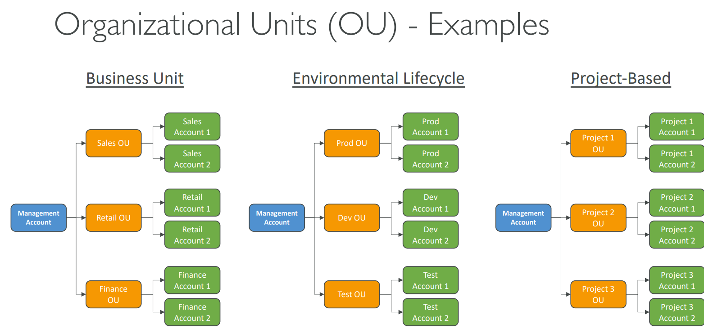
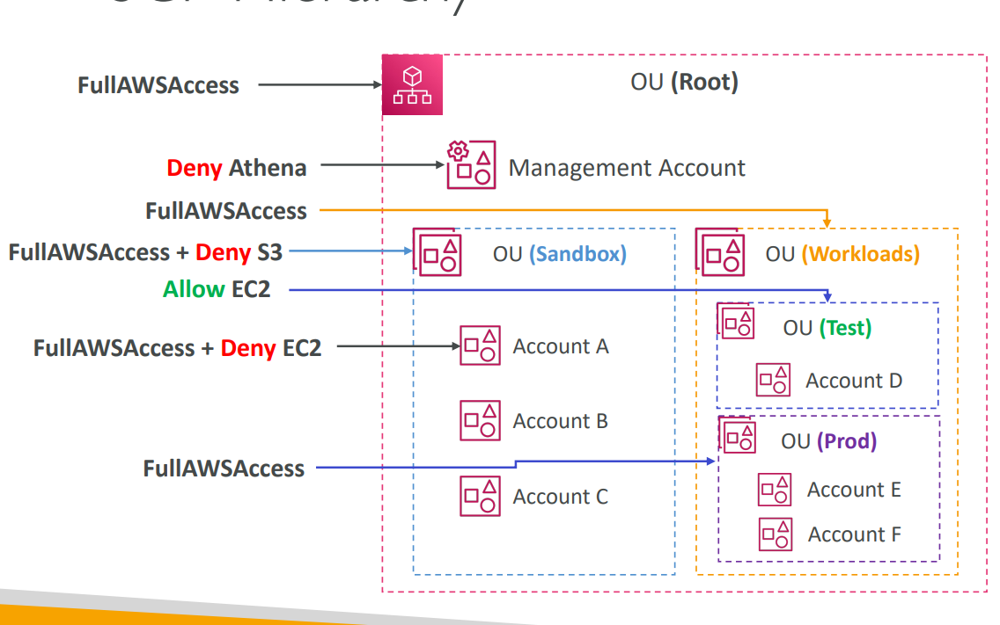

## AWS Organizations
- Global service
- Allows to manage multiple AWS accounts 
- The main account is the management account 
- Other accounts are member accounts 
- Member accounts can only be part of one organization
- Consolidated Billing across all accounts - single payment method
- Pricing benefits from aggregated usage (volume discount for EC2, S3…)
- Shared reserved instances and Savings Plans discounts across accounts
- API is available to automate AWS account creation

  
  

    | Level      | SCP Type       | Description      | Effect               |
    | ---------- | -------------- | ---------------- | -------------------- |
    | Root       | Default (Full) | No restrictions  | —                    |
    | OU A       | FullAccess     | Full permissions | —                    |
    | OU B       | FullAccess     | Full permissions | —                    |
    | OU C       | FullAccess     | Full permissions | —                    |
    | Account B1 | EC2AccessOnly  | Allows only EC2  | **Restricts to EC2** |
    | Account C1 | EC2AccessOnly  | Allows only EC2  | **Restricts to EC2** |

## AWS Service Catalog

- organizations create, manage, and distribute approved IT services (like EC2 instances, RDS databases, or full VPC stacks) that are preconfigured and compliant with company standards.

- Think of it as an internal AWS marketplace — but only with products your company approves.

    | Component               | Description                                                                         |
    | ----------------------- | ----------------------------------------------------------------------------------- |
    | **Product**             | A CloudFormation template defining one AWS resource or stack (e.g., EC2, RDS, VPC). |
    | **Portfolio**           | A logical collection of products. You assign access to users or groups.             |
    | **Constraint**          | Rules that restrict usage — for example, instance type = `t3.micro` only.           |
    | **Launch Constraint**   | Defines which IAM role launches the product (for least privilege).                  |
    | **Template Constraint** | Restricts what parameters can be modified by the user.                              |
    | **Tag Constraint**      | Enforces tagging policies.                                                          |
