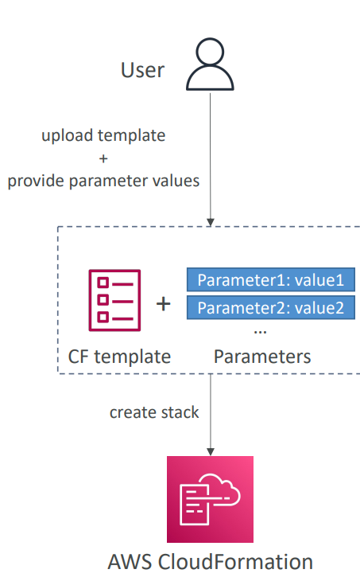
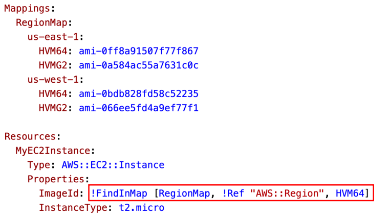
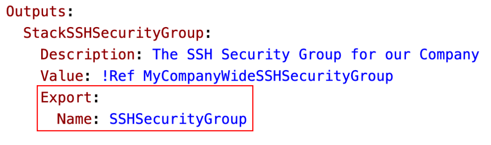
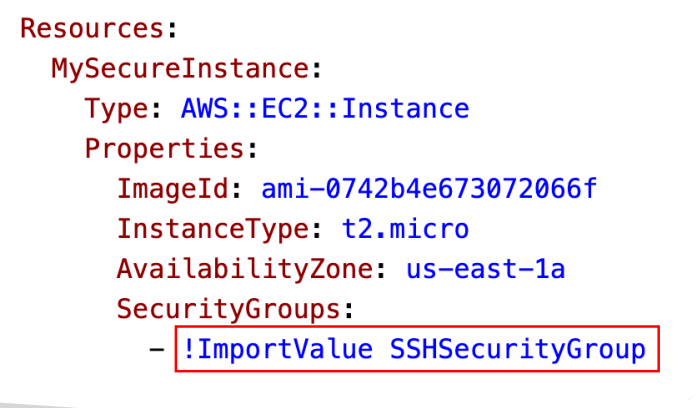

## CloudFormation

- AWS CloudFormation is an Infrastructure as Code (IaC) service that allows you to create, manage, and delete AWS resources automatically using templates (written in YAML or JSON).

- Instead of manually creating VPCs, EC2s, S3 buckets, etc. in the console, you define everything in a template, and CloudFormation provisions all of it for you in the correct order.


    | Component      | Description                                                                                 |
    | -------------- | ------------------------------------------------------------------------------------------- |
    | **Template**   | A YAML/JSON file defining AWS resources and configurations.                                 |
    | **Stack**      | A collection of resources managed as a single unit.                                         |
    | **Change Set** | A preview of changes before applying them to your stack.                                    |
    | **Parameters** | Input values that make your template dynamic (like variables).                              |
    | **Outputs**    | Return values (like instance IDs or load balancer URLs).                                    |
    | **Mappings**   | Static key-value pairs for region or environment-based values.                              |
    | **Resources**  | Actual AWS services you’re deploying (EC2, VPC, S3, etc.).                                  |
    | **Conditions** | Logic to create resources only under certain conditions (e.g., only in `prod` environment). |


#### CloudFormation – Parameters
    -  Parameters are a way to provide inputs to your 
AWS CloudFormation template
     

######  How to Reference a Parameter?
    ```bash
        Parameters:
            SecurityGroupDescription:
            Description: Security Group Description
            Type: String

        ServerSecurityGroup:
            Type: AWS::EC2::SecurityGroup
            Properties:
            GroupDescription: !Ref SecurityGroupDescription # Reference of  a Parameter
            SecurityGroupIngress:
                - IpProtocol: tcp
                FromPort: 80
                ToPort: 80
                CidrIp: 0.0.0.0/0
                - IpProtocol: tcp
                FromPort: 22
                ToPort: 22
                CidrIp: 192.168.1.1/32
                

    ```
       
#### CloudFormation – Mappings
- Mappings are fixed variables within your CloudFormation template
- They’re very handy to differentiate between different environments (dev vs prod), regions (AWS regions), AMI types…
- All the values are hardcoded within the template

  - Accessing Mapping Values (Fn::FindInMap)
     -  !FindInMap [ MapName, TopLevelKey, SecondLevelKey ]
        


#### CloudFormation – Outputs

  - Creating a SSH Security Group as part of one template 
  -  Wecreate an output that references that security group
      

- CloudFormation – Outputs Cross-Stack 
Reference
  


#### Rollbacks

| Option                                          | What Happens on Failure                                   | Stack State                        | Common Use Case                |
| ----------------------------------------------- | --------------------------------------------------------- | ---------------------------------- | ------------------------------ |
| **Roll back all stack resources**               | Deletes all resources created during the failed operation | `ROLLBACK_COMPLETE`                | Production; ensure clean state |
| **Preserve successfully provisioned resources** | Keeps successfully created resources                      | `CREATE_FAILED` or `UPDATE_FAILED` | Development / debugging        |


### CloudFormation StackSet

- A StackSet is an extension of CloudFormation that allows you to deploy the same CloudFormation stack across multiple AWS accounts and multiple regions — automatically.

- It’s like a multi-account, multi-region CloudFormation manager.


- How Deployment Happens

   -  Create a StackSet

        - Upload your CloudFormation template (YAML or JSON).

        - Define parameters and permissions.

    - Add Target Accounts & Regions

       -  Choose accounts (manually or via AWS Organizations).

        - Choose one or more AWS regions.

    - CloudFormation Automatically:

        - Creates stack instances in each target account/region.

        - Deploys the resources as defined in your template.

    - Centralized Management

    - You can update, delete, or view all stacks from the Admin account.