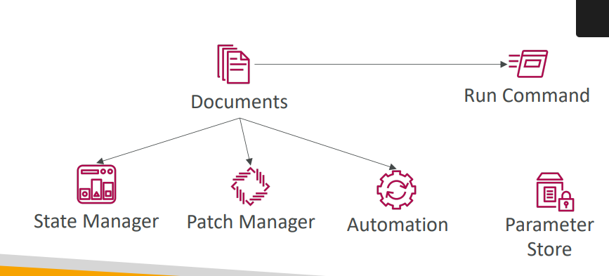

## SSM
- SSM stands for AWS Systems Manager.
    - It’s a management service that lets you view, control, and automate tasks across your AWS resources — especially EC2 instances — without needing to log in manually (SSH or RDP).


        | Feature             | Description                                                                                |
        | ------------------- | ------------------------------------------------------------------------------------------ |
        | **Run Command**     | Execute commands on EC2 instances remotely (no SSH needed).                                |
        | **Session Manager** | Securely connect to EC2 instances via the AWS Console or CLI (browser-based shell access). |
        | **Parameter Store** | Securely store configuration data, environment variables, passwords, etc.                  |
        | **Patch Manager**   | Automate OS updates and patching.                                                          |
        | **Inventory**       | Collect information about your EC2 instances (software, configuration, etc.).              |
        | **State Manager**   | Automatically maintain system configurations.                                              |

#### fleet server
 - Fleet Manager is a console-based tool within AWS Systems Manager (SSM) that helps you manage and monitor your fleet of servers (EC2 and on-premise) — without SSH or RDP.

- Example Scenario
    ```bash
        Let’s say you need to:

        Check a log file (/var/log/httpd/access_log)

        Restart Apache service

         Open Fleet Manager → Instance → File System → /var/log/httpd → View the file
         Then go to Processes → Restart or stop Apache process

        All without logging in via SSH.

        - created EC2 instand with no perssion of SG and also assign role for SSm and use amazon linux AMi so there alredy installed SSM agent on it
    ```

#### SSM - Documents
- An SSM Document (also called a Systems Manager document) is a JSON or YAML file that defines actions for AWS Systems Manager to perform on your managed instances or resources.

- You can think of it like a script or blueprint that Systems Manager follows to automate a task — for example:
installing software, running commands, patching servers, or collecting logs.
 

#### Run Command
- AWS Systems Manager Run Command is a feature that lets you remotely and securely execute commands or scripts on your EC2 instances, on-prem servers, or hybrid instances — without SSH or RDP access.


#### SSM – Session Manager
- Allows you to start a secure shell on your EC2 and on- premises servers
- Access through AWS Console, AWS CLI, or Session 
Manager SDK
- Does not need SSH access, bastion hosts, or SSH keys
- Supports Linux, macOS, and Windows
- Log connections to your instances and executed 
commands
- Session log data can be sent to S3 or CloudWatch Logs
- CloudTrail can intercept StartSession events


