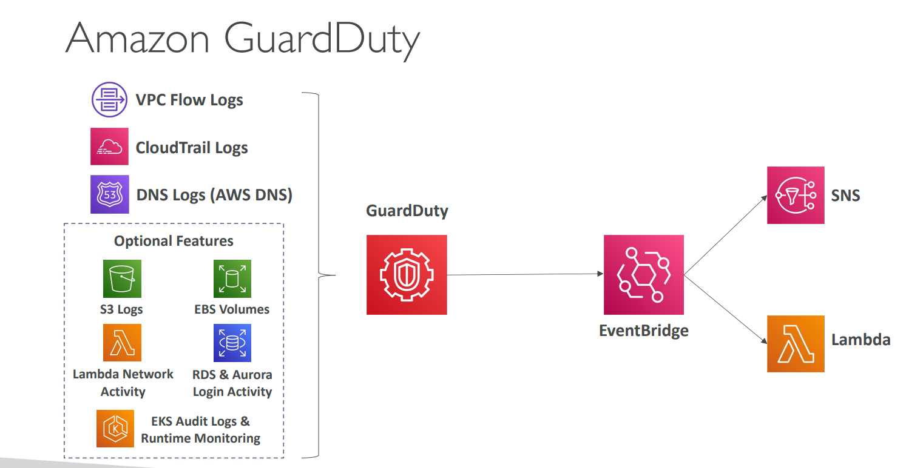

## AWS Shield

- AWS Shield is a managed Distributed Denial of Service (DDoS) protection service
that helps safeguard your applications running on AWS from DDoS attacks.

- It automatically detects and mitigates attacks in real time, without you having to configure anything.

    | Tier                    | Description                                       | Cost                          |
    | ----------------------- | ------------------------------------------------- | ----------------------------- |
    | **AWS Shield Standard** | Automatic protection for all AWS customers        |  Free                        |
    | **AWS Shield Advanced** | Enhanced protection, visibility, and 24/7 support |  Paid (monthly fee + usage) |

## Amazon Inspector

- Automated Security Assessments 
- For EC2 instances 
- Leveraging the AWS System Manager (SSM) agent
- Analyze against unintended network accessibility
- Analyze the running OS against known vulnerabilities
- For Container Images push to Amazon ECR
- Assessment of Container Images as they are pushed
- For Lambda Functions
- Identifies software vulnerabilities in function code and package dependencies
- Assessment of functions as they are deployed
- Reporting & integration with AWS Security Hub
- Send findings to Amazon Event Bridge

## Amazon GuardDuty
- Intelligent Threat discovery to protect your AWS Account 
- Uses Machine Learning algorithms, anomaly detection, 3rd party data
- One click to enable (30 days trial), no need to install software
- Input data includes:
    - CloudTrail Events Logs – unusual API calls, unauthorized deployments
    - CloudTrail Management Events – create VPC subnet, create trail, …
    - CloudTrail S3 Data Events – get object, list objects, delete object, …
    - VPC Flow Logs – unusual internal traffic, unusual IP address
    - DNS Logs – compromised EC2 instances sending encoded data within DNS queries
    - Optional Feature – EKS Audit Logs, RDS & Aurora, EBS, Lambda, S3 Data Events…
- Can setup EventBridge rules to be notified in case of findings
- EventBridge rules can target AWS Lambda or SNS
- Can protect against CryptoCurrency attacks (has a dedicated “finding” for it)

  

## AWS Macie

- Amazon Macie is a fully managed data security and data privacy service 
that uses machine learning and pattern matching to discover and protect your sensitive data in AWS.
-  Macie helps identify and alert 

## KMS 

#### KMS Keys Types
- KMS Keys is the new name of KMS Customer Master Key
  -  Symmetric (AES-256 keys)
        - Single encryption key that is used to Encrypt and Decrypt
        - AWS services that are integrated with KMS use Symmetric CMKs
        - You never get access to the KMS Key unencrypted (must call KMS API to use)
  - Asymmetric (RSA & ECC key pairs)
        - Public (Encrypt) and Private Key (Decrypt) pair
        - Used for Encrypt/Decrypt, or Sign/Verify operations
        - The public key is downloadable, but you can’t access the Private Key unencrypted
        - Use case: encryption outside of AWS by users who can’t call the KMS API

- Types of KMS Keys:
- AWS Owned Keys (free): SSE-S3, SSE-SQS, SSE-DDB (default key)
- AWS Managed Key: free (aws/service-name, example: aws/rds or aws/ebs)
- Customer managed keys created in KMS: $1 / month
- Customer managed keys imported: $1 / month
 pay for API call to KMS ($0.03 / 10000 calls)