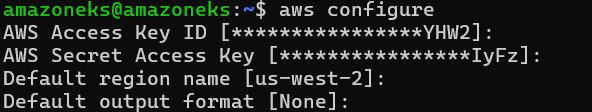
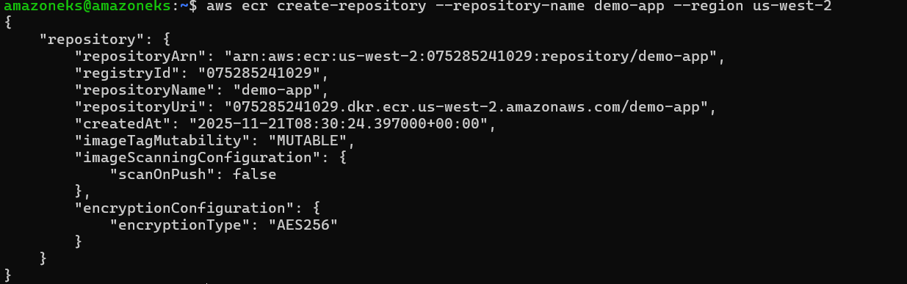
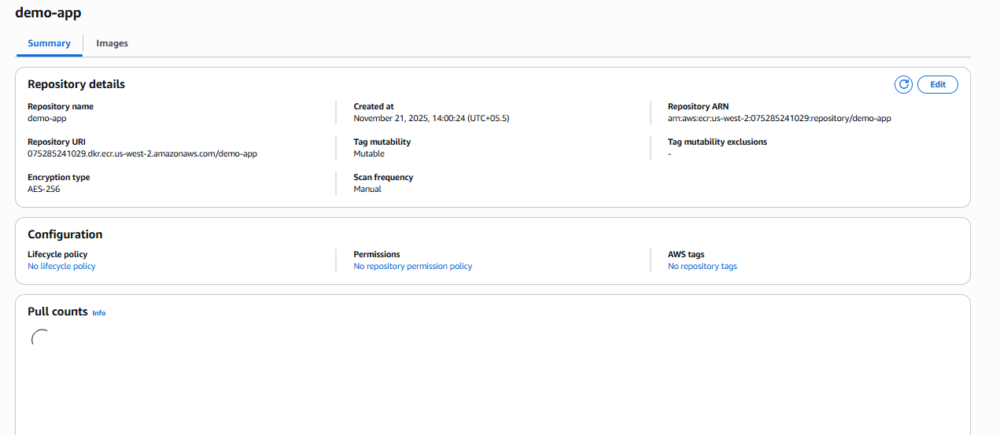
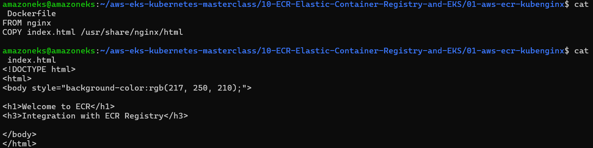
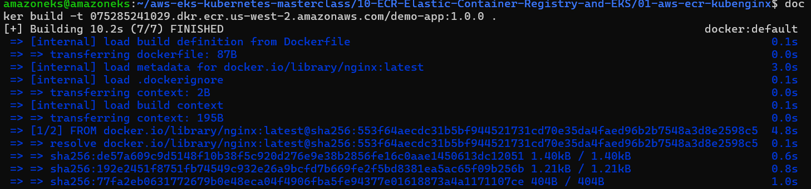
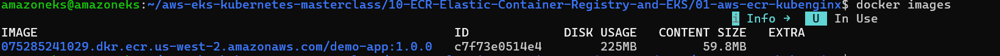
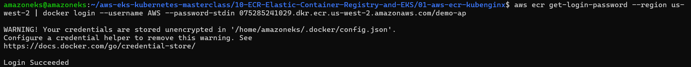
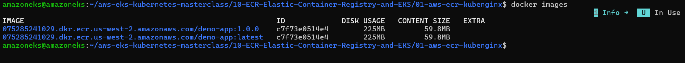
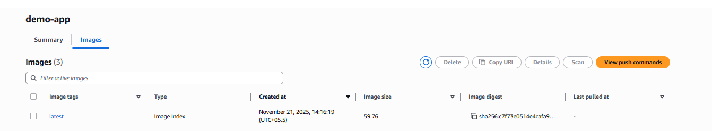

## ECR (Amazon Elastic Container Registry)
- Amazon ECR is a fully managed container image registry service provided by AWS. It allows you to store, manage, share, and deploy Docker container images securely and at scale.

- ECR integrates seamlessly with AWS services such as EKS, ECS, Fargate, CodeBuild, and Lambda, making it the recommended place to store container images for applications running on AWS.
- ECR is AWS’s private Docker container registry.
- You can think of it like Docker Hub, but:

    - Secure

    - Private

    - Fully integrated with AWS

    - Faster for EKS / ECS deployments


- Pre-requisites
   - Install AWS CLI V2 version
   - Install Docker CLI
      ```bash
      sudo apt update
      sudo apt upgrade -y
      sudo apt install -y ca-certificates curl gnupg lsb-release
      # Add Docker’s official GPG key
      sudo install -m 0755 -d /etc/apt/keyrings
        curl -fsSL https://download.docker.com/linux/ubuntu/gpg | sudo gpg --dearmor -o /etc/apt/keyrings/docker.gpg
      sudo chmod a+r /etc/apt/keyrings/docker.gpg
      # Add Docker repository
            echo \
        "deb [arch=$(dpkg --print-architecture) signed-by=/etc/apt/keyrings/docker.gpg] https://download.docker.com/linux/ubuntu \
        $(lsb_release -cs) stable" | \
        sudo tee /etc/apt/sources.list.d/docker.list > /dev/null
      # Install Docker Engine
      sudo apt update
      sudo apt install -y docker-ce docker-ce-cli containerd.io docker-buildx-plugin docker-compose-plugin
      # Check Docker is running
      docker --version
      sudo systemctl status docker
      # Run Docker without sudo
       sudo usermod -aG docker $USER
       newgrp docker


      ```
   - Configure AWS CLI with Authorization Token
     


   ```bash
      aws configure
   ```
     

- Created a repository
```bash
aws ecr create-repository --repository-name demo-app --region us-west-2
```




- created image
  
  ```bash
  docker build -t 075285241029.dkr.ecr.us-west-2.amazonaws.com/demo-app:1.0.0 . 

  ```
    
    

- Login to ECR
```bash
aws ecr get-login-password --region us-west-2 | docker login --username AWS --password-stdin 075285241029.dkr.ecr.us-west-2.amazonaws.com/demo-app
```

- Tag an image
```bash
docker tag 075285241029.dkr.ecr.us-west-2.amazonaws.com/demo-app:1.0.0 075285241029.dkr.ecr.us-west-2.amazonaws.com/demo-app:latest
```


- Push the image
```bash
docker push 075285241029.dkr.ecr.us-west-2.amazonaws.com/demo-app:latest
```


