## Horizontal Pod Autoscaler 

- Horizontal Scaling means increasing and decreasing the number of Replicas (Pods)
- HPA automatically scales the number of pods in a deployment, replication controller, or replica set, stateful set based on that resource's CPU utilization. 
- This can help our applications scale out to meet increased demand or scale in when resources are not needed, thus freeing up your worker nodes for other applications. 
- When we set a target CPU utilization percentage, the HPA scales our application in or out to try to meet that target.
- HPA needs Kubernetes metrics server to verify CPU metrics of a pod. 
- We do not need to deploy or install the HPA on our cluster to begin scaling our applications, its out of the box available as a default Kubernetes API resource

    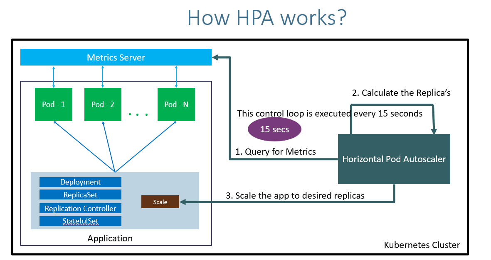
    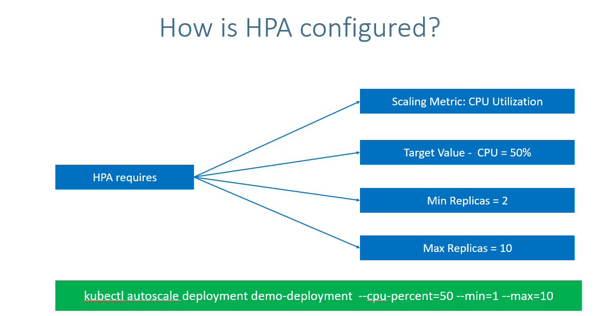


## EKS - Horizontal Pod Autoscaling (HPA) with Cloud Watch


#### created cluster 

```bash
eksctl create cluster --name=eksdemo1 \
                      --region=us-west-2 \
                      --zones=us-west-2a,us-west-2b \
                      --without-nodegroup 

```


#### Create & Associate IAM OIDC Provider for our EKS Cluster
```bash
eksctl utils associate-iam-oidc-provider \
    --region us-west-2 \
    --cluster eksdemo1 \
    --approve
```

#### Create EKS Node Group in public Subnets

```bash

eksctl create nodegroup --cluster=eksdemo1 \
                       --region=us-west-2 \
                       --name=eksdemo1-ng-public1 \
                       --node-type=t3.medium \
                       --nodes=2 \
                       --nodes-min=2 \
                       --nodes-max=4 \
                       --node-volume-size=20 \
                       --ssh-access \
                       --ssh-public-key=kube-demo \
                       --managed \
                       --asg-access \
                       --external-dns-access \
                       --full-ecr-access \
                       --appmesh-access \
                       --alb-ingress-access 


```
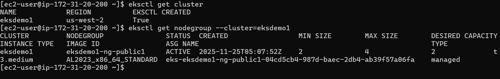

#### Associate CloudWatch Policy to our EKS Worker Nodes Role
- Go to Services -> EC2 -> Worker Node EC2 Instance -> IAM Role -> Click on that role

```bash
 # Policy to be associated
Associate Policy: CloudWatchAgentServerPolicy
```
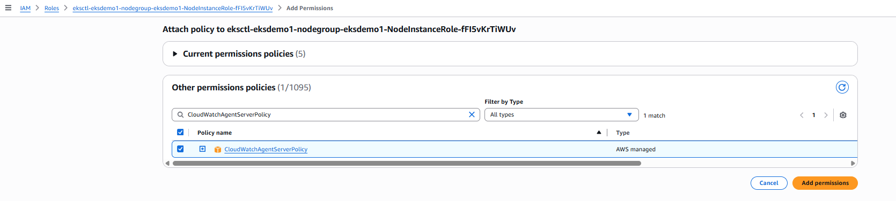

#### Install Container Insights
- Deploy CloudWatch Agent and Fluentd as DaemonSets
  - This command will
     - Creates the Namespace amazon-cloudwatch.
     - Creates all the necessary security objects for both DaemonSet:
        -  SecurityAccount
        - ClusterRole
        - ClusterRoleBinding

    - Deploys ``Cloudwatch-Agent`` (responsible for sending the metrics to CloudWatch) as a DaemonSet.
    - Deploys fluentd (responsible for sending the logs to Cloudwatch) as a DaemonSet.
    - Deploys ConfigMap configurations for both DaemonSets.
    ```bash
        # Template
        curl -s https://raw.githubusercontent.com/aws-samples/amazon-cloudwatch-container-insights/latest/k8s-deployment-manifest-templates/deployment-mode/daemonset/container-insights-monitoring/quickstart/cwagent-fluentd-quickstart.yaml | sed "s/{{cluster_name}}/<REPLACE_CLUSTER_NAME>/;s/{{region_name}}/<REPLACE-AWS_REGION>/" | kubectl apply -f -
    
        # Replaced Cluster Name and Region
        curl -s https://raw.githubusercontent.com/aws-samples/amazon-cloudwatch-container-insights/latest/k8s-deployment-manifest-templates/deployment-mode/daemonset/container-insights-monitoring/quickstart/cwagent-fluentd-quickstart.yaml | sed "s/{{cluster_name}}/eksdemo1/;s/{{region_name}}/us-west-2/" | kubectl apply -f -
    ``` 
    
    ```bash
        kubectl -n amazon-cloudwatch get daemonsets
    ``` 
       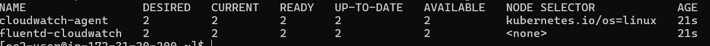    
     
     
#### Install Metrics Server


```bash
# Verify if Metrics Server already Installed
kubectl -n kube-system get deployment/metrics-server

# Install Metrics Server
kubectl apply -f https://github.com/kubernetes-sigs/metrics-server/releases/download/v0.3.6/components.yaml # in this latest version find in given below link 

# Verify
kubectl get deployment metrics-server -n kube-system
```
- Metrics Server Releases
https://github.com/kubernetes-sigs/metrics-server/releases

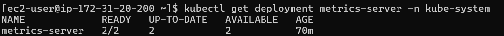


#### Review Deploy our Application

```bash
# Deploy
kubectl apply -f kube-manifests/

# List Pods, Deploy & Service
kubectl get pod,svc,deploy

# Access Application (Only if our Cluster is Public Subnet)
kubectl get nodes -o wide
http://<Worker-Node-Public-IP>:31231
```
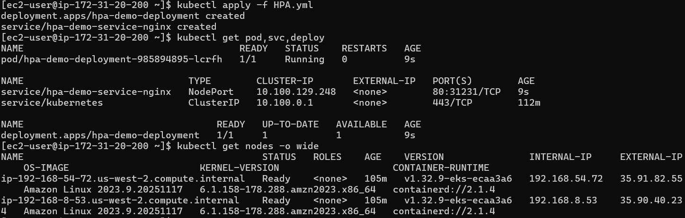
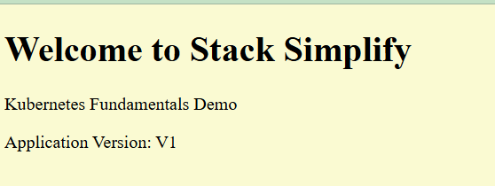

#### Create a Horizontal Pod Autoscaler resource for the "hpa-demo-deployment"

- This command creates an autoscaler that targets 50 percent CPU utilization for the deployment, with a minimum of one pod and a maximum of ten pods.
- When the average CPU load is below 50 percent, the autoscaler tries to reduce the number of pods in the deployment, to a minimum of one.
- When the load is greater than 50 percent, the autoscaler tries to increase the number of pods in the deployment, up to a maximum of ten

    ```bash
    # Template
    kubectl autoscale deployment <deployment-name> --cpu-percent=50 --min=1 --max=10

    # Replace
    kubectl autoscale deployment hpa-demo-deployment --cpu-percent=50 --min=1 --max=10

    # Describe HPA
    kubectl describe hpa/hpa-demo-deployment 

    # List HPA
    kubectl get horizontalpodautoscaler.autoscaling/hpa-demo-deployment 

    ```
    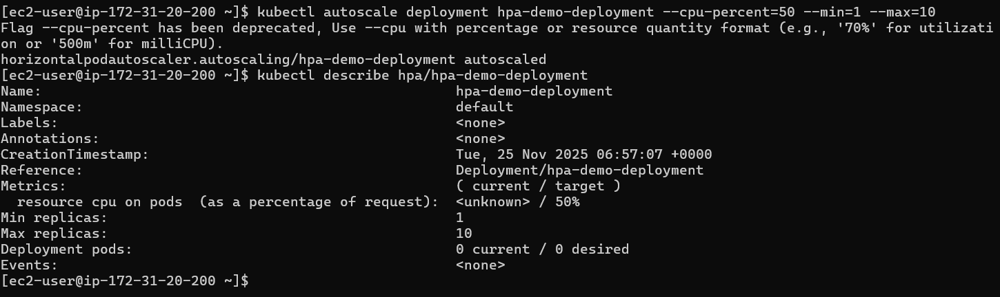
    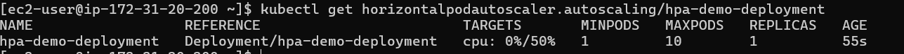
    


 #### Create the load & Verify how HPA is working   

 ```bash
 # Generate Load
kubectl run apache-bench \
  -it --rm \
  --image=jordi/ab \
  --restart=Never \
  -- ab -n 500000 -c 1000 http://hpa-demo-service-nginx.default.svc.cluster.local/

# List all HPA
kubectl get hpa

# List specific HPA
kubectl get hpa hpa-demo-deployment 

# Describe HPA
kubectl describe hpa/hpa-demo-deployment 

# List Pods
kubectl get pods

 ```
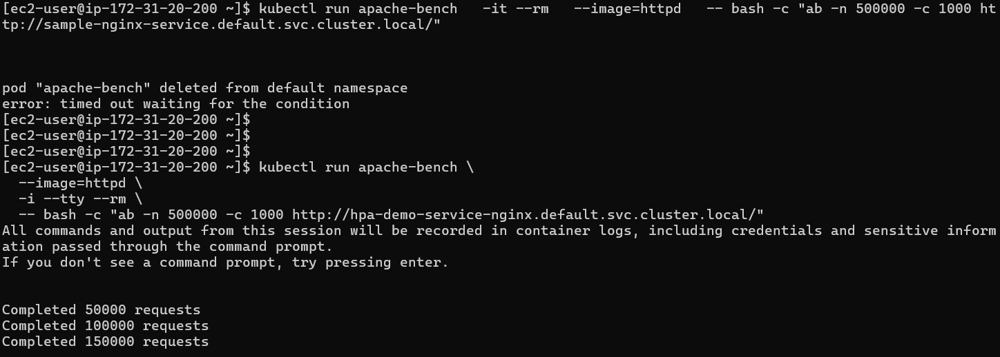
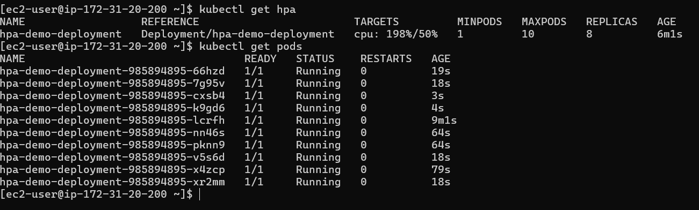

#### Cooldown / Scaledown

- Default cooldown period is 5 minutes.
- Once CPU utilization of pods is less than 50%, it will starting terminating pods and will reach to minimum 1 pod as configured.
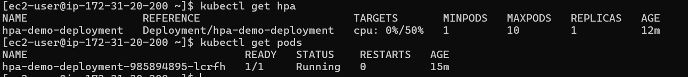


#### CloudWatch
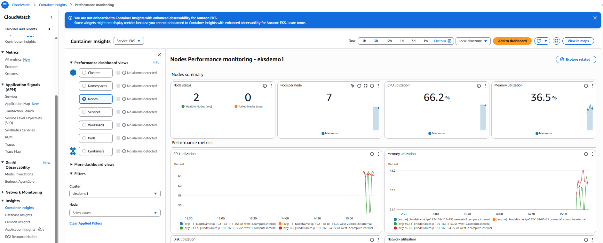