## EKS - Cluster Autoscaler

#### Verify if our NodeGroup as --asg-access
- We need to ensure that we have a parameter named --asg-access present during the cluster or nodegroup creation.
- Verify the same when we created our cluster node group
###### What will happen if we use --asg-access tag?
- It enables IAM policy for cluster-autoscaler
- Lets review our nodegroup IAM role for the same.
- Go to Services -> IAM -> Roles -> - eksctl-eksdemo1-nodegroup-XXXXXX
- Click on Permissions tab
- You should see a inline policy named eksctl-eksdemo1-nodegroup-eksdemo1-ng-private1-PolicyAutoScaling in the list of policies associated to this role.
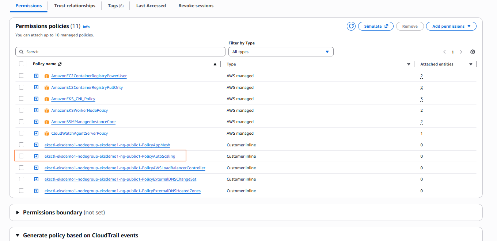


#### Deploy Cluster Autoscaler

```bash
# Deploy the Cluster Autoscaler to your cluster
kubectl apply -f https://raw.githubusercontent.com/kubernetes/autoscaler/master/cluster-autoscaler/cloudprovider/aws/examples/cluster-autoscaler-autodiscover.yaml

# Add the cluster-autoscaler.kubernetes.io/safe-to-evict annotation to the deployment
kubectl -n kube-system annotate deployment.apps/cluster-autoscaler cluster-autoscaler.kubernetes.io/safe-to-evict="false"
```
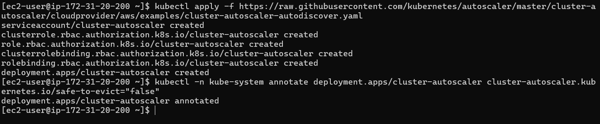

#### Edit Cluster Autoscaler Deployment to add Cluster name and two more parameters

```bash
kubectl -n kube-system edit deployment.apps/cluster-autoscaler
```
- Add cluster name

```bash
# Before Change
        - --node-group-auto-discovery=asg:tag=k8s.io/cluster-autoscaler/enabled,k8s.io/cluster-autoscaler/<YOUR CLUSTER NAME>

# After Change
        - --node-group-auto-discovery=asg:tag=k8s.io/cluster-autoscaler/enabled,k8s.io/cluster-autoscaler/eksdemo1

```
- Add two more parameters

```bash
        - --balance-similar-node-groups
        - --skip-nodes-with-system-pods=false
```

- Sample for reference

```bash
    spec:
      containers:
      - command:
        - ./cluster-autoscaler
        - --v=4
        - --stderrthreshold=info
        - --cloud-provider=aws
        - --skip-nodes-with-local-storage=false
        - --expander=least-waste
        - --node-group-auto-discovery=asg:tag=k8s.io/cluster-autoscaler/enabled,k8s.io/cluster-autoscaler/eksdemo1
        - --balance-similar-node-groups
        - --skip-nodes-with-system-pods=false
```
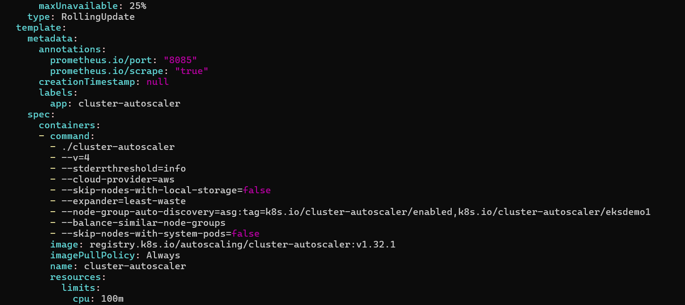

#### Set the Cluster Autoscaler Image related to our current EKS Cluster version

- Open https://github.com/kubernetes/autoscaler/releases
- Find our release version (example: 1.30.n) and update the same.
- Our Cluster version is 1.32 and our cluster autoscaler version is 1.30.7 as per above releases link


```bash
# Template
# Update Cluster Autoscaler Image Version
kubectl -n kube-system set image deployment.apps/cluster-autoscaler cluster-autoscaler=us.gcr.io/k8s-artifacts-prod/autoscaling/cluster-autoscaler:v1.XY.Z


# Update Cluster Autoscaler Image Version
kubectl -n kube-system set image deployment.apps/cluster-autoscaler cluster-autoscaler=us.gcr.io/k8s-artifacts-prod/autoscaling/cluster-autoscaler:v1.30.7

```
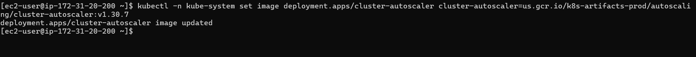


####  Verify Image version got updated
```bash
kubectl -n kube-system get deployment.apps/cluster-autoscaler -o yaml
```
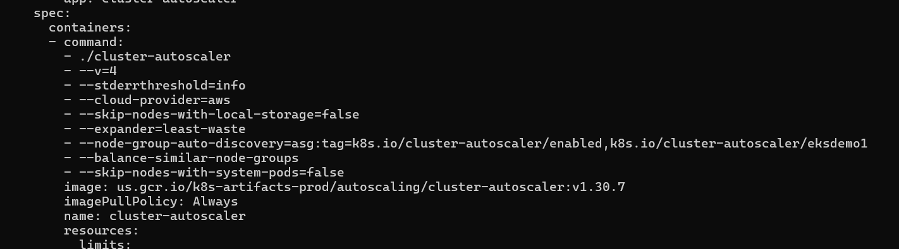


#### View Cluster Autoscaler logs to verify that it is monitoring your cluster load.

```bash
kubectl -n kube-system logs -f deployment.apps/cluster-autoscaler
```

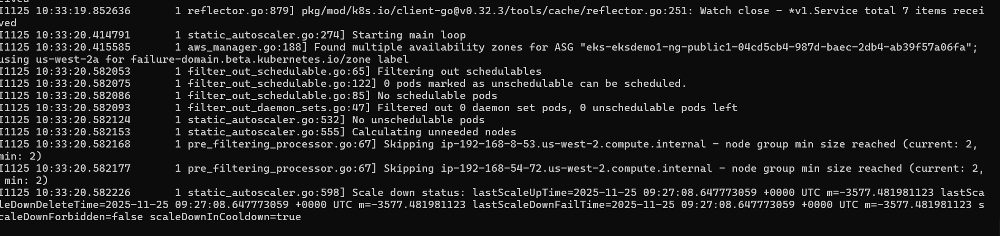


#### Deploy simple Application
```bash
# Deploy Application
kubectl apply -f kubenginx-Deployment-Service.yml
```
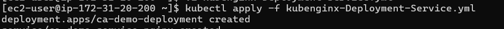


#### Cluster Scale UP: Scale our application to 30 pods

- In 2 to 3 minutes, one after the other new nodes will added and pods will be scheduled on them.
- Our max number of nodes will be 4 which we provided during nodegroup creation.


```bash

# Terminal - 1: Keep monitoring cluster autoscaler logs
kubectl -n kube-system logs -f deployment.apps/cluster-autoscaler

# Terminal - 2: Scale UP the demo application to 30 pods
kubectl get pods
kubectl get nodes 
kubectl scale --replicas=30 deploy ca-demo-deployment 
kubectl get pods

# Terminal - 2: Verify nodes
kubectl get nodes -o wide

```
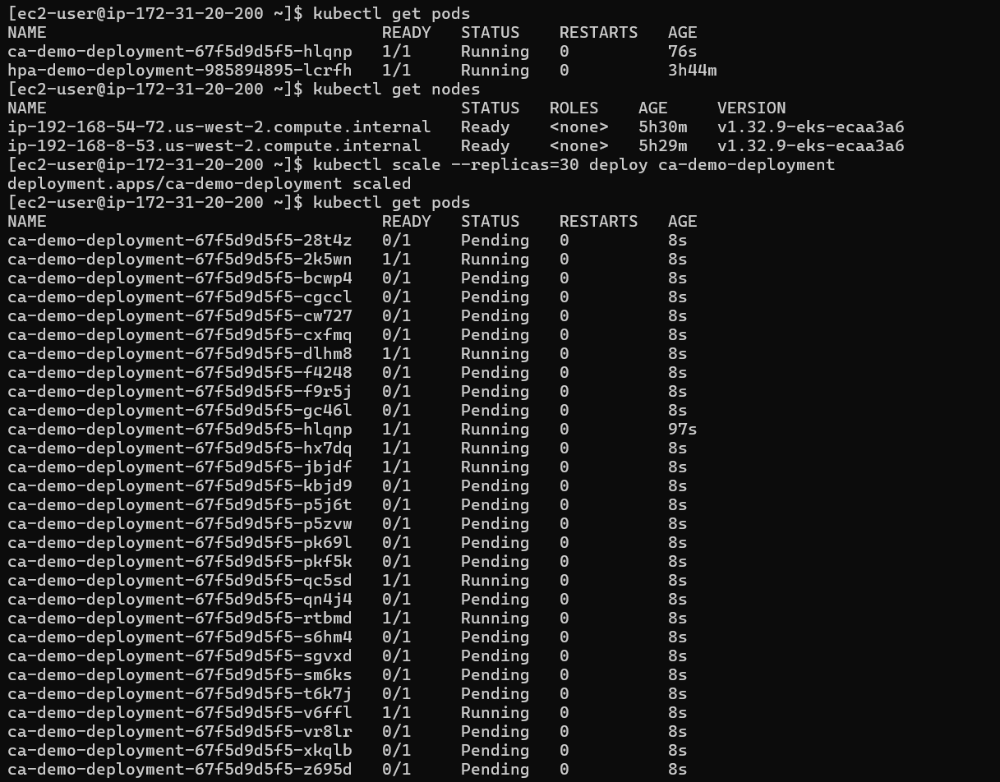
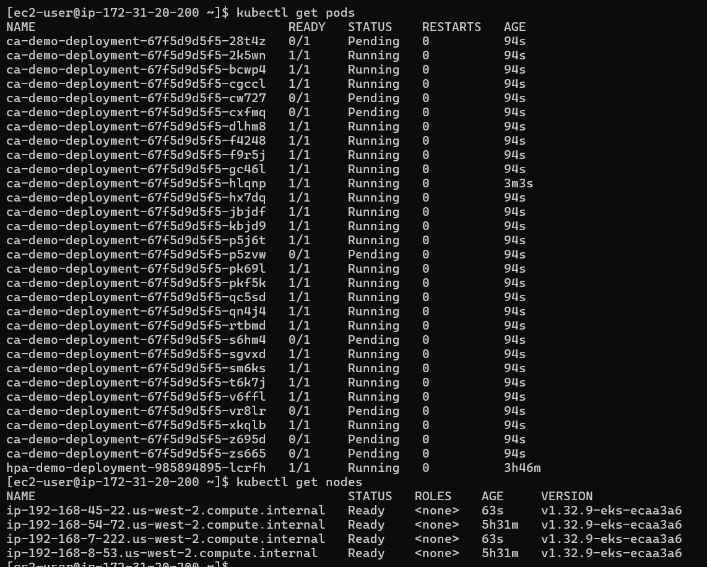


#### Cluster Scale DOWN: Scale our application to 1 pod
- It might take 5 to 20 minutes to cool down and come down to minimum nodes which will be 2 which we configured during nodegroup creation

```bash
# Terminal - 1: Keep monitoring cluster autoscaler logs
kubectl -n kube-system logs -f deployment.apps/cluster-autoscaler

# Terminal - 2: Scale down the demo application to 1 pod
kubectl scale --replicas=1 deploy ca-demo-deployment 

# Terminal - 2: Verify nodes
kubectl get nodes -o wide

```
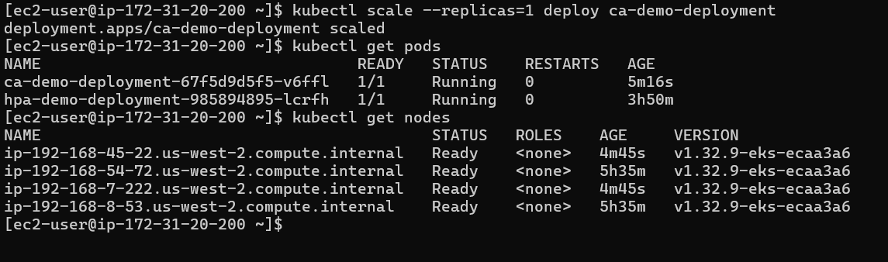
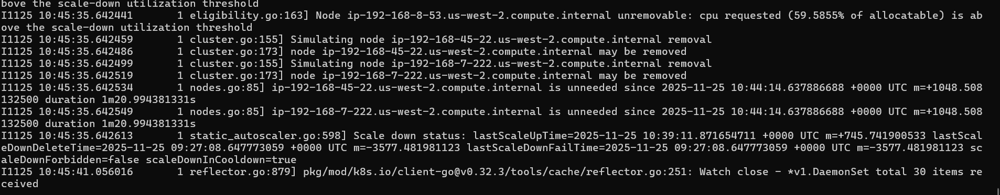
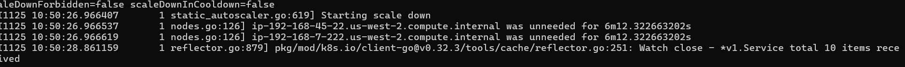
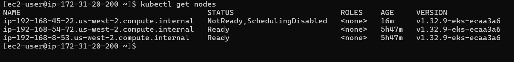