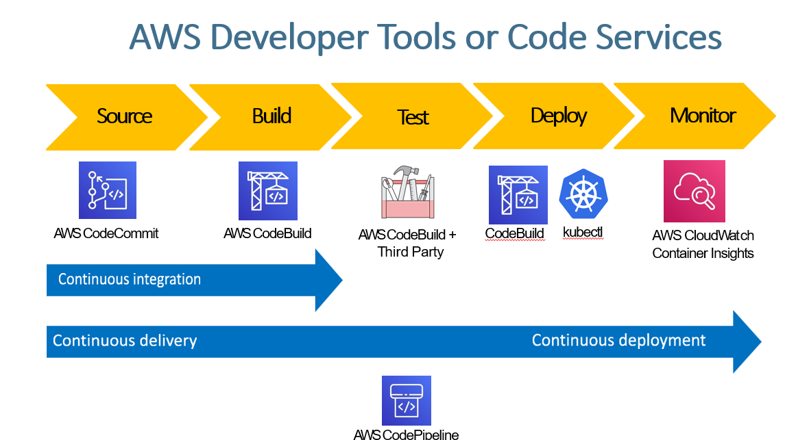

## CI/CD pipeline (Continuous Integration & Continuous Deployment).
The pipeline is divided into five major stages:

#### Source (Code Storage)

- Service: AWS CodeCommit

    - A fully managed Git-based source code repository.

    - Developers push their code here.

    - This is the starting point of the pipeline.

#### Build (Compile & Package)

- Service: AWS CodeBuild

    - Compiles code, installs dependencies, runs unit tests, and creates build artifacts.

    - Completely serverless build service — you don’t manage servers.

#### Test (Automated Testing)

- Service: AWS CodeBuild again OR
Third-party tools (Selenium, JUnit, pytest, etc.)

- This stage runs automated test cases to validate code quality and functionality.

#### Deploy (Release to Environments)

- Tools Shown:
CodeBuild (for build/deploy steps inside pipeline)
kubectl (to deploy to Kubernetes or EKS)
This is where application updates are deployed to:
✔ EC2
✔ ECS
✔ EKS
✔ Lambda
✔ On-premises

#### Monitor (Track System Health)

- Service: Amazon CloudWatch Container Insights

    - Monitors logs, metrics, traces for containers.

    - Helps identify performance issues or errors.

#### CI / CD Workflow Arrows
- Continuous Integration (CI)

    - Runs from Source → Build → Test

    - Ensures every code commit is automatically built and tested.

- Continuous Delivery / Continuous Deployment (CD)

    - Runs from Build → Deploy → Monitor

    - Ensures the application is automatically deployed and monitored.

#### AWS CodePipeline (Orchestration Layer)
- CodePipeline connects all services together:
CodeCommit → CodeBuild → Tests → Deploy

- It automatically triggers the next step when the previous one is successful.

| Stage   | Purpose           | AWS Service           |
| ------- | ----------------- | --------------------- |
| Source  | Store code        | CodeCommit            |
| Build   | Compile / package | CodeBuild             |
| Test    | Validate          | CodeBuild / 3rd party |
| Deploy  | Release app       | CodeBuild / kubectl   |
| Monitor | Observe system    | CloudWatch            |
