#### create cluster 
```bash
eksctl create cluster --name=eksdemo1 \
                      --region=us-west-2 \
                      --zones=us-west-2a,us-west-2b \
                      --without-nodegroup

```
#### Create & Associate IAM OIDC Provider for our EKS Cluster
- To enable and use AWS IAM roles for Kubernetes service accounts on our EKS cluster, we must create & associate OIDC identity provider.
- To do so using eksctl we can use the below command.
```bash
eksctl utils associate-iam-oidc-provider \
    --region us-west-2 \
    --cluster eksdemo1 \
    --approve

```
#### Create Node Group with additional Add-Ons in Public Subnets

```bash
# Create Public Node Group   
eksctl create nodegroup --cluster=eksdemo1 \
                       --region=us-west-2 \
                       --name=eksdemo1-ng-public1 \
                       --node-type=t3.medium \
                       --nodes=2 \
                       --nodes-min=2 \
                       --nodes-max=4 \
                       --node-volume-size=20 \
                       --ssh-access \
                       --ssh-public-key=kube-demo \
                       --managed \
                       --asg-access \
                       --external-dns-access \
                       --full-ecr-access \
                       --appmesh-access \
                       --alb-ingress-access 

```
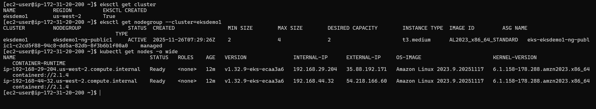
## Create Project Directory & Files
- Create project directory
```bash
mkdir ~/canary-demo
cd ~/canary-demo
```
## Create Application Files
- Create app.py
```bash
from flask import Flask
import os

app = Flask(__name__)
ver = os.environ.get("APP_VERSION", "v1")

@app.route("/")
def index():
    return f"hello from canary-demo {ver}\n"

if __name__ == "__main__":
    app.run(host="0.0.0.0", port=8080)
```
## Create requirements.txt
- requirements.txt
```bash
Flask==2.2.5
```

#### Create Dockerfile
- Dockerfile
```bash
FROM python:3.11-slim

ARG APP_VERSION=v1
ENV APP_VERSION=${APP_VERSION}

WORKDIR /app

COPY requirements.txt .
RUN pip install --no-cache-dir -r requirements.txt

# during build we create different output for v1 & v2
RUN echo "from flask import Flask\napp = Flask(__name__)\n@app.route('/')\ndef home():\n    return 'Hello from version ${APP_VERSION}!'\n\nif __name__ == '__main__':\n    app.run(host='0.0.0.0', port=8080)" > app.py

EXPOSE 8080
CMD ["python", "app.py"]
```

#### Build & Push Images to ECR
- Set your variables
```bash
AWS_ACCOUNT_ID=285241029
AWS_REGION=us-west-2
REPO_NAME=canary-demo
```
#### Create ECR repo
```bash
aws ecr create-repository \
  --repository-name ${REPO_NAME} \
  --region ${AWS_REGION} || true
```
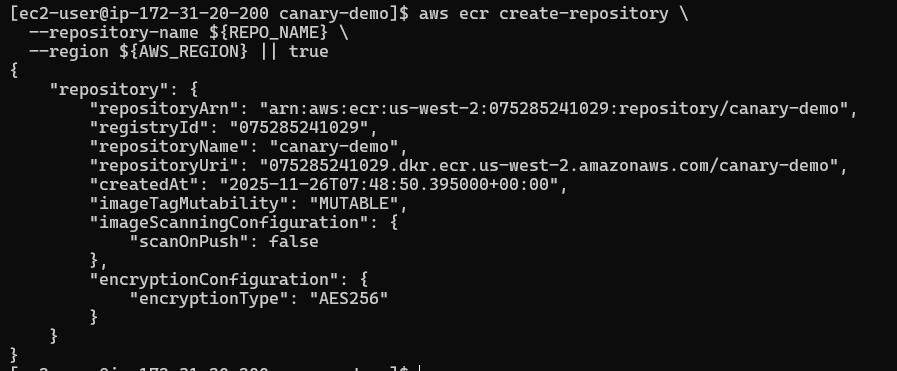

#### Login Docker to ECR
```bash
aws ecr get-login-password --region ${AWS_REGION} | \
docker login --username AWS --password-stdin \
${AWS_ACCOUNT_ID}.dkr.ecr.${AWS_REGION}.amazonaws.com
```
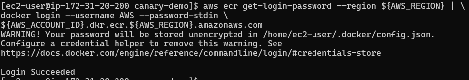
#### Build v1 image
```bash
docker build --build-arg APP_VERSION=v1 -t canary-demo:v1 .
docker tag ${REPO_NAME}:v1 ${AWS_ACCOUNT_ID}.dkr.ecr.${AWS_REGION}.amazonaws.com/${REPO_NAME}:v1
docker push ${AWS_ACCOUNT_ID}.dkr.ecr.${AWS_REGION}.amazonaws.com/${REPO_NAME}:v1
```
####  Build v2 image
```bash
docker build -t ${REPO_NAME}:v2 .
docker tag ${REPO_NAME}:v2 ${AWS_ACCOUNT_ID}.dkr.ecr.${AWS_REGION}.amazonaws.com/${REPO_NAME}:v2
docker push ${AWS_ACCOUNT_ID}.dkr.ecr.${AWS_REGION}.amazonaws.com/${REPO_NAME}:v2
```
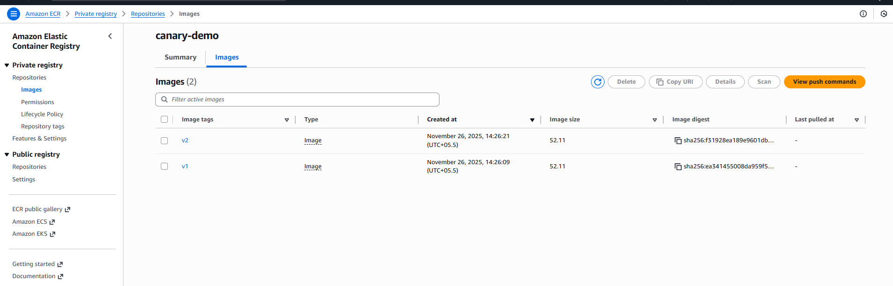

### Install AWS Load Balancer Controller (ALB Controller)

#### download IAM policy JSON
```bash
curl -o iam_policy.json https://raw.githubusercontent.com/kubernetes-sigs/aws-load-balancer-controller/main/docs/install/iam_policy.json
```
#### Create the IAM policy 
```bash
aws iam create-policy \
  --policy-name AWSLoadBalancerControllerIAMPolicy \
  --policy-document file://iam_policy.json
```
```bash
arn:aws:iam::5285241029:policy/AWSLoadBalancerControllerIAMPolicy
```

#### Create IAM Role using eksctl
```bash
eksctl create iamserviceaccount \
  --cluster=eksdemo1 \
  --namespace=kube-system \
  --name=aws-load-balancer-controller \
  --attach-policy-arn=arn:aws:iam::075285241029:policy/AWSLoadBalancerControllerIAMPolicy \
  --region=us-west-2 \
  --approve \
  --override-existing-serviceaccounts
```

#### Install Helm:
```bash
curl -fsSL https://raw.githubusercontent.com/helm/helm/master/scripts/get-helm-3 | bash
```

#### Install ALB Controller using Helm
```bash
helm repo add eks https://aws.github.io/eks-charts
helm repo update
helm upgrade --install aws-load-balancer-controller eks/aws-load-balancer-controller \
  -n kube-system \
  --set clusterName=eksdemo1 \
  --set serviceAccount.create=false \
  --set serviceAccount.name=aws-load-balancer-controller \
  --set region=us-west-2 \
  --set vpcId=$(aws eks describe-cluster --name eksdemo1 --region us-west-2 --query "cluster.resourcesVpcConfig.vpcId" --output text)
```
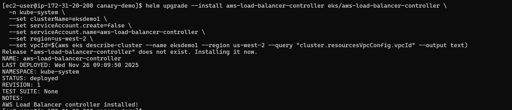
#### Kubernetes Deployment Files

- Create a folder:
```bash
mkdir k8s
```
- Namespace
- k8s/namespace.yaml
```bash
apiVersion: v1
kind: Namespace
metadata:
  name: canary-demo
```

#### Deployment v1
- k8s/deployment-v1.yaml
```bash
apiVersion: apps/v1
kind: Deployment
metadata:
  name: canary-demo-v1
  namespace: canary-demo
  labels:
    app: canary-demo
    version: v1
spec:
  replicas: 3
  selector:
    matchLabels:
      app: canary-demo
      version: v1
  template:
    metadata:
      labels:
        app: canary-demo
        version: v1
    spec:
      containers:
      - name: app
        image: 075285241029.dkr.ecr.us-west-2.amazonaws.com/canary-demo:v1
        ports:
        - containerPort: 8080
        env:
        - name: APP_VERSION
          value: "v1"
```

#### Deployment v2

- k8s/deployment-v2.yaml
```bash
apiVersion: apps/v1
kind: Deployment
metadata:
  name: canary-demo-v2
  namespace: canary-demo
  labels:
    app: canary-demo
    version: v2
spec:
  replicas: 2
  selector:
    matchLabels:
      app: canary-demo
      version: v2
  template:
    metadata:
      labels:
        app: canary-demo
        version: v2
    spec:
      containers:
      - name: app
        image: 075285241029.dkr.ecr.us-west-2.amazonaws.com/canary-demo:v2
        ports:
        - containerPort: 8080
        env:
        - name: APP_VERSION
          value: "v2"
```

#### Primary Service
- k8s/service-primary.yaml
```bash
apiVersion: v1
kind: Service
metadata:
  name: canary-demo
  namespace: canary-demo
spec:
  selector:
    app: canary-demo
    version: v1
  ports:
    - port: 80
      targetPort: 8080
  type: NodePort
```  

#### Canary Service

- k8s/service-canary.yaml
```bash
apiVersion: v1
kind: Service
metadata:
  name: canary-demo-canary
  namespace: canary-demo
spec:
  selector:
    app: canary-demo
    version: v2
  ports:
    - port: 80
      targetPort: 8080
  type: NodePort
```

#### ALB Ingress with Weighted Canary 90/10
- k8s/ingress.yaml
```bash
apiVersion: networking.k8s.io/v1
kind: Ingress
metadata:
  name: canary-demo-ingress
  namespace: canary-demo
  annotations:
    kubernetes.io/ingress.class: alb
    alb.ingress.kubernetes.io/scheme: internet-facing
    alb.ingress.kubernetes.io/listen-ports: '[{"HTTP":80}]'
    alb.ingress.kubernetes.io/actions.canary-action: >-
      {"Type":"forward","ForwardConfig":{"TargetGroups":[{"ServiceName":"canary-demo","ServicePort":"80","Weight":90},{"ServiceName":"canary-demo-canary","ServicePort":"80","Weight":10}]}}
spec:
  rules:
  - http:
      paths:
      - path: /
        pathType: Prefix
        backend:
          service:
            name: canary-action
            port:
              name: use-annotation
```

#### Apply All Kubernetes Resources
```bash
kubectl apply -f k8s/namespace.yaml
kubectl apply -f k8s/deployment-v1.yaml
kubectl apply -f k8s/deployment-v2.yaml
kubectl apply -f k8s/service-primary.yaml
kubectl apply -f k8s/service-canary.yaml
kubectl apply -f k8s/ingress.yaml
```

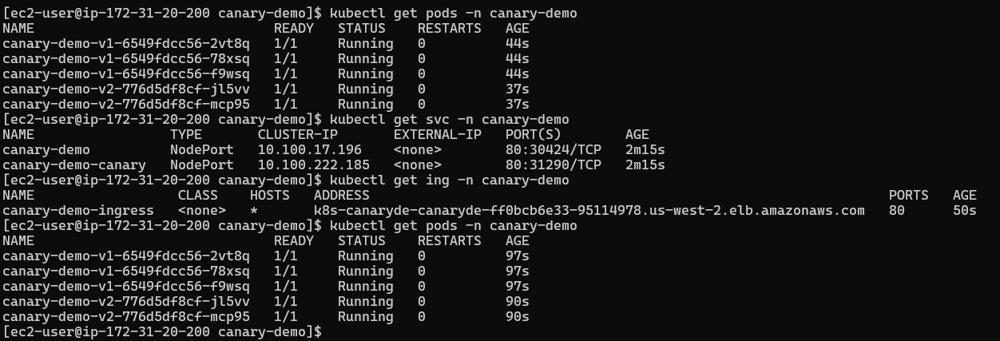
#### Get ALB DNS / ARN
- Get DNS name
```bash
kubectl -n canary-demo get ing canary-demo-ingress -o jsonpath='{.status.loadBalancer.ingress[0].hostname}'; echo

### Get ALB ARN
aws elbv2 describe-load-balancers \
  --region us-west-2 \
  --query "LoadBalancers[?contains(LoadBalancerName, 'canary')]" 
```
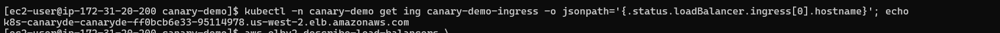
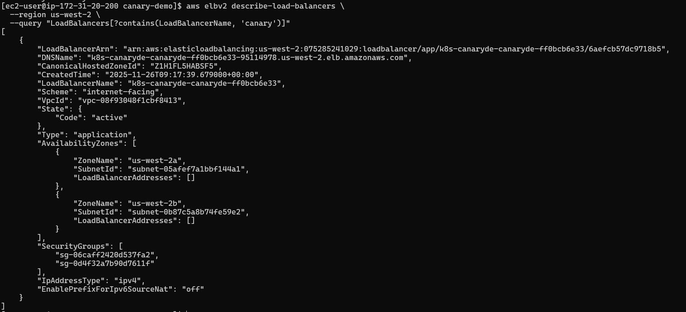
#### Test Canary Behavior

- Test responses
```bash
ALB=$(kubectl -n canary-demo get ing canary-demo-ingress -o jsonpath='{.status.loadBalancer.ingress[0].hostname}')
for i in {1..40}; do curl -s http://$ALB/; done
```
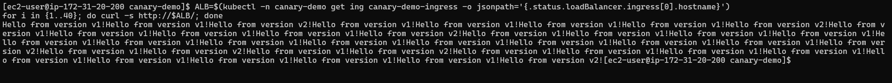


#### Promote Canary (Change Weight)
- Increase to 50/50
```bash
kubectl -n canary-demo annotate ingress canary-demo-ingress \
  alb.ingress.kubernetes.io/actions.canary-action='{"Type":"forward","ForwardConfig":{"TargetGroups":[{"ServiceName":"canary-demo","ServicePort":"80","Weight":50},{"ServiceName":"canary-demo-canary","ServicePort":"80","Weight":50}]}}' --overwrite
```
- Promote v2 to 100%
```bash
kubectl -n canary-demo annotate ingress canary-demo-ingress \
  alb.ingress.kubernetes.io/actions.canary-action='{"Type":"forward","ForwardConfig":{"TargetGroups":[{"ServiceName":"canary-demo-canary","ServicePort":"80","Weight":100}]}}' --overwrite
```
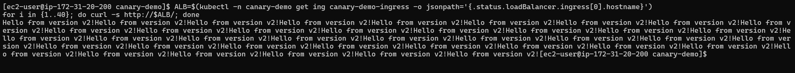

#### Rollback to v1

```bash
kubectl -n canary-demo annotate ingress canary-demo-ingress \
  alb.ingress.kubernetes.io/actions.canary-action='{"Type":"forward","ForwardConfig":{"TargetGroups":[{"ServiceName":"canary-demo","ServicePort":"80","Weight":100}]}}' --overwrite
```
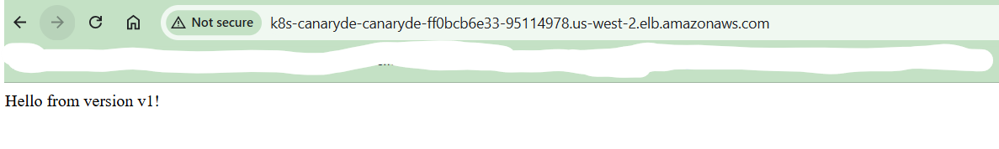