## Three-Tier Application Deployment on Amazon EKS with ALB, RDS, X-Ray, and CloudWatch Observability


#### Variables — set
```bash
# EKS values
ACCOUNT_ID=111122223333
REGION=us-west-2
CLUSTER_NAME=three-tier-eks
K8S_NAMESPACE=three-tier
ECR_REPO_BACKEND=three-tier-backend
ECR_REPO_FRONTEND=three-tier-frontend

# RDS
DB_IDENTIFIER=three-tier-db
DB_NAME=appdb
DB_USER=appuser
DB_PASS='xyz...'    

# Images & tags
BACKEND_IMAGE_TAG=latest
FRONTEND_IMAGE_TAG=latest
```


### Create EKS cluster 

- Create EKS Cluster using eksctl
```bash
# Create Cluster
eksctl create cluster --name=three-tier-eks \
                      --region=us-west-2 \
                      --zones=us-west-2a,us-west-2b \
                      --without-nodegroup
```

- Create & Associate IAM OIDC Provider for our EKS Cluster

```bash
eksctl utils associate-iam-oidc-provider \
    --region us-west-2 \
    --cluster three-tier-eks \
    --approve
```
- Create EKS Node Group in Private Subnets

```bash
eksctl create nodegroup --cluster=three-tier-eks \
                        --region=us-west-2 \
                        --name=three-tier-eks-ng-private1 \
                        --node-type=t3.medium \
                        --nodes-min=2 \
                        --nodes-max=4 \
                        --node-volume-size=20 \
                        --ssh-access \
                        --ssh-public-key=kube-demo \
                        --managed \
                        --asg-access \
                        --external-dns-access \
                        --full-ecr-access \
                        --appmesh-access \
                        --alb-ingress-access \
                        --node-private-networking   
```

#### Identify VPC + Private Subnets
```bash
VPC_ID=$(aws eks describe-cluster \
 --region $REGION \
 --name $CLUSTER_NAME \
 --query "cluster.resourcesVpcConfig.vpcId" \
 --output text)

SUBNETS=$(aws eks describe-cluster \
 --region $REGION \
 --name $CLUSTER_NAME \
 --query "cluster.resourcesVpcConfig.subnetIds" \
 --output text)

echo "VPC_ID=$VPC_ID"
echo "Subnets: $SUBNETS"
```
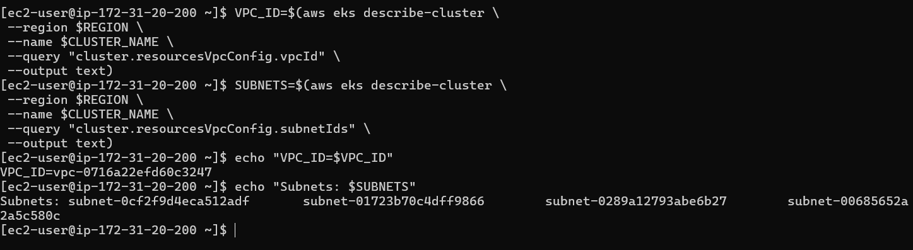

- Check which subnets are private:
```bash
aws ec2 describe-subnets \
 --subnet-ids $SUBNETS \
 --region $REGION \
 --query 'Subnets[*].{ID:SubnetId,Public:MapPublicIpOnLaunch}' --output table
```
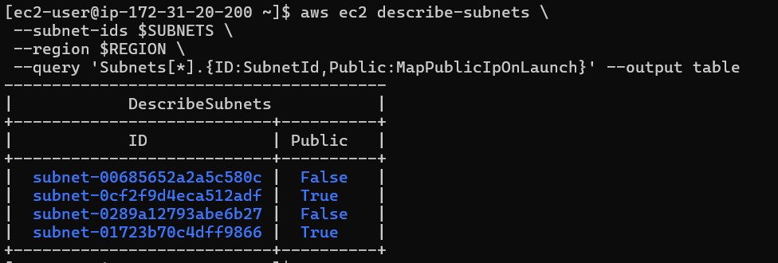


#### Create RDS DB Subnet Group (private)

```bash
aws rds create-db-subnet-group \
 --db-subnet-group-name three-tier-db-subnet-group \
 --db-subnet-group-description "Subnet group for EKS RDS" \
 --subnet-ids $SUBNETS \
 --region $REGION

```

#### Get Nodegroup Security Group
```bash
NODE_SG=$(aws ec2 describe-instances \
 --filters "Name=tag:eks:cluster-name,Values=$CLUSTER_NAME" \
 "Name=instance-state-name,Values=running" \
 --query "Reservations[*].Instances[*].SecurityGroups[*].GroupId" \
 --region $REGION \
 --output text | awk '{print $1}')

echo "Node SG: $NODE_SG"

```
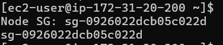

#### Create RDS Security Group + Allow EKS Nodes

```bash
RDS_SG=$(aws ec2 create-security-group \
 --group-name three-tier-rds-sg \
 --description "RDS SG for 3Tier App" \
 --vpc-id $VPC_ID \
 --region $REGION \
 --query GroupId \
 --output text)

aws ec2 authorize-security-group-ingress \
 --group-id $RDS_SG \
 --protocol tcp \
 --port 5432 \
 --source-group $NODE_SG \
 --region $REGION

echo "Created RDS SG: $RDS_SG"

```
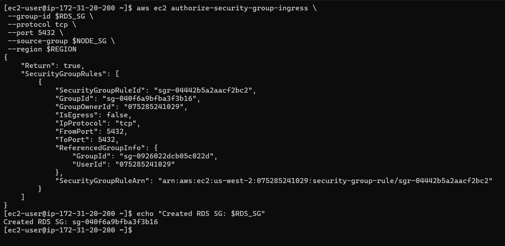

#### Create RDS Postgres (Private)
```bash
aws rds create-db-instance \
 --db-instance-identifier $DB_IDENTIFIER \
 --engine postgres \
 --db-instance-class db.t3.micro \
 --allocated-storage 20 \
 --db-name $DB_NAME \
 --master-username $DB_USER \
 --master-user-password "$DB_PASS" \
 --vpc-security-group-ids $RDS_SG \
 --db-subnet-group-name three-tier-db-subnet-group \
 --no-publicly-accessible \
 --no-multi-az \
 --region $REGION

```
- Wait until available:
```bash
aws rds wait db-instance-available --db-instance-identifier $DB_IDENTIFIER --region $REGION
```
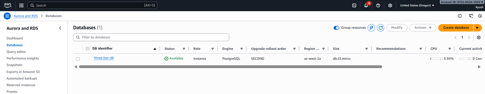
- Get endpoint:

```bash
DB_ENDPOINT=$(aws rds describe-db-instances \
 --db-instance-identifier $DB_IDENTIFIER \
 --query "DBInstances[0].Endpoint.Address" \
 --region $REGION \
 --output text)

echo "RDS Endpoint: $DB_ENDPOINT"

```
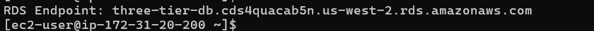


#### Create ECR Repos + Login

```bash
aws ecr create-repository --repository-name $ECR_REPO_BACKEND --region $REGION || true
aws ecr create-repository --repository-name $ECR_REPO_FRONTEND --region $REGION || true

ECR_URI_BACKEND="$ACCOUNT_ID.dkr.ecr.$REGION.amazonaws.com/$ECR_REPO_BACKEND"
ECR_URI_FRONTEND="$ACCOUNT_ID.dkr.ecr.$REGION.amazonaws.com/$ECR_REPO_FRONTEND"

aws ecr get-login-password --region $REGION | docker login --username AWS --password-stdin $ACCOUNT_ID.dkr.ecr.$REGION.amazonaws.com

```
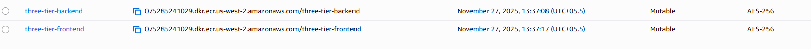
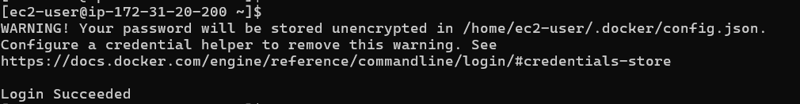


#### Create Backend App + Dockerfile
```bash
# mkdir -p backend
# backend/server.js

const AWSXRay = require('aws-xray-sdk-core');
const express = require('express');
const { Client } = require('pg');

AWSXRay.captureHTTPsGlobal(require('http'));
AWSXRay.captureHTTPsGlobal(require('https'));

const app = express();
app.use(express.json());
app.use(AWSXRay.express.openSegment('backend'));

const client = new Client({
  host: process.env.DB_HOST,
  port: process.env.DB_PORT || 5432,
  user: process.env.DB_USER,
  password: process.env.DB_PASS,
  database: process.env.DB_NAME
});

client.connect();

app.post('/items', async (req,res)=>{
  const {name} = req.body;
  await client.query('CREATE TABLE IF NOT EXISTS items(id SERIAL PRIMARY KEY, name TEXT)');
  await client.query('INSERT INTO items(name) VALUES($1)',[name]);
  res.json({ok:true});
});

app.get('/items', async (req,res)=>{
  const r = await client.query('SELECT * FROM items');
  res.json(r.rows);
});

app.use(AWSXRay.express.closeSegment());

app.listen(3000,()=>console.log("backend running"));


```

- Create package.json
```bash
# backend/package.json
{
  "name": "three-tier-backend",
  "version": "1.0.0",
  "dependencies": {
    "aws-xray-sdk-core": "^3.4.0",
    "express": "^4.18.2",
    "pg": "^8.11.0"
  }
}
EOF
```

- Create Backend Dockerfile:
```bash
# backend/Dockerfile
FROM node:18-alpine
WORKDIR /app
COPY package.json ./
RUN npm install --production
COPY . .
EXPOSE 3000
CMD ["node","server.js"]

```

#### Build + Push Backend Image

```bash
cd backend
docker build -t $ECR_URI_BACKEND:$BACKEND_IMAGE_TAG .
docker push $ECR_URI_BACKEND:$BACKEND_IMAGE_TAG
cd ..
```
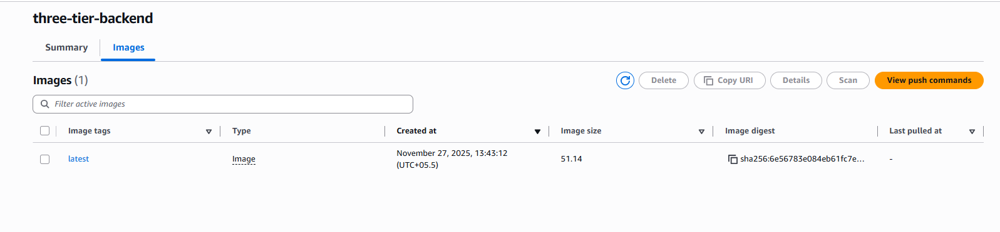

#### Create Frontend App + Dockerfile

```bash
 # mkdir -p frontend/public
# frontend/public/index.html
<!DOCTYPE html>
<html>
<body>
<h1>Three Tier App</h1>
<input id="name" placeholder="Enter Name">
<button onclick="add()">Add</button>
<ul id="list"></ul>
<script>
async function add(){
  const name=document.getElementById('name').value;
  await fetch('/api/items',{method:'POST', headers:{'Content-Type':'application/json'}, body:JSON.stringify({name})});
  load();
}
async function load(){
  const r=await fetch('/api/items');
  const items=await r.json();
  document.getElementById('list').innerHTML='';
  for(const i of items){
    const li=document.createElement('li'); li.innerText=i.name;
    document.getElementById('list').appendChild(li);
  }
}
load();
</script>
</body>
</html>
```
- Create Dockerfile:
```bash
# frontend/Dockerfile 
FROM nginx:stable-alpine
COPY public/ /usr/share/nginx/html
EXPOSE 80
CMD ["nginx","-g","daemon off;"]
EOF

```
#### Build + Push Frontend Image

```bash
cd frontend
docker build -t $ECR_URI_FRONTEND:$FRONTEND_IMAGE_TAG .
docker push $ECR_URI_FRONTEND:$FRONTEND_IMAGE_TAG
cd ..
```
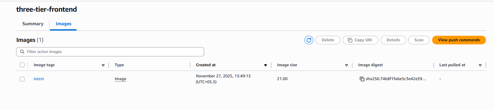


#### Download & Create IAM Policies (ALB, X-Ray, FluentBit)

- ALB Policy

```bash
curl -o iam_policy_alb.json \
https://raw.githubusercontent.com/kubernetes-sigs/aws-load-balancer-controller/main/docs/install/iam_policy.json

aws iam create-policy \
 --policy-name AWSLoadBalancerControllerIAMPolicy \
 --policy-document file://iam_policy_alb.json \
 --region $REGION || true

ALB_POLICY_ARN=$(aws iam list-policies --query "Policies[?PolicyName=='AWSLoadBalancerControllerIAMPolicy'].Arn | [0]" --output text)
```

- X-Ray Policy
```bash
curl -o iam_policy_xray.json \
https://raw.githubusercontent.com/awsdocs/aws-xray-developer-guide/master/doc_source/xray-permissions-policy.json

aws iam create-policy \
 --policy-name AWSXRayDaemonWritePolicy \
 --policy-document file://iam_policy_xray.json \
 --region $REGION || true

XRAY_POLICY_ARN=$(aws iam list-policies --query "Policies[?PolicyName=='AWSXRayDaemonWritePolicy'].Arn | [0]" --output text)

```

- FluentBit Policy
```bash
curl -o iam_policy_fluentbit.json \
https://raw.githubusercontent.com/aws/amazon-cloudwatch-logs-for-fluent-bit/main/deployment/permissions.json

aws iam create-policy \
 --policy-name FluentBitCloudWatchPolicy \
 --policy-document file://iam_policy_fluentbit.json \
 --region $REGION || true

FLUENTBIT_POLICY_ARN=$(aws iam list-policies --query "Policies[?PolicyName=='FluentBitCloudWatchPolicy'].Arn | [0]" --output text)
```

#### Create IRSA (ALB, X-Ray, FluentBit)

- ALB IRSA
```bash
eksctl create iamserviceaccount \
 --cluster $CLUSTER_NAME \
 --region $REGION \
 --namespace kube-system \
 --name aws-load-balancer-controller \
 --attach-policy-arn $ALB_POLICY_ARN \
 --approve

```
- X-Ray IRSA

```bash
kubectl create namespace $K8S_NAMESPACE || true

eksctl create iamserviceaccount \
 --cluster $CLUSTER_NAME \
 --region $REGION \
 --namespace $K8S_NAMESPACE \
 --name xray-daemon-sa \
 --attach-policy-arn $XRAY_POLICY_ARN \
```

- FluentBit IRSA

```bash
kubectl create namespace amazon-cloudwatch || true

eksctl create iamserviceaccount \
 --cluster $CLUSTER_NAME \
 --region $REGION \
 --namespace amazon-cloudwatch \
 --name fluent-bit \
 --attach-policy-arn $FLUENTBIT_POLICY_ARN \
 --approve

```

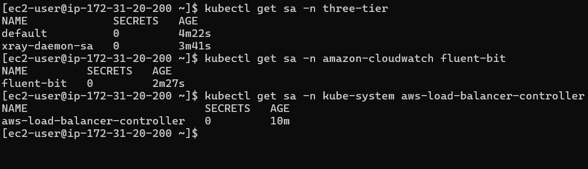


#### Install AWS Load Balancer Controller

```bash
helm repo add eks https://aws.github.io/eks-charts
helm repo update

helm install aws-load-balancer-controller eks/aws-load-balancer-controller \
 -n kube-system \
 --set clusterName=$CLUSTER_NAME \
 --set region=$REGION \
 --set serviceAccount.create=false \
 --set serviceAccount.name=aws-load-balancer-controller
```
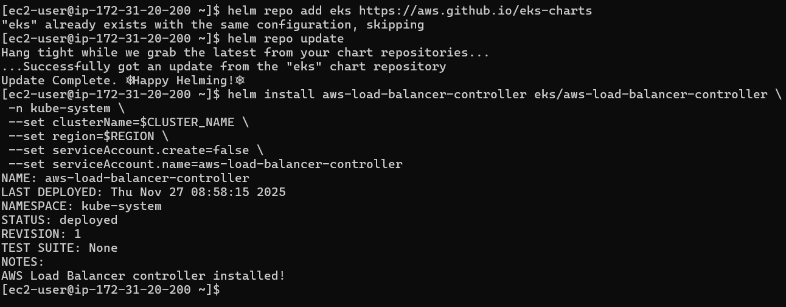
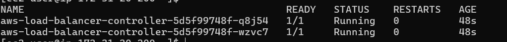


#### Deploy X-Ray DaemonSet

```bash

# xray.yaml
apiVersion: apps/v1
kind: DaemonSet
metadata:
  name: xray-daemon
  namespace: $K8S_NAMESPACE
spec:
  selector:
    matchLabels:
      app: xray-daemon
  template:
    metadata:
      labels:
        app: xray-daemon
    spec:
      serviceAccountName: xray-daemon-sa
      containers:
      - name: xray-daemon
        image: amazon/aws-xray-daemon:latest
        ports:
        - containerPort: 2000
          protocol: UDP
        env:
        - name: AWS_REGION
          value: "$REGION"

# kubectl apply -f xray.yaml

```
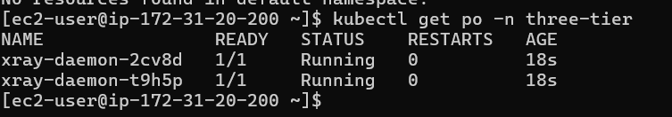


#### Install Fluent Bit
```bash
curl -O https://raw.githubusercontent.com/aws/amazon-cloudwatch-logs-for-fluent-bit/main/deployment/fluent-bit-service-account.yaml
curl -O https://raw.githubusercontent.com/aws/amazon-cloudwatch-logs-for-fluent-bit/main/deployment/fluent-bit-configmap.yaml
curl -O https://raw.githubusercontent.com/aws/amazon-cloudwatch-logs-for-fluent-bit/main/deployment/fluent-bit-daemonset.yaml

kubectl apply -f fluent-bit-service-account.yaml
kubectl apply -f fluent-bit-configmap.yaml
kubectl apply -f fluent-bit-daemonset.yaml


```
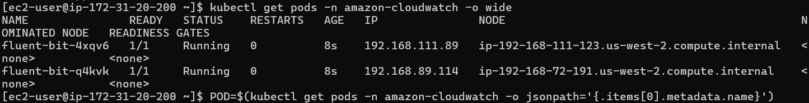


#### Deploy Backend + Frontend + Services + Secrets

```bash
#  app.yaml 
apiVersion: v1
kind: Secret
metadata:
  name: db-credentials
  namespace: $K8S_NAMESPACE
type: Opaque
stringData:
  DB_HOST: "$DB_ENDPOINT"
  DB_PORT: "5432"
  DB_USER: "$DB_USER"
  DB_PASS: "$DB_PASS"
  DB_NAME: "$DB_NAME"
---
apiVersion: apps/v1
kind: Deployment
metadata:
  name: backend
  namespace: $K8S_NAMESPACE
spec:
  replicas: 2
  selector:
    matchLabels: { app: backend }
  template:
    metadata:
      labels: { app: backend }
    spec:
      containers:
      - name: backend
        image: "$ECR_URI_BACKEND:$BACKEND_IMAGE_TAG"
        ports:
        - containerPort: 3000
---
apiVersion: v1
kind: Service
metadata:
  name: backend-svc
  namespace: $K8S_NAMESPACE
spec:
  selector: { app: backend }
  ports:
  - port: 3000
    targetPort: 3000
---
apiVersion: apps/v1
kind: Deployment
metadata:
  name: frontend
  namespace: $K8S_NAMESPACE
spec:
  replicas: 2
  selector:
    matchLabels: { app: frontend }
  template:
    metadata:
      labels: { app: frontend }
    spec:
      containers:
      - name: frontend
        image: "$ECR_URI_FRONTEND:$FRONTEND_IMAGE_TAG"
        ports:
        - containerPort: 80
---
apiVersion: v1
kind: Service
metadata:
  name: frontend-svc
  namespace: $K8S_NAMESPACE
spec:
  selector: { app: frontend }
  ports:
  - port: 80
    targetPort: 80


        # kubectl apply -f app.yaml
        # kubectl -n $K8S_NAMESPACE get pods
```

#### Create Ingress (ALB)

```bash
# ingress.yaml 
apiVersion: networking.k8s.io/v1
kind: Ingress
metadata:
  name: three-tier-ingress
  namespace: $K8S_NAMESPACE
  annotations:
    kubernetes.io/ingress.class: alb
    alb.ingress.kubernetes.io/scheme: internet-facing
spec:
  rules:
  - http:
      paths:
      - path: /api
        pathType: Prefix
        backend:
          service:
            name: backend-svc
            port:
              number: 3000
      - path: /
        pathType: Prefix
        backend:
          service:
            name: frontend-svc
            port:
              number: 80


# kubectl apply -f ingress.yaml


```
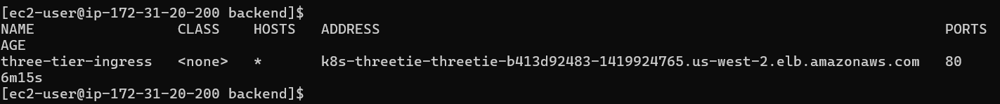
- Check ALB URL:

```bash
kubectl -n $K8S_NAMESPACE get ingress three-tier-ingress

```


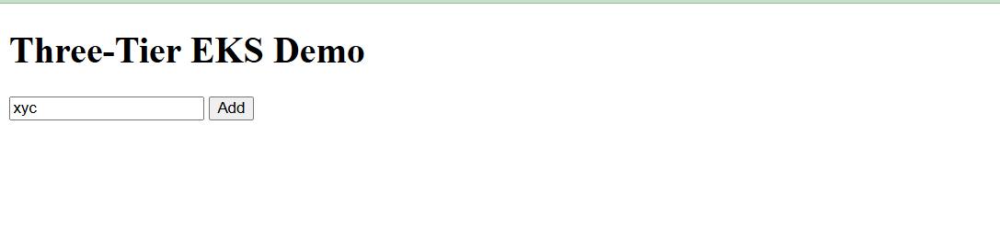
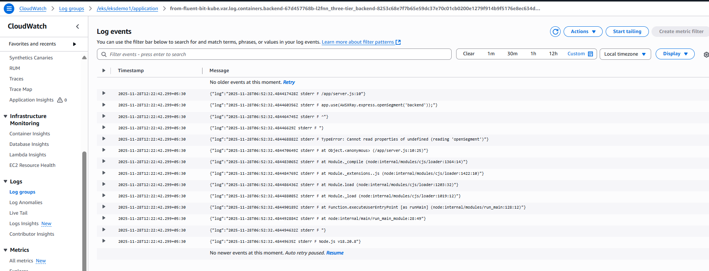

