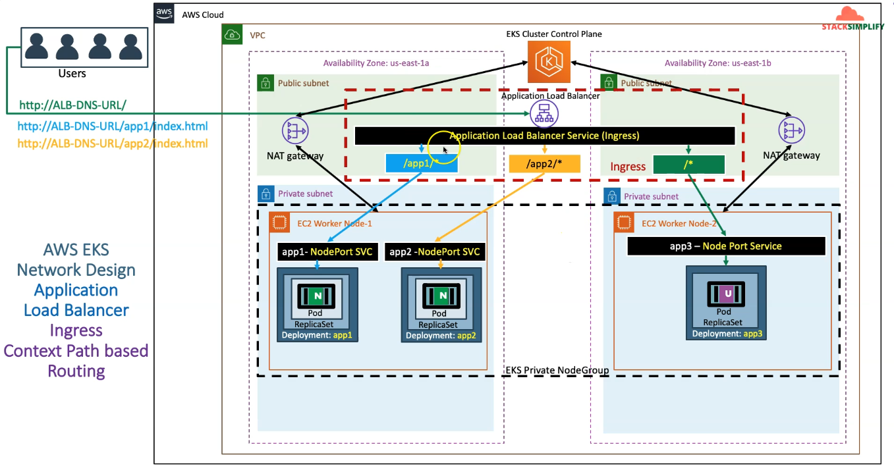

# Ingress Context Path Based Routing

### We are going to deploy multiple appliation for context path based routing using aws laod balancer controller with Ingress rules.




### Apply kube-manifests
``` bash
kubectl apply -f kube-manifests/
```

