# AWS Load Balancer Controller Install on AWS EKS

## Pre-requisites

#### eksctl & kubectl Command Line Utility

```bash
# Verify eksctl version
eksctl version

# For installing or upgrading latest eksctl version
https://docs.aws.amazon.com/eks/latest/userguide/eksctl.html

# Verify EKS Cluster version
kubectl version --short
kubectl version
Important Note: You must use a kubectl version that is within one minor version difference of your Amazon EKS cluster control plane. For example, a 1.20 kubectl client works with Kubernetes 1.19, 1.20 and 1.21 clusters.

# For installing kubectl cli
https://docs.aws.amazon.com/eks/latest/userguide/install-kubectl.html

```
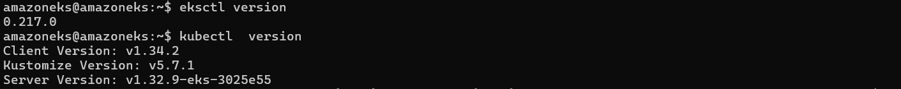


#### Create EKS Cluster and Worker Nodes (if not created)

```bash
# Create Cluster 
eksctl create cluster --name=eksdemo1 \
                      --region=us-east-1 \
                      --zones=us-east-1a,us-east-1b \
                      --version="1.21" \
                      --without-nodegroup 


# Get List of clusters 
eksctl get cluster   

# Template 
eksctl utils associate-iam-oidc-provider \
    --region region-code \
    --cluster <cluter-name> \
    --approve

# Replace with region & cluster name 
eksctl utils associate-iam-oidc-provider \
    --region us-east-1 \
    --cluster eksdemo1 \
    --approve

# Create EKS NodeGroup in VPC Private Subnets 
eksctl create nodegroup --cluster=eksdemo1 \
                        --region=us-east-1 \
                        --name=eksdemo1-ng-private1 \
                        --node-type=t3.medium \
                        --nodes-min=2 \
                        --nodes-max=4 \
                        --node-volume-size=20 \
                        --ssh-access \
                        --ssh-public-key=kube-demo \
                        --managed \
                        --asg-access \
                        --external-dns-access \
                        --full-ecr-access \
                        --appmesh-access \
                        --alb-ingress-access \
                        --node-private-networking       


```


#### Verify Cluster, Node Groups and configure kubectl cli if not configured

- EKS Cluster
- EKS Node Groups in Private Subnets

```bash
# Verfy EKS Cluster
eksctl get cluster

# Verify EKS Node Groups
eksctl get nodegroup --cluster=eksdemo1

# Verify if any IAM Service Accounts present in EKS Cluster
eksctl get iamserviceaccount --cluster=eksdemo1
Observation:
1. No k8s Service accounts as of now. 

# Configure kubeconfig for kubectl
eksctl get cluster # TO GET CLUSTER NAME
aws eks --region <region-code> update-kubeconfig --name <cluster_name>
aws eks --region us-east-1 update-kubeconfig --name eksdemo1

# Verify EKS Nodes in EKS Cluster using kubectl
kubectl get nodes

# Verify using AWS Management Console
1. EKS EC2 Nodes (Verify Subnet in Networking Tab)
2. EKS Cluster


```
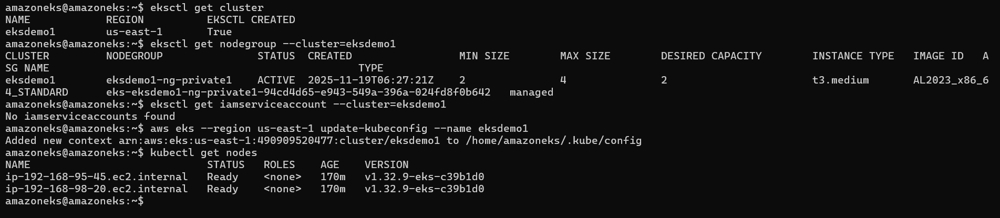


## Created IAM Policy

- Create IAM policy for the AWS Load Balancer Controller that allows it to make calls to AWS APIs on your behalf.
- We will download always latest from main branch of Git Repo
- AWS Load Balancer Controller Main Git repo


```bash
# Change Directroy
cd 08-NEW-ELB-Application-LoadBalancers/
cd 08-01-Load-Balancer-Controller-Install

# Delete files before download (if any present)
rm iam_policy_latest.json

# Download IAM Policy
## Download latest
curl -o iam_policy_latest.json https://raw.githubusercontent.com/kubernetes-sigs/aws-load-balancer-controller/main/docs/install/iam_policy.json
## Verify latest
ls -lrta 

## Download specific version
curl -o iam_policy_v2.3.1.json https://raw.githubusercontent.com/kubernetes-sigs/aws-load-balancer-controller/v2.3.1/docs/install/iam_policy.json


# Create IAM Policy using policy downloaded 
aws iam create-policy \
    --policy-name AWSLoadBalancerControllerIAMPolicy \
    --policy-document file://iam_policy_latest.json


```

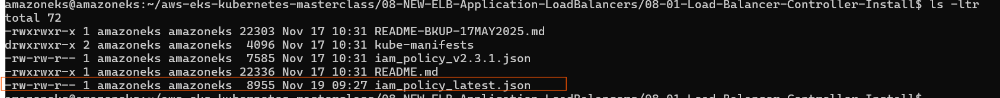
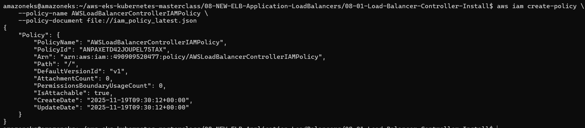

- arn of policy

```bash
arn:aws:iam::490909520477:policy/AWSLoadBalancerControllerIAMPolicy
```


## Created an IAM role for the AWS LoadBalancer Controller and attach the role to the Kubernetes service account

- Applicable only with eksctl managed clusters
- This command will create an AWS IAM role
- This command also will create Kubernetes Service Account in k8s cluster
- In addition, this command will bound IAM Role created and the Kubernetes service account created


```bash

# Verify if any existing service account
kubectl get sa -n kube-system
kubectl get sa aws-load-balancer-controller -n kube-system
Obseravation:
1. Nothing with name "aws-load-balancer-controller" should exist


eksctl create iamserviceaccount \
  --cluster=eksdemo1 \
  --namespace=kube-system \
  --name=aws-load-balancer-controller \
  --attach-policy-arn=arn:aws:iam::490909520477:policy/AWSLoadBalancerControllerIAMPolicy \
  --override-existing-serviceaccounts \
  --approve

```
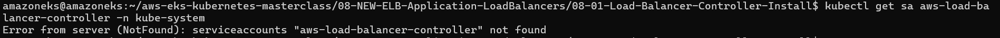
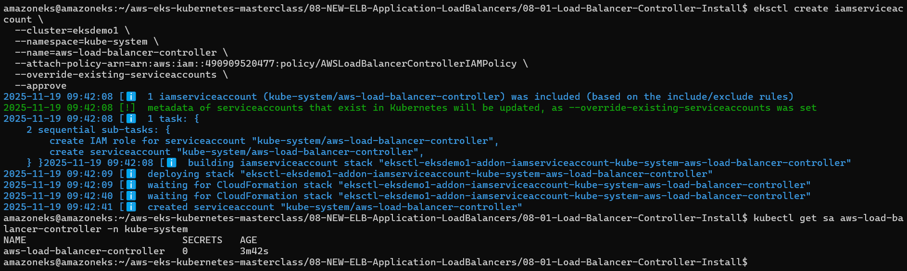

- Verify using eksctl cli

```bash
# Get IAM Service Account
eksctl  get iamserviceaccount --cluster eksdemo1

```
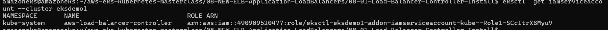

- Observation: You can see that newly created Role ARN is added in Annotations confirming that AWS IAM role bound to a Kubernetes service account
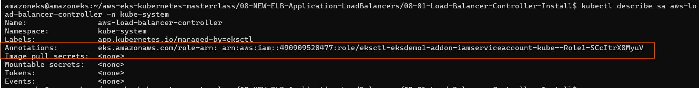


## Install the AWS Load Balancer Controller using Helm V3

- Install Helm - [Install Helm](https://helm.sh/docs/intro/install/)

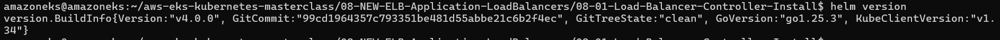

```bash
# Add the eks-charts repository.
helm repo add eks https://aws.github.io/eks-charts

# Update your local repo to make sure that you have the most recent charts.
helm repo update

# Install the AWS Load Balancer Controller.
## Template
helm install aws-load-balancer-controller eks/aws-load-balancer-controller \
  -n kube-system \
  --set clusterName=<cluster-name> \
  --set serviceAccount.create=false \
  --set serviceAccount.name=aws-load-balancer-controller \
  --set region=<region-code> \
  --set vpcId=<vpc-xxxxxxxx> \
  --set image.repository=public.ecr.aws/eks/aws-load-balancer-controller

## Replace Cluster Name, Region Code, VPC ID, Image Repo Account ID and Region Code  
helm install aws-load-balancer-controller eks/aws-load-balancer-controller \
  -n kube-system \
  --set clusterName=eksdemo1 \
  --set serviceAccount.create=false \
  --set serviceAccount.name=aws-load-balancer-controller \
  --set region=us-east-1 \
  --set vpcId=vpc-047f01d7cd2aa7d47 \
  --set image.repository=public.ecr.aws/eks/aws-load-balancer-controller

```

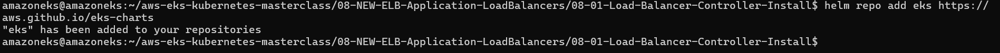
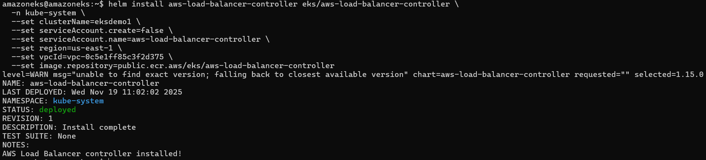

#### Verify that the controller is installed and Webhook Service created

```bash
# Verify that the controller is installed.
kubectl -n kube-system get deployment 
kubectl -n kube-system get deployment aws-load-balancer-controller
kubectl -n kube-system describe deployment aws-load-balancer-controller

# Verify AWS Load Balancer Controller Webhook service created
kubectl -n kube-system get svc 
kubectl -n kube-system get svc aws-load-balancer-webhook-service
kubectl -n kube-system describe svc aws-load-balancer-webhook-service

# Verify Labels in Service and Selector Labels in Deployment
kubectl -n kube-system get svc aws-load-balancer-webhook-service -o yaml
kubectl -n kube-system get deployment aws-load-balancer-controller -o yaml

```


- UNINSTALL AWS Load Balancer Controller using Helm Command


```bash
# Uninstall AWS Load Balancer Controller
helm uninstall aws-load-balancer-controller -n kube-system 
```

- Created IngressClass Resource

```bash

# Create IngressClass Resource
kubectl apply -f kube-manifests

# Verify IngressClass Resource
kubectl get ingressclass

# Describe IngressClass Resource
kubectl describe ingressclass my-aws-ingress-class

```

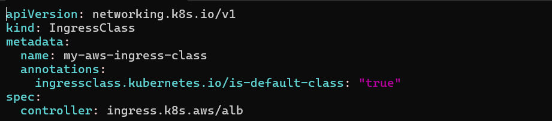
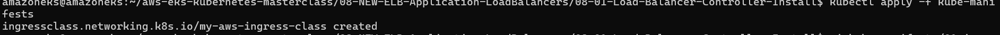
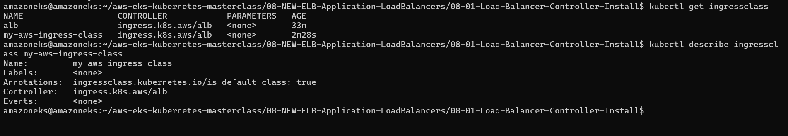


- Deploy kube-manifests with routing rule
  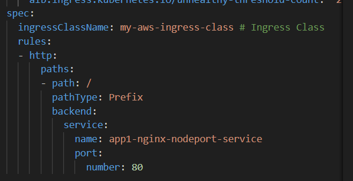


