# Container Insights
- Container Insights is an AWS CloudWatch feature that monitors and collects metrics, logs, and performance data from your containerized applications running on:

    - Amazon EKS (Kubernetes)
    - Amazon ECS
    - AWS Fargate
    - Kubernetes clusters (via CloudWatch agent)


#### Collects Performance Metrics

- It gathers system-level and container-level metrics like:

- CPU usage

- Memory usage

- Network I/O

- Disk I/O

- Number of containers running

#### Gives Insights into Cluster & Node Health

- You can monitor:

    - Node performance

    - Pod status

    - Container restarts

    - Daemonset/Deployment performance

    - Cluster utilization

#### Automatically Creates Dashboards

- Container Insights builds ready-made dashboards inside CloudWatch for:

    - EKS cluster performance

    - ECS services/tasks

    - Fargate containers

#### Collects Logs

- It sends logs to CloudWatch:

    - Application logs

    -Container runtime logs

    -kubelet logs

    - Docker logs

#### Helps in Troubleshooting

- You can quickly identify:

    - Memory leaks

    - High CPU containers

    - Pods failing or restarting

    - Bottlenecks in the cluster

    - Overloaded nodes   

| Component                | What it Does                                  |
| ------------------------ | --------------------------------------------- |
| **FluentD pod**          | Collects & forwards logs (container logs)     |
| **CloudWatch agent pod** | Collects metrics (CPU, memory, disk, network) |


## enable container insight in cluster


#### created cluster 

```bash
eksctl create cluster --name=eksdemo1 \
                      --region=us-west-2 \
                      --zones=us-west-2a,us-west-2b \
                      --without-nodegroup 

```
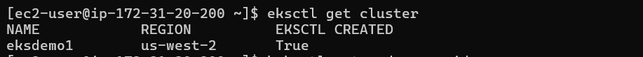

#### Create & Associate IAM OIDC Provider for our EKS Cluster
```bash
eksctl utils associate-iam-oidc-provider \
    --region us-west-2 \
    --cluster eksdemo1 \
    --approve
```

#### Create EKS Node Group in Private Subnets

```bash

eksctl create nodegroup --cluster=eksdemo1 \
                        --region=us-west-2 \
                        --name=eksdemo1-ng-private1 \
                        --node-type=t3.medium \
                        --nodes-min=2 \
                        --nodes-max=4 \
                        --node-volume-size=20 \
                        --ssh-access \
                        --ssh-public-key=kube-demo \
                        --managed \
                        --asg-access \
                        --external-dns-access \
                        --full-ecr-access \
                        --appmesh-access \
                        --alb-ingress-access \
                        --node-private-networking 


```
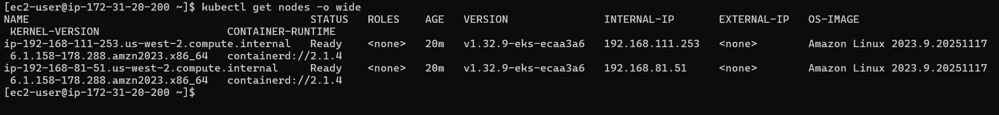

#### Associate CloudWatch Policy to our EKS Worker Nodes Role
- Go to Services -> EC2 -> Worker Node EC2 Instance -> IAM Role -> Click on that role

```bash
 # Policy to be associated
Associate Policy: CloudWatchAgentServerPolicy
```

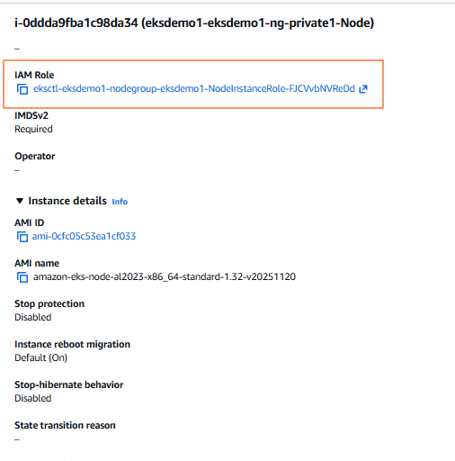
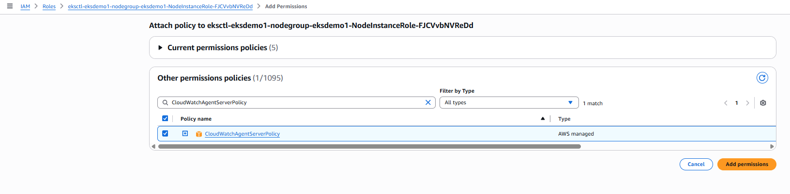

#### Install Container Insights
- Deploy CloudWatch Agent and Fluentd as DaemonSets
  - This command will
     - Creates the Namespace amazon-cloudwatch.
     - Creates all the necessary security objects for both DaemonSet:
        -  SecurityAccount
        - ClusterRole
        - ClusterRoleBinding

    - Deploys ``Cloudwatch-Agent`` (responsible for sending the metrics to CloudWatch) as a DaemonSet.
    - Deploys fluentd (responsible for sending the logs to Cloudwatch) as a DaemonSet.
    - Deploys ConfigMap configurations for both DaemonSets.
    ```bash
        # Template
        curl -s https://raw.githubusercontent.com/aws-samples/amazon-cloudwatch-container-insights/latest/k8s-deployment-manifest-templates/deployment-mode/daemonset/container-insights-monitoring/quickstart/cwagent-fluentd-quickstart.yaml | sed "s/{{cluster_name}}/<REPLACE_CLUSTER_NAME>/;s/{{region_name}}/<REPLACE-AWS_REGION>/" | kubectl apply -f -
    
        # Replaced Cluster Name and Region
        curl -s https://raw.githubusercontent.com/aws-samples/amazon-cloudwatch-container-insights/latest/k8s-deployment-manifest-templates/deployment-mode/daemonset/container-insights-monitoring/quickstart/cwagent-fluentd-quickstart.yaml | sed "s/{{cluster_name}}/eksdemo1/;s/{{region_name}}/us-west-2/" | kubectl apply -f -
    ```
    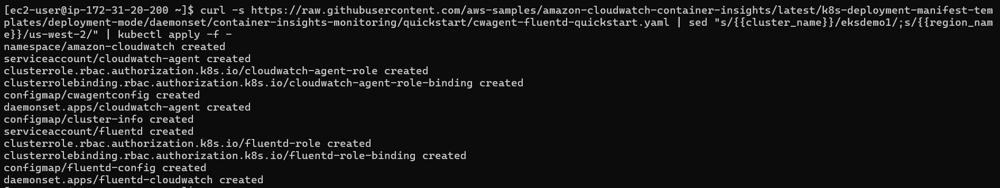

    ```bash
    kubectl -n amazon-cloudwatch get daemonsets
    ```
    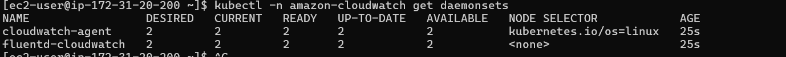


#### Deploy Sample Nginx Application

```bash
kubectl apply -f Sample-Nginx-App.yml
```

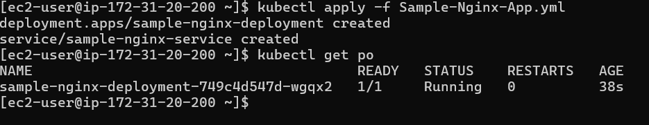
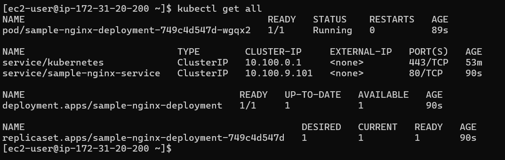


#### Generate load on our Sample Nginx Application
```bash
kubectl run apache-bench \
  -it --rm \
  --image=httpd \
  -- bash -c "ab -n 500000 -c 1000 http://sample-nginx-service.default.svc.cluster.local/"

```
#### Access CloudWatch Dashboard
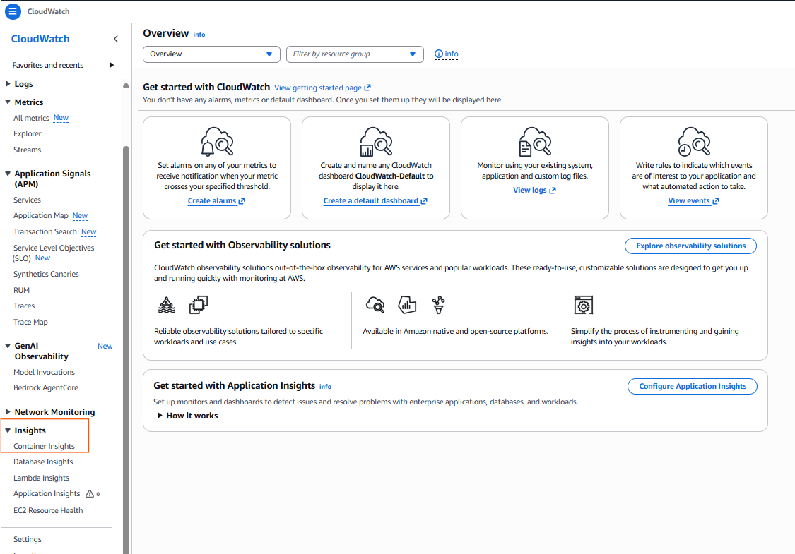
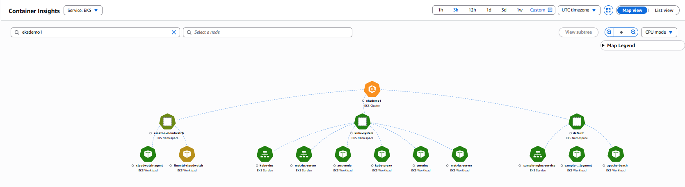
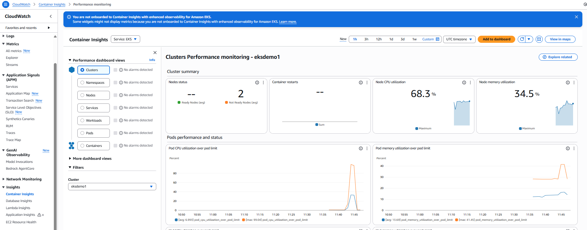
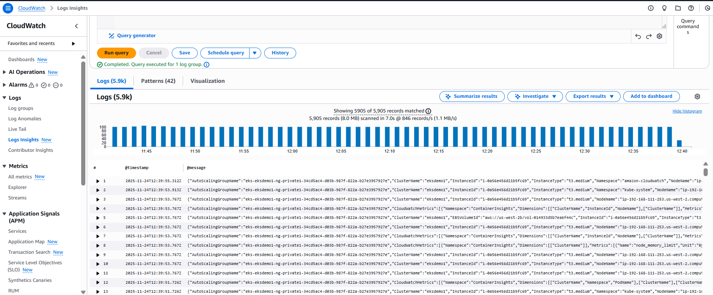


#### Create Graph for Avg Node CPU Utlization
- DashBoard Name: EKS-Performance
- Widget Type: Bar
- Log Group: /aws/containerinsights/eksdemo1/performance
```bash
STATS avg(node_cpu_utilization) as avg_node_cpu_utilization by NodeName
| SORT avg_node_cpu_utilization DESC
```
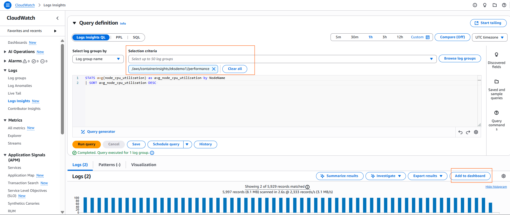


#### Container Restarts
- DashBoard Name: EKS-Performance
- Widget Type: Table
- Log Group: /aws/containerinsights/eksdemo1/performance
```bash
STATS avg(number_of_container_restarts) as avg_number_of_container_restarts by PodName
| SORT avg_number_of_container_restarts DESC
```


#### Cluster Node Failures
- DashBoard Name: EKS-Performance
- Widget Type: Table
- Log Group: /aws/containerinsights/eksdemo1/performance
```bash
stats avg(cluster_failed_node_count) as CountOfNodeFailures 
| filter Type="Cluster" 
| sort @timestamp desc
```

#### CPU Usage By Container
- DashBoard Name: EKS-Performance
- Widget Type: Bar
- Log Group: /aws/containerinsights/eksdemo1/performance
```bash
stats pct(container_cpu_usage_total, 50) as CPUPercMedian by kubernetes.container_name 
| filter Type="Container"
```

#### Pods Requested vs Pods Running
- DashBoard Name: EKS-Performance
- Widget Type: Bar
- Log Group: /aws/containerinsights/eksdemo1/performance
```bash
fields @timestamp, @message 
| sort @timestamp desc 
| filter Type="Pod" 
| stats min(pod_number_of_containers) as requested, min(pod_number_of_running_containers) as running, ceil(avg(pod_number_of_containers-pod_number_of_running_containers)) as pods_missing by kubernetes.pod_name 
| sort pods_missing desc
```
#### Application log errors by container name
- DashBoard Name: EKS-Performance
- Widget Type: Bar
- Log Group: /aws/containerinsights/eksdemo1/application
```bash
stats count() as countoferrors by kubernetes.container_name 
| filter stream="stderr" 
| sort countoferrors desc 
```

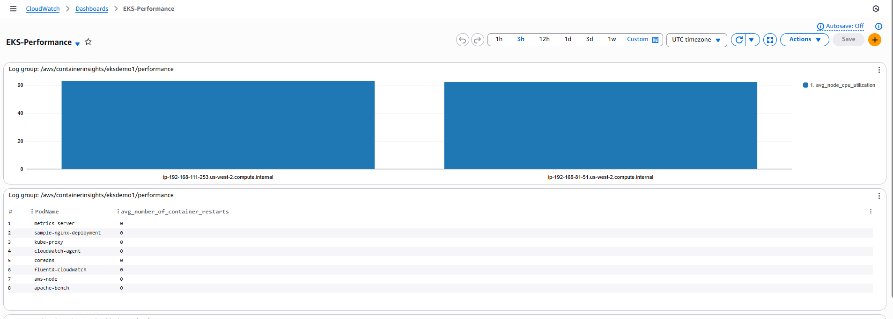

#### Container Insights - CloudWatch Alarms
###### Create Alarms - Node CPU Usage
- Specify metric and conditions
    - Select Metric: Container Insights -> ClusterName -> node_cpu_utilization
    - Metric Name: eksdemo1_node_cpu_utilization
    - Threshold Value: 70

- Configure Actions
    - Create New Topic: eks-alerts
    - Email: xyz@gmail.com
    - Click on Create Topic
    - Important Note:** Complete Email subscription sent to your email id.
- Add name and description
    - Name: EKS-Nodes-CPU-Alert
    - Descritption: EKS Nodes CPU alert notification
    - Click Next
- Preview
Preview and Create Alarm
- Add Alarm to our custom Dashboard
- Generate Load & Verify Alarm

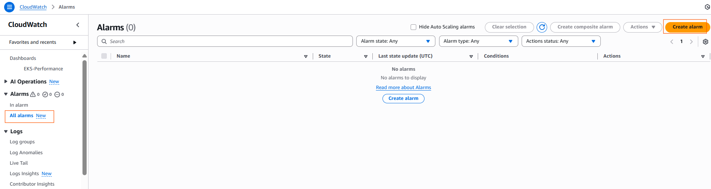
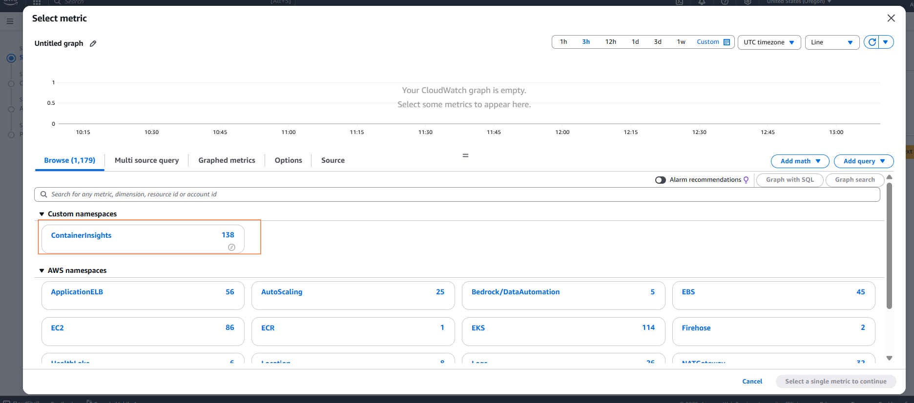
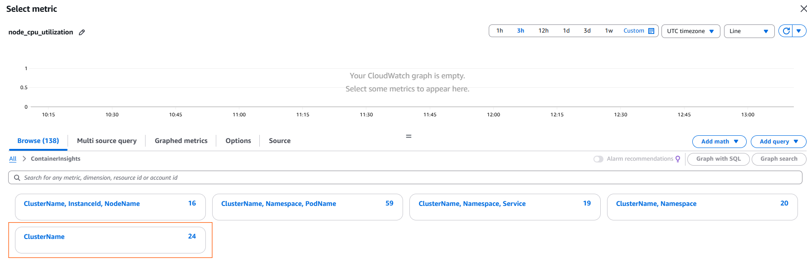
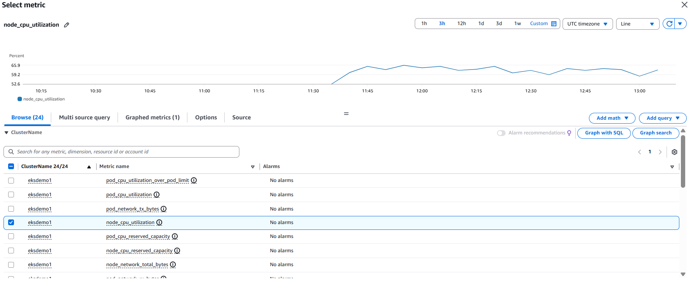
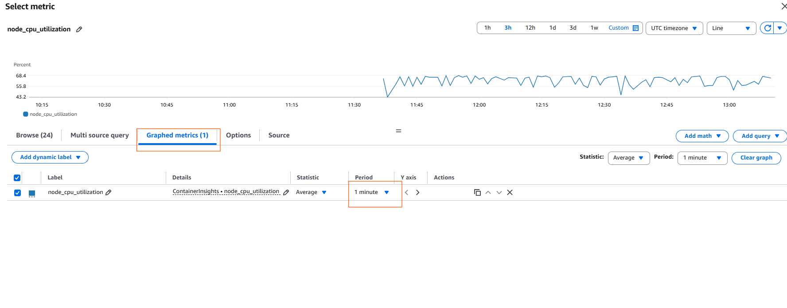
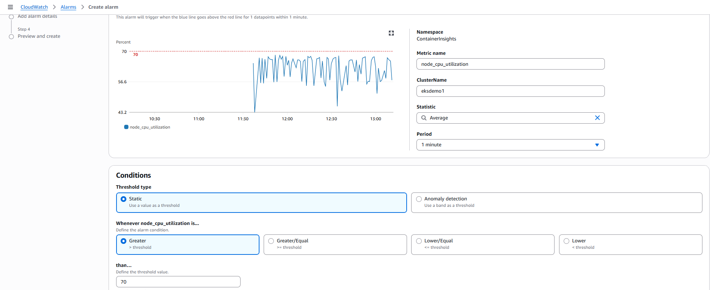
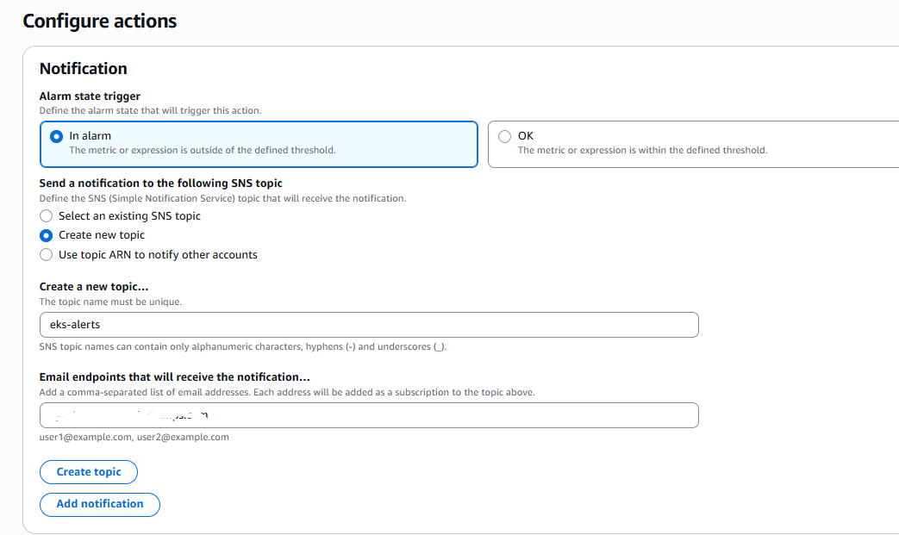
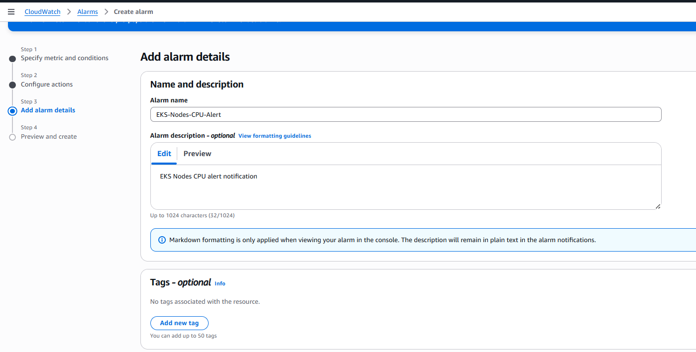
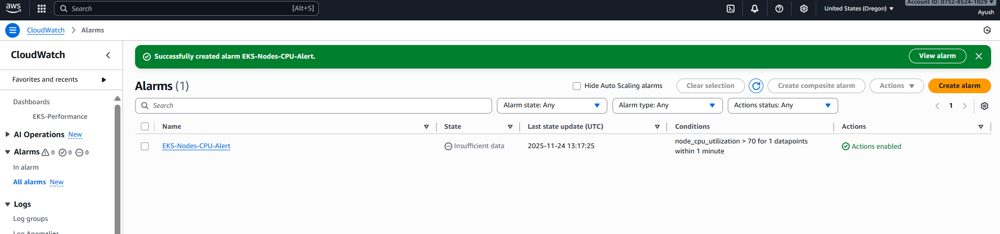


#### Generate Load & Verify Alarm

```bash
```bash
kubectl run apache-bench \
  -it --rm \
  --image=httpd \
  -- bash -c "ab -n 500000 -c 1000 http://sample-nginx-service.default.svc.cluster.local/"

```


