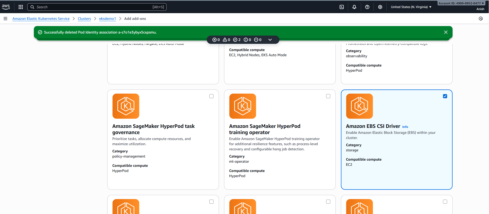
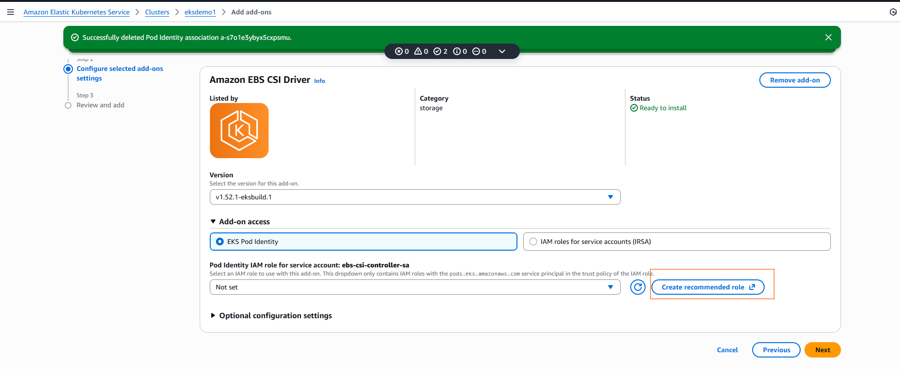
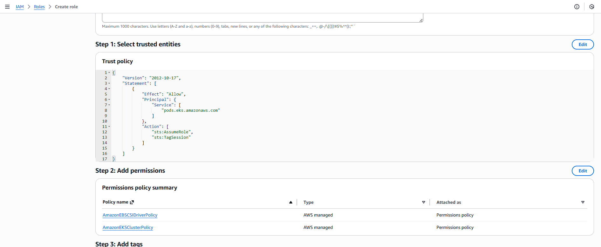
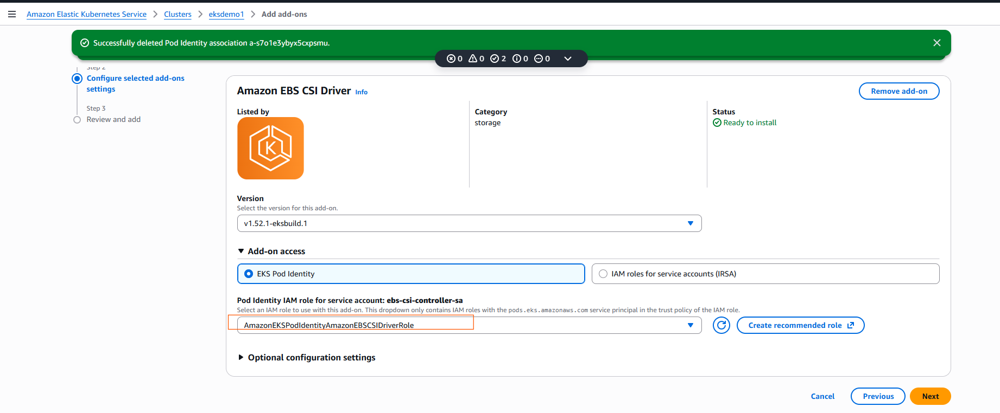
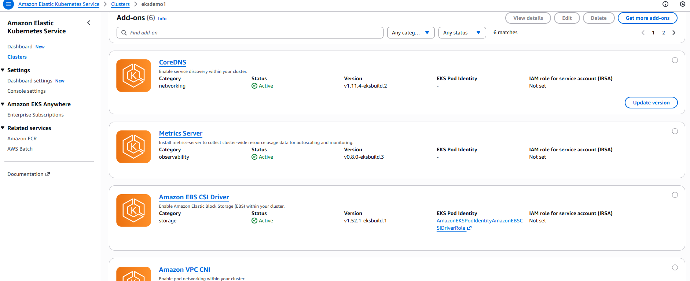
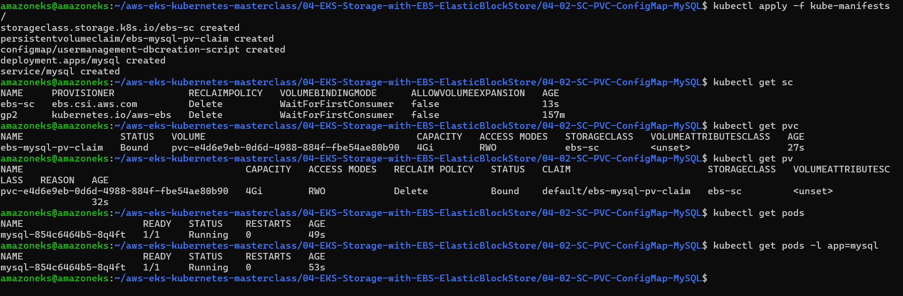
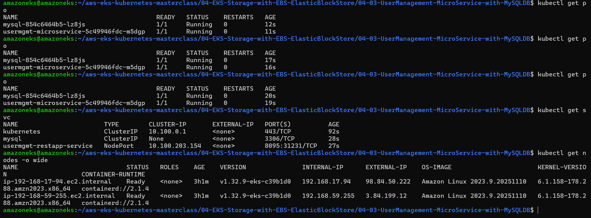

# Amazon EBS CSI Driver

#### Install Amazon EBS CSI Driver

-  on Add-ons → Get more add-ons

- Search for Amazon EBS CSI driver (aws-ebs-csi-driver)

- On the Permissions step, choose Create recommended role

  - Console will create an IAM role with the managed policy: AmazonEBSCSIDriverPolicy, and AmazonEKSClusterPolicy
  - Trust is automatically set to pods.eks.amazonaws.com

  
  
  
  
  


#### EKS Storage - Storage Classes, Persistent Volume Claims  

| **Kubernetes Object**                             | **YAML File Name**                |
| ------------------------------------------------- | --------------------------------- |
| Storage Class                                     | `01-storage-class.yml`            |
| Persistent Volume Claim (PVC)                     | `02-persistent-volume-claim.yml`  |
| ConfigMap                                         | `03-UserManagement-ConfigMap.yml` |
| Deployment (with Env Vars, Volumes, VolumeMounts) | `04-mysql-deployment.yml`         |
| ClusterIP Service                                 | `05-mysql-clusterip-service.yml`  |

- Important Note: ``WaitForFirstConsumer`` mode will delay the volume binding and provisioning of a PersistentVolume until a Pod using the PersistentVolumeClaim is created.

- Create ConfigMap manifest
   -  We are going to create a usermgmt database schema during the mysql pod creation time which we will leverage when we deploy User Management Microservice.
- Create MySQL Deployment manifest
    - Environment Variables
    - Volumes
    - Volume Mounts
- Create MySQL ClusterIP Service manifest
    - At any point of time we are going to have only one mysql pod in this design so ClusterIP: None will use the Pod IP Address instead of creating or allocating a separate IP for MySQL Cluster IP service.


    


-  Connect to MySQL Database


    ```bash
    # Connect to MYSQL Database
    kubectl run -it --rm --image=mysql:5.6 --restart=Never mysql-client -- mysql -h mysql -pdbpassword11

    [or]

    # Use mysql client latest tag
    kubectl run -it --rm --image=mysql:latest --restart=Never mysql-client -- mysql -h mysql -pdbpassword11

    # Verify usermgmt schema got created which we provided in ConfigMap
    mysql> show schemas;

    ```

    
    
    