## EKS-Storage-with-RDS-Database


#### Create RDS Database

- vpc of eks cluster
  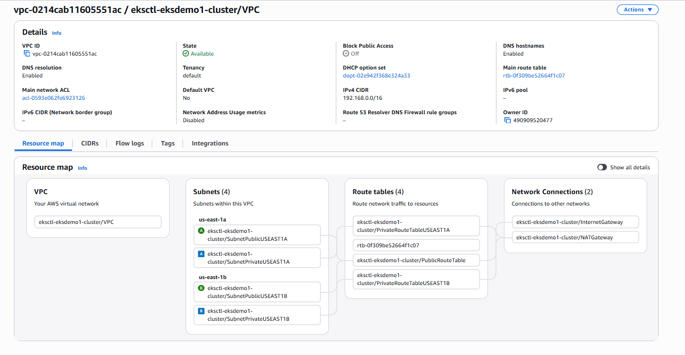

-  Created DB Security Group
   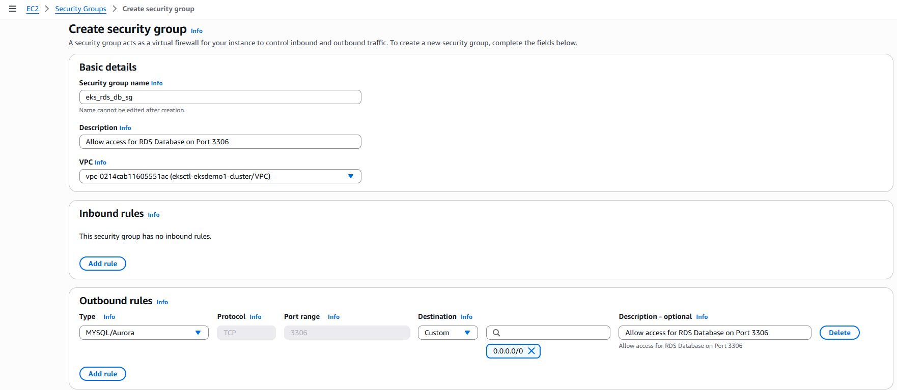

- Created DB Subnet Group in RDS
  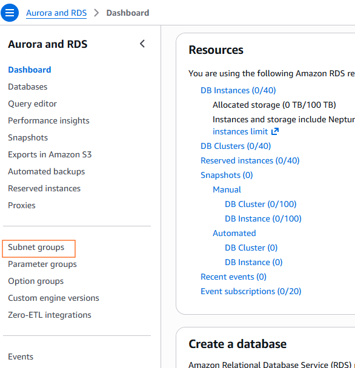
  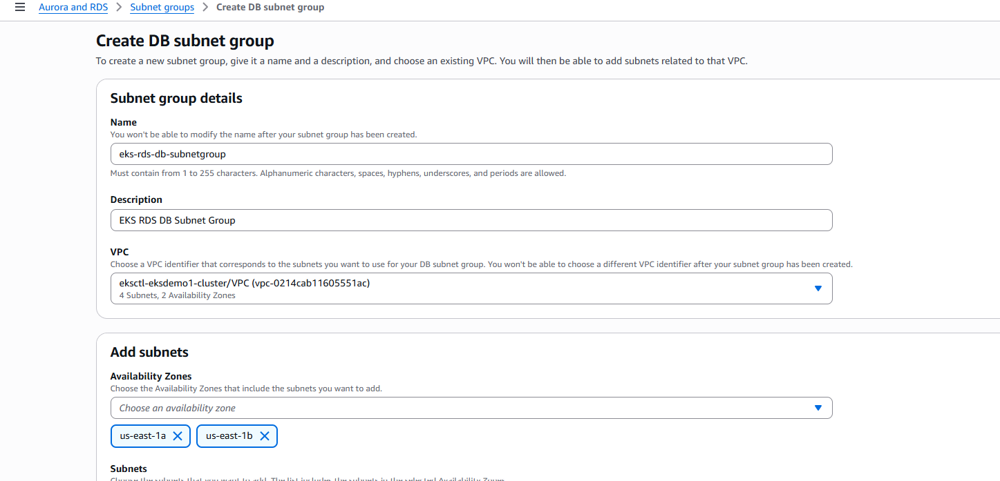

   -  slelect private subnet
      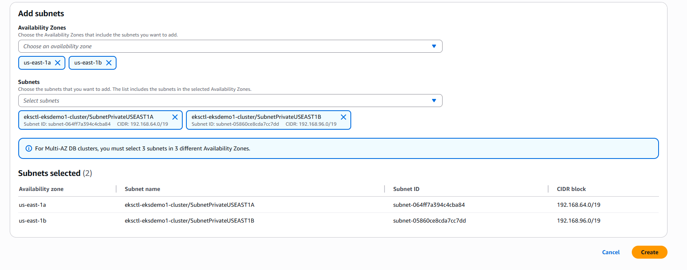 
      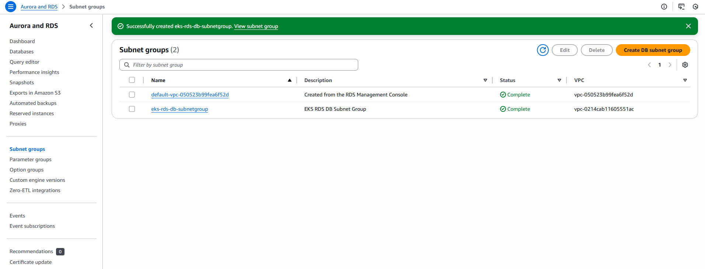   


- Created RDS Database    
  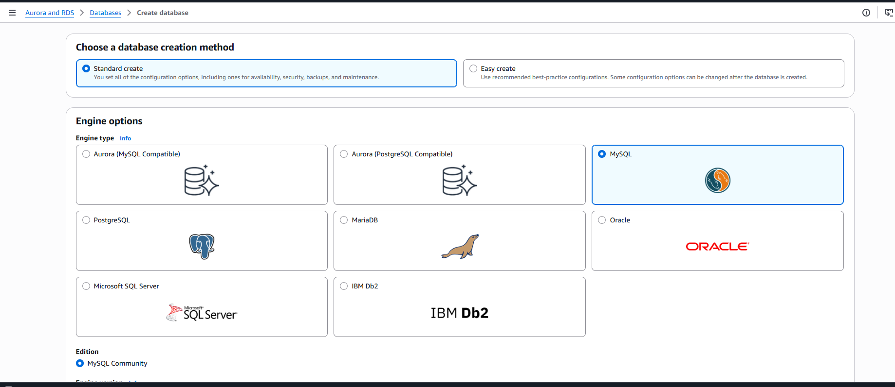
  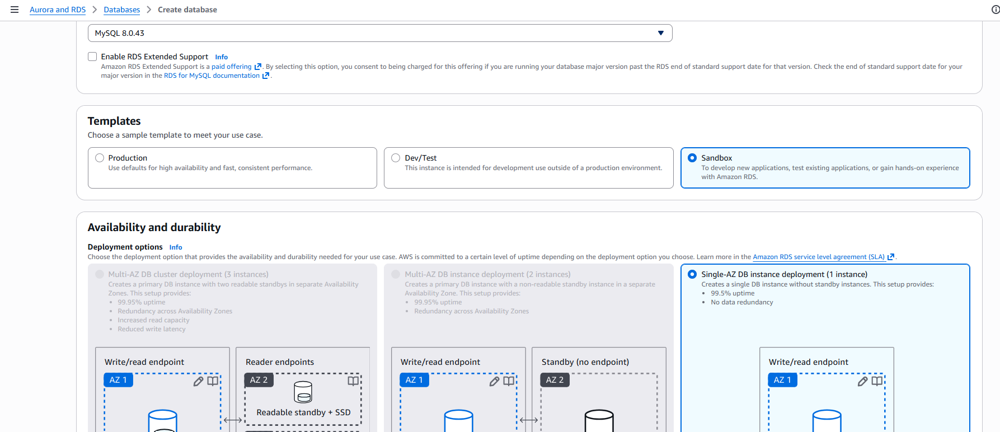
  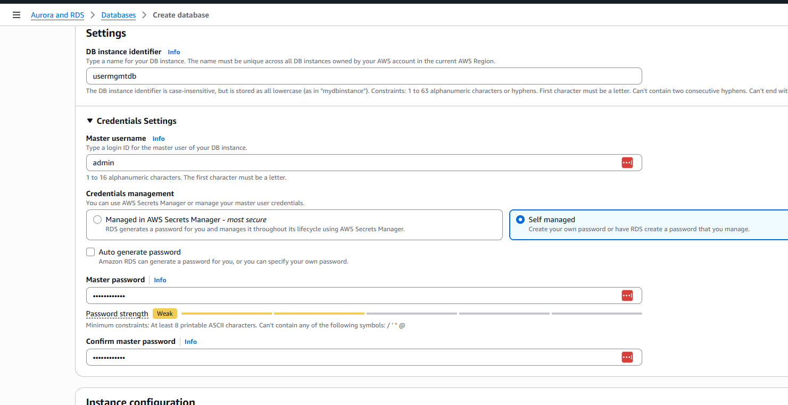
  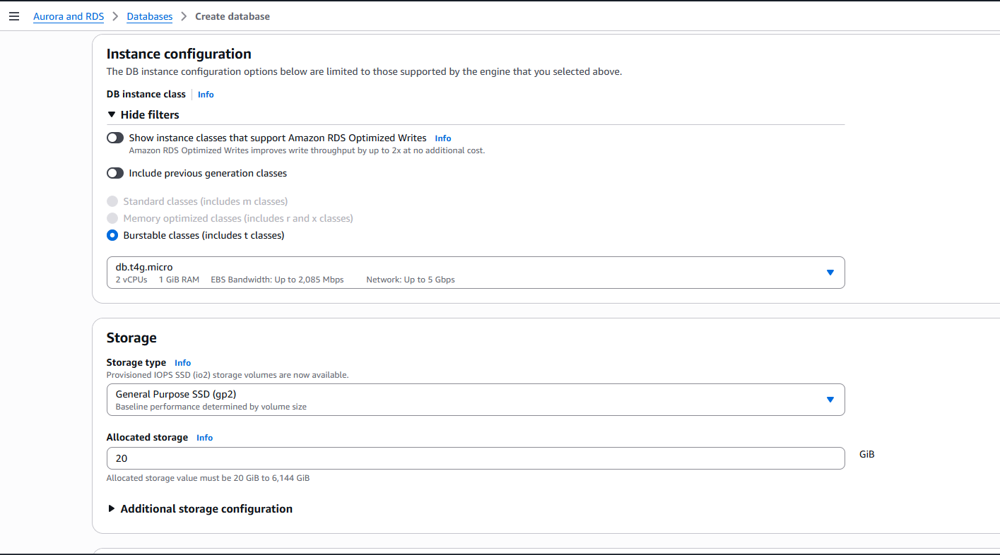
  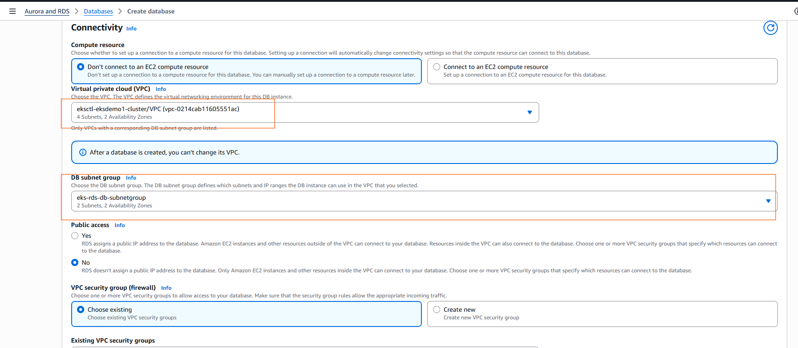
  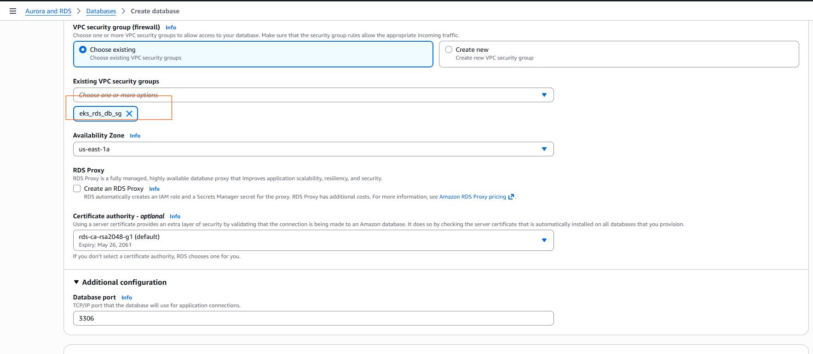
  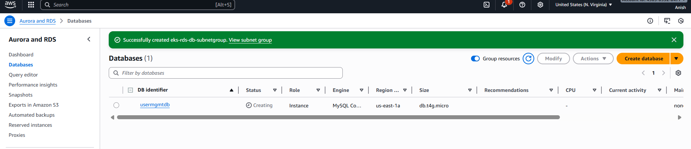

####  Create Kubernetes externalName service Manifest and Deploy

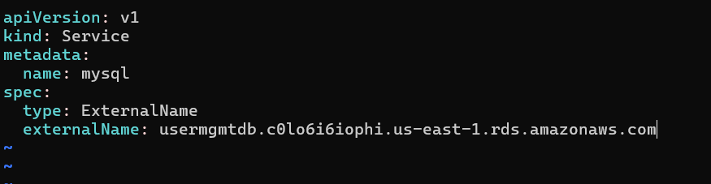
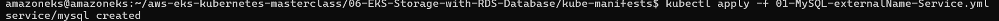

- Connect to RDS Database using kubectl and create usermgmt schema/db
```bash
kubectl run -it --rm --image=mysql:latest --restart=Never mysql-client -- mysql -h usermgmtdb.c0lo6i6iophi.us-east-1.rds.amazonaws.com -u admin -pdbpassword11

mysql> show schemas;
mysql> create database usermgmt;
mysql> show schemas;
mysql> exit

```

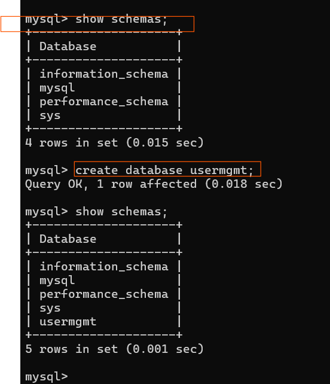


- Deploy with web app


