# Deployed Web Application on Amazon EKS Fargate with Public Access via ALB Ingress

#### Create EKS Fargate Cluster (us-west-2)
```bash
eksctl create cluster \
  --name fargate-demo \
  --region us-west-2 \
  --fargate
```
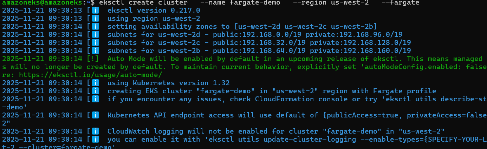
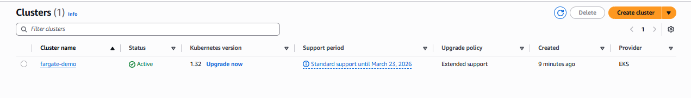

#### Create Namespace
```bash
kubectl create namespace demo
```


#### Create Fargate Profile
```bash
eksctl create fargateprofile \
  --cluster fargate-demo \
  --name fp-default \
  --namespace demo
```
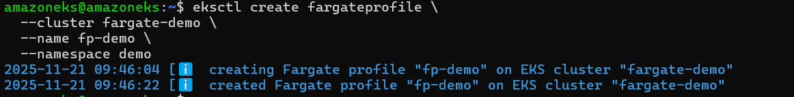
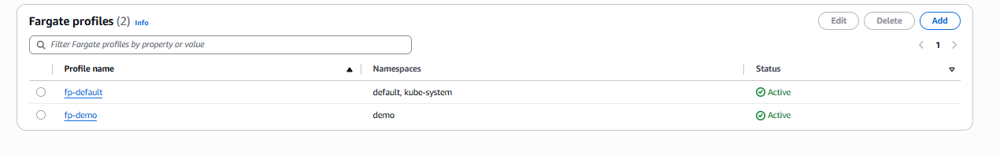

#### Create Deployment YAML 
```bash

deploy-app.yaml
apiVersion: apps/v1
kind: Deployment
metadata:
  name: demo-app
  namespace: demo
spec:
  replicas: 1
  selector:
    matchLabels:
      app: demo-app
  template:
    metadata:
      labels:
        app: demo-app
    spec:
      containers:
        - name: demo-app
          image: 075285241029.dkr.ecr.us-west-2.amazonaws.com/demo-app:latest
          ports:
            - containerPort: 80
```

- Apply:
```bash
kubectl apply -f deploy-app.yaml
```
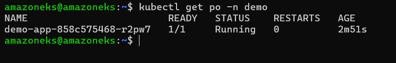

- Create Service YAML (ClusterIP)
```bash
service.yaml
apiVersion: v1
kind: Service
metadata:
  name: demo-service
  namespace: demo
spec:
  type: ClusterIP
  selector:
    app: demo-app
  ports:
    - port: 80
      targetPort: 80
```

- Apply:
```bash
kubectl apply -f service.yaml
```


#### Install AWS ALB Ingress Controller
```bash
 #Required for Internet access

eksctl utils associate-iam-oidc-provider --cluster fargate-demo --approve
```

#### Install IAM Policy:

```bash
curl -o alb-iam-policy.json https://raw.githubusercontent.com/kubernetes-sigs/aws-load-balancer-controller/main/docs/install/iam_policy.json
```
#### Create the IAM policy
```bash
  aws iam create-policy \
  --policy-name AWSLoadBalancerControllerIAMPolicy \
  --policy-document file://alb-iam-policy.json

# arn = arn:aws:iam::075285241029:policy/AWSLoadBalancerControllerIAMPolicy
```


#### Create IAM Role and service account :
```bash
eksctl create iamserviceaccount \
  --cluster fargate-demo \
  --namespace kube-system \
  --name aws-load-balancer-controller \
  --attach-policy-arn arn:aws:iam::075285241029:policy/AWSLoadBalancerControllerIAMPolicy \
  --approve \
  --override-existing-serviceaccounts

```
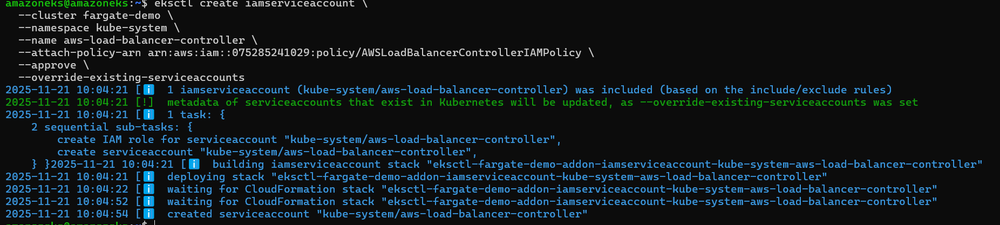
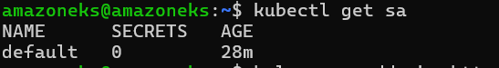
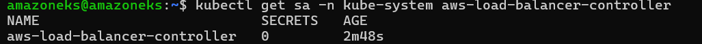
#### Install ALB Controller:
```bash
helm repo add eks https://aws.github.io/eks-charts
helm install aws-load-balancer-controller eks/aws-load-balancer-controller \
  -n kube-system \
  --set clusterName=fargate-demo \
  --set serviceAccount.create=false \
  --set serviceAccount.name=aws-load-balancer-controller
```
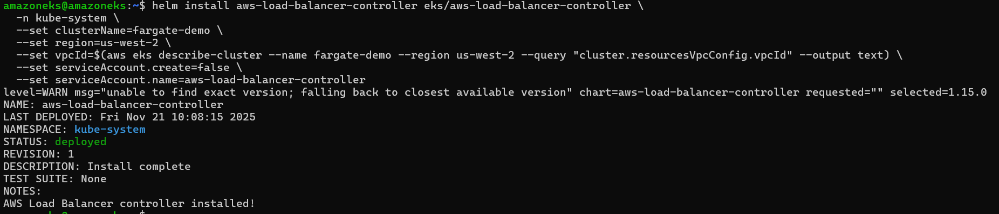
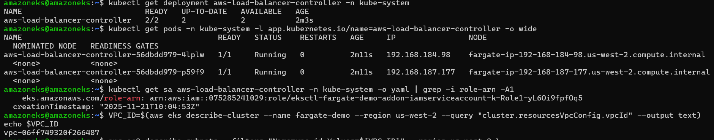
#### Create Ingress (ALB)
```bash
apiVersion: networking.k8s.io/v1
kind: Ingress
metadata:
  name: demo-ingress
  namespace: demo
  annotations:
    alb.ingress.kubernetes.io/scheme: internet-facing
    alb.ingress.kubernetes.io/target-type: ip
spec:
  ingressClassName: alb
  rules:
    - http:
        paths:
          - path: /
            pathType: Prefix
            backend:
              service:
                name: demo-service
                port:
                  number: 80
```
- Apply:
```bash
kubectl apply -f ingress.yaml
```
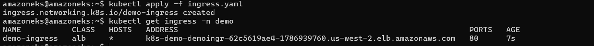
#### Get ALB URL
```bash
kubectl get ingress -n demo
```
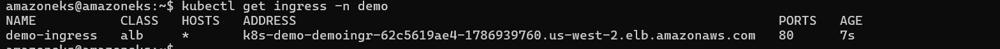

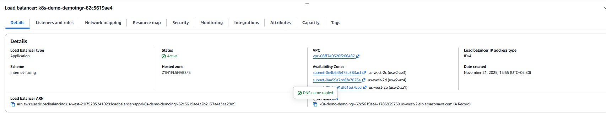
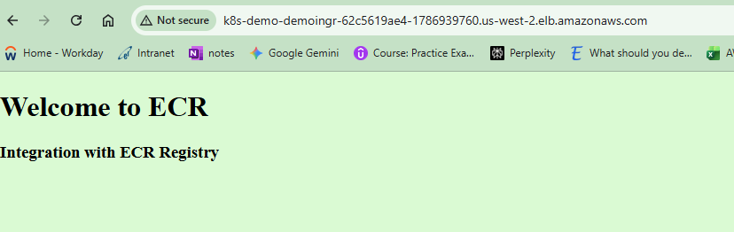

