# AWS - Classic Load Balancer 
## Create EKS Node Group in Private Subnets

- We are going to create a node group in VPC Private Subnets
- We are going to deploy workloads on the private node group wherein workloads will be running private subnets and load balancer gets created in public subnet and accessible via internet.


-  Creates EKS Cluster using eksctl

```bash
# Create Cluster
eksctl create cluster --name=eksdemo1 \
                      --region=us-east-1 \
                      --zones=us-east-1a,us-east-1b \
                      --without-nodegroup 

# Get List of clusters
eksctl get cluster                  

```
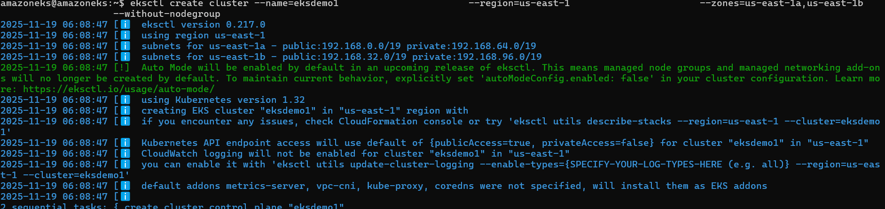
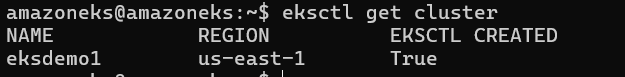

- Created & Associate IAM OIDC Provider for our EKS Cluster
   - To enable and use AWS IAM roles for Kubernetes service accounts on our EKS cluster, we must create & associate OIDC identity provider.


 ```bash
  eksctl utils associate-iam-oidc-provider \
    --region us-east-1 \
    --cluster eksdemo1 \
    --approve

 ```  
 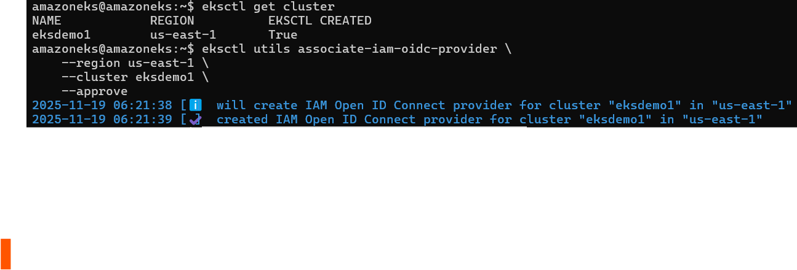


- Created EKS Node Group in Private Subnets
   - Key option for the command is ``--node-private-networking``

 ```bash
eksctl create nodegroup --cluster=eksdemo1 \
                        --region=us-east-1 \
                        --name=eksdemo1-ng-private1 \
                        --node-type=t3.medium \
                        --nodes-min=2 \
                        --nodes-max=4 \
                        --node-volume-size=20 \
                        --ssh-access \
                        --ssh-public-key=kube-demo \
                        --managed \
                        --asg-access \
                        --external-dns-access \
                        --full-ecr-access \
                        --appmesh-access \
                        --alb-ingress-access \
                        --node-private-networking                      
 ```  


- External IP Address should be none if our Worker Nodes created in Private Subnets
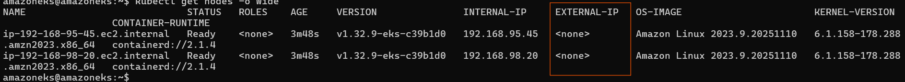


- Installed  EKS Pod Identity Agent to use EKS Pod Identity to grant AWS IAM permissions to pods through Kubernetes service accounts.


## Created RDS Database
#### Create DB Security Group

- Create security group to allow access for RDS Database on port 3306
- Security group name: eks_rds_db_sg
- Description: Allow access for RDS Database on Port 3306
- VPC: eksctl-eksdemo1-cluster/VPC
- Inbound Rules
    - Type: MySQL/Aurora
    - Protocol: TPC
    - Port: 3306
    - Source: Anywhere (0.0.0.0/0)
    - Description: Allow access for RDS Database on Port 3306
- Outbound Rules
  - Leave to defaults
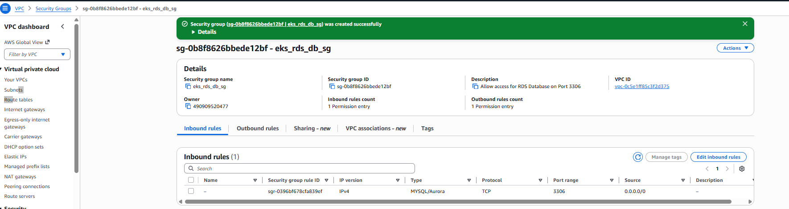

#### Create DB Subnet Group in RDS

- Go to RDS -> Subnet Groups
- Click on Create DB Subnet Group
    - Name: eks-rds-db-subnetgroup
    - Description: EKS RDS DB Subnet Group
    - VPC: eksctl-eksdemo1-cluster/VPC 
    - Availability Zones: us-east-1a, us-east-1b
    - Subnets: 2 subnets in 2 AZs --> private subnet
     - Click on Create
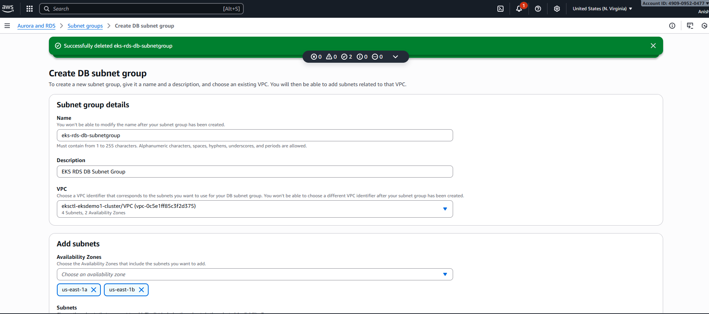
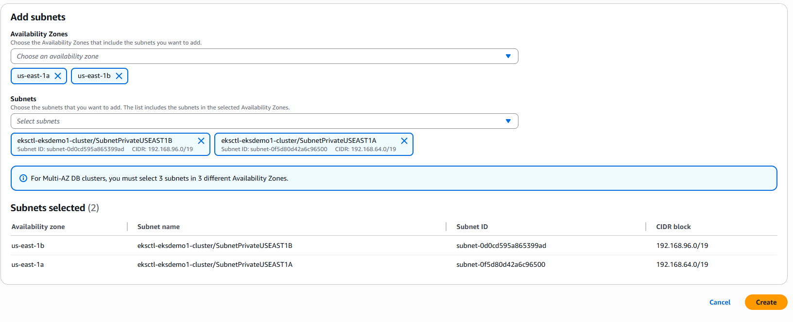
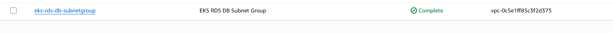

#### Create RDS Database

- Go to Services -> RDS
- Click on Create Database
    - Choose a Database Creation Method: Standard Create
    - Engine Options: MySQL
    - Edition: MySQL Community
    - Version: 5.7.22 (default populated)
    - Template Size: Free Tier
    - DB instance identifier: usermgmtdb
    - Master Username: dbadmin
    - Master Password: 
    - Confirm Password: 
    - DB Instance Size: leave to defaults
    - Storage: leave to defaults
    - Connectivity
        - VPC: eksctl-eksdemo1-cluster/VPC
        - Additional Connectivity Configuration
            - Subnet Group: eks-rds-db-subnetgroup
            - Publicyly accessible: YES (for our learning and troubleshooting - if required)
        - VPC Security Group: Create New
            - Name: eks-rds-db-securitygroup
         - Availability Zone: No Preference
        - Database Port: 3306
  - Rest all leave to defaults
- Click on Create Database

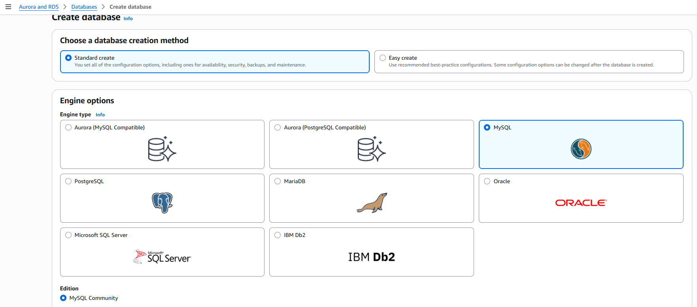

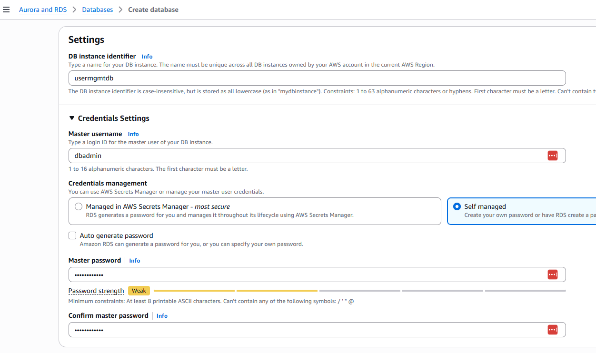
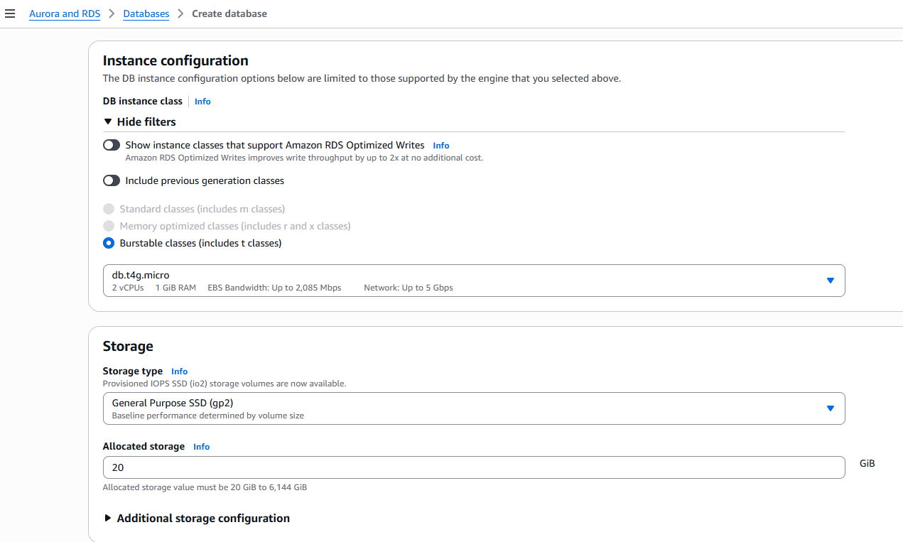
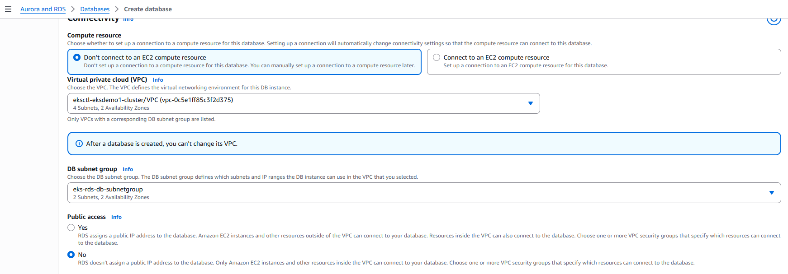
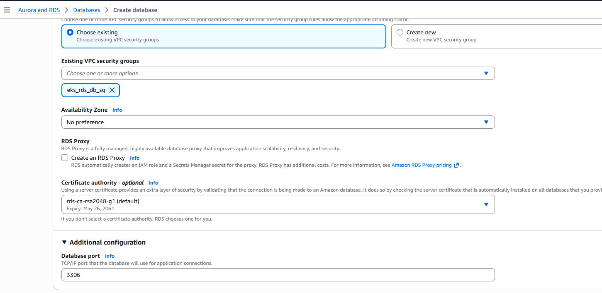


- Created Kubernetes externalName service Manifest and Deploy
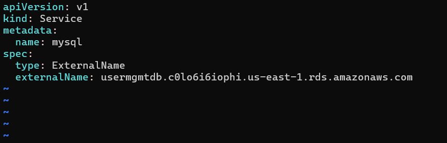

    ```bash
    kubectl apply -f kube-manifests/01-MySQL-externalName-Service.yml

    ```
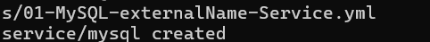

- Connect to RDS Database using kubectl and create usermgmt schema/db

```bash
kubectl run -it --rm --image=mysql:latest --restart=Never mysql-client -- mysql -h usermgmtdb.c0lo6i6iophi.us-east-1.rds.amazonaws.com -u dbadmin -#passws

mysql> show schemas;
mysql> create database usermgmt;
mysql> show schemas;
mysql> exit

```

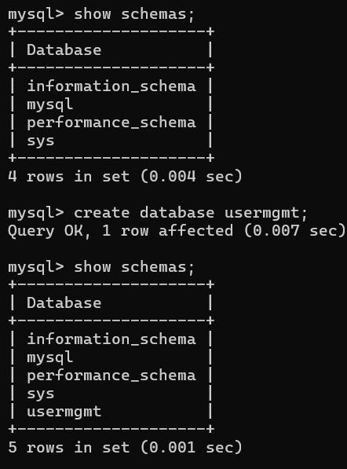


#### created AWS Classic Load Balancer Kubernetes Manifest & Deploy with web app

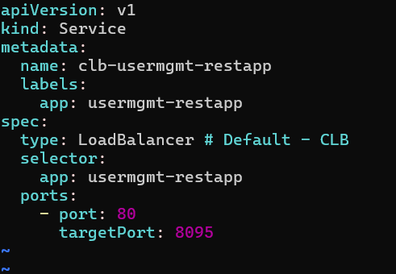
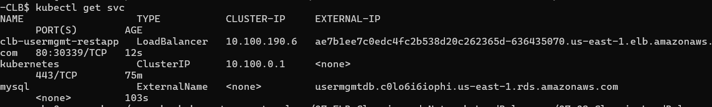

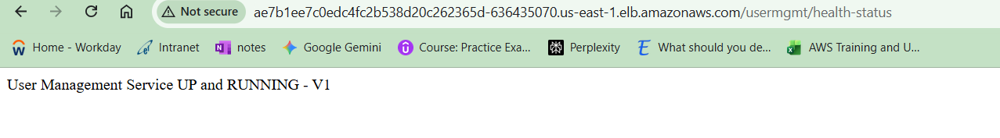


