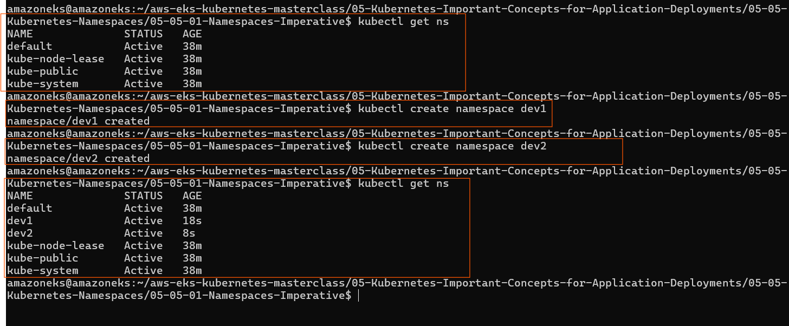
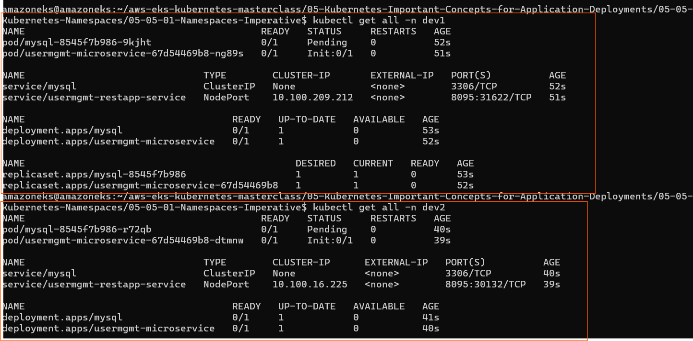
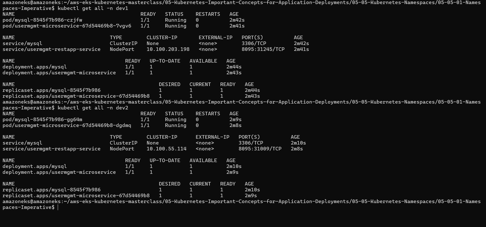

## Deploy web app using kubernetes-secrets,init containeres, liveness probes , requrst-limits and name spcae


##### kubernetes-secrets

- created kubernetes-secrets
```bash
apiVersion: v1
kind: Secret
metadata:
  name: mysql-db-password
type: Opaque
data: 
  db-password:

```

- and declrd in db deployment

```bash
spec: 
      containers:
        - name: mysql
          image: mysql:5.6
          env:
            - name: MYSQL_ROOT_PASSWORD
              valueFrom:
                secretKeyRef:
                  name: mysql-db-password
                  key: db-password 
```


- define init cintainers

```bash
spec:
  replicas: 1
  selector:
    matchLabels:
      app: usermgmt-restapp
  template:  
    metadata:
      labels: 
        app: usermgmt-restapp
    spec:
      initContainers:
        - name: init-db
          image: busybox:1.31
          command: ['sh', '-c', 'echo -e "Checking for the availability of MySQL Server deployment"; while ! nc -z mysql 3306; do sleep 1; printf "-"; done; echo -e "  >> MySQL DB Server has started";']
          # check  the availability of MySQL Server after that below conatiner start     
      containers:
        - name: usermgmt-restapp
          image: stacksimplify/kube-usermanagement-microservice:1.0.0
          ports: 
            - containerPort: 8095


```

- define probes
```bash
    apiVersion: apps/v1
kind: Deployment 
metadata:
  name: usermgmt-microservice
  labels:
    app: usermgmt-restapp
spec:
  replicas: 1
  selector:
    matchLabels:
      app: usermgmt-restapp
  template:  
    metadata:
      labels: 
        app: usermgmt-restapp
    spec:
      initContainers:
        - name: init-db
          image: busybox:1.31
          command: ['sh', '-c', 'echo -e "Checking for the availability of MySQL Server deployment"; while ! nc -z mysql 3306; do sleep 1; printf "-"; done; echo -e "  >> MySQL DB Server has started";']      
      containers:
        - name: usermgmt-restapp
          image: stacksimplify/kube-usermanagement-microservice:1.0.0
          ports: 
            - containerPort: 8095           
          env:
            - name: DB_HOSTNAME
              value: "mysql"            
            - name: DB_PORT
              value: "3306"            
            - name: DB_NAME
              value: "usermgmt"            
            - name: DB_USERNAME
              value: "root"            
            - name: DB_PASSWORD
              valueFrom:
                secretKeyRef:
                  name: mysql-db-password # secret name
                  key: db-password      # secrets key name      
          livenessProbe: # check pod helth for every 10 second if find unhealthy then restart the pod
            exec:
              command: 
                - /bin/sh
                - -c 
                - nc -z localhost 8095
            initialDelaySeconds: 60
            periodSeconds: 10
          readinessProbe: # ready to serve traffice 
            httpGet:
              path: /usermgmt/health-status
              port: 8095
            initialDelaySeconds: 60
            periodSeconds: 10   


```


- Created  Namespace

```bash
  # List Namespaces
kubectl get ns 

# Craete Namespace
kubectl create namespace <namespace-name>
kubectl create namespace dev1
kubectl create namespace dev2

# List Namespaces
kubectl get ns 

```




- Deploy All k8s Objects
```bash
# Deploy All k8s Objects
kubectl apply -f kube-manifests/ -n dev1
kubectl apply -f kube-manifests/ -n dev2

# List all objects from dev1 & dev2 Namespaces
kubectl get all -n dev1
kubectl get all -n dev2

```
- ``PVC is a namespace specific resource``
- ``PV and SC are generic``


- so  i have tryed multiple time to deploy but every time postgress sql pod going in peding state
- as i have debugged and finded the volume mount is not happing in postgress 
- as per finding ``root cause - Amazon EKS Pod Identity Agent not enable in cluster that reasion pod doesnot have permission to access the EBS but alredy enable  Amazon EBS CSI Driver is not working without Amazon EBS CSI Driver``



- after enabling ``Amazon EKS Pod Identity Agent`` working as expected



