# Created EKS Cluster 


#### Created EKS Cluster using eksctl
```bash
# Create Cluster
eksctl create cluster --name=eksdemo1 \
                      --region=us-east-1 \
                      --zones=us-east-1a,us-east-1b \
                      --without-nodegroup 

# Get List of clusters
eksctl get cluster                  

```
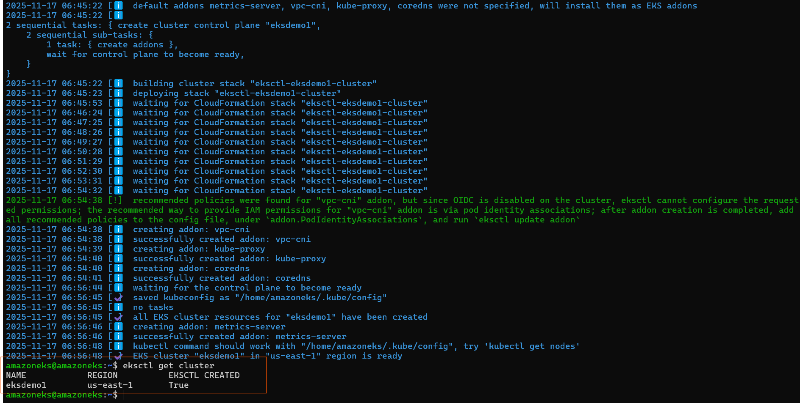

#### Creates & Associate IAM OIDC Provider for our EKS Cluster
  - To enable and use AWS IAM roles for Kubernetes service accounts on our EKS cluster, we must create & associate OIDC identity provider.
- To do so using eksctl we can use the below command

- An ``OIDC provider`` is a service that verifies the identity of users or applications using tokens.
It allows you to securely authenticate without passwords — using tokens and claims.
- ``OIDC provider`` = A trusted system that verifies identity using tokens, so AWS knows which pod/user is trying to access resources.
    ```bash
    # Template
    eksctl utils associate-iam-oidc-provider \
        --region region-code \
        --cluster <cluter-name> \
        --approve

    # Replace with region & cluster name
    eksctl utils associate-iam-oidc-provider \
        --region us-east-1 \
        --cluster eksdemo1 \
        --approve

    ```

    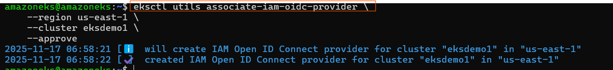
####  Creates EC2 Keypair   
- Create a new EC2 Keypair with name as kube-demo
- This keypair we will use it when creating the EKS NodeGroup.
- This will help us to login to the EKS Worker Nodes using Terminal.


####  Create Node Group with additional Add-Ons in Public Subnets

 
- These add-ons will create the respective IAM policies for us automatically within our Node Group role.
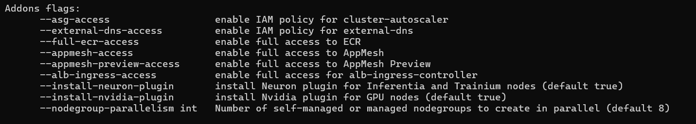
```bash
# Create Public Node Group   
eksctl create nodegroup --cluster=eksdemo1 \
                       --region=us-east-1 \
                       --name=eksdemo1-ng-public1 \
                       --node-type=t3.medium \
                       --nodes=2 \
                       --nodes-min=2 \
                       --nodes-max=4 \
                       --node-volume-size=20 \
                       --ssh-access \
                       --ssh-public-key=kube-demo \
                       --managed \
                       --asg-access \
                       --external-dns-access \
                       --full-ecr-access \
                       --appmesh-access \
                       --alb-ingress-access 

```


#### Verify Cluster & Nodes
- Verify the node group subnet to ensure it created in public subnets
    - Go to Services -> EKS -> eksdemo -> eksdemo1-ng1-public
    - Click on Associated subnet in Details tab
    - Click on Route Table Tab.
    - We should see that internet route via Internet Gateway (0.0.0.0/0 -> igw-xxxxxxxx)
    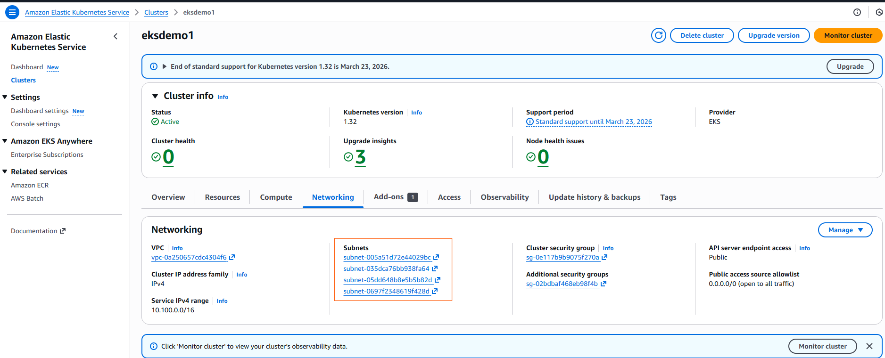
    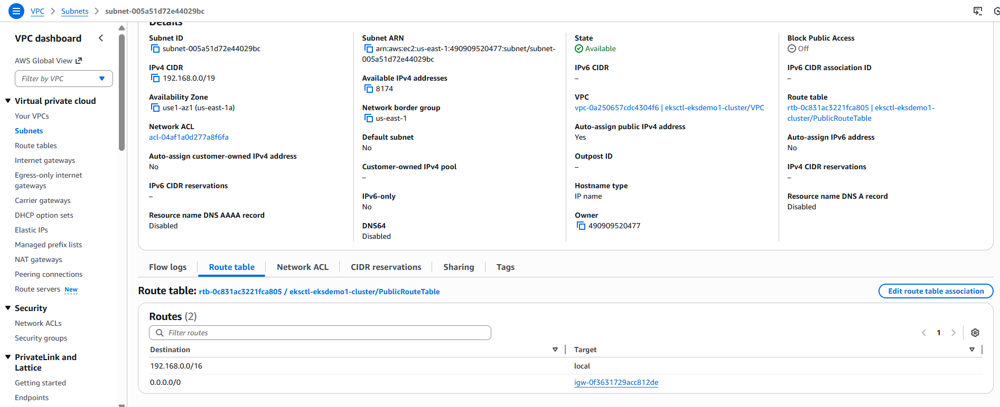

#### Verify Cluster, NodeGroup in EKS Management Console
- Go to Services -> Elastic Kubernetes Service -> eksdemo1
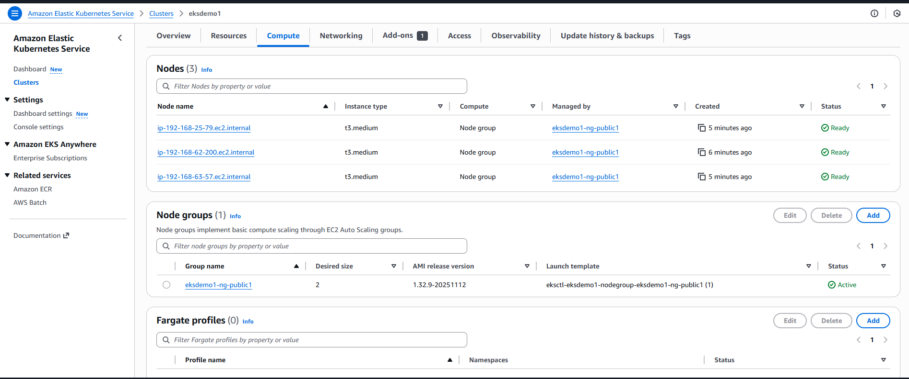
``` bash
 # List EKS clusters
eksctl get cluster

# List NodeGroups in a cluster
eksctl get nodegroup --cluster=<clusterName>

# List Nodes in current kubernetes cluster
kubectl get nodes -o wide

# Our kubectl context should be automatically changed to new cluster
kubectl config view --minify
```


- Verify Worker Node IAM Role and list of Policies
    - Go to Services -> EC2 -> Worker Nodes
    - Click on IAM Role associated to EC2 Worker Nodes
- Verify Security Group Associated to Worker Nodes
   - - Go to Services -> EC2 -> Worker Nodes
    - Click on Security Group associated to EC2 Instance which contains ``remote`` in the name.
- Verify CloudFormation Stacks
   - Verify Control Plane Stack & Events
    - Verify NodeGroup Stack & Events


# Amazon EKS Pod Identity Agent

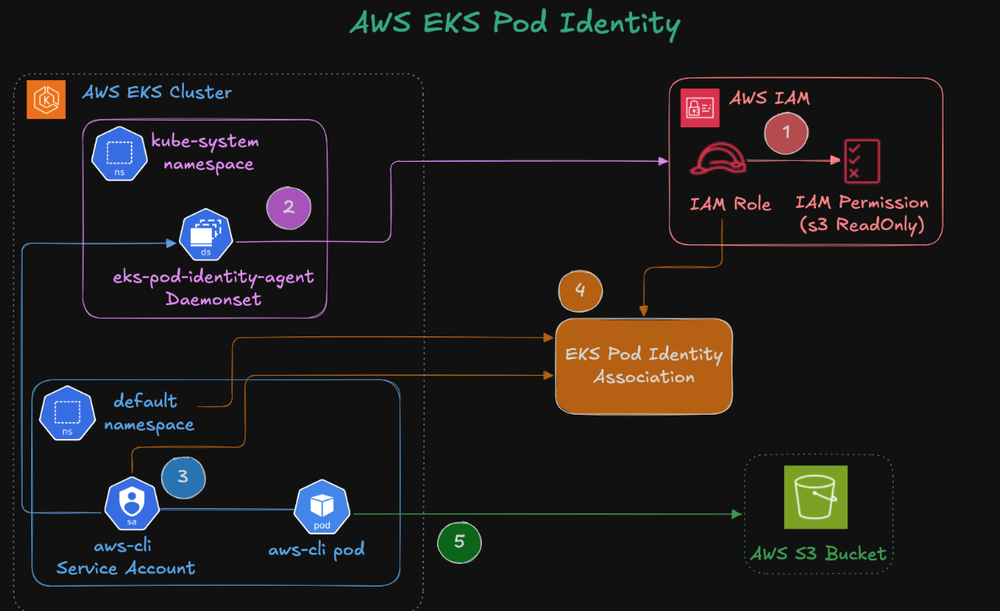


#### Install EKS Pod Identity Agent

- Open EKS Console → Clusters → select your cluster (eksdemo1)
- Go to Add-ons → Get more add-ons
-Search for EKS Pod Identity Agent
- Click Next → Create
- This installs a DaemonSet (eks-pod-identity-agent) that enables Pod Identity associations.
    ```bash
    # List k8s PIA Resources
    kubectl get daemonset -n kube-system

    # List k8s Pods
    kubectl get pods -n kube-system
    ```

  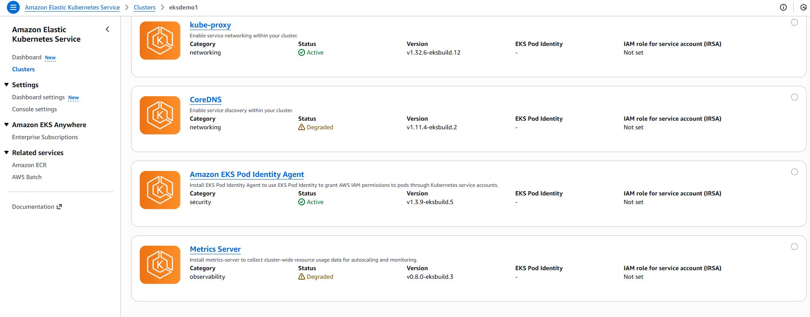
  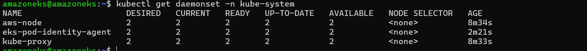


#### Deploy AWS CLI Pod (without Pod Identity Association)

- Created Service Account

    ```bash
    apiVersion: v1
    kind: ServiceAccount
    metadata:
    name: aws-cli-sa
    namespace: default
    ```

- Created a simple Kubernetes Pod with AWS CLI image:    
    ```bash
    apiVersion: v1
    kind: Pod
    metadata:
    name: aws-cli
    namespace: default
    spec:
    serviceAccountName: aws-cli-sa
    containers:
    - name: aws-cli
        image: amazon/aws-cli
        command: ["sleep", "infinity"]


    ```

-  Deploy CLI Pod
    ```bash
    kubectl apply -f 
    kubectl get pods

    ```
    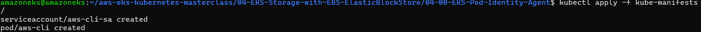
    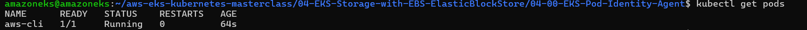

- Exec into the pod and try to list S3 buckets:

    ```bash
    kubectl exec -it aws-cli -- aws s3 ls
    ```
    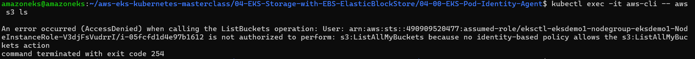

#### Create IAM Role for Pod Identity    
- Go to IAM Console → Roles → Create Role
- Select Trusted entity type → Custom trust policy
- Attach AmazonS3ReadOnlyAccess policy
- Created role → ``EKS-PodIdentity-S3-ReadOnly-Role-101``
  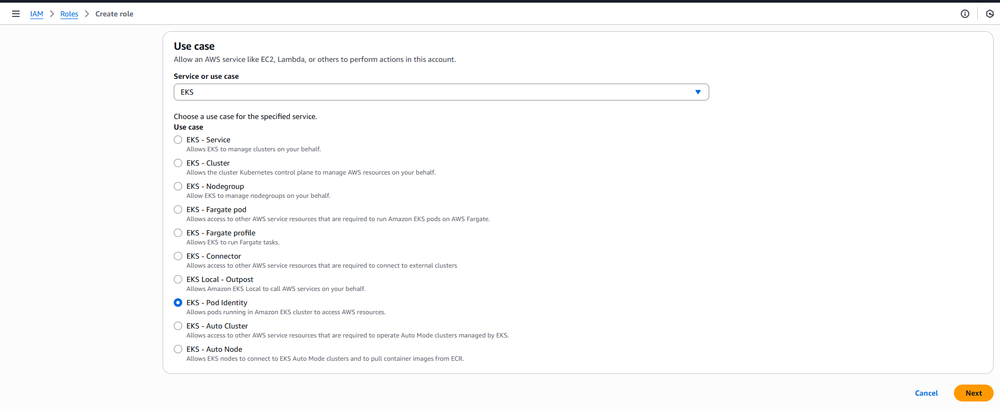
  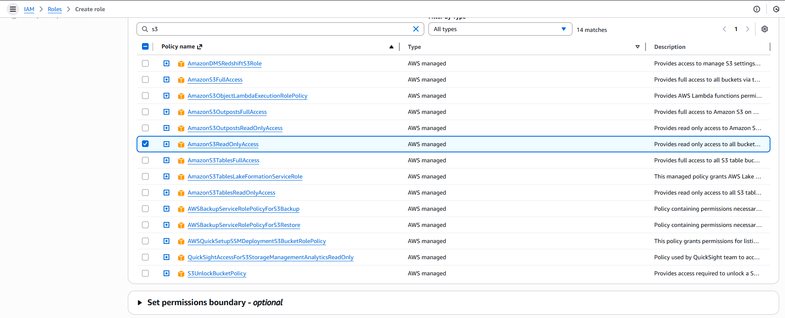


#### Create Pod Identity Association

- Go to EKS Console → Cluster → Access → Pod Identity Associations
- Create new association:

    - Namespace: default
    - Service Account: aws-cli-sa
    - IAM Role: EKS-PodIdentity-S3-ReadOnly-Role-101
    Click on create

    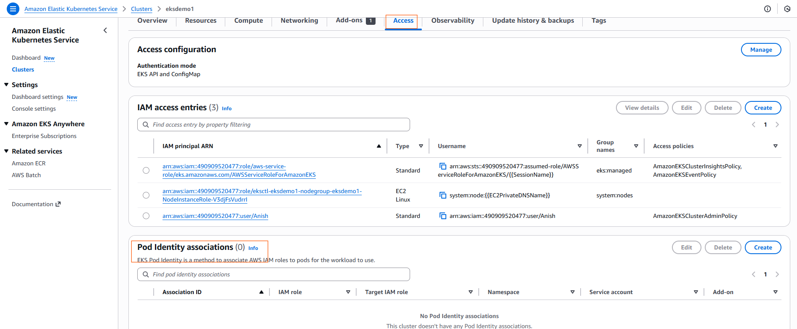
    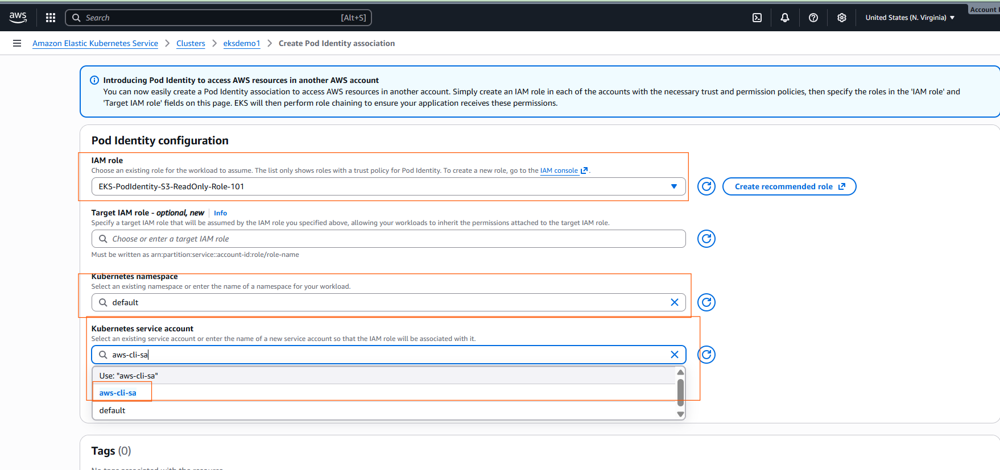
    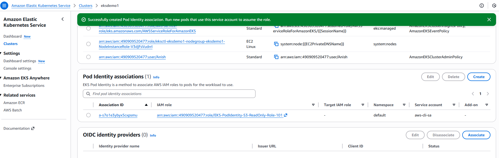

#### Test Again    

- Restart Pod
    ```bash
    # Delete Pod
    kubectl delete pod aws-cli -n default

    # Create Pod
    kubectl apply -f kube-manifests/02_k8s_aws_cli_pod.yaml

    # List Pods
    kubectl get pods

    ```

    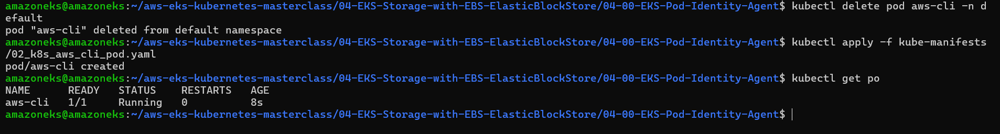
- Exec into the Pod:
    ```bash
    kubectl exec -it aws-cli -- aws s3 ls
    ```
    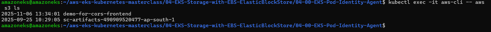


