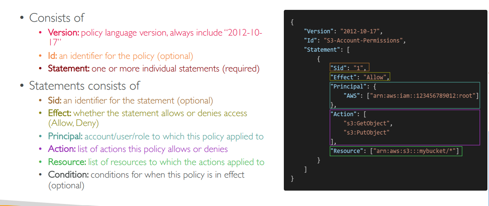
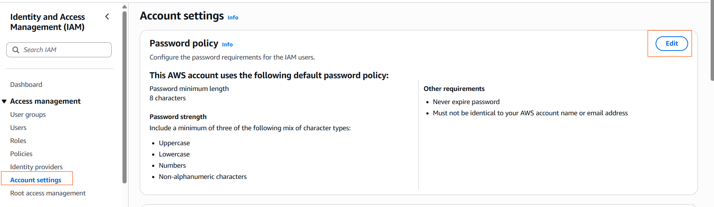
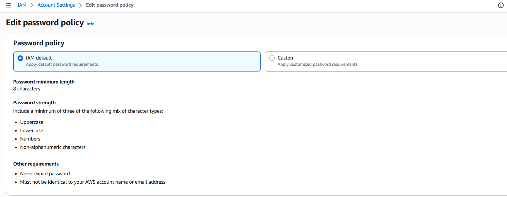
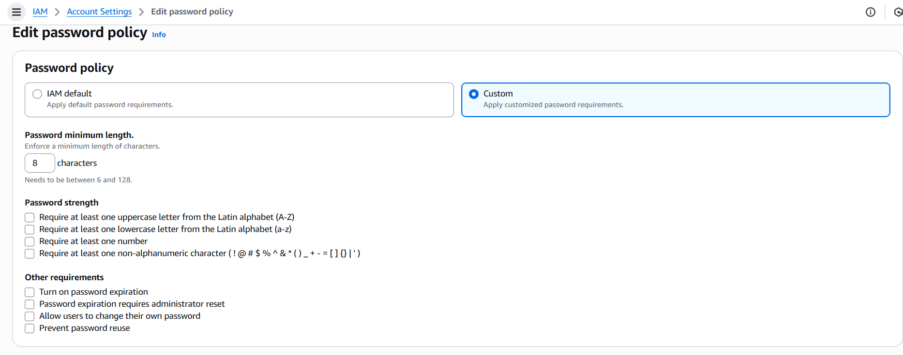
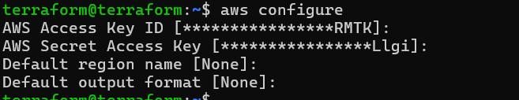
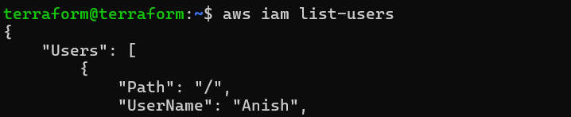
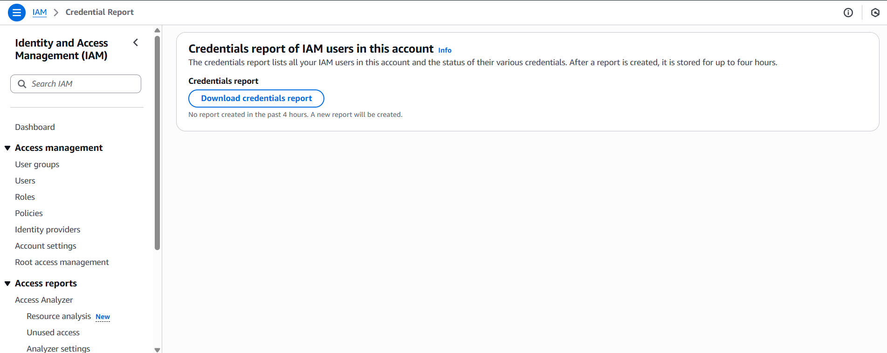
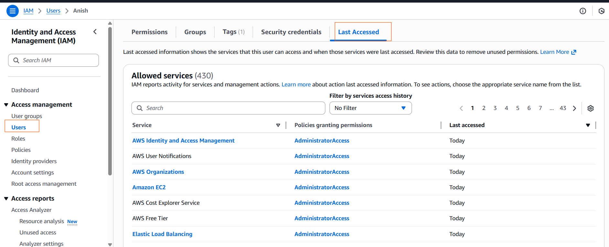

# AWS Identity and Access Management (AWS IAM)

#### IAM: Users & Groups
- IAM = Identity and Access Management, Global service
- Root account created by default, shouldn’t be used or shared
- Users are people within your organization, and can be grouped
- Groups only contain users, not other groups
- Users don’t have to belong to a group, and user can belong to multiple 

#### IAM: Permissions
- Users or Groups can be assigned JSON documents called policies
- These policies define the
permissions of the users
- A policy is a set of rules  that define what actions are allowed or denied on AWS resources.

- create user and group using terraform
  

#### IAM Policies Structure

#### IAM – Password Policy
- Strong passwords = higher security for your account
- In AWS, you can setup a password policy:
    - Set a minimum password length
    - Require specific character types:
        - including uppercase letters
        - lowercase letters
        - numbers
        - non-alphanumeric characters
  - Allow all IAM users to change their own passwords
  - Require users to change their password after some time (password expiration)
   - Prevent password re-use

     
     
    

#### Multi Factor Authentication - MFA
- Users have access to your account and can possibly change
configurations or delete resources in your AWS account
- You want to protect your Root Accounts and IAM users
- MFA = password you know + security device you own

#### AWS CLI
- A tool that enables you to interact with AWS services using commands in your command-line shell
- Direct access to the public APIs of AWS services
- You can develop scripts to manage your resources
- It’s open-source https://github.com/aws/aws-cli
- Alternative to using AWS Management Console

  
  

#### IAM Roles for Services

- some AWS service will need to perform actions on your behalf
- To do so, we will assign permissions to AWS services
with IAM Roles
- Common roles:
     - EC2 Instance Roles 
     - Lambda Function Roles 
     - Roles for CloudFormation 

####  IAM Security Tools
- IAM Credentials Report (account-level)
  - a report that lists all your account's users and the status of their various credentials
  

- IAM Access Advisor (user-level)
  - Access advisor shows the service permissions granted to a user and when those services were last accessed.
  - You can use this information to revise your policies  

     

    