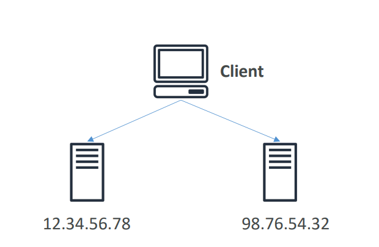
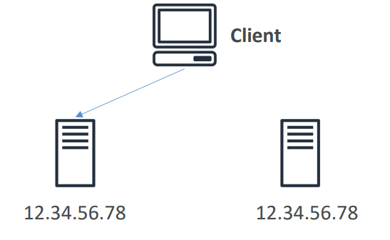

### CloudFront

- CloudFront = A global content distribution system that delivers your website or app’s content from the nearest AWS location to your users, reducing latency and improving performance.
- Content Delivery Network (CDN)
- Improves read performance, 
content is cached at the edge
- Improves users experience
- Hundreds of Points of Presence 
globally (edge locations, caches)
- DDoS protection (because 
worldwide), integration with Shield, 
AWS Web Application Firewall

    

#### CloudFront Geo Restriction

- You can restrict who can access your distribution
    - Allowlist: Allow your users to access your content only if they're in one of the 
    countries on a list of approved countries.
    - Blocklist: Prevent your users from accessing your content if they're in one of the 
    countries on a list of banned countries.

### AWS Global Accelerator 

- AWS Global Accelerator directs user traffic to the nearest and healthiest application endpoint using the AWS global network, providing low latency, automatic failover, and high availability.

- How It Works

    - When you create a Global Accelerator, AWS gives you two static anycast IP addresses.

    - You associate these IPs with one or more endpoints (like ALB, NLB, EC2, or EIP) in different AWS Regions.

    - When users connect, their requests go to the nearest AWS edge location.

    - From there, AWS routes traffic over its high-performance global backbone network to your application endpoint — bypassing slow public internet routes.

- Unicast IP: one server holds one IP 
address
  
- Anycast IP: all servers hold the same 
IP address and the client is routed to 
the nearest one    
   

   