## EBS Volume

- An EBS (Elastic Block Store) Volume is a network drive you can attach
to your instances while they run
- It allows your instances to persist data, even after their termination
- They can only be mounted to one instance at a time (at the CCP
level)
- They are bound to a specific availability zone
- Analogy: Think of them as a “network USB stick”

***
- It’s a network drive (i.e. not a physical drive)
    - It uses the network to communicate the instance, which means there might be a bit of
latency
  - It can be detached from an EC2 instance and attached to another one quickly
- It’s locked to an Availability Zone (AZ)
   - An EBS Volume in us-east-1a cannot be attached to us-east-1b
   - To move a volume across, you first need to snapshot it
- Have a provisioned capacity (size in GBs, and IOPS) 
    - You get billed for all the provisioned capacity
    - You can increase the capacity of the drive over time

### EBS – Delete on Termination attribute
- Controls the EBS behaviour when an EC2 instance terminates
  - By default, the root EBS volume is deleted (attribute enabled)
  - By default, any other attached EBS volume is not deleted (attribute disabled)
- This can be controlled by the AWS console / AWS CLI
- Use case: preserve root volume when instance is terminated

### EBS Snapshots
- Make a backup (snapshot) of your EBS volume at a point in time
- Not necessary to detach volume to do snapshot, but recommended
- Can copy snapshots across AZ or Region

    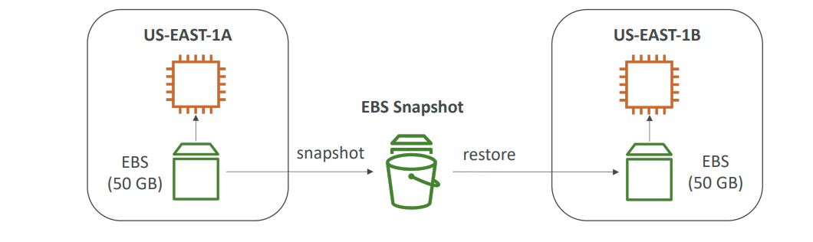

##### EBS Snapshots Features
- EBS Snapshot Archive
    - Move a Snapshot to an ”archive tier” that is
    75% cheaper
    - Takes within 24 to 72 hours for restoring the
    archive
- Recycle Bin for EBS Snapshots
    - Setup rules to retain deleted snapshots so you
    can recover them after an accidental deletion
    - Specify retention (from 1 day to 1 year)
- Fast Snapshot Restore (FSR)
    -  Force full initialization of snapshot to have no
latency on the first use ($$$)

### AMI Overview
- AMI = Amazon Machine Image
- AMI are a customization of an EC2 instance
    - You add your own software, configuration, operating system, monitoring…
    - Faster boot / configuration time because all your software is pre-packaged
- AMI are built for a specific region (and can be copied across regions)
- You can launch EC2 instances from:
    - A Public AMI: AWS provided
    - Your own AMI: you make and maintain them yourself
    - An AWS Marketplace AMI: an AMI someone else made (and potentially sells)

##### AMI Process (from an EC2 instance)
- Start an EC2 instance and customize it
- Stop the instance (for data integrity)
- Build an AMI – this will also create EBS snapshots
-  Launch instances from other AMIs

   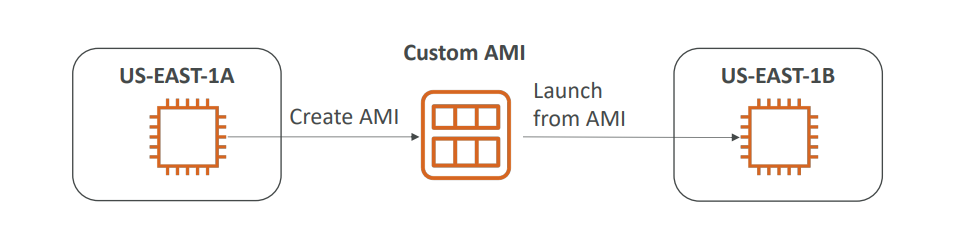

 - creted EC2 using user data that install httpd into ec2
   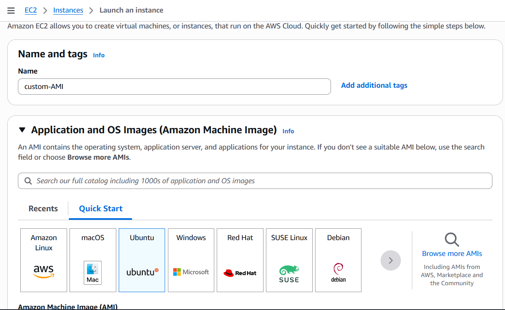 
   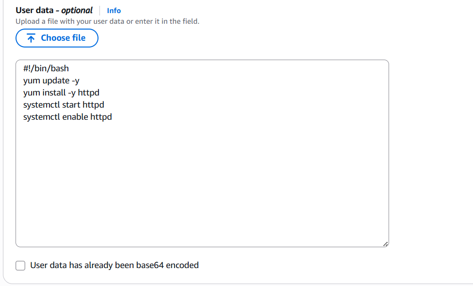 
- now creat custom AMI using customized EC2 instance whre instaled httpd
   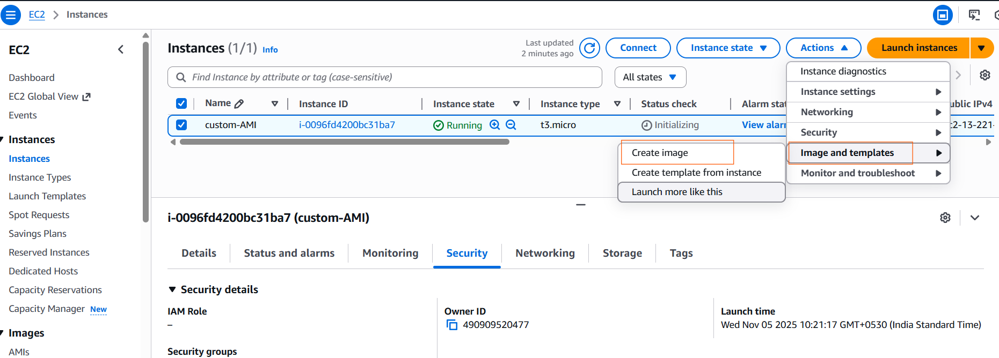   
   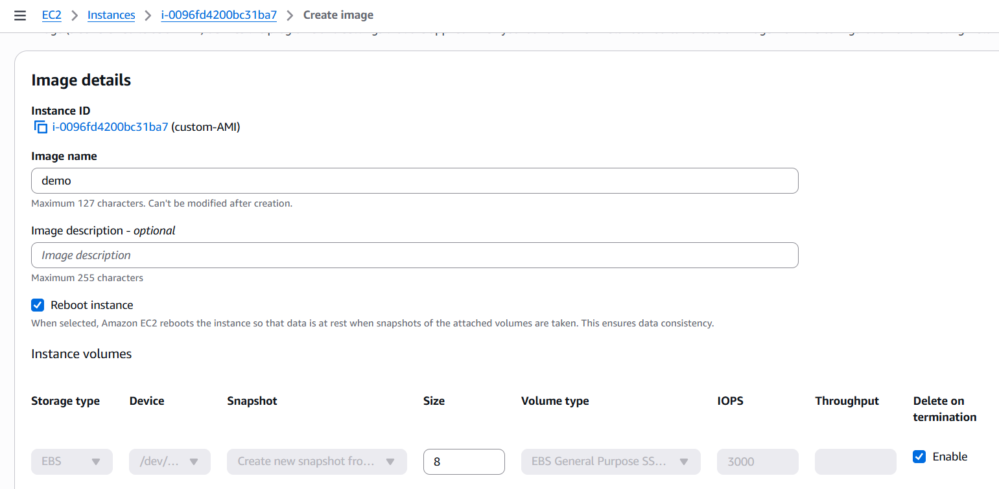
   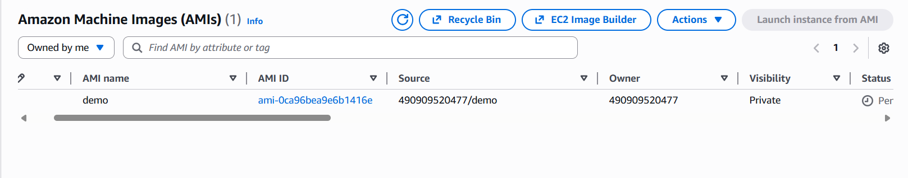

- now create ec2 using custom ami and add user data it's work if https already installed
   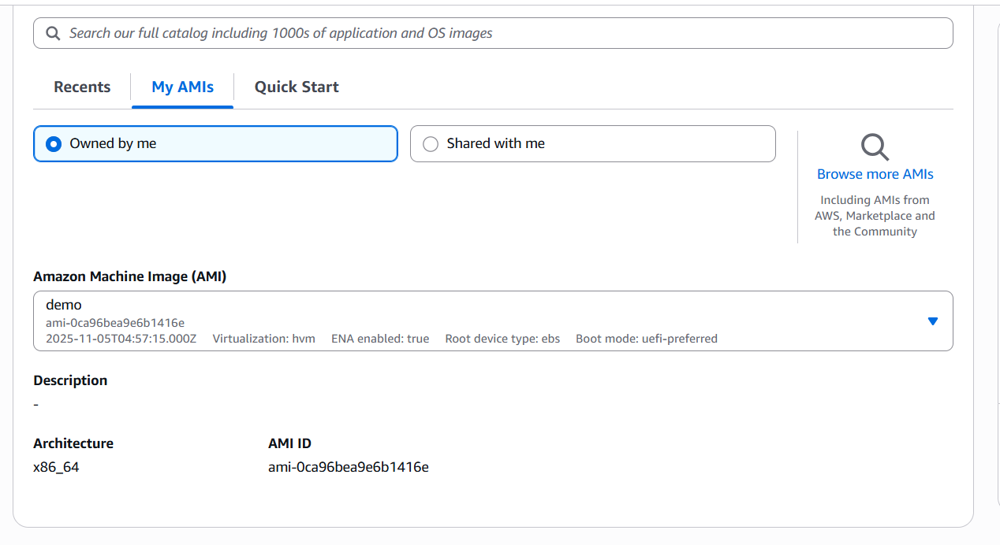
   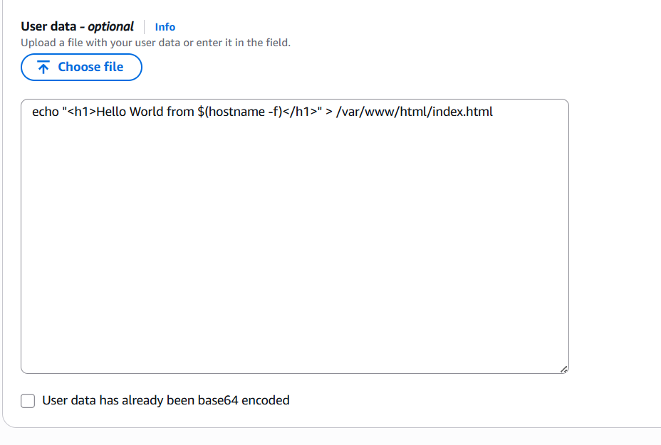 

### EBS Volume Types   
***
- `gp3 vs gp2 (General Purpose SSD`
)

    - Cost effective storage, low-latency
    - System boot volumes, Virtual desktops, Development and test environments
    - 1 GiB - 16 TiB
    - gp3:
      - Baseline of 3,000 IOPS and throughput of 125 MiB/s
      -  Can increase IOPS up to 16,000 and throughput up to 1000 MiB/s independently
    - gp2:
        - Small gp2 volumes can burst IOPS to 3,000
        - Size of the volume and IOPS are linked, max IOPS is 16,000
        - 3 IOPS per GB, means at 5,334 GB we are at the max IOPS
***
- `io1/io2 (Provisioned IOPS (PIOPS) SSD)`

    - Critical business applications with sustained IOPS performance
    - Or applications that need more than 16,000 IOPS
    - Great for databases workloads (sensitive to storage perf and consistency)
    - io1 (4 GiB - 16 TiB):
        - Max PIOPS: 64,000 for Nitro EC2 instances & 32,000 for other
        - Can increase PIOPS independently from storage size
    - io2 Block Express (4 GiB – 64 TiB):
        - Sub-millisecond latency
        - Max PIOPS: 256,000 with an IOPS:GiB ratio of 1,000:1
  - Supports EBS Multi-attach 
***
- `st1/sc1 (Hard Disk Drives (HDD))`

    - Cannot be a boot volume 
    - 125 GiB to 16 TiB 
    - Throughput Optimized HDD (st1) 
        - Big Data, Data Warehouses, Log Processing 
        - Max throughput 500 MiB/s – max IOPS 500 
    - Cold HDD (sc1): 
        - For data that is infrequently accessed
        - Scenarios where lowest cost is important 
        - Max throughput 250 MiB/s – max IOPS 250
***
- `EBS Multi-Attach – io1/io2 family`  

    - Attach the same EBS volume to multiple EC2
    instances in the same AZ
    - Each instance has full read & write permissions
    to the high-performance volume
    - Use case:
        - Achieve higher application availability in clustered
        Linux applications (ex: Teradata)
        - Applications must manage concurrent write
        operations
    - Up to 16 EC2 Instances at a time
    - Must use a file system that’s cluster-aware (not
    XFS, EXT4, etc…) 

###  EFS

- EFS (Amazon Elastic File System) is a scalable, fully managed, cloud-native file storage service provided by AWS that you can use with EC2 instances, Lambda functions, ECS tasks, and other AWS services.
- It provides a shared file system that can be mounted across multiple EC2 instances simultaneously

##### EFS – Storage Classes

- Storage Tiers (lifecycle management feature – move file after N days)
    - Standard: for frequently accessed files
    - Infrequent access (EFS-IA): cost to retrieve files, lower 
    price to store. 
    - Archive: rarely accessed data (few times each year), 50% cheaper
    - Implement lifecycle policies to move files between storage tiers
- Availability and durability
    - Standard: Multi-AZ, great for prod
    - One Zone: One AZ, great for dev, backup enabled by 
    default, compatible with IA (EFS One Zone-IA)
- Over 90% in cost savings

***

- create EFS
  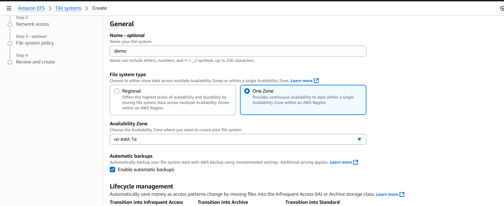
  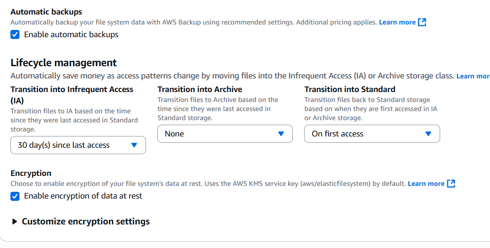
  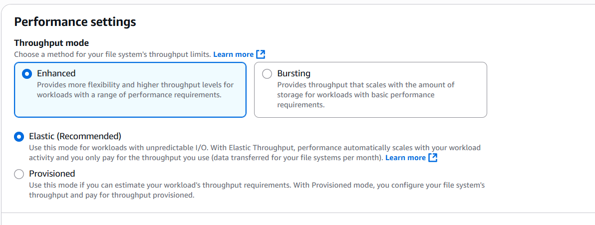
  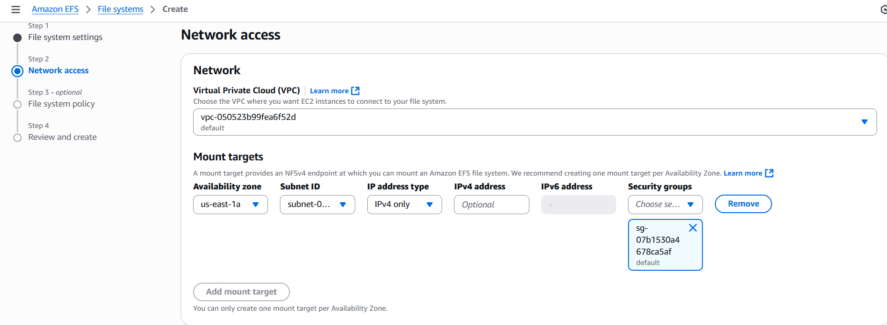
  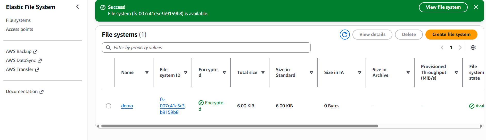

- now attech EFS to two EC2 and both ec2 
  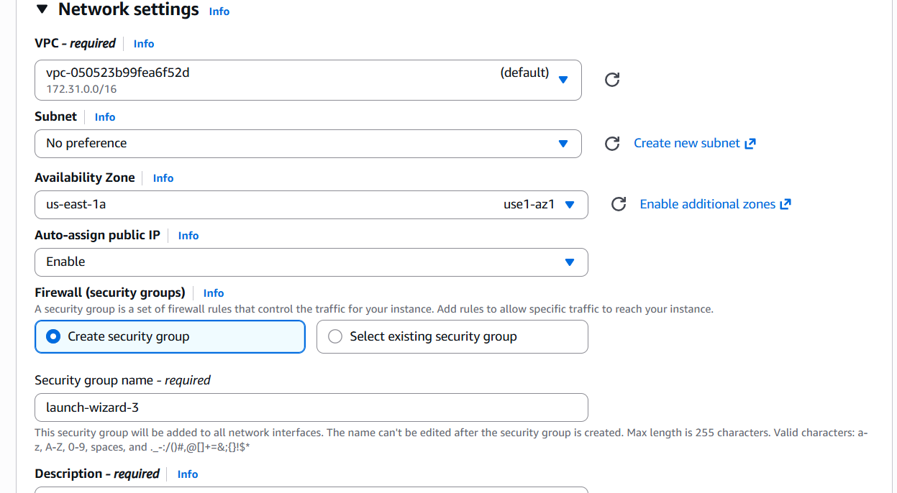  
  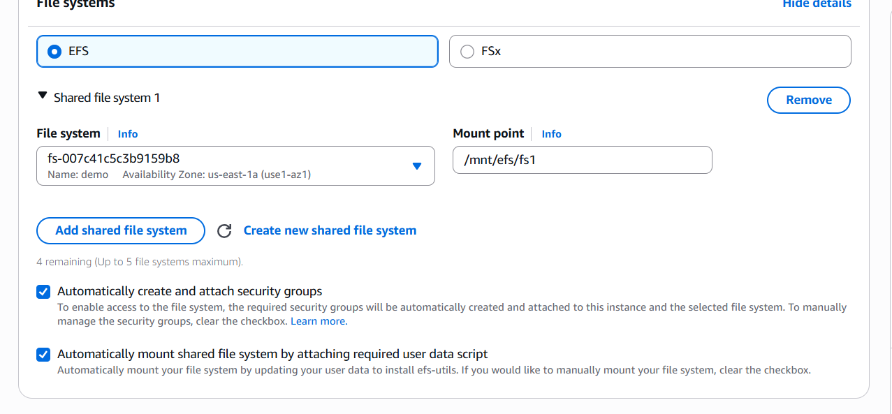

- now connected with both ec2 and creat one file in to 1 st ec2 that file reflect on second ec2
  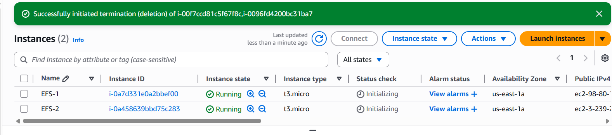
  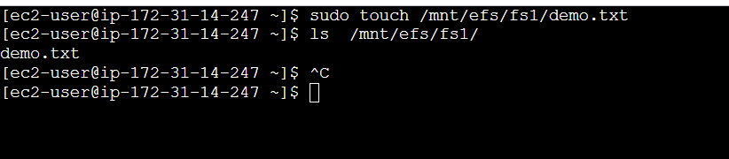
  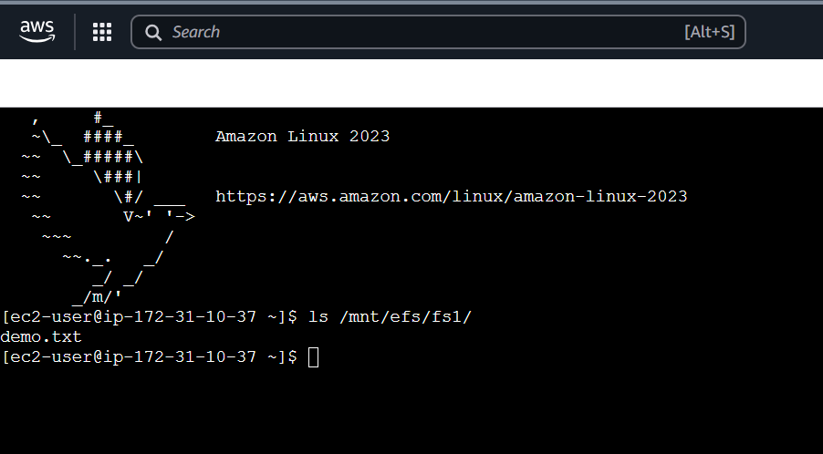
   