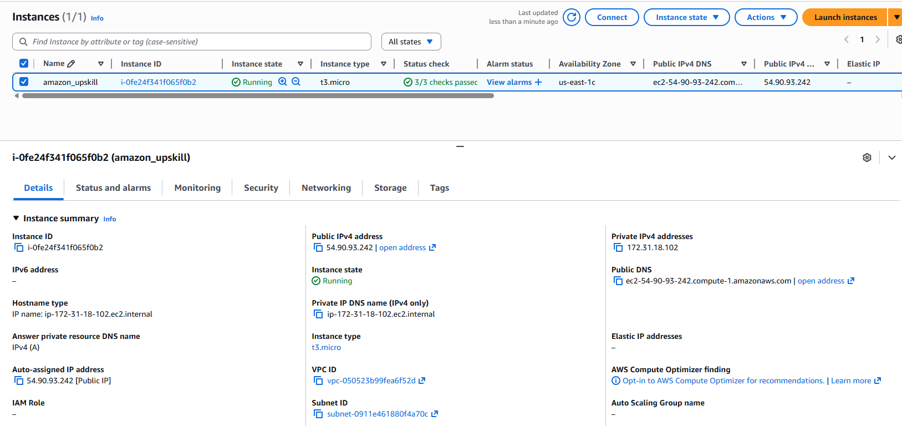
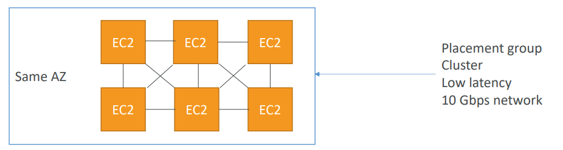
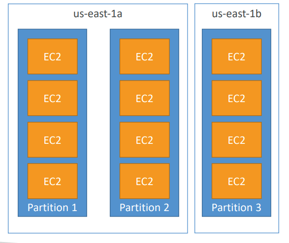

### Amazon EC2

- Amazon EC2 (Elastic Compute Cloud) = a virtual server (like a computer) that runs in AWS’s data centers.
- It gives you CPU + Memory + Storage + Network on-demand.

### EC2 User Data

- It is possible to bootstrap our instances using an EC2 User data script.
   - bootstrapping means launching commands when a machine starts
- That script is only run once at the instance first start
- EC2 user data is used to automate boot tasks such as:
    - Installing updates
    - Installing software
    - Downloading common files from the internet
- The EC2 User Data Script runs with the root user

- created EC2 using terraform
  

### EC2 Instance Types – General Purpose
- Great for a diversity of workloads such as web servers or code repositories
- Balance between:
    - Compute
    - Memory
    - Networking

### EC2 Instance Types – Compute Optimized
- Great for compute-intensive tasks that require high performance
processors:
    - Batch processing workloads
    - Media transcoding
    - High performance web servers
    - High performance computing (HPC)
    - Scientific modeling & machine learning
    - Dedicated gaming servers

### EC2 Instance Types – Memory Optimized

- Fast performance for workloads that process large data sets in memory
- Use cases:
    - High performance, relational/non-relational databases
    - Distributed web scale cache stores
    - In-memory databases optimized for BI (business intelligence)
    - Applications performing real-time processing of big unstructured data

### EC2 Instance Types – Storage Optimized

- Great for storage-intensive tasks that require high, sequential read and write access to large data sets on local storage
- Use cases:
    - High frequency online transaction processing (OLTP) systems
    - Relational & NoSQL databases
    - Cache for in-memory databases (for example, Redis)
    - Data warehousing applications
    - Distributed file systems

### Security Groups
- Security Groups are the fundamental of network security in AWS
- They control how traffic is allowed into or out of our EC2 Instances
- Security groups are acting as a “firewall” on EC2 instances • - They regulate: 
  - Access to Ports 
  - Authorised IP ranges – IPv4 and IPv6  
  - Control of inbound network (from other to the instance)
  -  Control of outbound network (from the instance to other)

- All inbound traffic is blocked by default
- All outbound traffic is authorised by default

### Classic Ports

| **Port** | **Protocol** | **Service Name**                  | **Purpose / Description**                                                            | **Used By**                                      |
| -------- | ------------ | --------------------------------- | ------------------------------------------------------------------------------------ | ------------------------------------------------ |
| **21**   | TCP          | **FTP (Control)**                 | Used to send commands between client and FTP server (like login, directory listing). | File Transfer Protocol clients (e.g., FileZilla) |
| **22**   | TCP          | **SSH (Secure Shell)**            | Secure remote login to Linux systems; also used for SCP and SFTP file transfer.      | System admins, developers                        |
| **80**   | TCP          | **HTTP (Web)**                    | Standard unencrypted web traffic.                                                    | Web browsers, APIs                               |
| **443**  | TCP          | **HTTPS (Secure Web)**            | Encrypted web traffic using SSL/TLS.                                                 | Web browsers, secure APIs                        |
| **3389** | TCP          | **RDP (Remote Desktop Protocol)** | Remote GUI access to Windows servers or desktops.                                    | Windows Admins                                   |
| **445**  | TCP          | **SMB (Server Message Block)**    | File sharing, printer sharing, and Windows network services.                         | Windows file servers and clients                 |

### EC2 On Demand
- Pay for what you use:
  - Linux or Windows - billing per second, after the first minute
  - All other operating systems - billing per hour
- Has the highest cost but no upfront payment
- No long-term commitment
 - Recommended for short-term and un-interrupted workloads, where
you can't predict how the application will behave

### EC2 Reserved Instances

- Up to 72% discount compared to On-demand
- ou reserve a specific instance attributes (Instance Type, Region, Tenancy, OS)
- Reservation Period – 1 year (+discount) or 3 years (+++discount)
- Payment Options – No Upfront (+), Partial Upfront (++), All Upfront (+++)
- Reserved Instance’s Scope – Regional or Zonal (reserve capacity in an AZ)
- Recommended for steady-state usage applications (think database)
- You can buy and sell in the Reserved Instance Marketplace

- Convertible Reserved Instance
  - Can change the EC2 instance type, instance family, OS, scope and tenancy
  - Up to 66% discount

### EC2 Savings Plans
- Get a discount based on long-term usage (up to 72% - same as RIs)
- Commit to a certain type of usage ($10/hour for 1 or 3 years)
-  Usage beyond EC2 Savings Plans is billed at the On-Demand price
- Locked to a specific instance family & AWS region (e.g., M5 in us-east-1)
- Flexible across:
    - Instance Size (e.g., m5.xlarge, m5.2xlarge)
    - OS (e.g., Linux, Windows)
    - Tenancy (Host, Dedicated, Default)

### EC2 Spot Instances
- Can get a discount of up to 90% compared to On-demand
- Instances that you can “lose” at any point of time if your max price is less than the
current spot price
- The MOST cost-efficient instances in AWS
- Useful for workloads that are resilient to failure
    - Batch jobs
    - Data analysis
    - Image processing
    - Any distributed workloads
    - Workloads with a flexible start and end time
- Not suitable for critical jobs or databases

### EC2 Dedicated Hosts
- A physical server with EC2 instance capacity fully dedicated to your use
- Allows you address compliance requirements and use your existing server- bound software licenses (per-socket, per-core, pe—VM software licenses)
- Purchasing Options:
    - On-demand – pay per second for active Dedicated Host
    - Reserved - 1 or 3 years (No Upfront, Partial Upfront, All Upfront)
- The most expensive option
- Useful for software that have complicated licensing model (BYOL – Bring Your Own License)
- Or for companies that have strong regulatory or compliance needs

### EC2 Dedicated Instances

- Instances run on hardware that’s
dedicated to you
- May share hardware with other
instances in same account
- No control over instance placement
(can move hardware after Stop / Start)

### EC2 Capacity Reservations
- Reserve On-Demand instances capacity in a specific AZ for any
duration
- You always have access to EC2 capacity when you need it
- No time commitment (create/cancel anytime), no billing discounts
- Combine with Regional Reserved Instances and Savings Plans to benefit
from billing discounts
- You’re charged at On-Demand rate whether you run instances or not
- Suitable for short-term, uninterrupted workloads that needs to be in a
specific AZ

### Spot Fleets
- A Spot Fleet is a group of EC2 Spot (and optionally On-Demand) instances managed automatically by AWS to achieve the target capacity at the lowest possible cost, by mixing multiple instance types and AZs.

### Private vs Public IP (IPv4)
- Public IP:
    - Public IP means the machine can be identified on the internet (WWW)
    - Must be unique across the whole web (not two machines can have the same public IP).
    - Can be geo-located easily
- Private IP:
    - Private IP means the machine can only be identified on a private network only
    - The IP must be unique across the private network
    - BUT two different private networks (two companies) can have the same IPs.
    - Machines connect to WWW using a NAT + internet gateway (a proxy)
    - Only a specified range of IPs can be used as private IP

### Elastic IPs

 - An Elastic IP address is a static, public IPv4 address provided by AWS that you can assign to an EC2 instance or network interface (ENI). 

### Placement Groups
- A Placement Group in AWS defines how EC2 instances are physically located within the AWS data center infrastructure.

- `Cluster Placement Group` : All instances are placed in the same rack (same AZ)
  - Very low network latency
  - Very high throughput (up to 10 Gbps+ between instances)
  - But low fault tolerance — if the rack fails, all instances fail together
   

- `Spread Placement Group` : Each instance is placed on different racks / hosts / hardware.
  - Each instance is isolated from hardware failure.
  - You can have up to 7 instances per AZ in a spread group.
  - Best for critical systems where you cannot afford correlated failures. 
   

-  `Partition Placement Group` : Divides instances into partitions.Each partition has its own rack and network.
Instances in the same partition may share hardware, but partitions do not.
   - Each partition = independent failure domain.
   - Supports hundreds of instances.
   - Great for distributed systems like Hadoop, Cassandra, or Kafka.
   