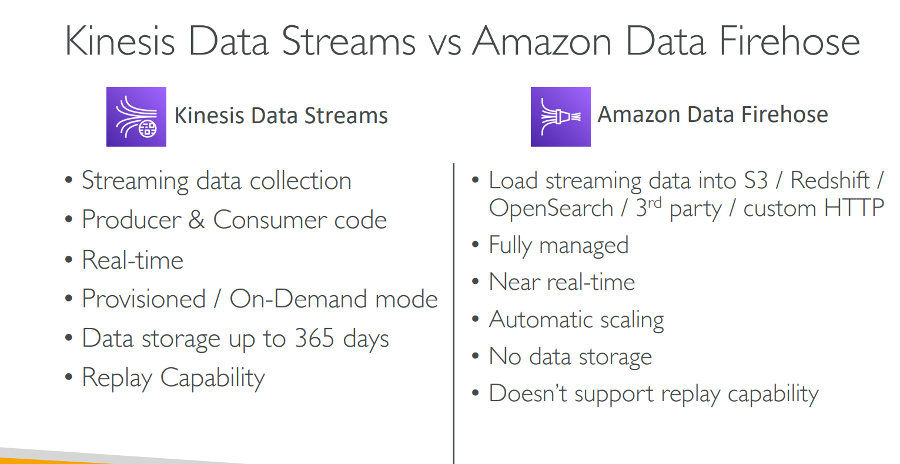

# IAM Permission Boundary
- A permission boundary is a limit (or maximum scope) on the permissions that an IAM user or IAM role can have — even if you attach policies that try to give more access.

    | Component                 | What it does                          | Example             |
    | ------------------------- | ------------------------------------- | ------------------- |
    | **IAM Policy**            | Grants permissions                    | “Allow EC2 and S3”  |
    | **Permission Boundary**   | Restricts maximum allowed permissions | “Allow only S3”     |
    | **Effective Permissions** | Intersection of both                  | “Only S3” allowed |

- You are an AWS admin, and you create users for your team:
  - user1 (developer)
  - user2 (tester)

  - You want user1 to create IAM roles, but you don’t want him to accidentally create a role with AdministratorAccess (too much power).
  - user1 can create roles, but those roles must never have more permissions than I allow.”
  - That limit you set is called a Permission Boundary.

# Amazon RDS Proxy

- Amazon RDS Proxy is a fully managed, highly available database proxy service for RDS (and Aurora). It sits between your application and your RDS database, managing and pooling database connections efficiently.

- Normally, each Lambda function, EC2 app, or container opens its own connection to the RDS database.
That causes problems like:

  -  Connection limits reached (PostgreSQL/MySQL have max connections).

  - Latency spikes when many clients open/close connections frequently.

  - DB overload under sudden traffic bursts.

- RDS Proxy fixes this by:

  - Pooling & reusing connections instead of creating new ones.

  - Handling failover automatically.

  - Improving scalability and availability of database workloads.

| Feature                             | Description                                                         |
| ----------------------------------- | ------------------------------------------------------------------- |
|  **Connection Pooling**           | Reduces overhead by reusing existing DB connections.                |
|  **Fast Failover**                 | Automatically reconnects to standby in multi-AZ RDS within seconds. |
|  **IAM Authentication**           | Can integrate with AWS IAM for secure connection authentication.    |
|  **Improved Lambda Support**      | Ideal for Lambda functions that open many short-lived connections.  |
|  **Secrets Manager Integration** | Manages credentials via AWS Secrets Manager securely.               |

| Situation             | Without Proxy              | With Proxy                |
| --------------------- | -------------------------- | ------------------------- |
| Active users          | 1000                       | 1000                      |
| Actual DB connections | 1000                       | 50 (proxy reuses them)    |
| DB crash risk         | High                       | Very low                  |
| Connection speed      | Slow (new for every user)  | Fast (reused connections) |
| Failover handling     | Manual reconnection needed | Automatic reconnection    |

- Your app connects to the Proxy endpoint (not directly to RDS).

- The Proxy checks its connection pool.

- If a connection is available → it reuses it.

- If not → it opens a new one and adds it to the pool.

- When your app finishes → the connection goes back to the pool for reuse.

### What is a connection pool?

- A connection pool is like a small “bucket” of ready-to-use database connections that the RDS Proxy keeps open to your RDS database.

- Instead of your app creating and closing new DB connections every time (which is slow and resource-heavy),
RDS Proxy keeps a pool of active connections ready to go.

### Amazon Route 53 Routing Policies

| **Routing Policy**                                 | **Description / Behavior**                                                                                   | **Use Case**                                              | **Example Scenario**                                         |
| -------------------------------------------------- | ------------------------------------------------------------------------------------------------------------ | --------------------------------------------------------- | ------------------------------------------------------------ |
| ** Simple Routing**                             | Routes traffic to a single resource. No health checks or load balancing.                                     | When you have only one web server or endpoint.            | `example.com → EC2 instance or ALB`                          |
| ** Weighted Routing**                           | Distributes traffic based on **weights** you assign (e.g. 70%-30%).                                          | Testing new versions (A/B testing) or gradual migration.  | 70% traffic to `us-east-1`, 30% to `us-west-1`.              |
| ** Latency-based Routing**                      | Routes user requests to the region with the **lowest latency**.                                              | Improve performance by directing users to nearest region. | Users in India → `ap-south-1`, users in US → `us-east-1`.    |
| ** Failover Routing**                           | Uses **primary and secondary** endpoints. Routes to secondary only if primary fails (based on health check). | Disaster recovery setup (active-passive).                 | Primary site in `Mumbai`, backup site in `Singapore`.        |
| ** Geolocation Routing**                        | Routes traffic based on the **geographic location** of the user (by IP).                                     | Serve region-specific content or comply with data laws.   | India users → `in.example.com`, US users → `us.example.com`. |
| ** Geoproximity Routing** *(Traffic Flow only)* | Routes based on user’s geographic location **and resource bias (weight adjustment)**.                        | Move more or less traffic to a particular location.       | Send 80% traffic to `Asia` and 20% to `Europe`.              |
| ** Multi-value Answer Routing**                 | Returns **multiple healthy IPs** randomly to clients (like simple load balancing).                           | Basic load balancing without ELB.                         | Return any of 3 web servers’ IPs for `example.com`.          |

### Kinesis Data Streams & Amazon Data Firehose

  