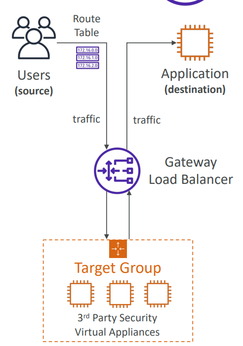
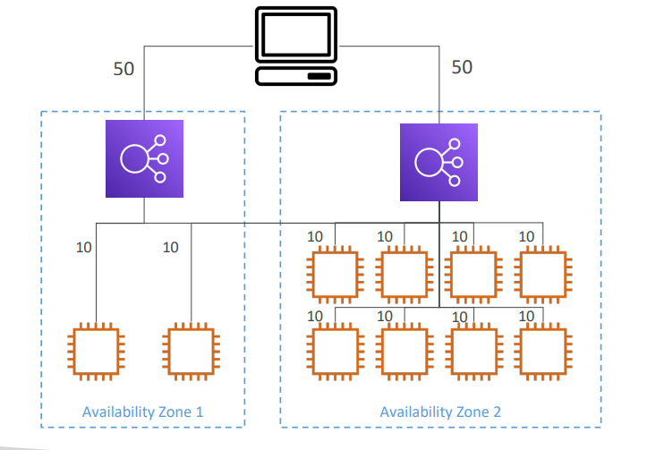
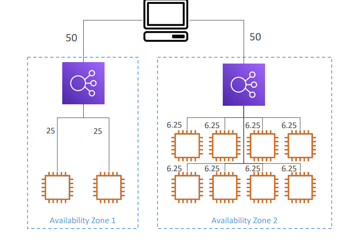

### High Availability & Scalability

#### High Scalability

- calability means the ability of a system to handle increased load by adding more resources (like servers, CPUs, or storage) without affecting performance.

    | **Type**                           | **Description**                                         | **Example (AWS)**                                  |
    | ---------------------------------- | ------------------------------------------------------- | -------------------------------------------------- |
    | **Vertical Scaling (Scale-Up)**    | Increase the size of a single resource (CPU, RAM, etc.) | Changing EC2 instance from `t2.micro` → `m5.large` |
    | **Horizontal Scaling (Scale-Out)** | Add more resources of the same type                     | Adding more EC2 instances behind a Load Balancer   |

    | **Service**                     | **Purpose**                                              |
    | ------------------------------- | -------------------------------------------------------- |
    | **Auto Scaling Group (ASG)**    | Automatically adds/removes EC2 instances based on demand |
    | **Elastic Load Balancer (ELB)** | Distributes traffic evenly across multiple instances     |
    | **Amazon Aurora / DynamoDB**    | Automatically scales database capacity                   |
    | **EFS / S3**                    | Scales storage automatically as data grows               |
    | **Lambda**                      | Scales automatically per request (serverless scaling)    |

#### High Availability 

- High Availability ensures that your application or service remains operational with minimal downtime, even if parts of the system fail.

    | **Service**                     | **HA Feature**                                                |
    | ------------------------------- | ------------------------------------------------------------- |
    | **Elastic Load Balancer (ELB)** | Routes traffic only to healthy instances                      |
    | **Auto Scaling Group**          | Replaces unhealthy instances automatically                    |
    | **Amazon RDS (Multi-AZ)**       | Automatically fails over to a standby DB in another AZ        |
    | **Route 53**                    | DNS failover between regions or endpoints                     |
    | **S3**                          | 99.999999999% (11 9’s) durability, stored across multiple AZs |
    | **EFS**                         | Data replicated across multiple AZs                           |

### ELB (Elastic Load Balancer)
- ELB (Elastic Load Balancer) is an AWS-managed service that automatically distributes incoming application traffic (like HTTP, HTTPS, or TCP) across multiple targets — such as EC2 instances, containers, IP addresses, or Lambda functions — in one or more Availability Zones (AZs).

#####  Types of LB

| **Type**                               | **Layer**            | **Use Case**                           | **Protocols Supported** |
| -------------------------------------- | -------------------- | -------------------------------------- | ----------------------- |
| **1. Application Load Balancer (ALB)** | Layer 7 (HTTP/HTTPS) | Web apps, microservices, containers    | HTTP, HTTPS, WebSocket  |
| **2. Network Load Balancer (NLB)**     | Layer 4 (TCP/UDP)    | High-performance apps, low latency     | TCP, UDP, TLS           |
| **3. Gateway Load Balancer (GWLB)**    | Layer 3 (IP)         | For security appliances like firewalls | IP (GENEVE protocol)    |
| **4. Classic Load Balancer (CLB)**     | Layer 4/7 (Legacy)   | Older applications                     | HTTP, HTTPS, TCP, SSL   |

***

#### Application Load Balancer

| **Feature**                            | **Description**                                                                                                                   |
| -------------------------------------- | --------------------------------------------------------------------------------------------------------------------------------- |
| **Layer 7 Load Balancing**             | Works at the **Application Layer**, understands HTTP/HTTPS, and can make routing decisions based on content.                      |
| **Content-Based Routing**              | Can route traffic based on **URL path**, **hostname**, **HTTP headers**, **query strings**, or **request method**.                |
| **Host-Based Routing**                 | Example: `api.example.com` → API servers, `app.example.com` → App servers.                                                        |
| **Path-Based Routing**                 | Example: `/images` → Image servers, `/videos` → Video servers.                                                                    |
| **Target Groups**                      | ALB sends requests to **target groups** that contain EC2 instances, containers, or Lambda functions.                              |
| **Health Checks**                      | Continuously monitors targets and sends traffic only to **healthy** instances.                                                    |
| **HTTPS (SSL/TLS) Termination**        | ALB can handle SSL certificates (via **AWS Certificate Manager**) and decrypt HTTPS traffic before sending it to backend servers. |
| **WebSocket & HTTP/2 Support**         | Enables real-time apps and better performance.                                                                                    |
| **Integration with ECS/EKS**           | Ideal for microservice and container-based applications.                                                                          |
| **Sticky Sessions (Session Affinity)** | Can bind a user’s session to a specific backend instance using cookies.                                                           |
| **WAF Integration**                    | Protects web applications from common threats (SQL injection, XSS, etc.) when used with **AWS WAF**.                              |

###### listener in LB
- A listener is a process that checks for connection requests (traffic) from clients using a specific port and protocol on your Load Balancer (ALB, NLB, or CLB).

- It acts like the entry point — the “ear” of the load balancer — that listens for incoming traffic and decides where to route it.

#### NLB

- NLB (Network Load Balancer) is an AWS Load Balancer designed to handle high volumes of TCP, UDP, and TLS (SSL) traffic at very high performance and low latency.

- It operates at Layer 4 (Transport Layer) of the OSI model — meaning it routes traffic based on IP address and port, not HTTP content.

    | Feature                                  | Description                                                                                                  |
    | ---------------------------------------- | ------------------------------------------------------------------------------------------------------------ |
    | **Layer 4 Load Balancing**               | Works with TCP, UDP, and TLS protocols. Routes connections based on IP and port, not application-level data. |
    | **Static IPs**                           | Each NLB gets one static IP per Availability Zone (AZ). You can also assign **Elastic IPs (EIPs)**.          |
    | **High Performance**                     | Can handle millions of requests per second while maintaining very low latency.                               |
    | **Zonal Isolation**                      | Each AZ has its own load balancer node — failure in one AZ does not affect others.                           |
    | **Target Types**                         | Can route traffic to: EC2 instances, IP addresses, or AWS PrivateLink endpoints.                             |
    | **Health Checks**                        | Performs health checks at the target level to route traffic only to healthy targets.                         |
    | **TLS Termination**                      | Supports TLS termination for secure connections, allowing decryption at the NLB level.                       |
    | **Cross-Zone Load Balancing (optional)** | Can distribute traffic evenly across all registered targets in all enabled AZs.                              |

#### Gateway Load Balancer
- AWS Gateway Load Balancer (GWLB) is a Layer 3 (Network Layer) load balancer designed to deploy, scale, and manage third-party virtual network appliances — like firewalls, intrusion detection/prevention systems (IDS/IPS), or deep packet inspection tools.

    1. Traffic arrives at the GWLB (from Internet, VPC, or on-prem).

    2. GWLB encapsulates the packets using the GENEVE protocol (on port 6081).

    3. Packets are sent to target appliances (like a firewall EC2 instance).

    4. The appliance inspects / filters / logs / modifies the traffic.

    5. The appliance sends the packets back to GWLB, which decapsulates them.

    6. GWLB forwards traffic to the next hop (like ALB, NLB, or EC2).

        

#### Cross-Zone Load Balancing

- With Cross Zone Load Balancing:each load balancer instance distributes evenly across all registered instances in all AZ
    
- Without Cross Zone Load Balancing:Requests are distributed in the instances of the node of the Elastic Load Balancer  
      

- Application Load Balancer 
    - Enabled by default (can be disabled at the Target Group level)
    -  No charges for inter AZ data 

- Network Load Balancer & Gateway Load Balancer 
    - Disabled by default 
    - You pay charges ($) for inter AZ data if enabled 
- Classic Load Balancer 
    - Disabled by default 
    - No charges for inter AZ data if enabl

### ASG (Auto Scaling Groups) 

- ASG stands for Auto Scaling Group in AWS. It’s a feature of EC2 Auto Scaling that automatically manages a group of EC2 instances —
launching or terminating instances based on demand, health, and scaling policies.

| Concept                                    | Description                                                                                   |
| ------------------------------------------ | --------------------------------------------------------------------------------------------- |
| **Launch Template / Launch Configuration** | Defines how new EC2s should be created (AMI, instance type, key pair, security groups, etc.). |
| **Minimum Size**                           | The fewest number of instances the group should ever have.                                    |
| **Desired Capacity**                       | The ideal number of instances the group tries to maintain.                                    |
| **Maximum Size**                           | The most instances the group can scale up to.                                                 |
| **Scaling Policies**                       | Define *when* and *how much* to scale (CPU, network load, schedule, etc.).                    |
| **Health Checks**                          | Replaces unhealthy instances automatically (EC2 or ELB health checks).                        |

#### Auto Scaling Groups – Scaling Policies

- Dynamic Scaling
    - Target Tracking Scaling
        - Simple to set-up
        - Example: I want the average ASG CPU to stay at around 40%
    - Simple / Step Scaling
        - When a CloudWatch alarm is triggered (example CPU > 70%), then add 2 units
        - When a CloudWatch alarm is triggered (example CPU < 30%), then remove 1
- Scheduled Scaling
    - Anticipate a scaling based on known usage patterns
    - Example: increase the min capacity to 10 at 5 pm on Fridays
-  Predictive scaling: 
   - continuously forecast load and schedule scaling ahead

