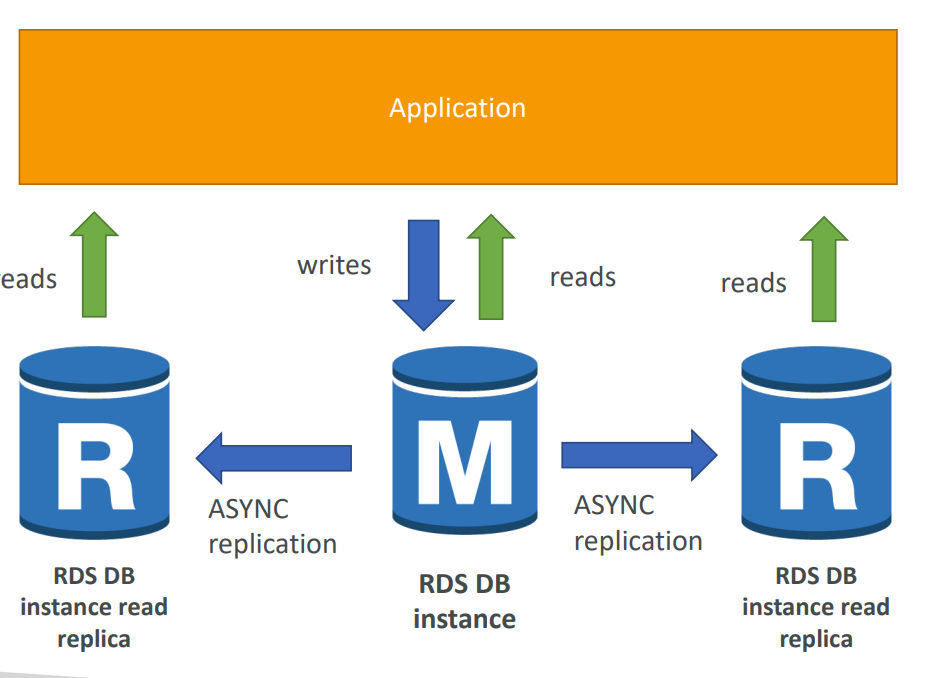

### Amazon RDS

- RDS stands for Relational Database Service
- It’s a managed DB service for DB use SQL as a query language. 
-  It allows you to create databases in the cloud that are managed by AWS
    - Postgres
    - MySQL
    - MariaDB
    - Oracle
    - Microsoft SQL Server
    - IBM DB2
    - Aurora (AWS Proprietary database)

#### RDS Read Replicas for read scalability

 - Up to 15 Read Replicas
- Within AZ, Cross AZ or 
Cross Region
- Replication is ASYNC, 
so reads are eventually 
consistent
- Replicas can be 
promoted to their own 
DB
- Applications must 
update the connection 
string to leverage read 
replicas

  

#### RDS Multi AZ (Disaster Recovery)
- SYNC replication
- One DNS name – automatic app 
failover to standby
- Increase availability
- Failover in case of loss of AZ, loss of 
network, instance or storage failure
- No manual intervention in apps
- Not used for scaling
- Note:The Read Replicas be setup as 
Multi AZ for Disaster Recovery (DR)
