### shell-scripting

- The first line of a shell script typically starts with a shebang, followed by the path to an interpreter that will be used to execute the  commands in the script.

 ##### Variable Usage
 - use variable value using `${VARIABLE_NAME}`
 - Assign command output to a variable `VARIABLE_NAME=$(command)

    ```bash
    #!/bin/bash
    HOST_NAME=$(hostname) 
    echo "This script is running on ${HOST_NAME}."
    ```  
     


 ##### File Test Operators in Bash

| Operator | Description | Example | Result |
|-----------|--------------|----------|---------|
| `-e` | **Exists:** True if the file or directory exists. | `[ -e my_file.txt ]` | True if `my_file.txt` exists. |
| `-f` | **Regular File:** True if the path exists and is a regular file (not a directory or special file). | `[ -f config.ini ]` | True if `config.ini` is a file. |
| `-d` | **Directory:** True if the path exists and is a directory. | `[ -d /home/user/data ]` | True if `/home/user/data` is a folder. |
| `-r` | **Readable:** True if the file exists and the user running the script has read permission. | `[ -r important.log ]` | True if the user can read `important.log`. |
| `-w` | **Writable:** True if the file exists and the user has write permission. | `[ -w script.sh ]` | True if the user can modify `script.sh`. |
| `-x` | **Executable:** True if the file exists and the user has execute permission. | `[ -x install.sh ]` | True if the user can run `install.sh`. |
| `-s` | **Not Empty:** True if the file exists and its size is greater than zero. | `[ -s output.txt ]` | True if `output.txt` contains data. |


##### Arithmetic Test Operators in Bash

| Operator | Description | Example | Result |
|-----------|--------------|----------|---------|
| `-eq` | **Equal to:** True if two numbers are equal. | `[ 5 -eq 5 ]` | True |
| `-ne` | **Not equal to:** True if two numbers are not equal. | `[ 5 -ne 10 ]` | True |
| `-gt` | **Greater than:** True if the first number is greater than the second. | `[ 8 -gt 3 ]` | True |
| `-lt` | **Less than:** True if the first number is less than the second. | `[ 2 -lt 7 ]` | True |
| `-ge` | **Greater than or equal to:** True if the first number is greater than or equal to the second. | `[ 6 -ge 6 ]` | True |
| `-le` | **Less than or equal to:** True if the first number is less than or equal to the second. | `[ 4 -le 9 ]` | True |

```bash
    Write a shell script to check to see if the file "/etc/shadow" exists. If it does exist, display "Shadow passwords are enabled." Next, check to see if you can write to the file. If you can, display "You have permissions to edit /etc/shadow." If you cannot, display "You do NOT have permissions to edit /etc/shadow."
    
    #!/bin/bash

    FILE="/etc/shadow"

    if [ -e "$FILE" ]
    then
    echo "Shadow passwords are enabled."
    fi
   
    if [ -w "$FILE" ]
    then
    echo "You have permissions to edit ${FILE}."  
    else
    echo "You do NOT have permissions to edit ${FILE}."
    fi
 ```
 
 


```bash
  - Write a shell script that displays "man", "bear", "pig", "dog", "cat", and "sheep" to the screen with each appearing on a separate line. Try to do this in as few lines as possible.

    #!/bin/bash
    for ANIMAL in man bear pig dog cat sheep
    do
    echo "$ANIMAL"
    done 
```

  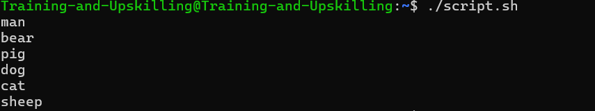


```bash
- Write a shell script that prompts the user for a name of a file or directory and reports if it is a regular file, a directory, or other type of file. Also perform an ls command against the file or directory with the long listing option.
    #!/bin/bash

    read -p "Enter the path to a file or a directory: " FILE

    if [ -f "$FILE" ]
    then
    echo "$FILE is a regular file."
    elif [ -d "$FILE" ]
    then
    echo "$FILE is a directory."
    else
    echo "$FILE is something other than a regular file or directory."
    fi

    ls -l $FILE
```

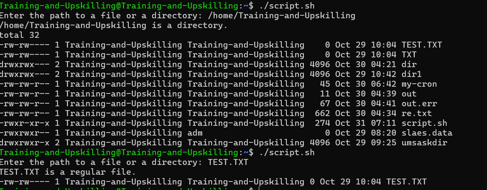

```bash
- Modify the previous script so that it accepts the file or directory name as an argument instead of prompting the user to enter it.

    #!/bin/bash

    FILE=$1

    if [ -f "$FILE" ]
    then
    echo "$FILE is a regular file."
    elif [ -d "$FILE" ]
    then
    echo "$FILE is a directory."
    else
    echo "$FILE is something other than a regular file or directory."
    fi

    ls -l $FILE

```

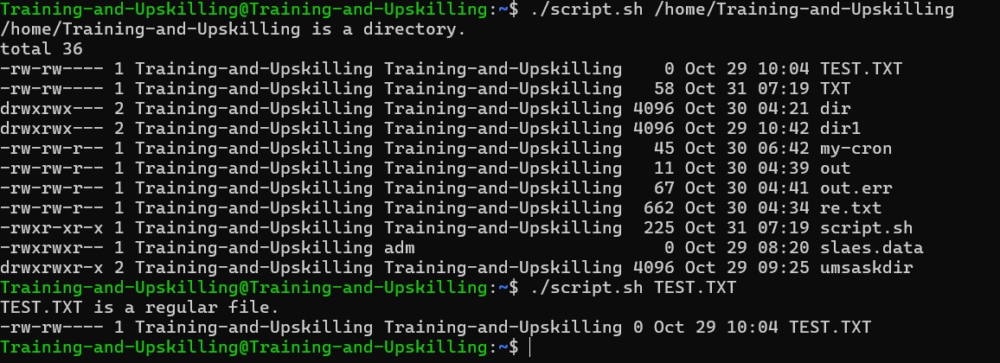


### exit statuses and return codes

- When a command or process finishes running in Linux, it returns an exit status (also called a return code or exit code) to the shell.

    | Exit Code            | Meaning                                                                                   |
    | -------------------- | ----------------------------------------------------------------------------------------- |
    | **0**                |  **Success** – The command executed without errors.                                      |
    | **Non-zero (1–255)** | **Failure** – Something went wrong. The specific number can indicate the type of error. |

  ```bash
     ls /etc
     echo $?
     0

  ```

##### && and ||

- && = AND - command2 runs only if command1 exits with status 0 (success).

    ```bash
    #!/bin/bash
    HOST="google.com"
    ping -c 1 $HOST && echo "$HOST reachable."

  ```
  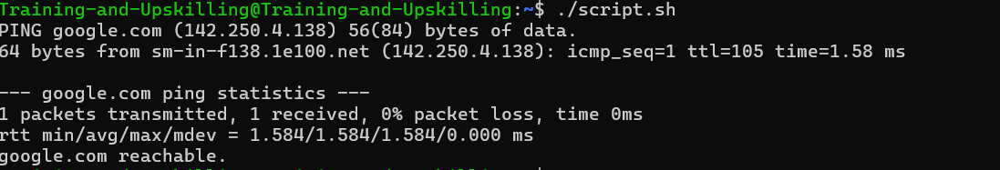

- || = OR - Run command2 only if command1 fails

    ```bash
    #!/bin/bash
    HOST="google.com"
    ping -c 1 $HOST || echo "$HOST unreachable."
    ```
  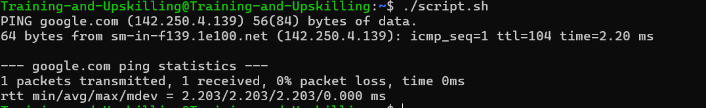


- `;` - Separating Commands on a Single Line

    ```bash
    echo "Starting cleanup"; rm -f *.tmp; echo "Cleanup finished"
    # all three commands run even if rm -f *.tmp fails.
    ```

    ```bash
    - Write a shell script that accepts a file or directory name as an argument. Have the script report
    if it is a regular file, a directory, or other type of file. If it is a regular file, exit with a 0 exit status.
    If it is a directory, exit with a 1 exit status. If it is some other type of file, exit with a 2 exit status.

        #!/bin/bash

        FILE=$1

        if [ -f "$FILE" ]
        then
        echo "$FILE is a regular file."
        exit 0
        elif [ -d "$FILE" ]
        then
        echo "$FILE is a directory."
        exit 1
        else
        echo "$FILE is something other than a regular file or directory."
        exit 2
        fi
    ```
  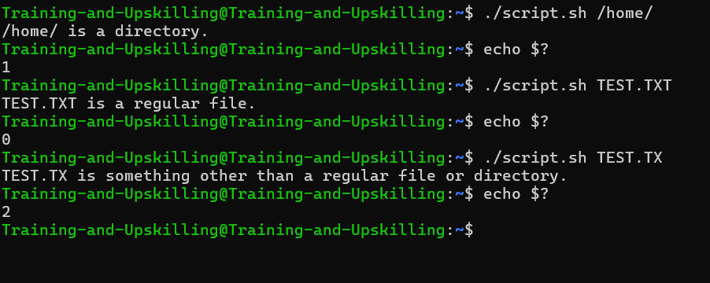


    ```bash
    - Write a script that executes the command "cat /etc/shadow". If the command returns a 0 exit
    status report "Command succeeded" and exit with a 0 exit status. If the command returns a
    non­zero exit status report "Command failed" and exit with a 1 exit status.

    #!/bin/bash
    cat /etc/shadow
    if [ "$?" -eq "0" ]
    then
    echo "Command succeeded"
    exit 0
    else
    echo "Command failed"
    exit 1
    fi
    ```
    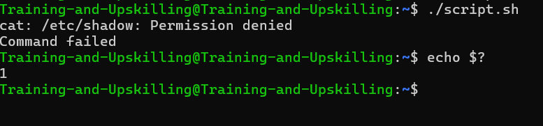

 ### Shell Functions

 - Functions are blocks of code that perform a specific, reusable task.

    ```bash
    function function_name {
        echo "This code is inside the function."
    }

    ```

- Positional Parameters (Arguments)
Functions use the same positional parameters ($1, $2, $@, $#) that were previously discussed for the main script, but they are local to the function itself.

  - $1, $2, etc., refer to the arguments passed to the function, not the arguments passed to the entire script.


    ```bash  
    func () {
        # $1 is the first argument passed to the function
        echo "Hello, $1! Welcome to the script."
    }

   
     func ALl
    ```
    


  #### Variable Scope

    - By default, variables are global
    -  Variables have to be defined before used

    ```bash
    #!/bin/bash
    my_function() {
    GLOBAL_VAR=1
    }
    # GLOBAL_VAR not available yet.
    echo $GLOBAL_VAR
    my_function
    # GLOBAL_VAR is NOW available.
    echo $GLOBAL_VAR

    ```

   ##### Local Variables
    - Can only be accessed within the function.
    - Create using the local keyword.
    - local LOCAL_VAR=1
    - Only functions can have local variables.
    - Best practice to keep variables local in 
    functions


        ```bash
        #!/bin/bash

        my_function() {
            local LOCAL_VAR=1
            echo "LOCAL_VAR can be accessed inside of the function: $LOCAL_VAR"
        }

        my_function

        # LOCAL_VAR is not available outside of the function.
        echo "LOCAL_VAR can NOT be accessed outside of the function: $LOCAL_VAR"

        ```  
   


        ```bash
                - Write a shell script that consists of a function that display the number of files in the present working directory. Name this function "file_count" and call it in your script. If you use a variable in your function, remember to make it a local variable.


        #!/bin/bash

        function file_count() {
        local NUMBER_OF_FILES=$(ls | wc -l)
        echo "$NUMBER_OF_FILES"
        }
        
        file_count
        ``` 
        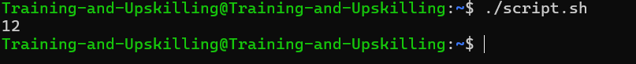 


      ```bash
        - Modify the script from the previous exercise. Make the "file_count" function accept a directory as an argument. Next have the function display the name of the directory followed by a colon. Finally, display the number of files to the screen on the next line. Call the function three times.First, on the "/etc" directory, next on the "/var" directory and finally on the "/usr/bin" directory.

        #!/bin/bash

        function file_count() {
        local DIR=$1
        local NUMBER_OF_FILES=$(ls $DIR | wc -l)
        echo "${DIR}:"
        echo "$NUMBER_OF_FILES"
        }

        file_count /etc
        file_count /var
        file_count /usr/bin

      ```  
      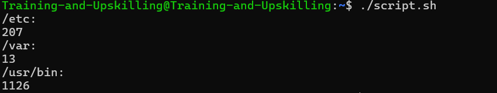


### Wildcards

- Wildcards are great when you want to work 
on a group of files or directories.


    ```bash

    #!/bin/bash

    cd /var/www
    for FILE in *.html
    do
        echo "Copying $FILE"
        cp $FILE /var/
    done
    ```


### Case Statements

- case statement in shell script is used to check one variable against many possible values.
- It’s similar to writing many if...elif...else conditions — but it’s shorter and easier to read.

  ```bash
  #!/bin/bash

  echo "Enter a number between 1 and 3:"
  read num

  case $num in
    1)
      echo "You entered ONE"
      ;;
    2)
      echo "You entered TWO"
      ;;
    3)
      echo "You entered THREE"
      ;;
    *)
      echo "Invalid number"
      ;;
  esac
  ```


  ```bash
  - Create a startup script for an application called sleep­walking­server, which is provided below.
  The script should be named sleep­walking and accept "start" and "stop" as arguments. If
  anything other than "start" or "stop" is provided as an argument, display a usage statement:
  "Usage sleep­walking start|stop" and terminate the script with an exit status of 1.
  To start sleep­walking­server, use this command: "/tmp/sleep­walking­server &"
  To stop sleep­walking­server, use this command: "kill $(cat /tmp/sleep­walking­server.pid)"


  case "$1" in
    start)
      /tmp/sleep-walking-server &
      ;;
    stop)
      kill $(cat /tmp/sleep-walking-server.pid)
      ;;
    *)
      echo "Usage: $0 start|stop"
      exit 1
  esac
  ```

  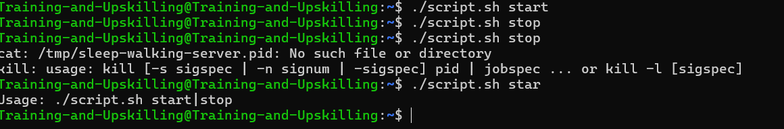


### Logging

- Logs are the who, what, when, where, and why.

- linux os use syslog for message loggin
- The syslog standard uses facilities and 
severities to categorize messages.
  - Facilities: kern, user, mail, daemon, auth, local0, local7
       -  local0-local7 for custom log
  - Severities: emerg, alert, crit, err, warning, notice, info,debug
- Log file locations are configurable:
  - /var/log/messages
  - /var/log/syslog


  | Term                         | Meaning                                               |
  | ---------------------------- | ----------------------------------------------------- |
  | **Facility**                 | Source or category of the log (auth, daemon, local0…) |
  | **Level/Priority**           | Severity of the message (info, warn, error, etc.)     |
  | **logger -p facility.level** | Used to send logs with both source and severity       |


  | Command                                       | Description                 | Example Log                |
  | --------------------------------------------- | --------------------------- | -------------------------- |
  | `logger "Message"`                            | Simple log message          | `ayush: Message`           |
  | `logger -p local0.info "Message"`             | Log with facility and level | `local0.info: Message`     |
  | `logger -t myscript -p local0.info "Message"` | Add tag + facility + level  | `myscript: Message`        |
  | `logger -i -t myscript "Message"`             | Add tag + PID               | `myscript[12345]: Message` |

  
  
  


    ```bash
  - Exercise 1:
  Write a shell script that displays one random number to the screen and also generates a syslog
  message with that random number. Use the "user" facility and the "info" facility for your
  messages.
      #!/bin/bash

  MESSAGE="Random number: $RANDOM"

  echo "$MESSAGE"
  logger -p user.info "$MESSAGE"

   
    ```
       
       


  ```bash
  - Exercise 2:
  Modify the previous script so that it uses a logging function. Additionally tag each syslog
  message with "randomly" and include the process ID. Generate 3 random numbers.

    #!/bin/bash 

  function my_logger() {
    local MESSAGE=$@
    echo "$MESSAGE"
    logger -i -t randomly -p user.info "$MESSAGE"
  }

  my_logger "Random number: $RANDOM"
  my_logger "Random number: $RANDOM"
  my_logger "Random number: $RANDOM"


  ```
  
  


### While Loops

- A while  is used to repeat a set of commands as long as a condition is true.
- It keeps looping until the condition becomes false.


  | Feature       | Description                             |
  | ------------- | --------------------------------------- |
  | Purpose       | Repeat commands while condition is true |
  | Syntax        | `while [ condition ]; do ... done`      |
  | Common Uses   | Counting, reading files, monitoring     |
  | Stops When    | Condition becomes false                 |
  | Infinite Loop | Use `while true`                        |

```bash
#!/bin/bash

count=1

while [ $count -le 5 ]
do
  echo "Count is: $count"
  count=$((count + 1))
done
```

- break is used to exit the loop immediately, even if the condition is still true.


  ```bash
  #!/bin/bash

  count=1

  while [ $count -le 10 ]
  do
    echo "Count: $count"
    
    if [ $count -eq 5 ]; then
      echo "Reached 5 — breaking the loop!"
      break
    fi

    count=$((count + 1))
  done

  echo "Loop ended."

  ```

- continue skips the rest of the commands in the loop for the current iteration,and then goes back to check the condition again.


    ```bash
    #!/bin/bash

    count=0

    while [ $count -lt 5 ]
    do
      count=$((count + 1))
      
      if [ $count -eq 3 ]; then
        echo "Skipping number 3"
        continue
      fi

      echo "Count: $count"
    done

  ```


  ```bash
  - Exercise 1:
  Write a shell script that loops through the /etc/passwd file one line at a time. Prepend each line
  with a line number followed by a colon and then a space.
  
    #!/bin/bash

  LINE_NUM=1
  while read LINE
  do
    echo "${LINE_NUM}: ${LINE}"
    ((LINE_NUM++))
  done < /etc/passwd
  ```

  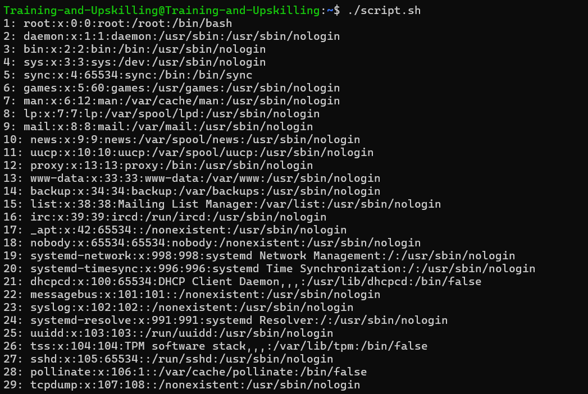


  ```bash
  - Exercise 2:
  Write a shell script that asks the user for the number of lines they would like to display from the
  /etc/passwd file and display those lines.
 
    #!/bin/bash

  read -p "How many lines of /etc/passwd would you like to see? " SHOW_LINES

  LINE_NUM=1
  while read LINE
  do
  if [ "$LINE_NUM" -gt "$SHOW_LINES" ]
  then
    break
  fi
  echo $LINE
  ((LINE_NUM++))
  done < /etc/passwd


  ``` 
  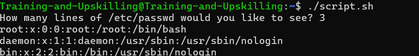

  ```bash
  - Exercise 3:
  Write a shell script that that allows a user to select an action from the menu. The actions are to
  show the disk usage, show the uptime on the system, and show the users that are logged into
  the system. Tell the user to enter q​to quit. Display "Goodbye!" just before the script exits.
  If the user enters anything other than 1​, 2​, 3​, or q​, tell them that it is an "Invalid option."
  You can show the disk usage by using the df​command. To show the uptime, use the uptime
  command. To show the users logged into the system, use the who​command. Print a blank
  line after the output of each command.


    #!/bin/bash

  while true
  do
    echo "1. Show disk usage."
    echo "2. Show system uptime."
    echo "3. Show the users logged into the system."
    read -p "What would you like to do? (Enter q to quit.) " CHOICE

    case "$CHOICE" in
      1)
        df
        ;;
      2)
        uptime
        ;;
      3)
        who
        ;;
      q)
        break
        ;;
      *)
        echo "Invalid option."
        ;;
    esac
    echo
  done
  echo "Goodbye!"


  ```

  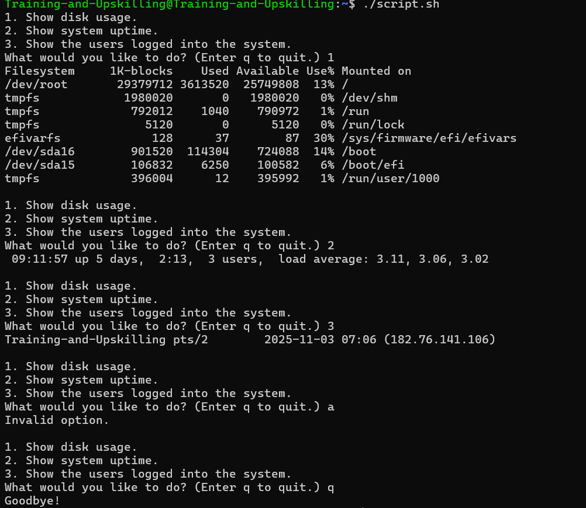


### Debugging

- -x - Prints commands and arguments as they execute

- To enable debugging to wall script wirte -x in shebang. #!/bin/bash -x

- set +x - To stop debugging.


```bash
#!/bin/bash -x

TEST_VAR="test"
echo "$TEST_VAR"


#!/bin/bash -x

TEST_VAR="test"
echo "$TEST_VAR"


set +x  # # Stop  debugging
hostname
```
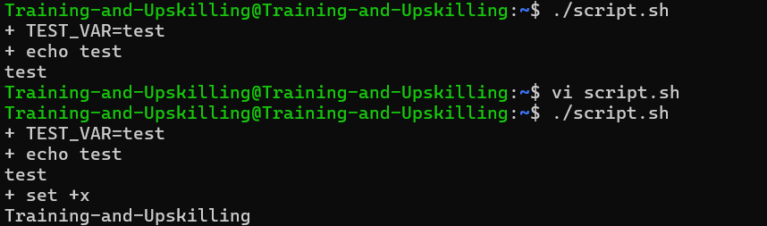


```bash
 #!/bin/bash

TEST_VAR="test"
set -x # Enable debugging
echo "$TEST_VAR"
set +x # Stop  debugging
hostname
```
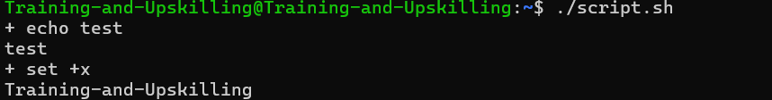

#### Error Exit in Debugging

- -e - Exit on Error #!/bin/bash -ex - Will enable debugging and Error exit.

- -v - Print shell input lines as they are read.


  ```bash
  #!/bin/bash -e

  FILE_NAME="/not/here"
  ls $FILE_NAME
  echo $FILE_NAME


  ```
  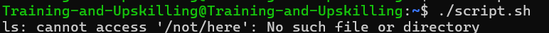
  ```bash
  #!/bin/bash -ex

  FILE_NAME="/not/here"
  ls $FILE_NAME
  echo $FILE_NAME
  ```
  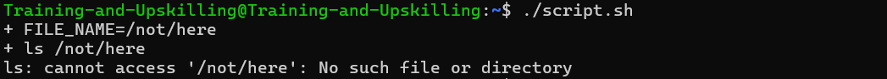
  ```bash
  #!/bin/bash -v

  TEST_VAR="test"
  echo "$TEST_VAR"
  ```
  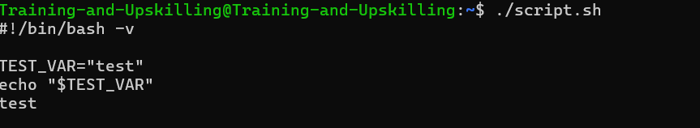
  ```bash
  #!/bin/bash -vx
  TEST_VAR="test"
  echo "$TEST_VAR"
  ```
  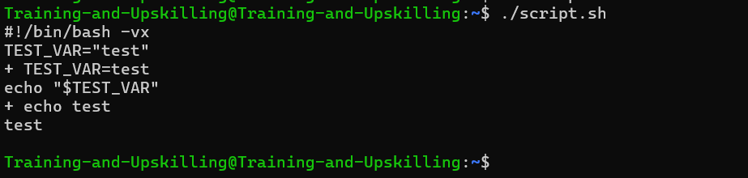


#### More Control over Debugging by Manual Debugging

- You can create your own debugging code.
- Use a special variable like DEBUG
   - DEBUG=true
   - DEBUG=false


  ```bash
    #!/bin/bash

  DEBUG=true

  if $DEBUG
  then
    echo "Debug mode is ON."
  else
    echo "Debug mode is OFF."
  fi

  ```
  


#### Use AND and OR

  ```bash
  #!/bin/bash

  DEBUG=true
  $DEBUG && echo "Debug mode is ON."

  #!/bin/bash

  DEBUG=false
  $DEBUG || echo "Debug mode is OFF."

  ```

#### Debug with Passing arguments

```bash
#!/bin/bash

debug() {
  echo "Executing: $@"
  $@
}
debug ls

```

#### PS4 
- set -x → turns debug (trace) mode ON
- PS4 → defines what gets printed before each traced command

By default:
```bash
PS4='+ '
```

So  run:
```bash
#!/bin/bash
set -x

a=10
b=20
c=$((a + b))
echo $c
```

 Output:
```bash
+ a=10
+ b=20
+ c=30
+ echo 30
30
# Here, the + is coming from the default PS4 value.

```

  ```bash
  - Exercise 1:
  Write a shell script that exit on error and displays commands as they will execute, including all
  expansions and substitutions. Use 3 ls​commands in your script. Make the first one succeed,
  the second one fail, and the third one succeed. If you are using the proper options, the third ls
  command will not be executed.
  
  #!/bin/bash -ex

ls /etc/passwd
ls /move/along/nothing/to/see/here
ls /etc/passwd

  ```
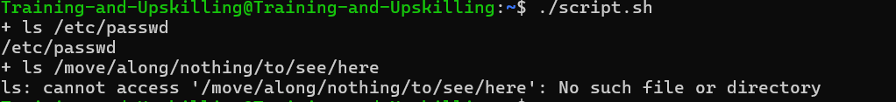


```bash
- Exercise 2:
Modify the previous exercise so that script continues, even if an error occurs. This time all three
ls ​commands will execute.

#!/bin/bash -x

ls /etc/passwd
ls /move/along/nothing/to/see/here
ls /etc/passwd

```
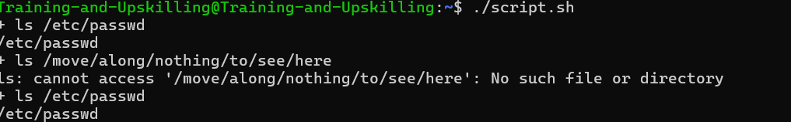


###  Data Manipulation and Text Transformations with Sed
- sed stands for Stream Editor.
- It is a command-line text processing tool used to search, find-and-replace, insert, delete, or modify text — directly in files or text streams.
- It reads text line by line, applies the given editing commands, and then outputs the modified text


  | Command | Meaning                         |
  | ------- | ------------------------------- |
  | `s`     | Substitute (search and replace) |
  | `d`     | Delete a line                   |
  | `p`     | Print lines                     |
  | `i`     | Insert text before a line       |
  | `a`     | Append text after a line        |
  | `c`     | Change a line completely        |

- Search and Replace (Substitute)
  ```bash
  # s for substitute
  sed 's/apple/orange/' fruits.txt
  # Replaces the first occurrence of "apple" with "orange" in each line.
  ```
  
  ```bash
  sed 's/apple/orange/g' fruits.txt
  # To replace all occurrences in a line:
  #  The g means global (replace all).
  ```


- Replace text directly in the file

  ```bash
  sed -i 's/apple/orange/g' fruits.txt
  # -i = in-place editing (changes saved directly in the file).
  ```


- Delete Lines
  ```bash
  # Delete line number 2:

  sed '2d' fruits.txt


  # Delete lines 2 to 4:
  sed '2,4d' fruits.txt
  ```
- Print Specific Lines
  ```bash
  # Print only line 3:

  sed -n '3p' fruits.txt


  # Print lines 2–5:

  sed -n '2,5p' fruits.txt


  #(-n suppresses normal output, and p explicitly prints selected lines)
  ```
- Insert or Append Text
  ```bash
  # Insert text before line 3:

  sed '3i This is new text' file.txt


  # Append text after line 3:

  sed '3a This is added after line 3' file.txt
  ```
- Change a Whole Line
  ```bash
  # Replace line 2 completely:

  sed '2c This line has been replaced' file.txt
  ```
- Use with Pipelines

- You can use sed in a pipeline to process command output:
  ```bash
  ps aux | sed -n '1,5p'
  # Shows only the first 5 lines of ps aux output.
  ```
