# Docker

1. Docker : 

   - Docker is a tool that packages an application and all its dependencies into a single, portable unit called a container. It makes sure that the application runs exactly the same way, everywhere, regardless of the environment.

2. Container :

   - container is a lightweight, standalone package of software that includes everything an application needs to run: the code, a runtime, system tools, and libraries. Containers are isolated from each other and the host system, making them secure and consistent.


3. Image :
   - Docker Image is a read-only template used to create containers. Think of an image as a blueprint for an application. It contains all the instructions and files needed to build a running container. You can create multiple containers from a single image.


4. Dockerfile :

   - Dockerfile is a simple text file that contains the step-by-step instructions for building a Docker image. It's like a recipe for your application's environment.


- Installing Dcoker on linux vm 
  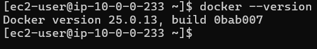


### Docker Commands :

  | Action                                        | Command                                    | Description                                 |
  | --------------------------------------------- | ------------------------------------------ | ------------------------------------------- |
  | **Run – run the container using image**       | `docker run <image_name>`                  | Run a new container from an image           |
  | **ps – list containers**                      | `docker ps`                                | List **running** containers                 |
  |                                               | `docker ps -a`                             | List **all** containers (including stopped) |
  | **-d – run container in detach mode**         | `docker run -d <image_name>`               | Run container in background                 |
  | **STOP – stop a container**                   | `docker stop <container_id>`               | Stop a running container                    |
  | **Rm – Remove a container**                   | `docker rm <container_id>`                 | Remove a stopped container                  |
  | **-it – login into container (interactive)**  | `docker run -it <image_name> /bin/bash`    | Start container and open shell              |
  |                                               | `docker exec -it <container_id> /bin/bash` | Login into **running** container            |
  | **images – List images**                      | `docker images`                            | List all local images                       |
  | **rmi – Remove images**                       | `docker rmi <image_id>`                    | Delete a Docker image                       |
  | **Pull – download an image**                  | `docker pull <image_name>`                 | Download image from Docker Hub              |
  | **Exec – execute a command inside container** | `docker exec -it <container_id> <command>` | Run command inside running container        |
  | **attach – attach to a running container**    | `docker attach <container_id>`             | Attach terminal to running container        |
  | **detach from attached container**            | `Ctrl + P, Ctrl + Q`                       | Detach without stopping container           |


- Run – run the container using image
  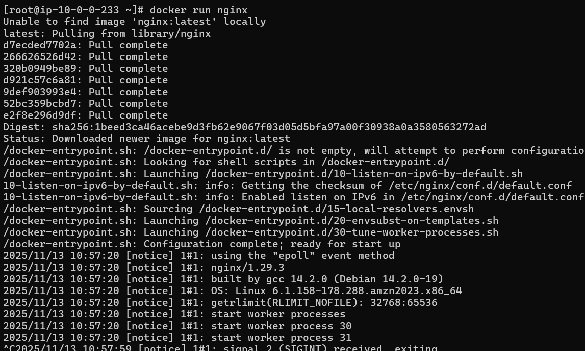


- ps – list containers
  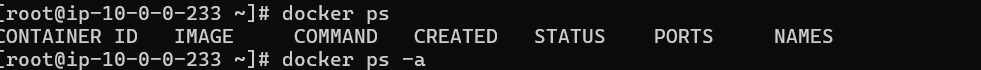

- -d run container in detach mod
   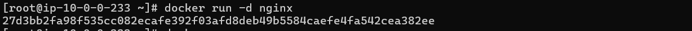

- STOP – stop a container
  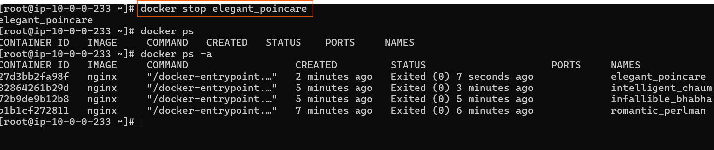
  
  
- Rm – Remove a container
  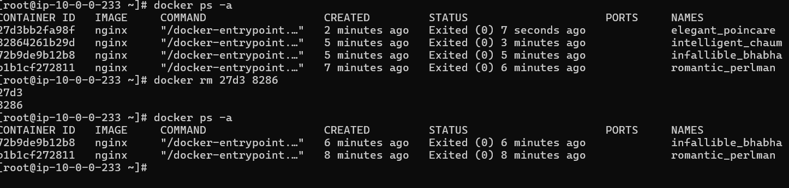
  

- -it loging into container
   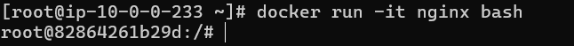  

- images – List images
   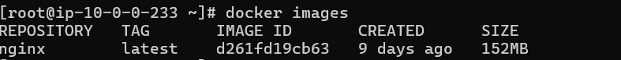

- rmi – Remove images
  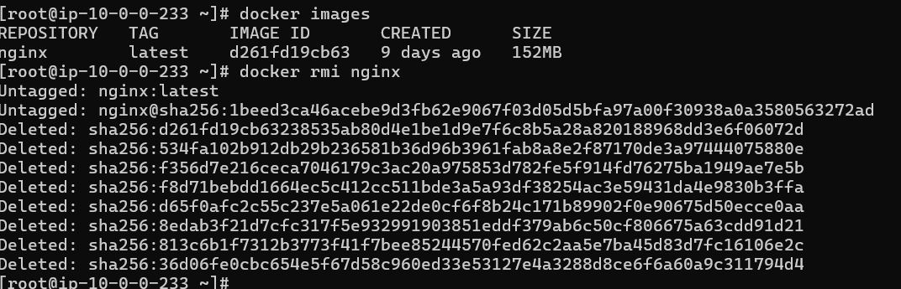
  
- Pull – download an image
  

- Exec – execute a command
  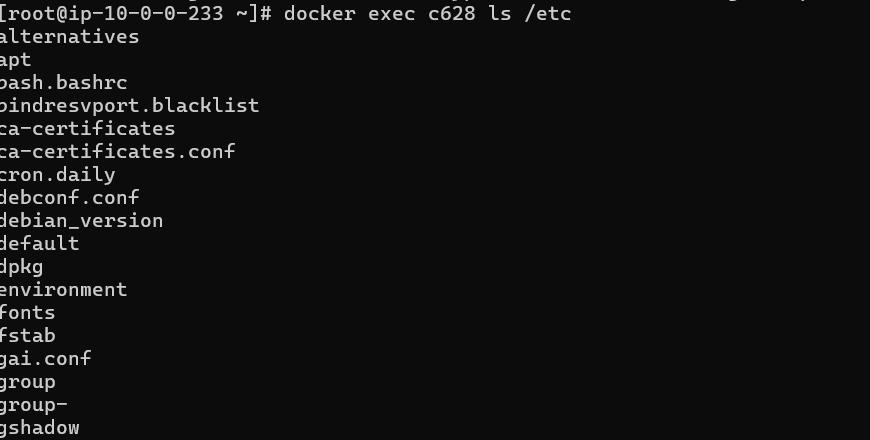

- attach - detach to attach mod
  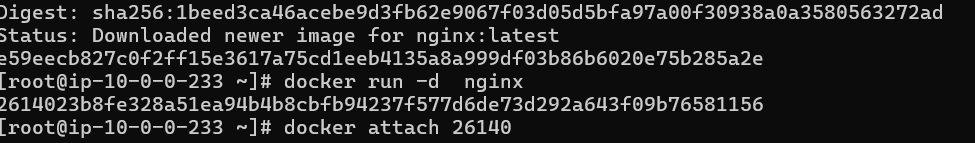  


### Docker Run :
  | Use Case                 | Command                                            | Description                            |
  | ------------------------ | -------------------------------------------------- | -------------------------------------- |
  | **Run – tag**            | `docker run nginx:latest`                          | If tag not specified → uses `:latest`  |
  | **Run – PORT mapping**   | `docker run -p 8080:80 nginx`                      | Map host port 8080 → container port 80 |
  | **Run – Volume mapping** | `docker run -v /host/path:/container/path <image>` | Mount host directory into container    |


- Run – tag
  - if we not specify any tag , Docker will consider the default tag to be latest.

   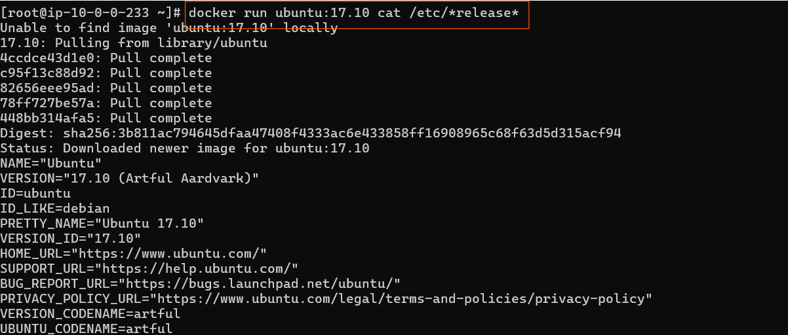


  | Action                | Command                         | Description                        |
  | --------------------- | ------------------------------- | ---------------------------------- |
  | **Inspect Container** | `docker inspect <container_id>` | Show detailed info about container |
  | **Container Logs**    | `docker logs <container_id>`    | View logs of a container           |


- Run – PORT mapping
   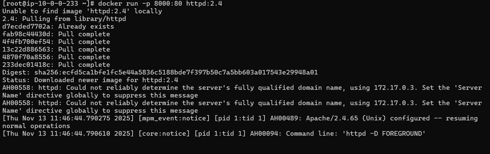
   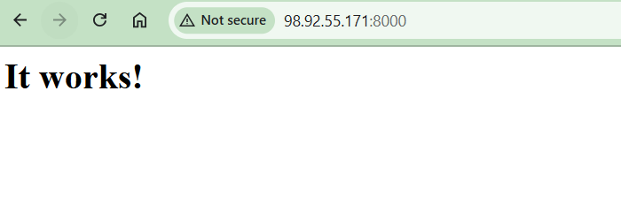


- Inspect Container
  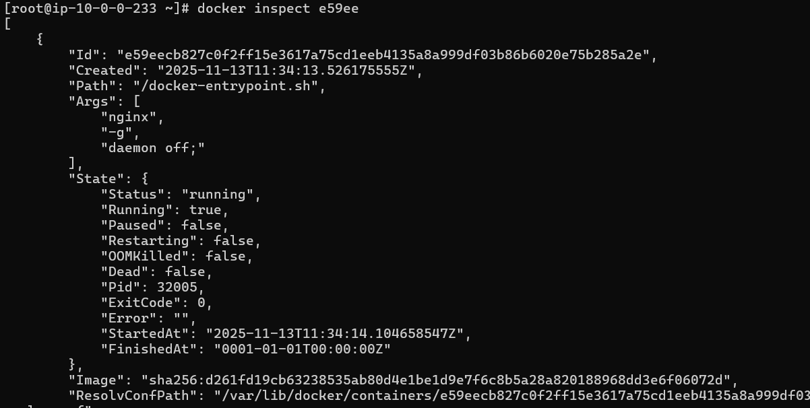

- Container Logs
  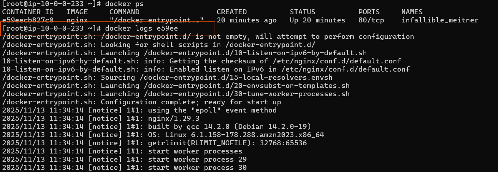

### Docker Images :
  - [REF](https://github.com/mmumshad/simple-webapp-flask)

- Build the image
    ```bash
    docker build -t <image_name>:<tag> -f <path_to_Dockerfile> <build_context>

    ```

  -  Run container

  ```bash
    docker run -d --name myapp-dev -p 8080:8000 myapp:dev
  ```  


- If your image is named myapp (no Docker Hub repo prefix), you must tag it properly before pushing.

- Log in to Docker Hub

```bash
docker login
```

- Enter your Docker Hub username and password / access token.

- You must have a Docker Hub account (https://hub.docker.com/
).

- Tag the local image for your Docker Hub repository

```bash

docker tag <local_image_name>:<tag> <dockerhub_username>/<repo_name>:<tag>


Example:

docker tag myapp:dev ayush/myapp:1.0
```

- This renames the local image reference to match your Docker Hub repository format.
Your image will now appear as:
```bash
REPOSITORY              TAG       IMAGE ID       CREATED          SIZE
ayush/myapp        1.0       4abf23cd56ef   2 minutes ago    130MB
```
- Push the image to Docker Hub
```bash
docker push ayushpatel/myapp:1.0
```
  
  - creating a new docker images
    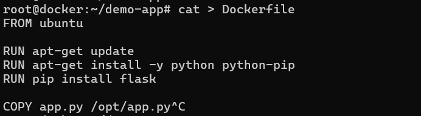
    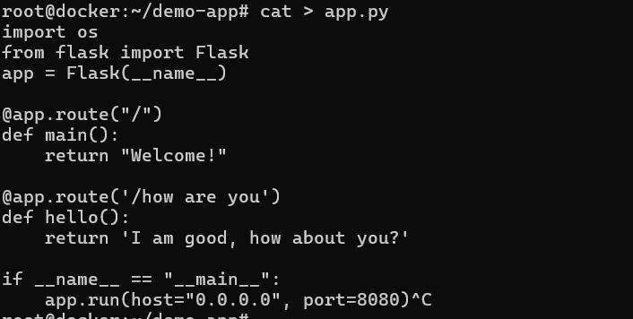
    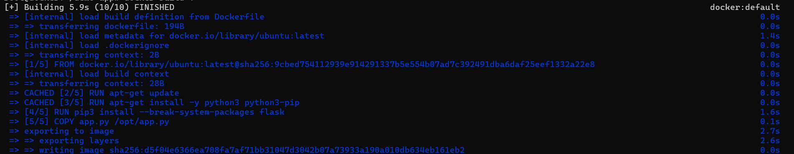
    
    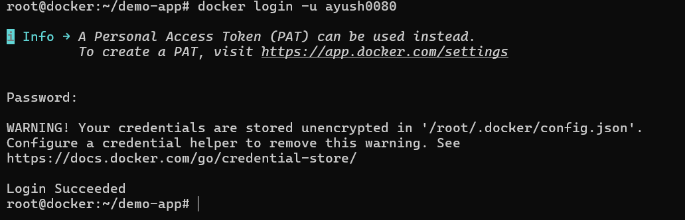
    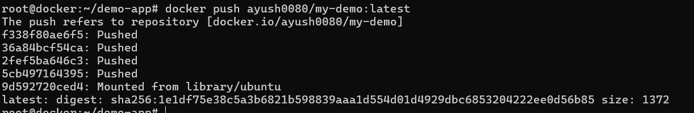
    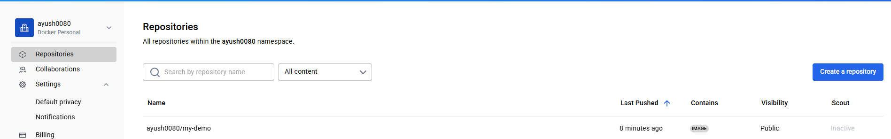


## ENTRYPOINT

  | Concept        | Purpose                                       | Example                  |
  | -------------- | --------------------------------------------- | ------------------------ |
  | **ENTRYPOINT** | Defines **the main, always-executed process** | `ENTRYPOINT ["python3"]` |
  | **CMD**        | Defines **default arguments** for ENTRYPOINT  | `CMD ["app.py"]`         |


```bash
FROM python:3.9
WORKDIR /app
COPY app.py .
ENTRYPOINT ["python3"]
CMD ["app.py"]
```

- when we run 

```bash
docker run myapp

```
- It executes:
```bash
python3 app.py

```
### Docker Compose :
 - Docker Compose is a tool that simplifies the process of defining and running multi-container Docker applications. It allows you to use a single YAML file (docker-compose.yml) to configure and manage all the services, networks, and volumes that make up your application.
   - Instead of running separate, long docker run commands for each container, Docker Compose lets you launch your entire application stack with a single command.

- links: used to allow containers to communicate with each other

 - installing docker-compose on VM : 
   [REF](https://docs.docker.com/compose/install/linux/)

   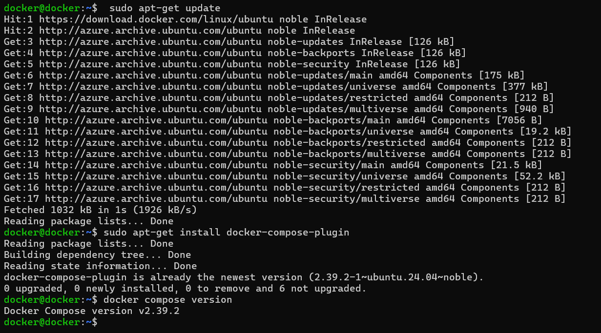

   - cloning repo [Git](https://github.com/dockersamples/example-voting-app)

     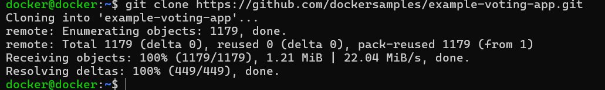
     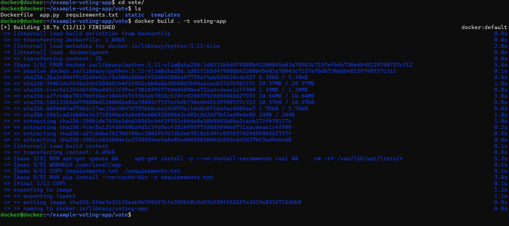
     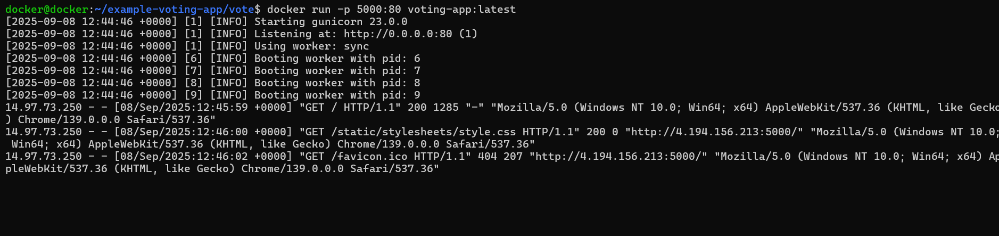
     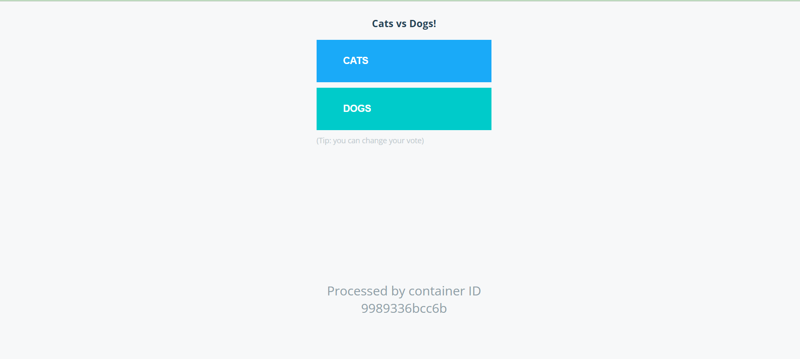
     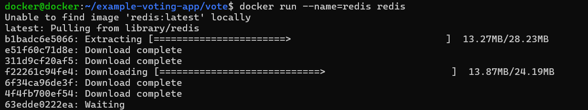
     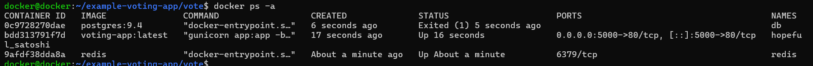
     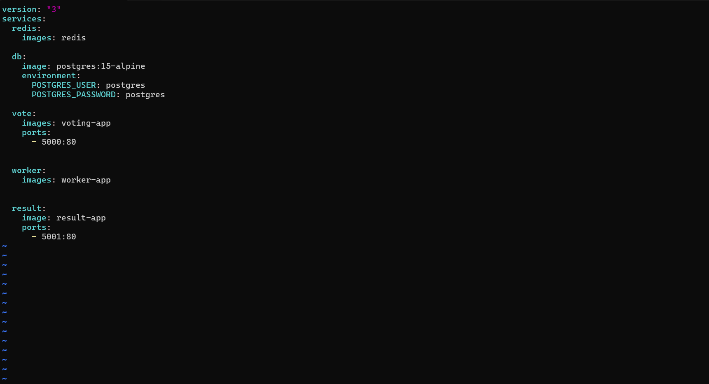

    


### Docker Engine,Storage and Networking


#####  Docker Engine Architecture
```bash
 +--------------------------------------+
|           Docker CLI/API             |
+--------------------+-----------------+
                     |
                     v
+--------------------------------------+
|         Docker Daemon (dockerd)      |
|   - Container management             |
|   - Image build/pull/push            |
|   - Networking, Volumes, etc.        |
+--------------------------------------+
                     |
                     v
+--------------------------------------+
|         Container Runtime (runc)     |
+--------------------------------------+
```

```bash
docker run --cpus=2 nginx # Restricts the container to 2 CPU cores maximum.
docker run -m 512m nginx # Restricts container to 512 MB RAM.


```

- by default docker stores data  in  /var/lib/docker
- create new volume in docker file system 
     ```bash
     docker volume create volumme_name
    ```
- mount the volume if we do not created volume1 than they automatically created 
    ```bash
     docker run -v volume1:/var/lib/mysql mysql
    ```
    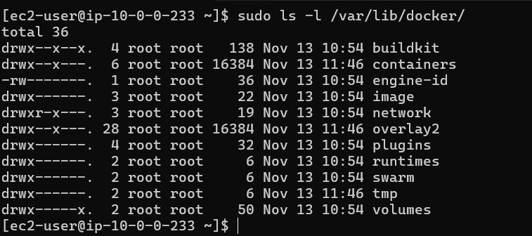   

    
- to show detailes about downloaded images 

```bash
  docker history <imageid>
```

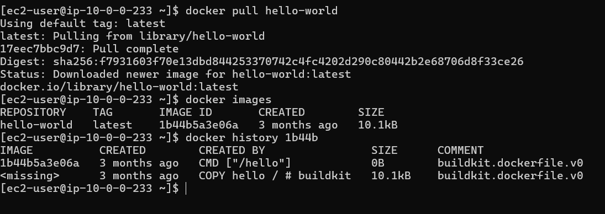


-  disk usgae of docker

```bash
  docker system df
  docker system df -v  # o particukle images and all

```
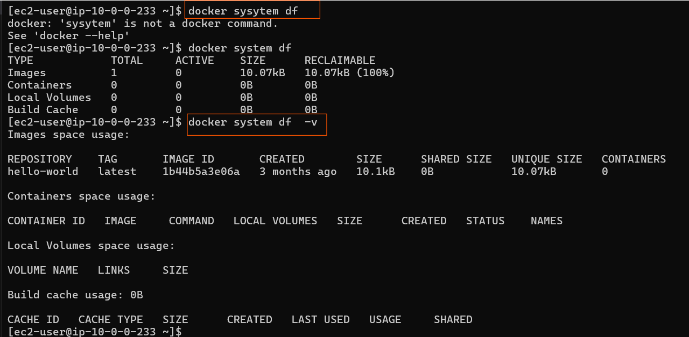
