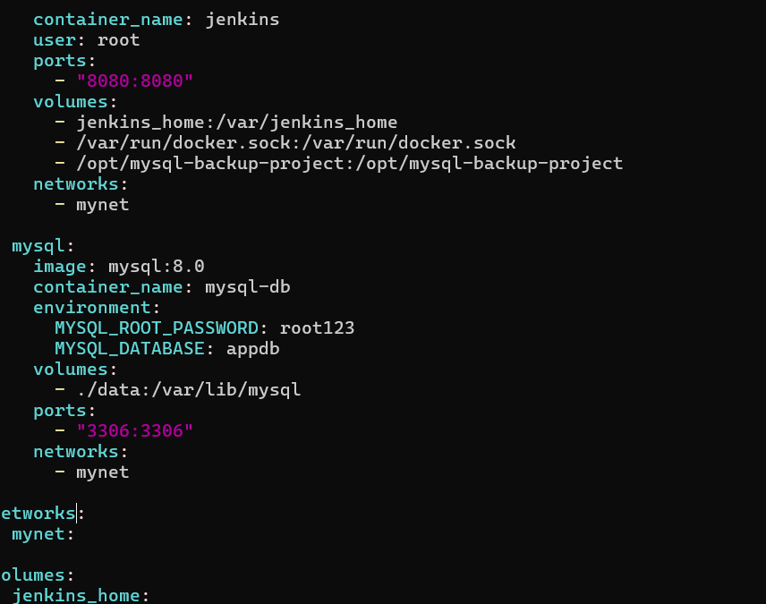
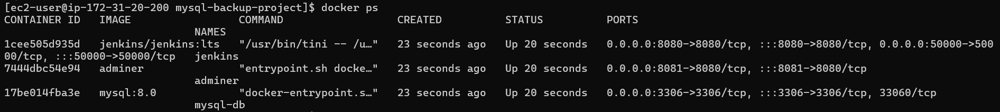
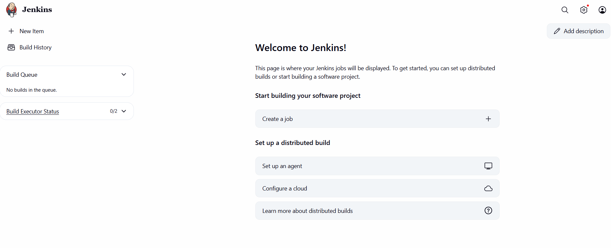
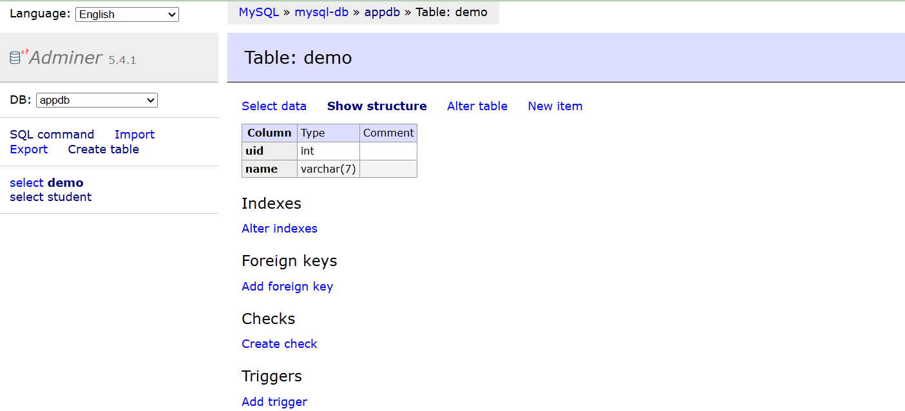
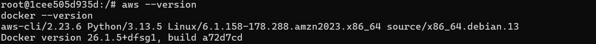
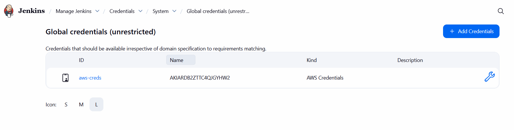
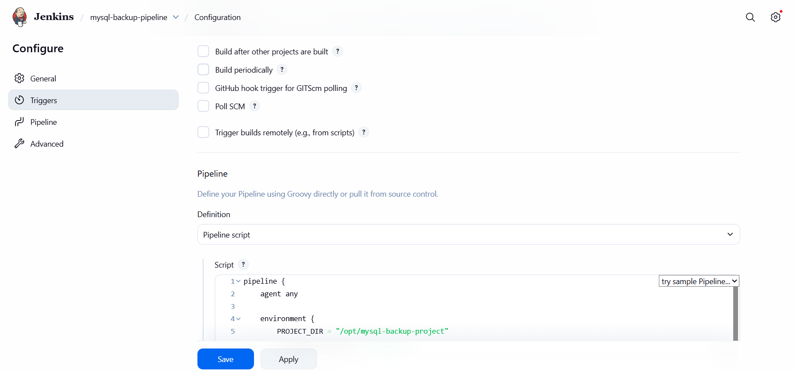
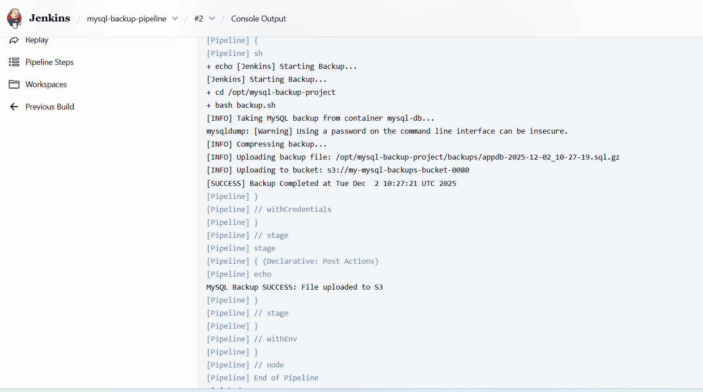
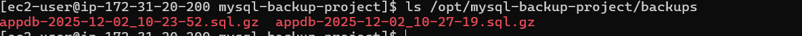
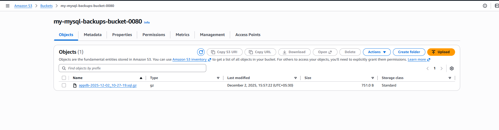

## Take my sql backup and upload into the s3 bucket using jenkins


#### Created Directory 
```bash
sudo mkdir -p /opt/mysql-backup-project
sudo chown -R $USER:$USER /opt/mysql-backup-project
cd /opt/mysql-backup-project
```

#### Creates docker-compose.yml (Jenkins + MySQL)
```bash
 /opt/mysql-backup-project/docker-compose.yml
```



#### Start Jenkins + MySQL
```bash
/opt/mysql-backup-project/docker compose up -d

docker ps
```



#### Initial Jenkins Setup (via Browser)

- http://<YOUR_VM_IP>:8080

- Jenkins asks for initial admin password. Get it:

- docker exec -it jenkins cat /var/jenkins_home/secrets/initialAdminPassword

- Paste into the browser → Continue.
- Click Install suggested plugins.
- Create admin user (username/password) → Finish.




#### STEP 5: Check MySQL Using Web (Adminer)
- Open Adminer:
```bash
http://<YOUR_VM_IP>:8081
```
- Login:
```bash
System: MySQL

Server: mysql-db

Username: root

Password: xyz

Database: appdb (optional)

```



#### Install AWS CLI & Docker CLI inside Jenkins Container

- Enter Jenkins container:
```bash
docker exec -it jenkins bash
```
- Inside the container:
```bash
apt-get update
apt-get install -y awscli docker.io
aws --version
docker --version
```

- Then exit:
```bash
exit
```



#### Create backup.sh Script

- On the host (but it’s mounted into Jenkins):
```bash
/opt/mysql-backup-project/vi backup.sh
```
#### Add AWS Credentials in Jenkins

- In Jenkins UI:

- Go to Manage Jenkins → Credentials → (Global)

- Click Add Credentials

    - Select:

    - Kind: AWS Credentials

    - ID: aws-creds

    - Access Key ID: your AWS key

    - Secret Access Key: your AWS secret

    - Region: (optional)

    - Click OK.



.

#### Create Pipeline Job 

- Jenkins → New Item

- Name: mysql-backup-pipeline

- Select Pipeline → OK

- Scroll to Pipeline section:

- Definition: Pipeline script

```bash
pipeline {
    agent any

    environment {
        PROJECT_DIR = "/opt/mysql-backup-project"
        AWS_DEFAULT_REGION = "ap-south-1"     // change if needed
    }

    stages {

        stage('Run MySQL Backup') {
            steps {
                withCredentials([[
                    $class: 'AmazonWebServicesCredentialsBinding',
                    credentialsId: 'aws-creds'
                ]]) {
                    sh '''
                        echo "[Jenkins] Starting MySQL Backup..."
                        cd $PROJECT_DIR
                        bash backup.sh
                    '''
                }
            }
        }
    }

    post {
        success {
            echo "MySQL Backup SUCCESS: Uploaded to S3"
        }
        failure {
            echo "MySQL Backup FAILED"
        }
    }
}

```
- Click Save.


#### Test the Pipeline

- Open your job: mysql-backup-pipeline

- Click Build Now

- Open the build → Console Output



- Check:
```bash
ls /opt/mysql-backup-project/backups → .sql.gz file present
```

- Your S3 bucket → backup file uploaded


