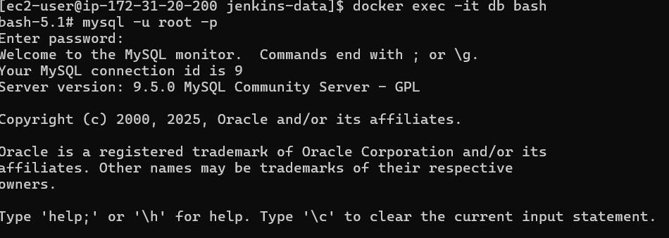
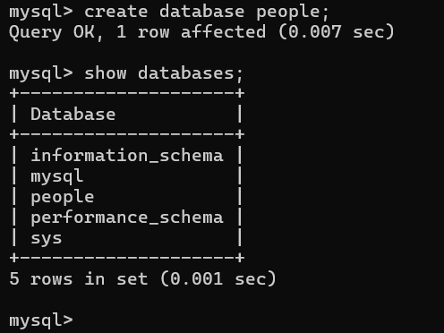
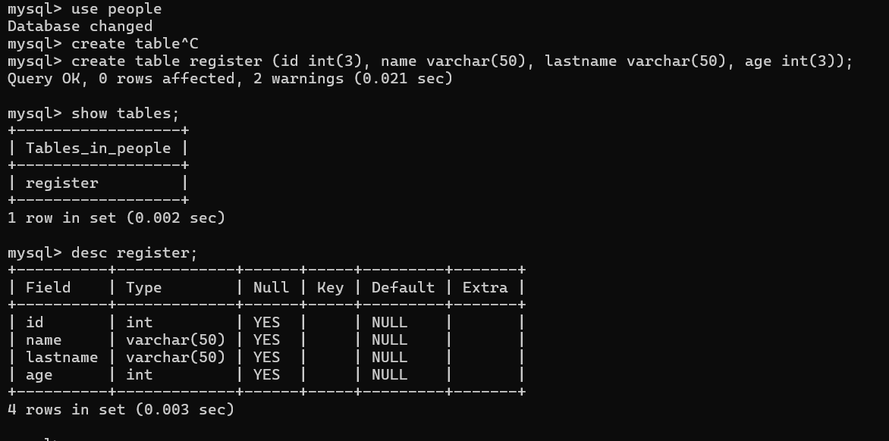
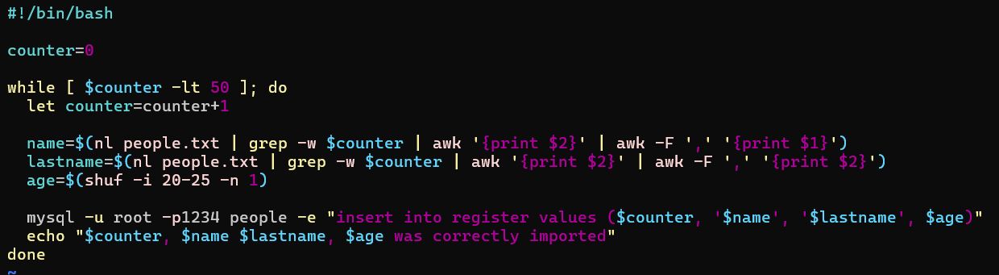
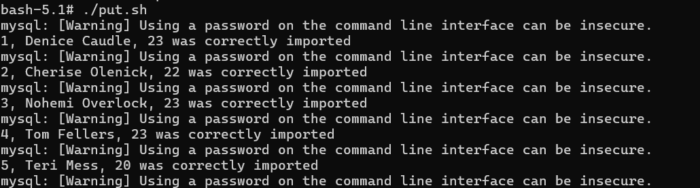
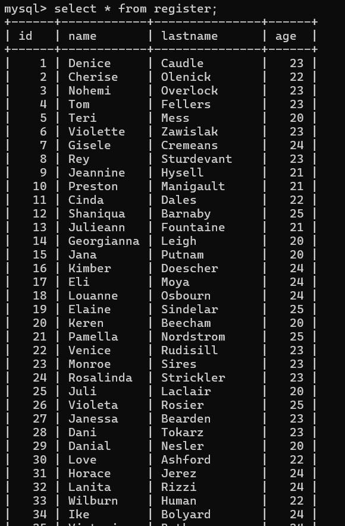
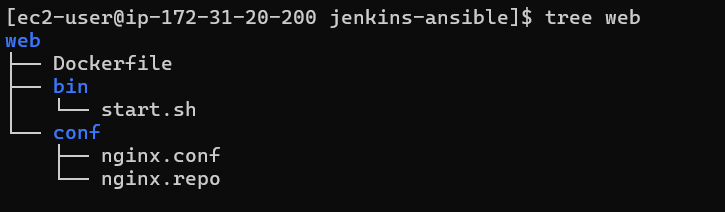
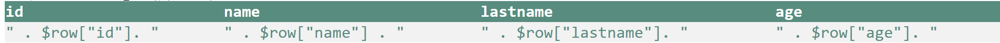

## jenkis-ansible-mysql
- We'll set up a Jenkins job that lets you select an age value.
- Using Docker, we'll create a MySQL database to store a list of people along with their ages.
- With Ansible, we'll dynamically generate a PHP file that displays only the people whose age matches the value chosen in Jenkins.


#### Create the DB that will hold all the users
- login into the mysql container
    ```bash
    docker exec -it db bash
    mysql -u root -p
    ```
  
- created db 
    ```bash
    create database people;
    show databases;
    ```
  

- created table on created db (db name =  people)
  ```bash
    use people;
    create table register (id int(3), name varchar(50), lastname varchar(50), age int(3));
    show tables;
    desc register;
  ```  
  

####  Create a Bash Script  for insert data into the DB

  

- login into the db container  and run script to insert data into register table in to people db (put.sh and people.txt)
  ```bash
  docker exec -it db bash
  ./put.sh
  ``` 
   
-  verify data

    ```bash
    mysql -u root -p
    use people;
    select * from register;
    ```
    


####  building a Docker Nginx Web Server + PHP 




#### Build a table using HTML, CSS and PHP to display users

```bash
table.j2
```

#### Integrate your Docker Web Server to the Ansible Inventory
```bash
hosts.txt
```
#### Create a Playbook in Ansible to update your web table
```bash
people.yml
```

#### test playbook
- goin into the jenkins container and run ansible playbook


