## Jenkins + Ansible

#### Created Dockerfile using jenkins as base image 
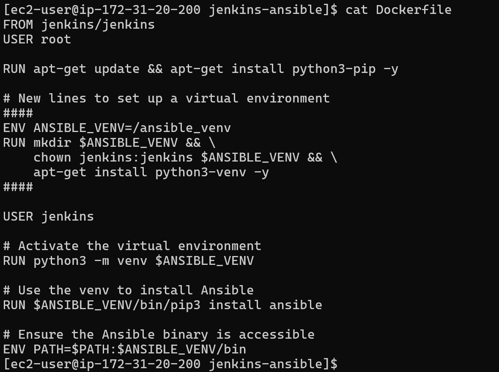
-  Created docker-compose file 
   - in side that jenkins we installed ansible

  


#### Make the ssh keys permanent on the Jenkins container
- when ansible need to ssh into the host that time need key to authenticat 
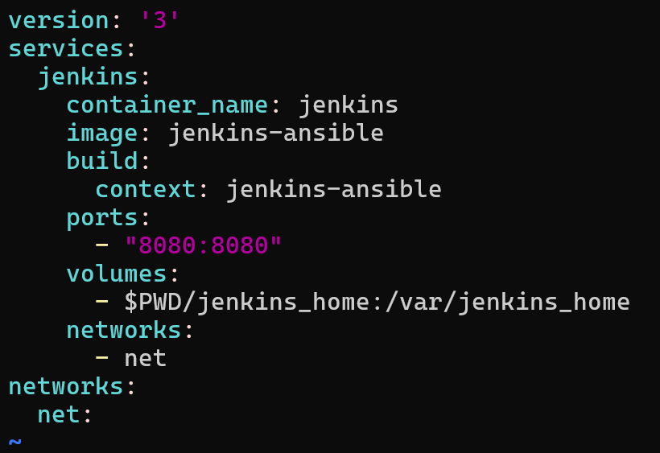

- created key-pair
    ```bash
    ssh-keygen -f ansible
    ```
  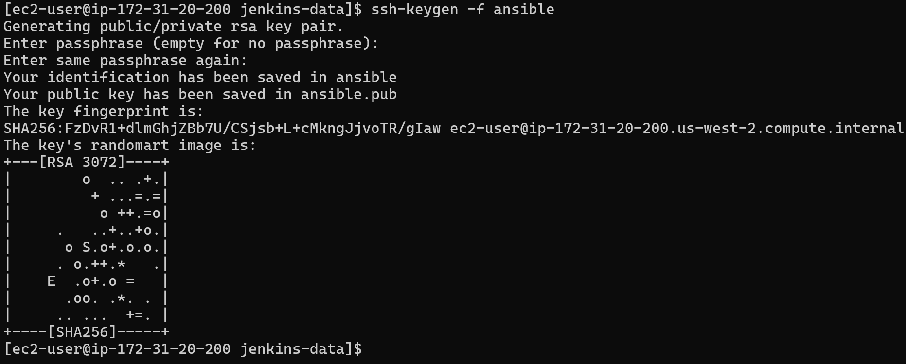 
  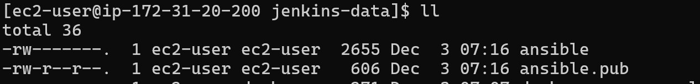

- we copy privat key into ``jenkins_home/ansible/`` folder as we mounted this folder into local volume with  jenkins conatiner 
  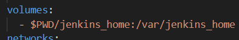
  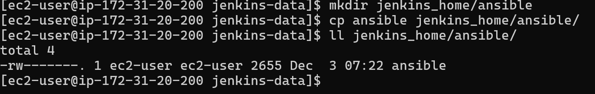

#### Created Ansible Inventory  
  - created this inventory file in ``jenkins_home/ansible/`` folder as we mounted this folder into local volumewith  jenkins conatiner 
  
#### login into jenkins container 
  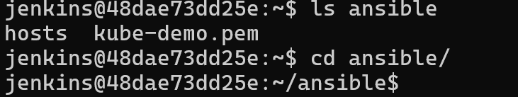

#### try to ping into my ec2
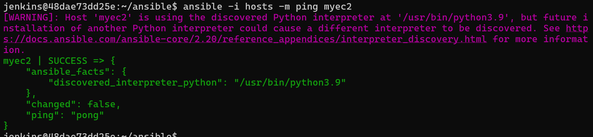
  
#### Create your first Ansible Playbook  
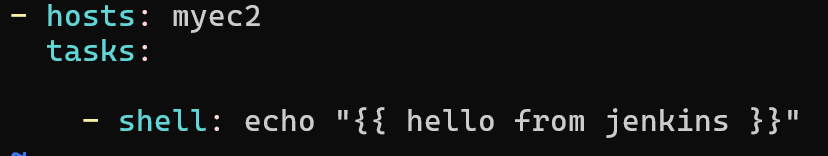

- test the playbook
  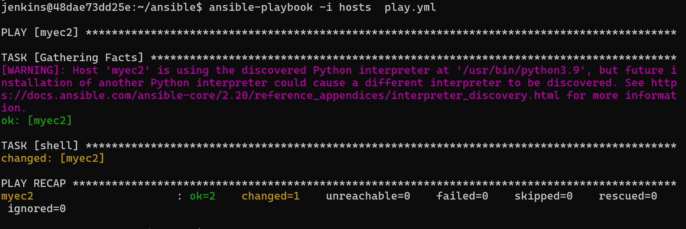
  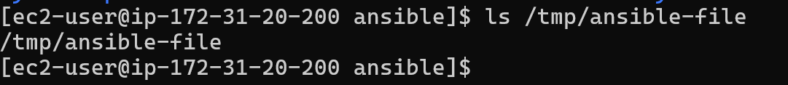
  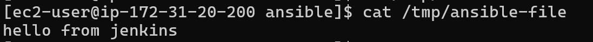


## Integrate Ansible and Jenkins and run playbook using jenkins

- install ansible plugin 

- test ansible using jenkins
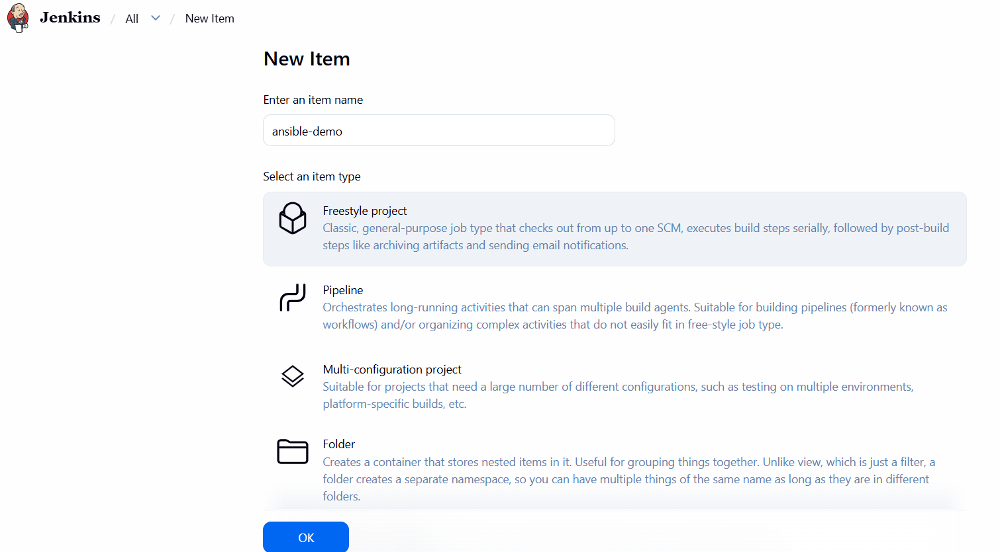
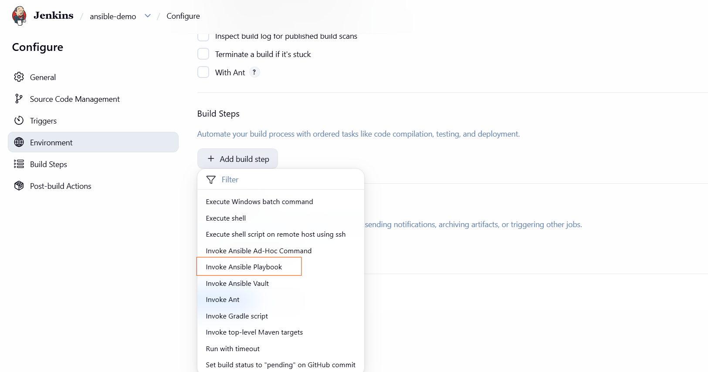

- give path of playbook and inventory file as where jenkins is running
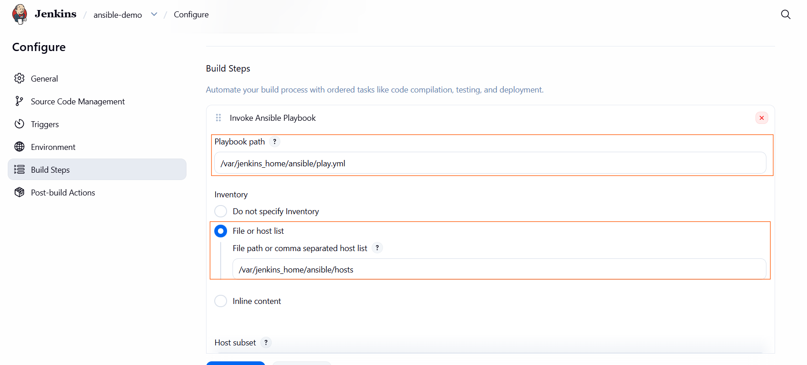
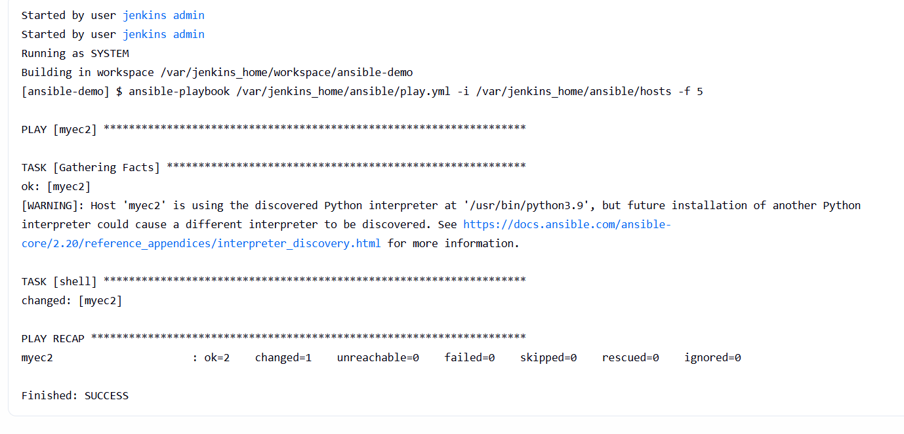


 
