## Jenkins pipeline

- go to the jenkins home page selcer new item
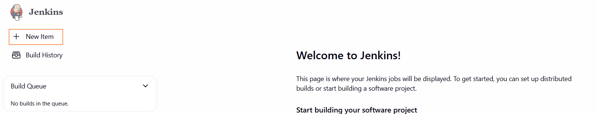

- give name of pipeline an Select an item type as pipeline
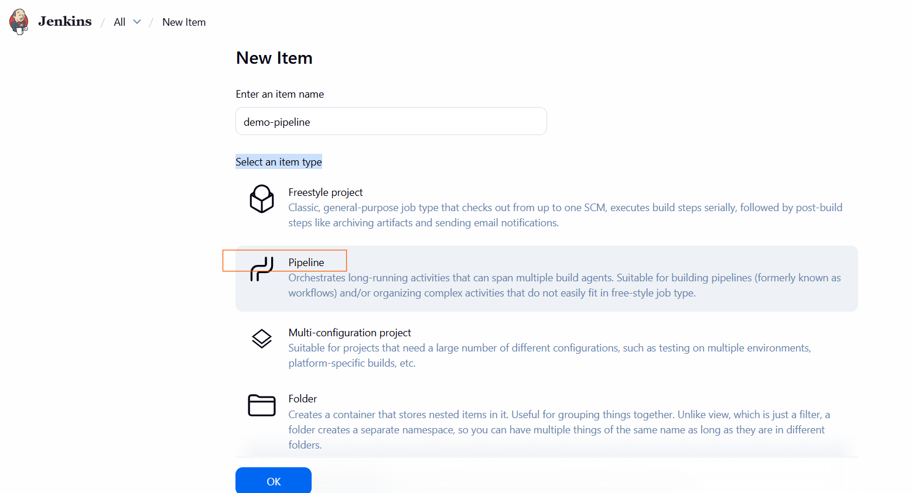


- in Configure section select pipeline
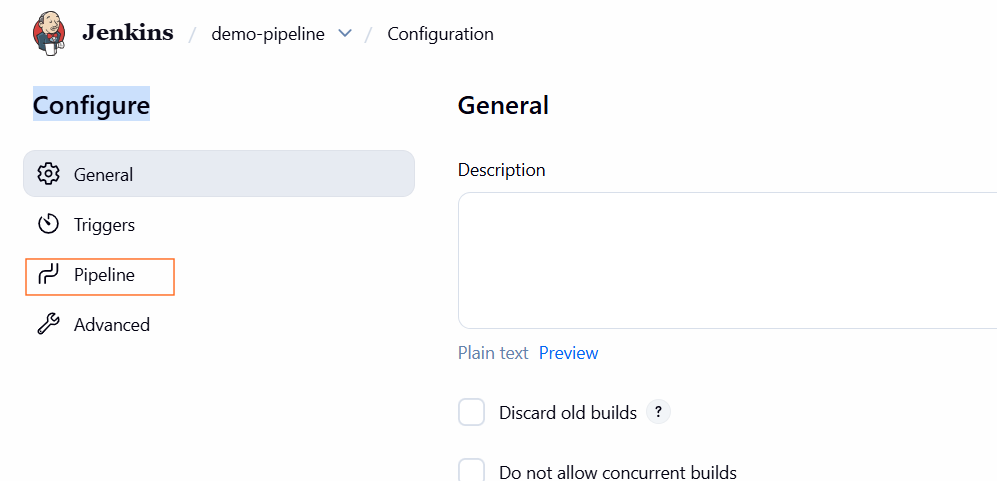

- now created one demo pipeline script that's create directory and file and also append content of echo command output and save 

    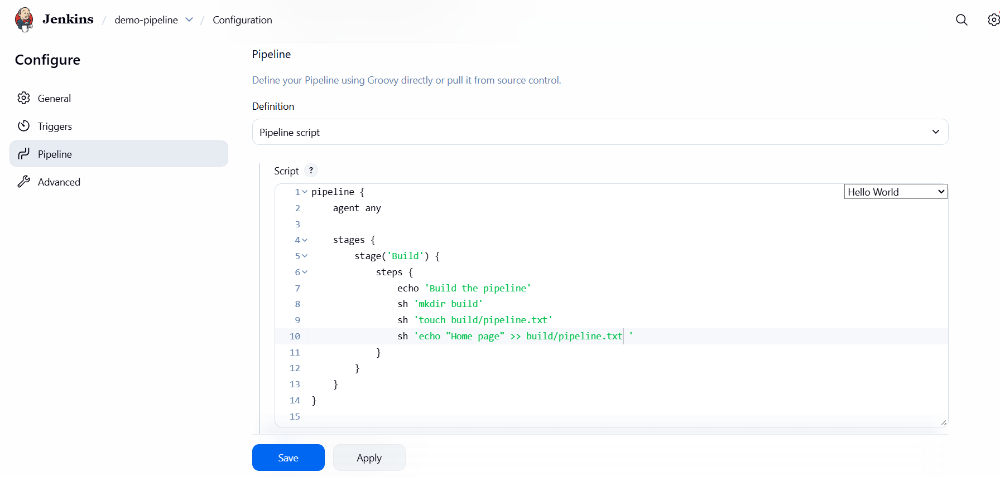


- bulid the peipeline

    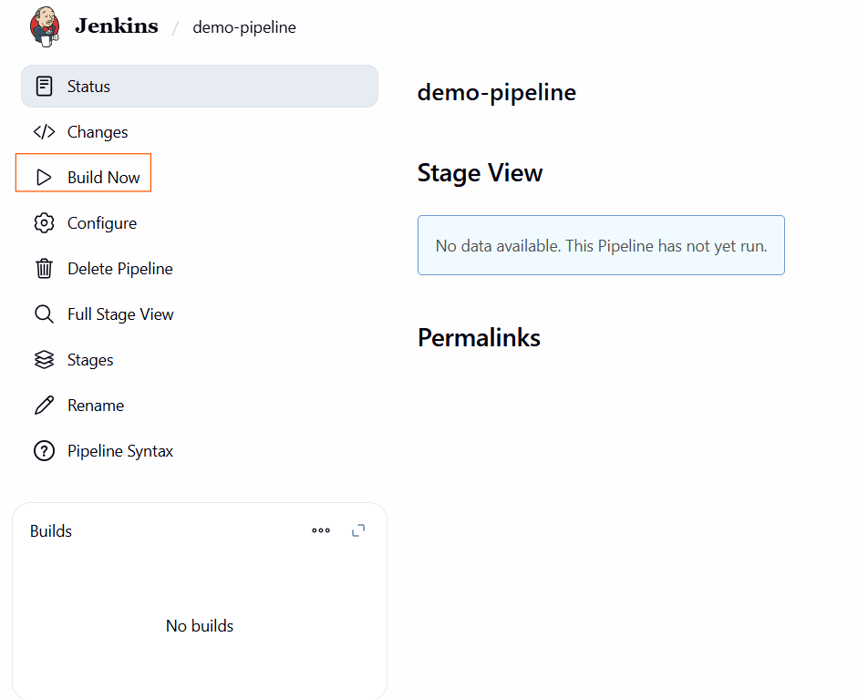
    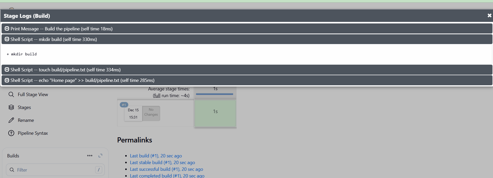  


### Jenkins workspace

- Jenkins workspace is the file system location where Jenkins executes a job and keeps all files related to that job.

- Clean before build

```bash
cleanWs()

```
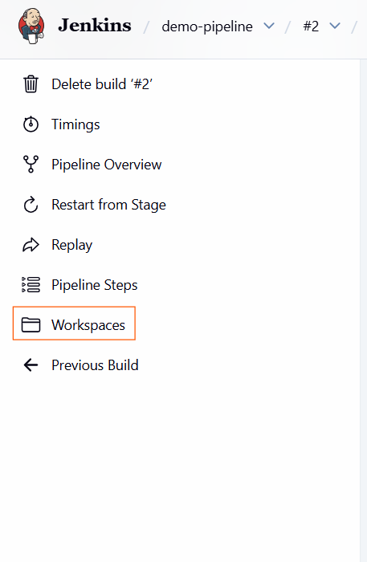
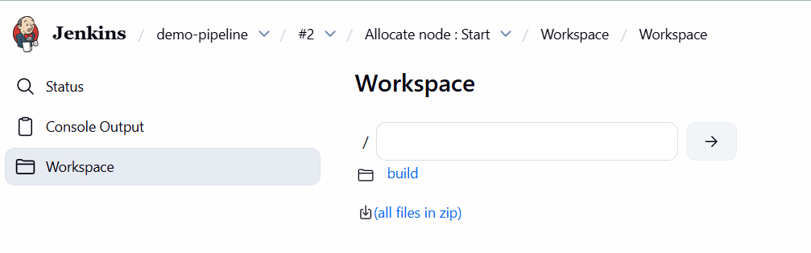
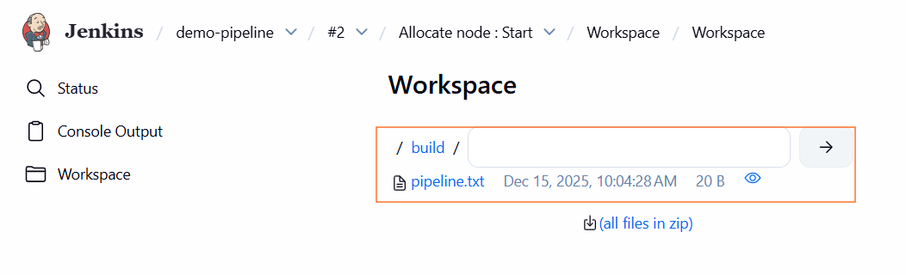


### Build Artifacts
-  Build artifacts are the output files produced by a Jenkins build that you want to save, share, or deploy later.


- this file firstly clear workspace and store newly created Build Artifacts 
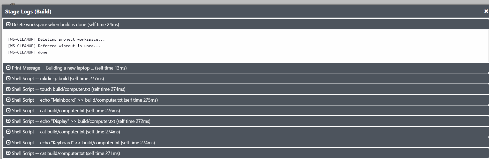


### Combining multiple shell steps (sh) into one
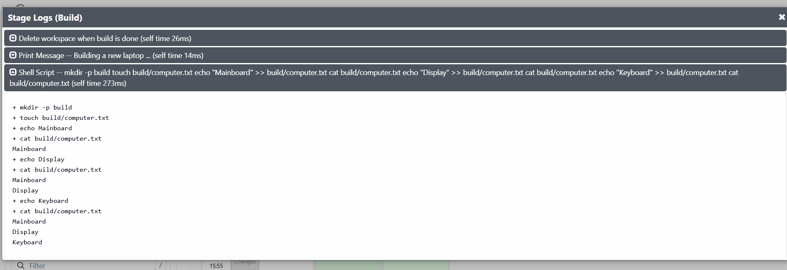

