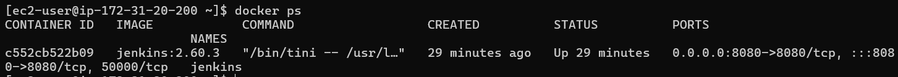
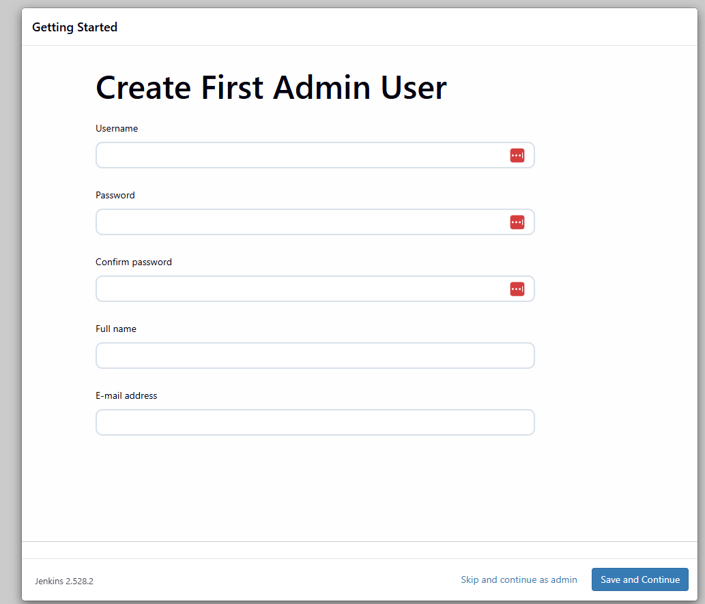
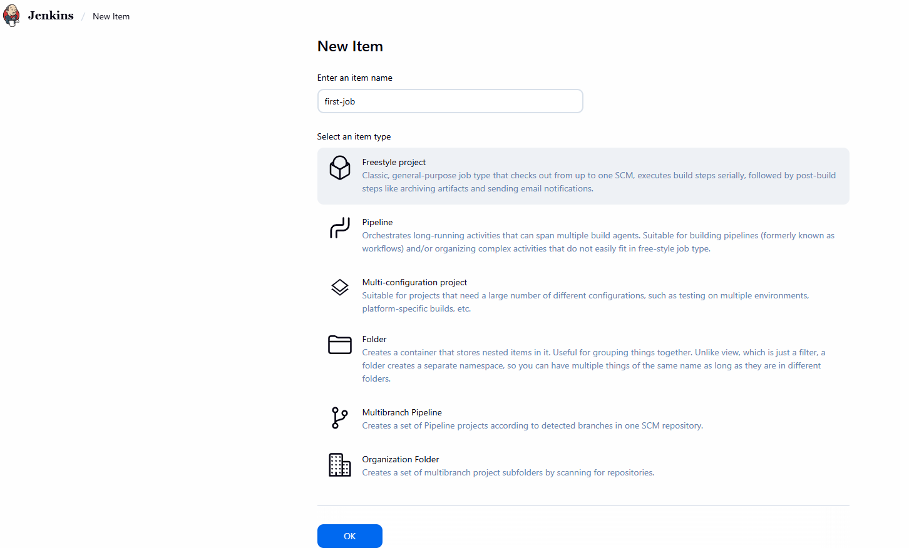
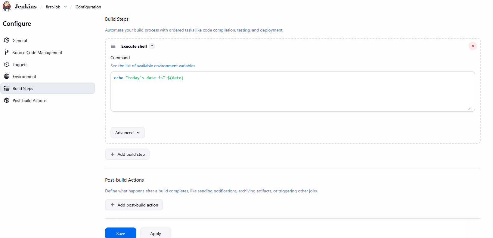
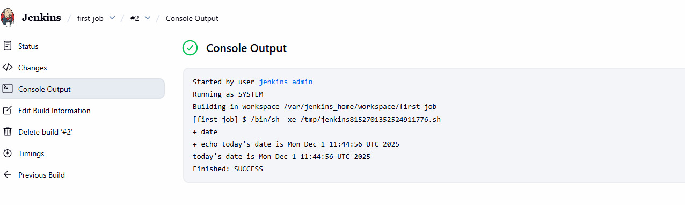
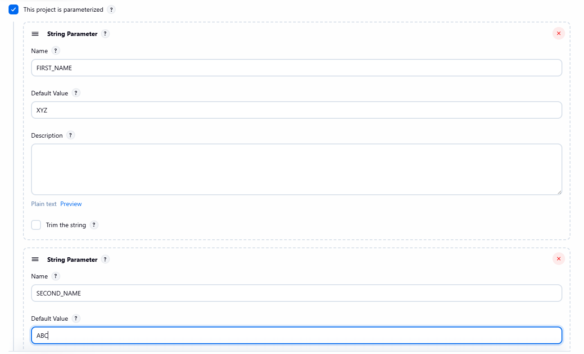
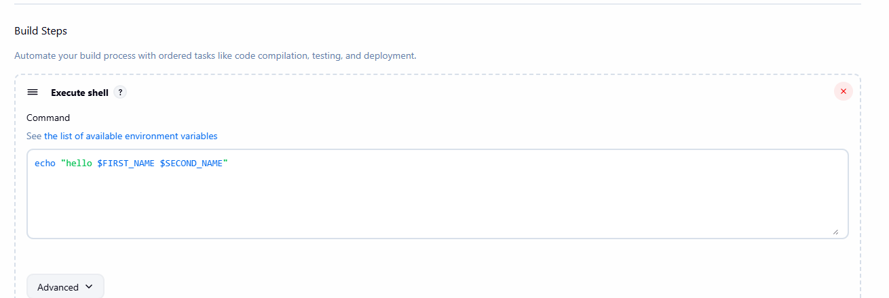
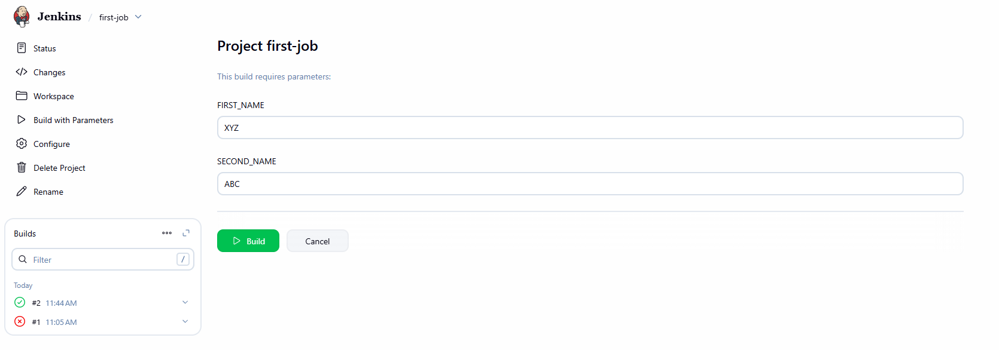
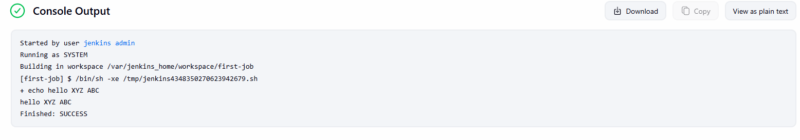

## installation


- created docker compose file and deployed
  

- to check login password 
  ```bash
  docker logs -f c552cb522b09 (# container id)
  # or
  docker exec -it jenkins cat /var/jenkins_home/secrets/initialAdminPassword


  ```  
    


## Created job





## Add parameters in job






