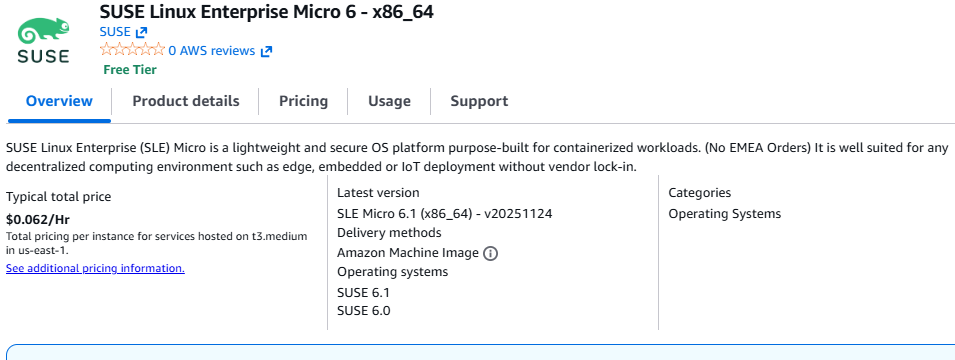
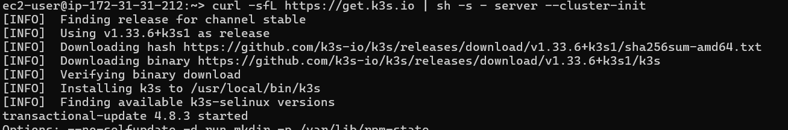
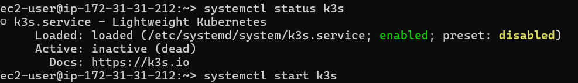
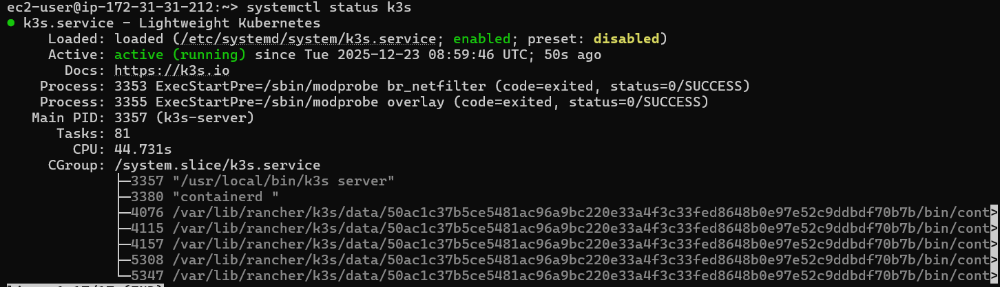
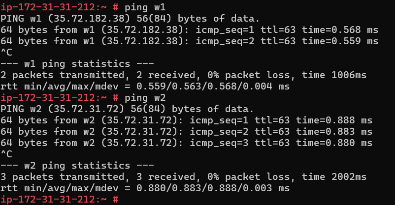
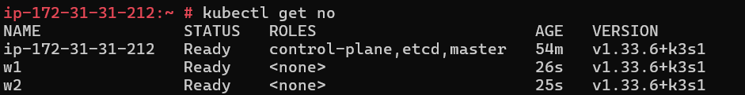

## Setup k3s


#### Setup Master Node

- created ec2 insatnce using ``suse-sle-micro-6-1-v20251124-hvm-ssd-x86_64-llc-prod-u7il6suomorsm`` AMI 

  


- installed k3s using script in ec2 [REF](https://docs.k3s.io/quick-start)

    ```bash
    curl -sfL https://get.k3s.io | sh -s - server --cluster-init 

    sudo systemctl status k3s
    sudo systemctl start k3s

    ```
  
  
  


#### Setup Cluster 

- set the hostname of all three nodes
    ```bash
    bashhostnamectl set-hostname m # master node
    hostnamectl set-hostname w2 # worker node 1
    hostnamectl set-hostname w2 # worker node 2

    ```

- set up the host file to have the name and IP address enteredin there so that we don't have to set up any dns records so that if we want to ping or reference Mater
 or worker one or worker two, we don't need a dns server or dns record for any of that.
- add on all 3 nodes

    ```bash
    vi /etc/hosts
    # k3s
    ip m
    ip w1
    ip w2
    # at bottom of file
    ```

    

- join worke nodes to the cluster  using shared secret

```bash
# K3S_TOKEN = in master node cat /var/lib/rancher/k3s/server/token
curl -sfL https://get.k3s.io |K3S_TOKEN=SECRET sh -s - agent --server https://<ip or hostname of server>:6443

curl -sfL https://get.k3s.io |K3S_TOKEN=SECRET sh -s - agent --server https://m:6443

systemctl start k3s-agent

```





- installed helm

```bash
transactional-update pkg install helm
```