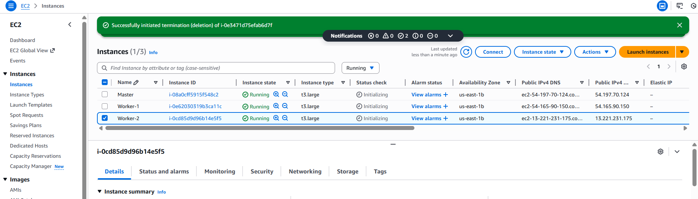
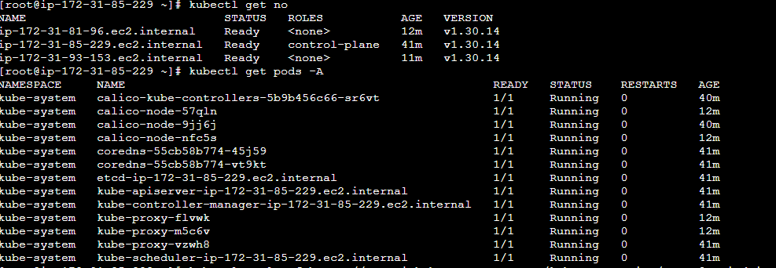
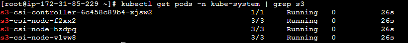

### Kubernetes Multi-Node Cluster on AWS using kubeadm with Full-Stack App 


- created 3 ec2 instances 


-  Pre-req on All Nodes
```bash
sudo su -
dnf update -y
dnf install -y curl wget git

# Install containerd
dnf install -y containerd
mkdir -p /etc/containerd
containerd config default > /etc/containerd/config.toml
# Edit config:
vi /etc/containerd/config.toml
# Find this line:
# SystemdCgroup = false
# Change to:
SystemdCgroup = true
#Restart containerd:

systemctl restart containerd
systemctl enable containerd

#Enable iptables & bridge
cat <<EOF | tee /etc/modules-load.d/k8s.conf
overlay
br_netfilter
EOF

modprobe overlay
modprobe br_netfilter

cat <<EOF | tee /etc/sysctl.d/k8s.conf
net.bridge.bridge-nf-call-iptables = 1
net.ipv4.ip_forward = 1
EOF

sysctl --system

# Install Kubernetes (kubeadm + kubelet + kubectl)
cat <<EOF | tee /etc/yum.repos.d/kubernetes.repo
[kubernetes]
name=Kubernetes
baseurl=https://pkgs.k8s.io/core:/stable:/v1.30/rpm/
enabled=1
gpgcheck=1
gpgkey=https://pkgs.k8s.io/core:/stable:/v1.30/rpm/repodata/repomd.xml.key
EOF


# Install:

dnf install -y kubeadm kubelet kubectl
systemctl enable kubelet

# Disable Swap
swapoff -a

# Initialize Kubernetes Master (Control Plane)

# Run this only on master:

kubeadm init --pod-network-cidr=192.168.0.0/16


# After init completes:

mkdir -p $HOME/.kube
cp -i /etc/kubernetes/admin.conf $HOME/.kube/config
chown $(id -u):$(id -g) $HOME/.kube/config

# Install CNI (Calico)
kubectl apply -f https://docs.projectcalico.org/v3.25/manifests/calico.yaml

# Join Worker Nodes

# Copy join command from master output:

kubeadm join <MASTER-IP>:6443 --token <token> --discovery-token-ca-cert-hash sha256:<hash>

kubectl get nodes
```




- Attach Database Storage to S3 Bucket

    - This mounts S3 as a filesystem inside pods.

    Install driver:
    ```bash
    kubectl apply -f https://raw.githubusercontent.com/kubernetes-sigs/aws-s3-csi-driver/master/deploy/mani
    ```

    


- Mount EBS on the worker node (do this on the worker where you want DB data)

Assume EBS block device is /dev/xvdf. Run on the worker node (not master):

- format only if the disk is brand new
```bash
sudo mkfs.ext4 /dev/xvdf || true

sudo mkdir -p /mnt/ebs-mongo
sudo mount /dev/xvdf /mnt/ebs-mongo
```
- make persistent across reboots
```bash
echo "/dev/xvdf /mnt/ebs-mongo ext4 defaults,nofail 0 2" | sudo tee -a /etc/fstab
```
- ensure permissions for container runtime (optional: restrict as needed)
```bash
sudo chown -R 1000:1000 /mnt/ebs-mongo
```

Note: chown 1000:1000 sets owner to uid 1000 (common non-root DB user). Adjust as needed.

- Label that node so Kubernetes can bind PV and schedule the DB there

- Run from any machine with kubeconfig (master):

- Find the node name that corresponds to the worker where EBS is mounted
kubectl get nodes -o wide

- label that node (replace <worker-node-name> with the node name)
kubectl label node <worker-node-name> db-node=true

- Apply Kubernetes manifests

Create a file mongo-ebs-setup.yaml with all the resources below and kubectl apply -f mongo-ebs-setup.yaml.
```bash
# ----------------------------
# PersistentVolume bound to hostPath (EBS mount)
# restricted to nodes with label db-node=true
# ----------------------------
apiVersion: v1
kind: PersistentVolume
metadata:
  name: mongo-ebs-pv
spec:
  capacity:
    storage: 20Gi
  accessModes:
    - ReadWriteOnce
  persistentVolumeReclaimPolicy: Retain
  storageClassName: manual
  hostPath:
    path: "/mnt/ebs-mongo"
    type: DirectoryOrCreate
  nodeAffinity:
    required:
      nodeSelectorTerms:
      - matchExpressions:
        - key: db-node
          operator: In
          values:
          - "true"
---
# ----------------------------
# PersistentVolumeClaim
# ----------------------------
apiVersion: v1
kind: PersistentVolumeClaim
metadata:
  name: mongo-pvc
spec:
  accessModes:
    - ReadWriteOnce
  storageClassName: manual
  resources:
    requests:
      storage: 20Gi
---
# ----------------------------
# MongoDB Deployment (runs ON the labelled node)
# ----------------------------
apiVersion: apps/v1
kind: Deployment
metadata:
  name: mongodb
spec:
  replicas: 1
  selector:
    matchLabels:
      app: mongodb
  template:
    metadata:
      labels:
        app: mongodb
    spec:
      nodeSelector:
        db-node: "true"    # ensures pod lands on the EBS node
      containers:
      - name: mongodb
        image: mongo:6.0
        ports:
        - containerPort: 27017
        env:
        - name: MONGO_INITDB_ROOT_USERNAME
          value: root
        - name: MONGO_INITDB_ROOT_PASSWORD
          value: 
        volumeMounts:
        - name: mongo-data
          mountPath: /data/db
      volumes:
      - name: mongo-data
        persistentVolumeClaim:
          claimName: mongo-pvc
---
# ----------------------------
# Headless Service for MongoDB (internal DNS)
# ----------------------------
apiVersion: v1
kind: Service
metadata:
  name: mongo-service
spec:
  selector:
    app: mongodb
  ports:
  - port: 27017
    targetPort: 27017
  clusterIP: None
---
# ----------------------------
# mongo-express Deployment (web UI) + Service (NodePort)
# ----------------------------
apiVersion: apps/v1
kind: Deployment
metadata:
  name: mongo-express
spec:
  replicas: 1
  selector:
    matchLabels:
      app: mongo-express
  template:
    metadata:
      labels:
        app: mongo-express
    spec:
      containers:
      - name: mongo-express
        image: mongo-express:1.0.0
        ports:
        - containerPort: 8081
        env:
        - name: ME_CONFIG_MONGODB_ADMINUSERNAME
          value: root
        - name: ME_CONFIG_MONGODB_ADMINPASSWORD
          value: rootpassword
        - name: ME_CONFIG_MONGODB_SERVER
          value: mongo-service
---
apiVersion: v1
kind: Service
metadata:
  name: mongo-express-svc
spec:
  type: NodePort
  selector:
    app: mongo-express
  ports:
  - port: 8081
    targetPort: 8081
    nodePort: 30081

```
- Apply it:
```bash
kubectl apply -f mongo-ebs-setup.yaml
```

- Access the web UI (mongo-express) from outside
  