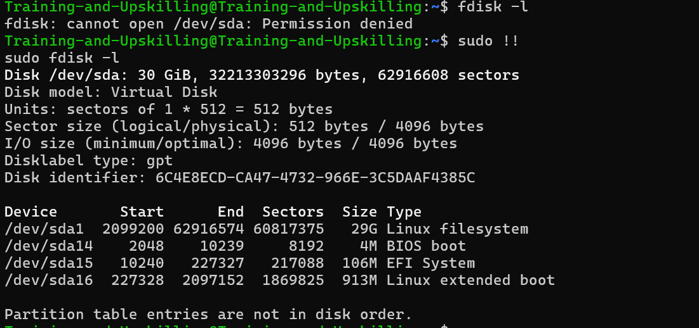
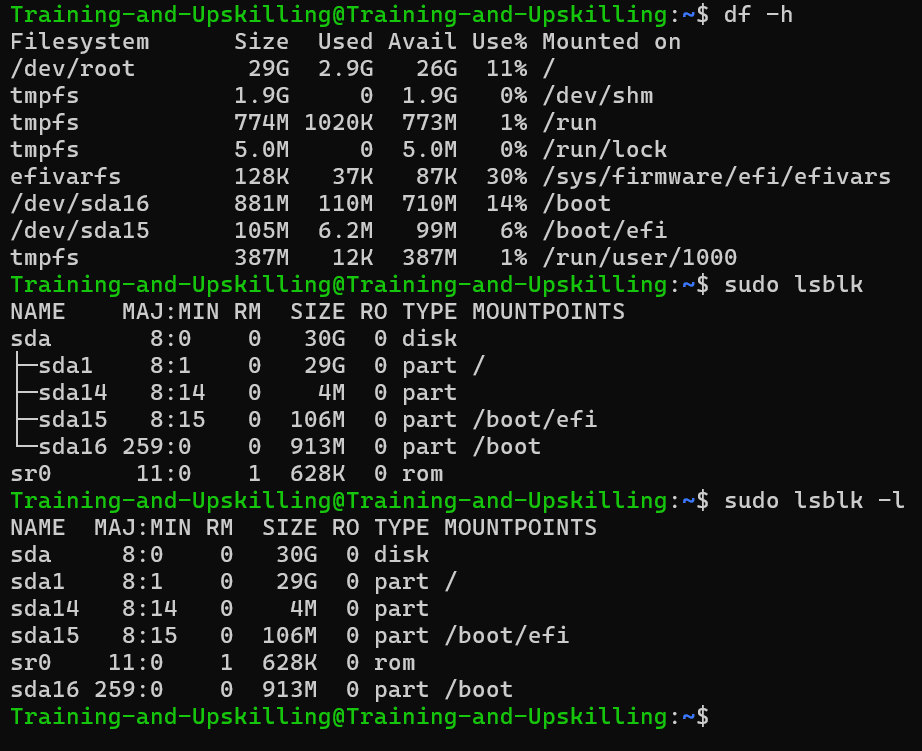
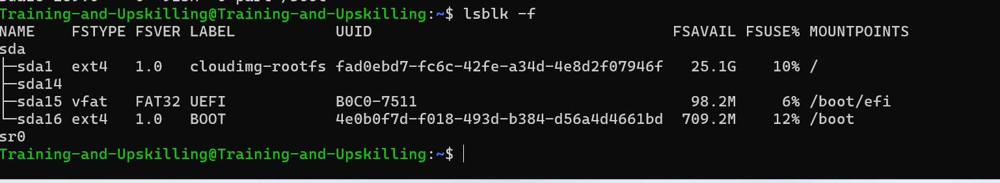

### partitions

- Disk can be divided into parts, called partiitons.
     - partitions allow you to seprate data.
     - partitions schemes
        - 1.os, 2.Application, 3.user, 4.swap
        - 1.os 2. user home directories

##### GPT
- GPT stands for GUID Partition Table.

  - It’s a modern partitioning scheme used to define how data is organized on a storage device such as a hard disk (HDD) or SSD.  
  - To keep track of where each partition starts and ends, Linux uses a partition table. 

  - GUID → Globally Unique Identifier  

| Feature                    | **MBR**                   | **GPT**                                  |
| -------------------------- | ------------------------- | ---------------------------------------- |
| **Max partitions**         | 4 primary partitions      | Up to 128 partitions (default in Linux)  |
| **Max disk size**          | 2 TB                      | Practically unlimited (up to 9.4 ZB)     |
| **Partition info storage** | Stored in first 512 bytes | Stored in multiple locations (redundant) |
| **Boot method**            | BIOS                      | UEFI                                     |
| **Backup partition table** | None                      | Yes (backup GPT at end of disk)          |
| **Identifier type**        | 32-bit                    | 128-bit GUIDs (globally unique)          |
   

##### mount point
- A mount point is a directory in Linux where you make a storage device (like a hard disk, partition, USB drive, or CD-ROM) accessible.   

