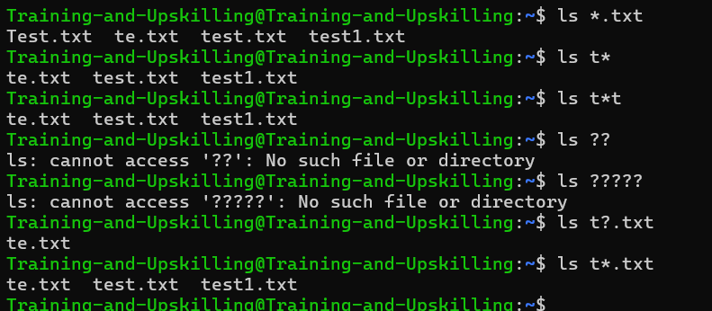

### Wildcards

- Wildcards are special characters used in Linux to match patterns in filenames and directories.  
- They are most commonly used with commands like `ls`, `cp`, `mv`, `rm`, and `find`.

| Wildcard | Meaning | Example | Description |
|-----------|----------|----------|--------------|
| `*` | Matches **zero or more characters** | `ls *.txt` | Lists all files ending with `.txt` |
| `?` | Matches **exactly one character** | `ls file?.txt` | Matches `file1.txt`, `fileA.txt`, but not `file10.txt` |
| `[ ]` | Matches **any one character** inside the brackets | `ls file[123].txt` | Matches `file1.txt`, `file2.txt`, or `file3.txt` |
| `[! ]` or `[^ ]` | Matches **any character except** those inside brackets | `ls file[!1].txt` | Matches all files except `file1.txt` |
| `{ }` | Matches **a comma-separated list** of strings | `cp {file1,file2}.txt /backup` | Copies both `file1.txt` and `file2.txt` to `/backup` |
| `~` | Refers to the **current user’s home directory** | `cd ~` | Takes you to your home directory |
| `\` | **Escapes** special characters | `ls file\*` | Treats `*` as a normal character instead of a wildcard |

#### Named Character Classes 

| Character Class | Matches | Example | Description |
|-----------------|----------|----------|--------------|
| `[:alnum:]` | All letters and digits | `[[:alnum:]]` | Matches A–Z, a–z, 0–9 |
| `[:alpha:]` | Alphabetic characters | `[[:alpha:]]` | Matches A–Z, a–z |
| `[:digit:]` | Numbers | `[[:digit:]]` | Matches 0–9 |
| `[:lower:]` | Lowercase letters | `[[:lower:]]` | Matches a–z |
| `[:upper:]` | Uppercase letters | `[[:upper:]]` | Matches A–Z |
| `[:space:]` | Whitespace (space, tab, newline) | `[[:space:]]` | Matches spaces and tabs |
| `[:blank:]` | Space and tab only | `[[:blank:]]` | Matches only space and tab characters |
| `[:punct:]` | Punctuation marks | `[[:punct:]]` | Matches symbols like `! ? , . ; :` |
| `[:print:]` | Printable characters | `[[:print:]]` | Matches any visible character (including spaces) |
| `[:graph:]` | Printable characters (excluding space) | `[[:graph:]]` | Matches visible characters except spaces |
| `[:cntrl:]` | Control characters | `[[:cntrl:]]` | Matches non-printable control characters (like newline, tab) |
| `[:xdigit:]` | Hexadecimal digits | `[[:xdigit:]]` | Matches 0–9, A–F, a–f |

 

