### Wildcards

- Wildcards are special characters used in Linux to match patterns in filenames and directories.  
- They are most commonly used with commands like `ls`, `cp`, `mv`, `rm`, and `find`.

| Wildcard | Meaning | Example | Description |
|-----------|----------|----------|--------------|
| `*` | Matches **zero or more characters** | `ls *.txt` | Lists all files ending with `.txt` |
| `?` | Matches **exactly one character** | `ls file?.txt` | Matches `file1.txt`, `fileA.txt`, but not `file10.txt` |
| `[ ]` | Matches **any one character** inside the brackets | `ls file[123].txt` | Matches `file1.txt`, `file2.txt`, or `file3.txt` |
| `[! ]` or `[^ ]` | Matches **any character except** those inside brackets | `ls file[!1].txt` | Matches all files except `file1.txt` |
| `{ }` | Matches **a comma-separated list** of strings | `cp {file1,file2}.txt /backup` | Copies both `file1.txt` and `file2.txt` to `/backup` |
| `~` | Refers to the **current user’s home directory** | `cd ~` | Takes you to your home directory |
| `\` | **Escapes** special characters | `ls file\*` | Treats `*` as a normal character instead of a wildcard |


#### Named Character Classes 

| Character Class | Matches | Example | Description |
|-----------------|----------|----------|--------------|
| `[:alnum:]` | All letters and digits | `[[:alnum:]]` | Matches A–Z, a–z, 0–9 |
| `[:alpha:]` | Alphabetic characters | `[[:alpha:]]` | Matches A–Z, a–z |
| `[:digit:]` | Numbers | `[[:digit:]]` | Matches 0–9 |
| `[:lower:]` | Lowercase letters | `[[:lower:]]` | Matches a–z |
| `[:upper:]` | Uppercase letters | `[[:upper:]]` | Matches A–Z |
| `[:space:]` | Whitespace (space, tab, newline) | `[[:space:]]` | Matches spaces and tabs |
| `[:blank:]` | Space and tab only | `[[:blank:]]` | Matches only space and tab characters |
| `[:punct:]` | Punctuation marks | `[[:punct:]]` | Matches symbols like `! ? , . ; :` |
| `[:print:]` | Printable characters | `[[:print:]]` | Matches any visible character (including spaces) |
| `[:graph:]` | Printable characters (excluding space) | `[[:graph:]]` | Matches visible characters except spaces |
| `[:cntrl:]` | Control characters | `[[:cntrl:]]` | Matches non-printable control characters (like newline, tab) |
| `[:xdigit:]` | Hexadecimal digits | `[[:xdigit:]]` | Matches 0–9, A–F, a–f |


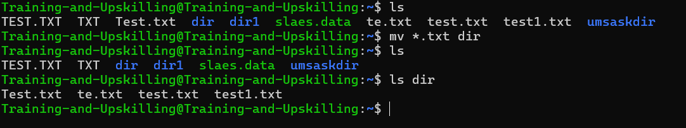

 
 ### Input, Output, and Redirection

 - three types of I/O types
    - Standard inputs (stdin) - 0
    - Standard output (stdout) - 1
    - Standard error  (stderr) - 2


  - Redirection
    - ">" - redirects standard output to file , overwrites existing contents
    - ">>" -  redirects standard output to file, appends to any existing contents
    - "<" - redirects input to file to command
    - ignor erro command 2>/dev/null

        
      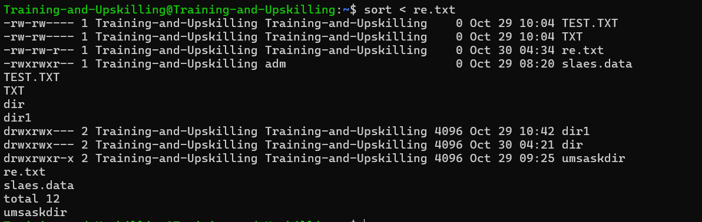  
      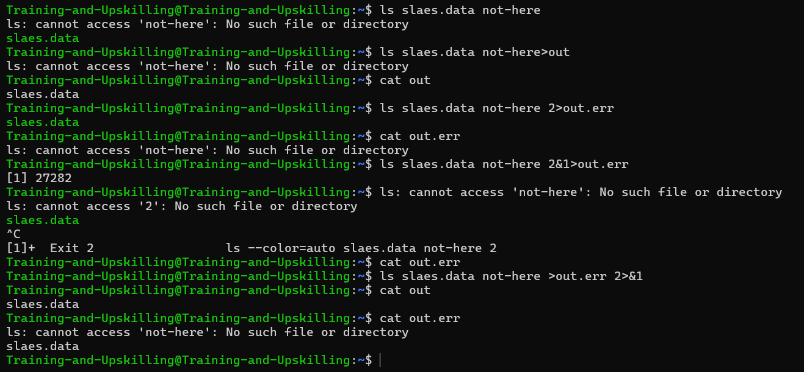

  ### Comparing Files

  - diff file1 file2 : compare two file
  - sdiff file1 file2 : side-by-side comparison
  - vimdiff file1 file2 :  highlight difference in vim  


   ### Searching in Files and Using Pipes

##### grep

   - grep -v pattern file - Invert match. Return lines from file that do not match pattern.
   - grep -i - Perform a search, ignoring case.
   - grep -c - Count the number of occurrences in a file.
   - grep -n - Precede output with line numbers from the file.


##### file

- The file command in Linux is used to identify the type of a file — not by its extension (like .txt or .jpg), but by examining its content (binary signature and metadata).
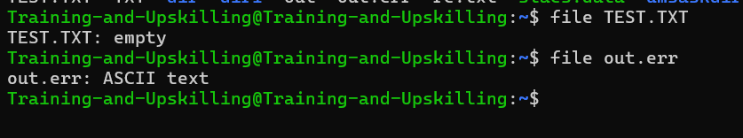


##### Pipes(|)
- The pipe (|) in Linux is used to connect multiple commands together, so that the output of one command becomes the input of the next.

```bash
command -output | command - input
```
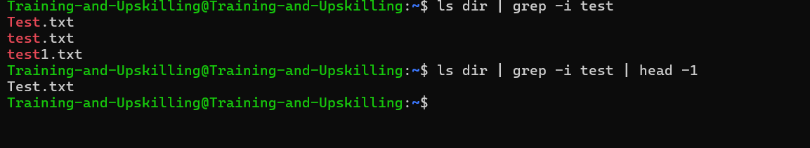


### Transferring and Copying Files over the Network

- scp source destination - Copy source to destination.
     -  Copy file from local → remote : scp file.txt user@192.168.1.10:/home/user/
     - Copy file from remote → local : scp user@ip:/home/user/file.txt /home/localuser/
     - Copy entire directory : scp -r myfolder user@ip:/home/user/


- sftp [username@]host - Connect to host as username to begin a secure file transfer session.
     - Connect to remote server : sftp user@ip
     - Once connected 
       ``` bash
       sftp> ls          # List files
       sftp> cd /home/user
       sftp> get file.txt   # Download file
       sftp> put local.txt  # Upload file
       sftp> exit           # Quit session
       ```
    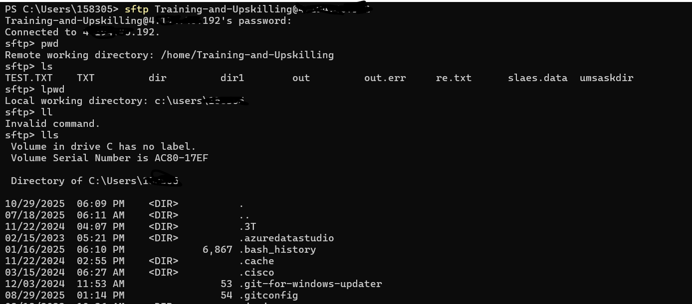
    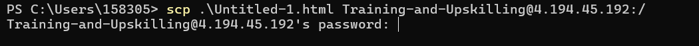


 ### Shell Aliases
 -  The alias command lets you create shortcuts for long or frequently used commands — saving time and reducing typing errors.

 ```bash
    alias name='command'
    alias ll='ls -l' # type ll instead of ls -l.
    alias # View all current aliases
    unalias ll # Remove an alias
    <!--
    Make alias permanent
    To make an alias persist after reboot: 
    Open your shell config file:
    For bash → ~/.bashrc
    Add your alias line, 
    -->
    e.g.:
    alias gs='git status'
 ```
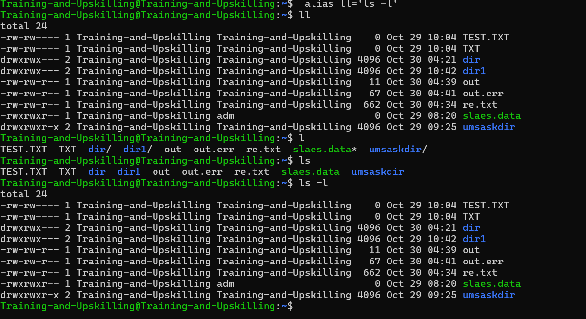

### Environment Variables
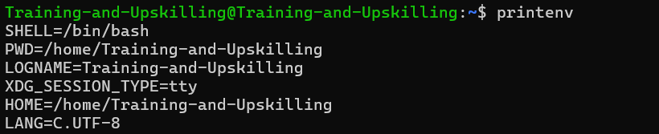

```bash
   export VAR="value" # set env
   export EDITOR="vi" # set env
   unset EDITOR
   export TZ="US" # set time zone
```
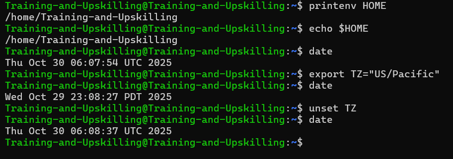


###  Processes and Job Control

```bash
    ps - display process status.
    ps -e - Display all processes.
    ps -ef - Display all processes.
    ps -eH - Display a process tree.
    ps -e --forest - Display a process tree.
    ps -u username - Display processes running as username.
    ps -p pid - Display process information for pid. A PID is a process ID.
    pstree - display process in tree format

```
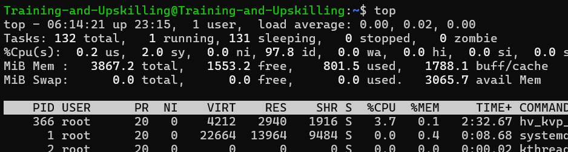
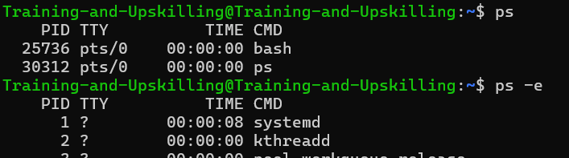
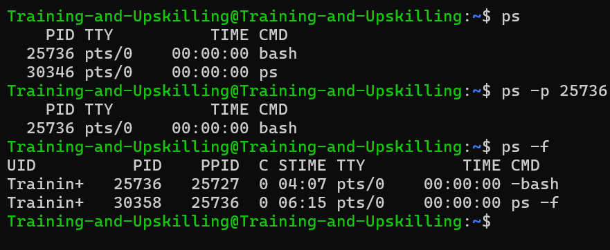
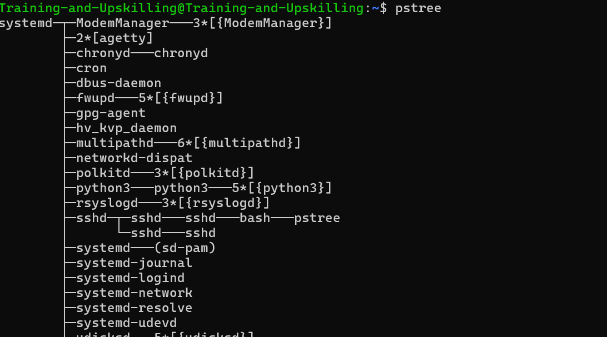


- command & - start command in background
- Ctrl-c - Kill the foreground process.
- Ctrl-z - Suspend the foreground process.
- bg [%num] - Background a suspended process.
- fg [%num] - Foreground a background process.
- kill [%num] - Kill a process by job number or PID.
- jobs [%num] - List jobs. 

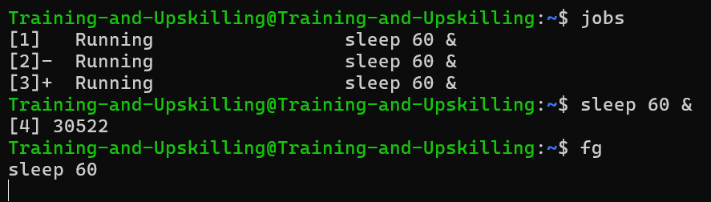
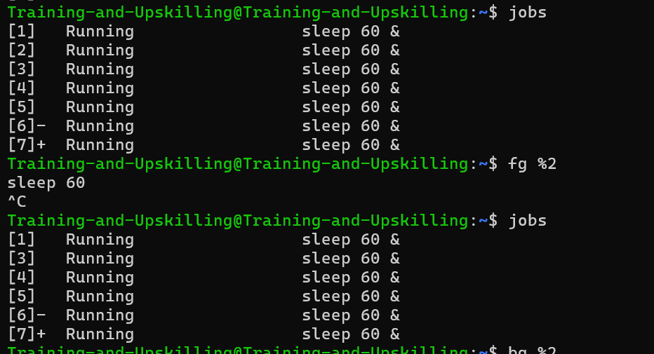
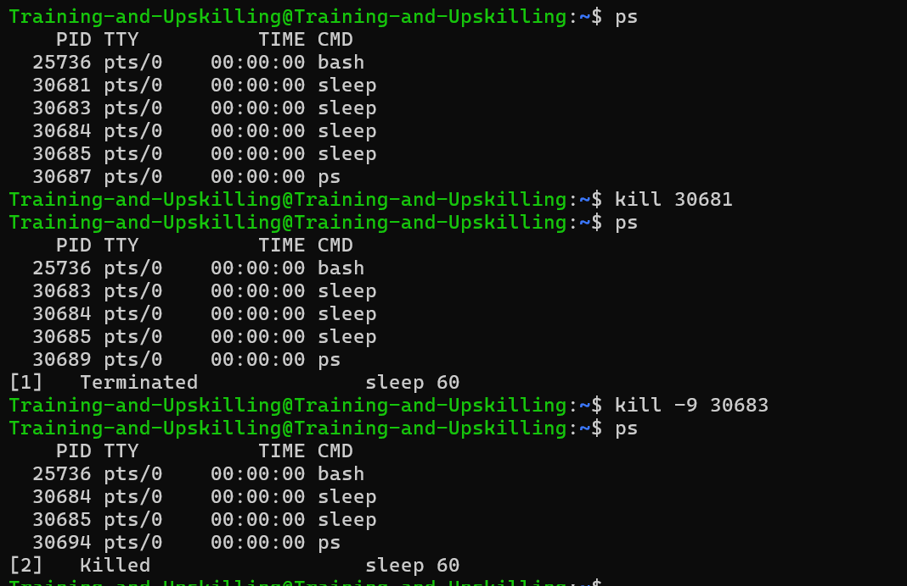


### Scheduling Repeated Jobs with Cron

- If you need to repeat a task on a schedule, you can use the cron service. Every minute the cron
service checks to see if there are any scheduled jobs to run and if so runs them. Cron jobs are
often used to automate a process or perform routine maintenance. You can schedule cron jobs
by using the crontab command.


```bash
crontab file - Install a new crontab from file.
crontab -l - List your cron jobs.
crontab -e - Edit your cron jobs.
crontab -r - Remove all of your cron jobs.
# Crontab Format
* * * * * command
| | | | |
| | | | +-- Day of the Week (0-6)
| | | +---- Month of the Year (1-12)
| | +------ Day of the Month (1-31)
| +-------- Hour (0-23)
+---------- Minute (0-59)
```
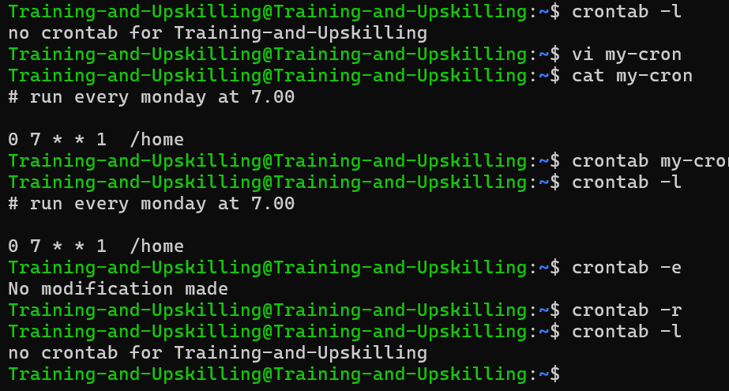


### Switching Users and Running Commands as Others

| Command                             | Description                     |
| ----------------------------------- | ------------------------------- |
| `sudo groupadd developers`          | Create group                    |
| `sudo useradd -m ayush`             | Create user with home directory |
| `sudo passwd ayush`                 | Set password                    |
| `sudo usermod -aG developers ayush` | Add user to group               |
| `groups ayush`                      | Verify group membership         |
| `sudo deluser ayush` | delete user |
|`sudo delgroup developers` | delete group |
| `su - ayush` | switch to user |
```bash
sudo -l - List available commands.
sudo command - Run command as the superuser.
sudo -u root command - Same as sudo command`.
sudo -u user command - Run command as user.
sudo su : Switch to the superuser account.
sudo su - : Switch to the superuser account with an environment like you would expect to see had you logged in as that user.
sudo su - username : Switch to the username account with an environment like you would expect to see had you logged in as that user.
```
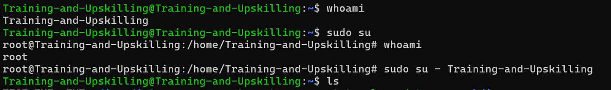


### Shell History and Tab Completion
0 The history command is used to display, search, and reuse previously executed commands.

| Command            | Description                                                                           |
| ------------------ | ------------------------------------------------------------------------------------- |
| `history`          | Shows the full list of previous commands                                              |
| `history N`        | Shows the last N commands (e.g. `history 10`)                                         |
| `!N`               | Repeats command number `N`                                                            |
| `!!`               | Repeats the **last** command                                                          |
| `!string`          | Repeats the **most recent command** starting with that string (e.g., `!ls`)           |
| `history -c`       | Clears the command history for the current session                                    |
| `history -d <num>` | Deletes the command at history line number `<num>`                                    |
| `history -a`       | Appends the current session’s history to the history file (usually `~/.bash_history`) |


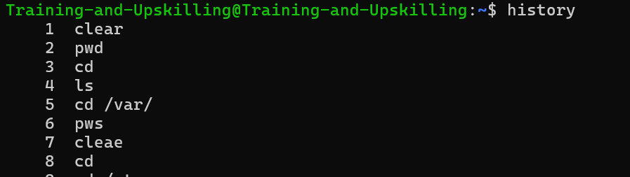
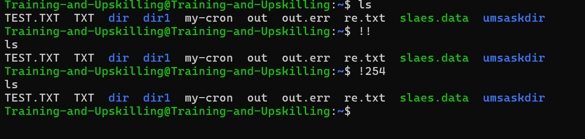


- rpm -qa : list all installed pacakges
- rpm -ql package : list the package,s files


