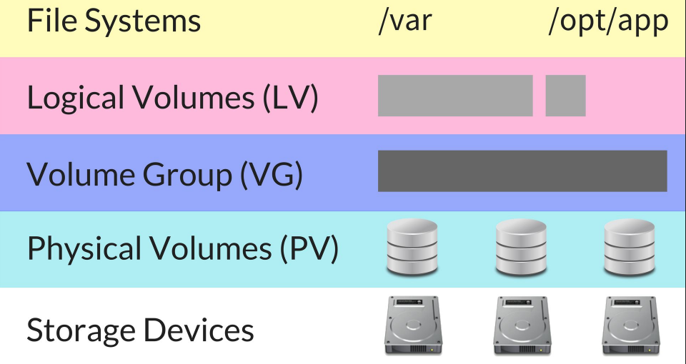
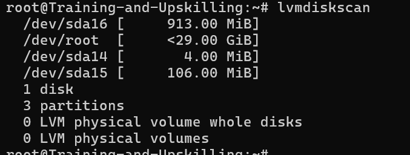
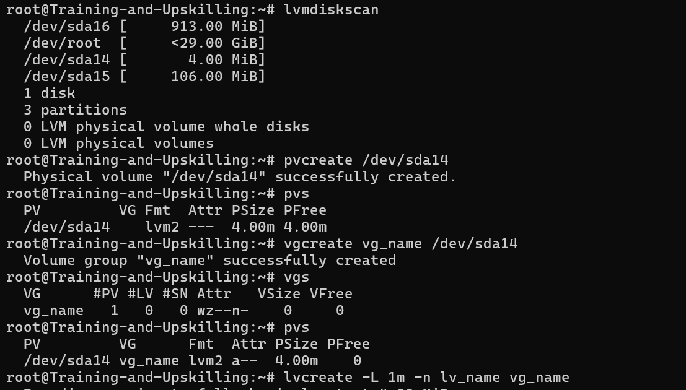
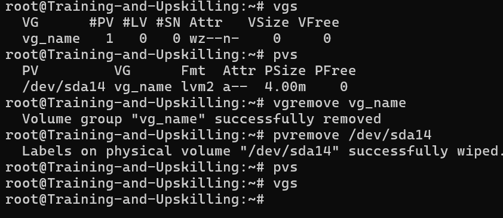

### LVM (Logical Volume Manager)

- It’s a way to manage disks in Linux more flexibly than normal partitions.
- Normally, when you create partitions (like /dev/sda1, /dev/sda2),each one has a fixed size — hard to change later.

#### LVM solves that problem — it lets you:

- Combine multiple disks together

- Create “virtual partitions” called Logical Volumes

- Resize them anytime (grow or shrink)

- Take snapshots (instant backups)




#### Creating Physical Volumes (PVs), Volume Groups (VGs), and Logical Volumes (LVs)
```bash
pvcreate /dev/sda14 # creat physical volumes
pvs   # list physical volume
vgcreate vg_name /dev/sda14 # creat volume group
vgs # list volume group
lvcreate -L 1m -n lv_name vg_name # creat logical volume
lvs # list logical volume
lvdisplay # detail data
mkfs -t ext4 /dev/vg_name/lv_name # make file system of lv
mount /dev/vg_name/lv_name /data # mount lv to data
df -h /data # list

```


#### Extending Volume Groups and Logical Volumes
```bash
pvcreate /dev/sdc # creat physical volume
vgextend vg_name /dev/sdc # extend volume group
lvextend -L +10G -r /dev/vg_name/lv_name # extend logical lovume -r resize

```

#### Mirroring Logical Volumes
```bash
pvcreate /dev/sdc # creat physical volume
vgcreate vg_name /dev/sdc # creat volume group
lvcreate -m 1 -L 100G -n lv_name vg_name # create copy of 1 of lv

```

####  Removing Logical Volumes, Physical Volumes, and Volume Groups

```bash
lvremove /dev/vg_name/lv_name
vgreduce vg_name /dev/sdb
vgremove vg_name
pvremove /dev/sdb
pvmove sourcepv destpv # to Migrating Data from One Storage Device to Another

```
