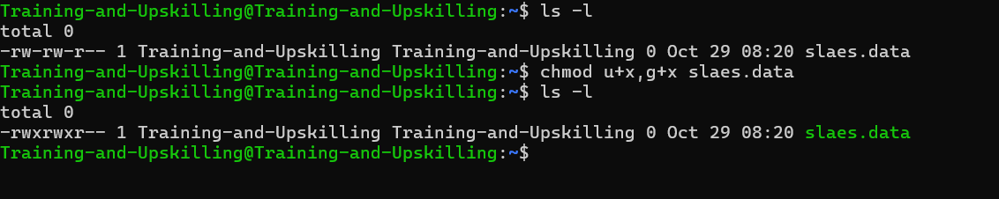
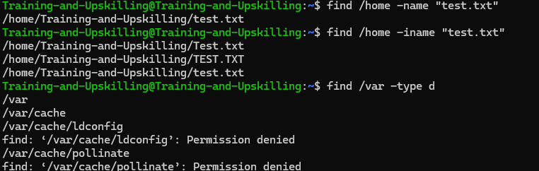

### Linux Directory Structure


| Directory | Description |
|------------|--------------|
| `/` | The directory called **root**. It is the starting point for the file system hierarchy. *(Note: this is not related to the root or superuser account.)* |
| `/bin` | Binaries and other executable programs. |
| `/etc` | System configuration files. |
| `/home` | Home directories for users. |
| `/opt` | Optional or third-party software. |
| `/tmp` | Temporary space, typically cleared on reboot. |
| `/usr` | User-related programs and utilities. |
| `/var` | Variable data, most notably log files. |

```plaintext
/
├── bin        → Essential binary executables
├── etc        → System configuration files
├── home       → User home directories
│   ├── alice
│   └── bob
├── opt        → Optional or third-party software
├── tmp        → Temporary files (cleared on reboot)
├── usr        → User-related programs, libraries, and docs
│   ├── bin
│   ├── lib
│   └── share
└── var        → Variable data (logs, caches, spools)
    ├── log
    ├── mail
    └── tmp
```

### Shell


- A program that accepts your commands and executes thos commands.
   - also called command line interpreter
   - default interface to linux


### Essential Linux Commands / Basic Linux Commands

- pwd : Displays the present working directory

  

- cd [dir] :  Changes the current directory to dir 

  

- ls :  Lists directory contents

  
  

- cat : Concatenates and displays files.  
  

- clear: Clears the screen. 
   

- man :  command Displays the online manual for
command.
    - Enter - Move down one line.
    - Space - Move down one page.
    - g - Move to the top of the page.
    - G - Move to the bottom of the page.
    - q - Quit.


- exit :  Exits the shell or your current session.


- If you want to know exactly where a command is located you can use the which command. 


### Working with Directories

| Symbol | Description |
|---------|--------------|
| `.` | Refers to the **current directory**. |
| `..` | Refers to the **parent directory** (one level up). |
| `/` | **Directory separator**. Directories end with a forward slash `/`, and this is often assumed. |
|`cd -`| chnage to the previos directory|

   
   


- The mkdir command is used to create directories and the rmdir command removes them.
- mkdir [-p] directory - Create a directory. Use the -p (parents) option to create intermediate
directories.
- rmdir [-p] directory - Remove a directory. Use the -p (parents) option to remove all the specified directories. rmdir only removes empty directories. To remove directories and their
contents, use rm .

- rm -rf directory - Recursively removes the directory and all files and directories in that
directory structure.

  
  

###  Listing Files and Understanding LS Output

- The -l flag tells ls to display output
in a long format. If you need to see what files or directories exist

  

    | Item | Value |
    |------|--------|
    | **Permissions** | `-rw-rw-r-- ` |
    | **Number of links** | `1` |
    | **Owner name** | `Training-and-Upskilling` |
    | **Group name** | `Training-and-Upskilling` |
    | **Number of bytes in the file** | `0` |
    | **Last modification time** | ` Oct 29 08:20 ` |
    | **File name** | `sales.data` |

  #### Listing All Files, Including Hidden Files

  ```bash
     ls -a
     ls -la
  ```  
  

    | Option | Description |
    |---------|-------------|
    | `-a` | All files, including hidden files |
    | `--color` | List files with colorized output |
    | `-d` | List directory names and not their contents |
    | `-l` | Long format |
    | `-r` | Reverse order |
    | `-R` | List files recursively |
    | `-t` | Sort by time, most recently modified first |


###  File and Directory Permissions 
#### File Type Symbols
| Symbol | Type |
|---------|------|
| `-` | Regular file |
| `d` | Directory |
| `l` | Symbolic link |


#### Permission Categories

| Symbol | Category |
|---------|-----------|
| `u` | User |
| `g` | Group |
| `o` | Other |
| `a` | All – user, group, and other |


#### Changing Permissions

| Item | Meaning |
|------|----------|
| `chmod` | The change mode command |
| `ugoa` | The user category. One or more of `u` for user, `g` for group, `o` for other, `a` for all. |
| `+-=` | One of `+`, `-`, or `=`. Use `+` to add permissions, `-` to remove them, or `=` to explicitly set them. |
| `rwx` | The permissions. One or more of `r` for read, `w` for write, and `x` for execute. | 


#### File Permission Representation (Octal, Binary & Symbolic)

| Octal | Binary | String |
|--------|---------|---------|
| 0 | 000 | --- |
| 1 | 001 | --x |
| 2 | 010 | -w- |
| 3 | 011 | -wx |
| 4 | 100 | r-- |
| 5 | 101 | r-x |
| 6 | 110 | rw- |
| 7 | 111 | rwx |

- give execute permission to group 

  

- remove execute permission to group
  

- give execute permission to group and user both
  


- the "chgrp" command use to chnage thes the group


#### Default Permissions and the File Creation Mask

- The file creation mask is what determines the permissions a file will be assigned upon its
creation. The mask restricts or masks permissions, thus determining the ultimate permission a file
or directory will be given. If no mask were present directories would be created with 777
(rwxrwxrwx) permissions and files would be created with 666 (rw-rw-rw-) permissions. The mask
can and is typically set by the system administrator, but it can be overridden on a per account
basis by including a umask statement in your personal initialization files.
  ```bash 
   - umask # Displays the current umask value in octal form.
   - umask -S # Displays the current mask in a symbolic (human-readable) format
   - umask 007 # Sets a new umask value.
   ```

  

  
  
- Default for files → 666 - 022 = 644 → rw-r--r--
- Default for directories → 777 - 022 = 755 → rwxr-xr-x
- Change umask
  ```bash
    umask 007
  ```  
- Removes all permissions for others.
  - Files → 666 - 007 = 660 → rw-rw----
  - Directories → 777 - 007 = 770 → rwxrwx---


### Finding Files and Directories

#### find
- find command is used to search for files and directories in a directory hierarchy based on various conditions such as:
    
    - Name
    - Type
    - Size
    - Modification time
    - Permissions, etc.

 ```bash
 find [path] [options] [expression] 
 find /home -name "test.txt" # This searches for a file named test.txt inside the /home directory.
 find / -name "file.txt" # Searches the entire system for file.txt (case-sensitive).
 find /home -iname "file.txt" # Finds file.txt, File.txt, or FILE.TXT.
 find /var -type d # Finds all directories under /var.
 find /var -type f # Finds all files under /var.
 find /tmp -mtime -1 # Finds files modified within the last 1 day.
 find /home -size +100M # Finds files larger than 100 MB.
 ```   



#### locate 

- The locate command is used to quickly find files and directories on your system.  
- It searches through a pre-built database of file paths instead of scanning the filesystem in real time — making it much faster than find.


   - Much faster than find because it uses an indexed database.
   - Case-insensitive searches with the -i option.
   - The database is usually updated automatically (via updatedb).
```bash
locate [options] pattern
locate file.txt # Finds all files named test.txt on the system.
locate -i readme.txt # Finds readme.txt, README.TXT, or ReadMe.txt.
locate /etc/passwd # Finds the exact path /etc/passwd if it exists in the database.
locate -c log # Displays how many files or directories contain the word log.
locate -n 10 conf # Shows only the first 10 matching results containing “conf”.
```
  


  ### Viewing Files and the Nano Editor

#### File Viewing Commands in Linux

```bash
  cat test.txt # Displays the contents of test.txt.
  cat file1.txt file2.txt > merged.txt # Combines file1.txt and file2.txt into a new file merged.txt.
  cat -n file.txt # Displays file contents with line numbers.
  head file.txt # Displays the first 10 lines of file.txt.
  head -n 5 file.txt # Displays the first 5 lines of file.txt.
  tail file.txt # Displays the last 10 lines of file.txt.
  tail -n 5 file.txt # Displays the last 5 lines of file.txt.
  more /var/log/syslog # Displays the file one page at a time.
  less /var/log/syslog # Opens the file in scrollable view.

```


### Deleting, Copying, Moving, and Renaming Files


#### Delete

```bash
  rm file.txt # Deletes file.txt from the current directory.
  rm file1.txt file2.txt file3.txt # Removes all three files.
  rm *.txt # Deletes all files ending with .txt in the current directory.
  rm -r myfolder # Removes the directory myfolder and everything inside it.
  rm -rf myfolder # Deletes myfolder and its contents without asking for confirmation.
  rm -i *.log # Asks before deleting each .log file.


```


#### Copy
``` bash
    cp file1 file2 # copy file1 data into the file2 (if file2 is not present then automatically created)
    cp file1 file2 dir # copy both file into the directory called dir
    cp -r dir dir2 # copy all content of dir to dir2 (if dir 2 is not present then automatically created )
    cp dir dir2 dir3  # copy dir and  dir2 to dir3


``` 


#### Move

- move or rename file and directories

```bash
  mv source destination
  mv file.txt /home/user/Documents/ # Moves file.txt into the /home/user/Documents/ directory.
  mv oldname.txt newname.txt # Renames oldname.txt to newname.txt.
  mv file1.txt file2.txt /home/user/Backup/ # Moves file1.txt and file2.txt into the Backup folder.
  mv myfolder /home/user/Documents/ # Moves the myfolder directory into /home/user/Documents/.

```

#### sort


```bash
 sort file.txt # sorting file 
 sort -u file.txt # sorting file uniqually
 sort -u -k2 file .txt # sorting 2 colume
```