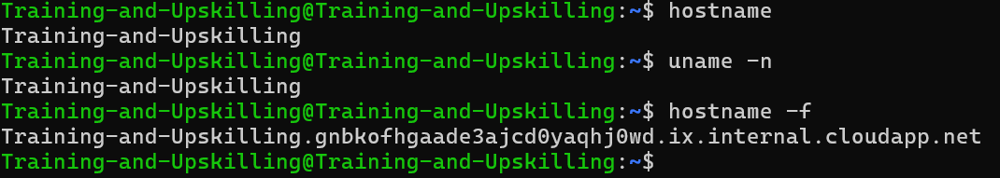

### TCP/IP Networking for Linux System Administrators


- TCP/IP : TCP/IP is a set of communication protocols that define how data is transmitted over a network. TCP ensures reliable communication, while IP handles addressing and routing.”


```bash
   ip addr , ip a , ip address show, ifconfig # check ip 
```

- DNS (Domain Name System) : DNS translates human-readable domain names into IP addresses, allowing users to access websites without remembering numeric IPs.

```bash
   hostname , uname -n # display hostname
   hostname -f # full name of host

```




- Network port :  is a virtual endpoint used by computers to identify specific services or applications on a device.

    | Service                          | Protocol | Port Number |
    | -------------------------------- | -------- | ----------- |
    | **HTTP**                         | TCP      | 80          |
    | **HTTPS**                        | TCP      | 443         |
    | **SSH**                          | TCP      | 22          |
    | **FTP**                          | TCP      | 21          |
    | **DNS**                          | UDP      | 53          |
    | **SMTP (Email)**                 | TCP      | 25          |
    | **RDP (Windows Remote Desktop)** | TCP      | 3389        |
    | **MySQL**                        | TCP      | 3306        |


    | Type                        | Range         | Description                                                  |
    | --------------------------- | ------------- | ------------------------------------------------------------ |
    | **Well-known ports**        | `0–1023`      | Reserved for system services (e.g., 22 for SSH, 80 for HTTP) |
    | **Registered ports**        | `1024–49151`  | Used by user or vendor applications                          |
    | **Dynamic / Private ports** | `49152–65535` | Temporary ports used by client apps for outgoing connections |


| Command      | Purpose                       | Example                 |
| ------------ | ----------------------------- | ----------------------- |
| `ping`       | Test connectivity             | `ping google.com`       |
| `traceroute` | Show network hops             | `traceroute google.com` |
| `tracepath`  | Trace path (no root)          | `tracepath google.com`  |
| `netstat`    | View open ports & connections | `netstat -tuln`         |
| `tcpdump`    | Capture network packets       | `sudo tcpdump -i eth0`  |
| `telnet`     | Test specific port connection | `telnet 8.8.8.8 53`     |
