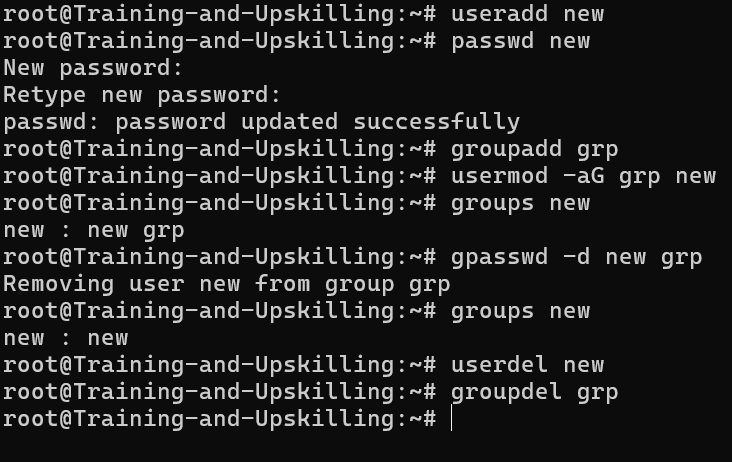

# Managing Users and Groups


- /etc/passwd is a text file in Linux that stores basic information about all user accounts on the system.
- while actual passwords are kept securely in /etc/shadow.”
 
   ```bash
    root:x:0:0:root:/root:/bin/bash
   ```
    | Field                        | Example     | Description                                           |
    | ---------------------------- | ----------- | ----------------------------------------------------- |
    | **1. Username**              | `root`      | The login name of the user                            |
    | **2. Password**              | `x`         | Placeholder — actual password stored in `/etc/shadow` |
    | **3. UID (User ID)**         | `0`         | Numeric ID of the user (0 = root)                     |
    | **4. GID (Group ID)**        | `0`         | Numeric ID of the user's primary group                |
    | **5. Comment / GECOS field** | `root`      | Description or full name of the user                  |
    | **6. Home directory**        | `/root`     | User’s home folder                                    |
    | **7. Shell**                 | `/bin/bash` | Default shell when user logs in                       |


| **Command**                      | **Description**                                                       |
| -------------------------------- | --------------------------------------------------------------------- |
| `useradd username`               | Create a new user account.                                            |
| `adduser username`               | More user-friendly version of `useradd` (prompts for password, etc.). |
| `passwd username`                | Set or change the user’s password.                                    |
| `usermod -aG groupname username` | Add a user to a group (append).                                       |
| `usermod -d /new/home username`  | Change a user’s home directory.                                       |
| `usermod -l newname oldname`     | Rename a user account.                                                |
| `userdel username`               | Delete a user account (keeps home directory by default).              |
| `userdel -r username`            | Delete a user and remove their home directory.                        |
| `id username`                    | Display user ID (UID), group ID (GID), and group memberships.         |
| `whoami`                         | Show the current logged-in username.                                  |


- The /etc/group file in Linux stores information about user groups —it defines which users belong to which groups on the system.

    ```bash
    group_name:password:GID:user_list
    ```

| Field          | Description                                                                       |
| -------------- | --------------------------------------------------------------------------------- |
| **group_name** | Name of the group (e.g., `sudo`, `developers`)                                    |
| **password**   | Usually `x` — actual group passwords are rarely used and stored in `/etc/gshadow` |
| **GID**        | Group ID number                                                                   |
| **user_list**  | Comma-separated list of users who are members of this group                       |


| **Command**                     | **Description**                                        |
| ------------------------------- | ------------------------------------------------------ |
| `groupadd groupname`            | Create a new group.                                    |
| `groupdel groupname`            | Delete a group.                                        |
| `groupmod -n newgroup oldgroup` | Rename a group.                                        |
| `gpasswd -a username groupname` | Add a user to a group.                                 |
| `gpasswd -d username groupname` | Remove a user from a group.                            |
| `groups username`               | Show all groups a user belongs to.                     |


| **Description**                     | **Command Example**             |
| ---------------------------- | ------------------------------- |
| Create user `new`          | `sudo useradd new`            |
| Set password for `new`     | `sudo passwd new`             |
| Create group `devops`        | `sudo groupadd devops`          |
| Add `new` to `devops`      | `sudo usermod -aG devops new` |
| Verify user’s groups         | `groups new`                  |
| Delete user & home directory | `sudo userdel -r new`         |
| Delete group `devops`        | `sudo groupdel devops`          |


