## Automated EC2 Start-Stop Scheduler with Slack Notifications

#### Create Slack Incoming Webhook

- Open Slack (web).

- Go to https://api.slack.com/apps
 → Create New App → From scratch → name it (e.g., ec2-notifier) → choose workspace.

- In the app page → Incoming Webhooks → Enable Incoming Webhooks → Add new webhook to workspace.

- Select the channel where you want notifications, click Allow.

- Copy the webhook URL

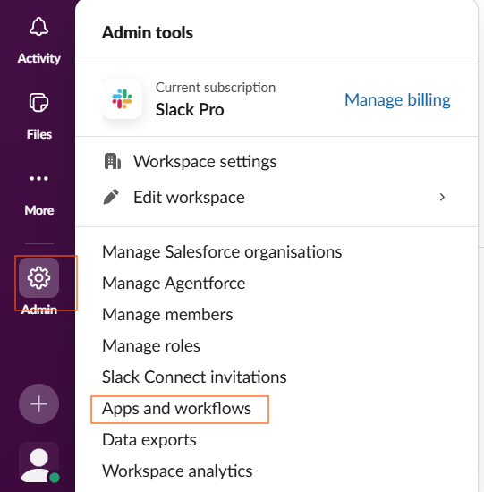
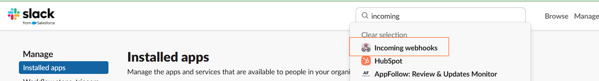
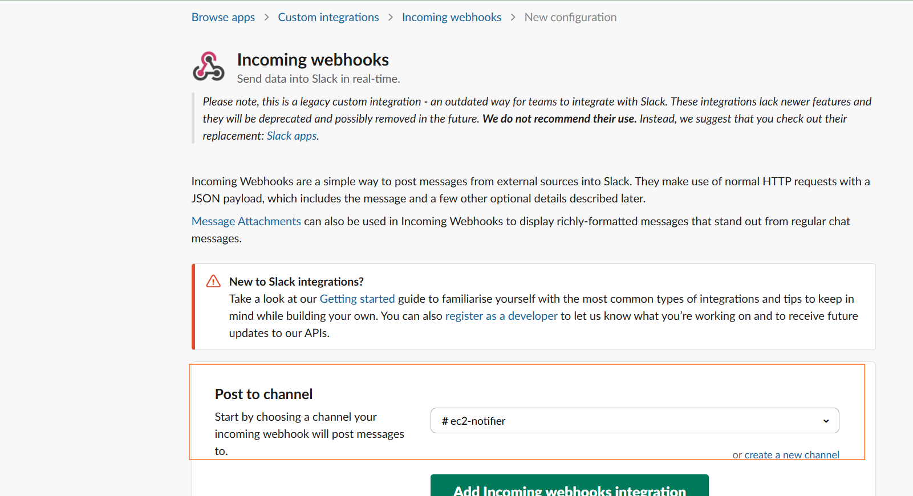
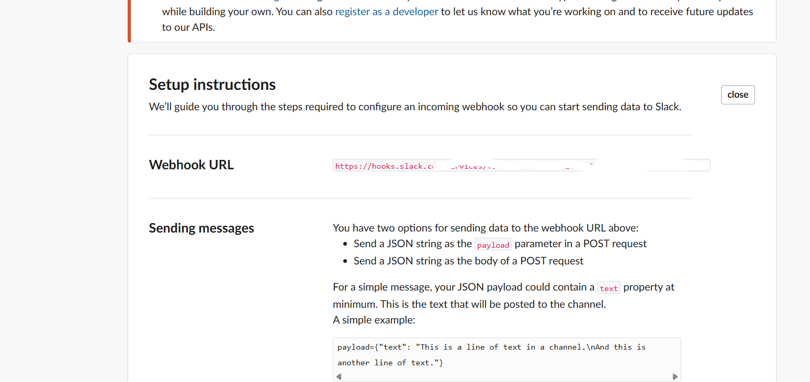


#### Create IAM role for Lambda

- We will create a role that allows the Lambda to start/stop/describe EC2 + write CloudWatch logs.

- Open IAM → Roles → Create role

- Trusted entity: AWS service → Lambda → Next

- Attach AWSLambdaBasicExecutionRole managed policy (CloudWatch Logs).

- Click Create policy (new tab) and paste this policy JSON for EC2 actions:

```bash
{
  "Version": "2012-10-17",
  "Statement": [
    {
      "Sid": "AllowEC2StartStopDescribe",
      "Effect": "Allow",
      "Action": [
        "ec2:StartInstances",
        "ec2:StopInstances",
        "ec2:DescribeInstances"
      ],
      "Resource": "arn:aws:ec2:*:*:instance/*"
    }
  ]
}
```
- Save the policy and attach it to the role.

.

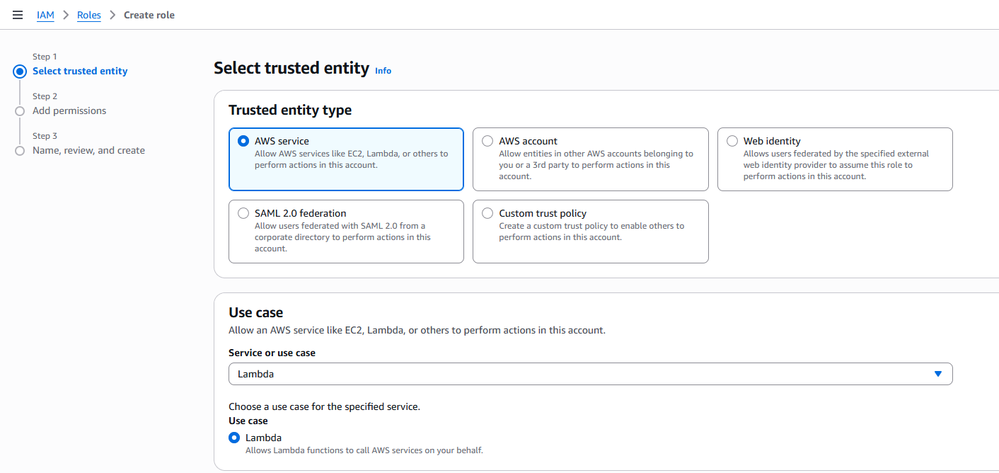
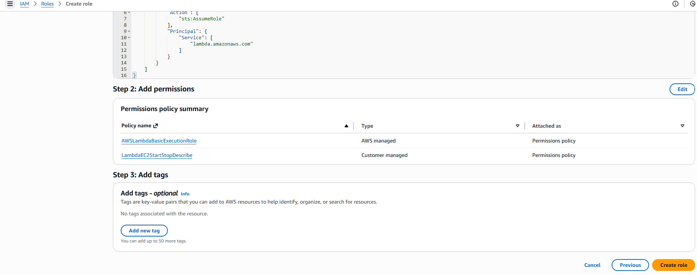


#### Create the Lambda function (one function that starts/stops + notifies Slack)

- Go to Lambda → Create function → Author from scratch

- Name: ec2-schedule-startstop-notify

- Runtime: Python 3.11 (or 3.10)

- Architecture: x86_64 (default) or arm64 (optional)

- Execution role: Use an existing role → select the IAM role you created above.(LambdaEC2StartStopDescribe)

- Paste the code below into the function editor (handler lambda_function.lambda_handler):

- Paste the code below into the function editor (handler lambda_function.lambda_handler):

```bash
import os
import json
import urllib.request
import boto3
from datetime import datetime, timedelta

# Environment variables
SLACK_WEBHOOK = os.environ.get("SLACK_WEBHOOK")  # required
REGION = os.environ.get("REGION", "us-west-2")  # change if needed
TAG_KEY = os.environ.get("TAG_KEY", "environment")
TAG_VALUE = os.environ.get("TAG_VALUE", "test")

ec2 = boto3.client("ec2", region_name=REGION)

def list_instances_by_tag():
    """Return list of all instance dicts (id + name + state) matching the tag."""
    paginator = ec2.get_paginator("describe_instances")
    filters = [
        {"Name": f"tag:{TAG_KEY}", "Values": [TAG_VALUE]},
        # include instances in running/stopped states so we can start/stop appropriately
        {"Name": "instance-state-name", "Values": ["running", "stopped", "stopping", "pending"]}
    ]
    instances = []
    for page in paginator.paginate(Filters=filters):
        for reservation in page.get("Reservations", []):
            for inst in reservation.get("Instances", []):
                iid = inst.get("InstanceId")
                name = "No-Name"
                for t in inst.get("Tags", []):
                    if t.get("Key") == "Name":
                        name = t.get("Value")
                        break
                state = inst.get("State", {}).get("Name")
                instances.append({"id": iid, "name": name, "state": state})
    return instances

def post_to_slack(text):
    if not SLACK_WEBHOOK:
        print("No SLACK_WEBHOOK configured.")
        return
    payload = {"text": text}
    data = json.dumps(payload).encode("utf-8")
    req = urllib.request.Request(SLACK_WEBHOOK, data=data, headers={"Content-Type":"application/json"})
    urllib.request.urlopen(req)

def ist_time():
    now_utc = datetime.utcnow()
    ist = now_utc + timedelta(hours=5, minutes=30)
    return ist.strftime("%Y-%m-%d %H:%M:%S IST")

def lambda_handler(event, context):
    # event must contain {"action":"start"} or {"action":"stop"}
    action = (event.get("action") or "").lower()
    if action not in ("start", "stop"):
        return {"error": "invalid action; expected start or stop"}

    instances = list_instances_by_tag()
    if not instances:
        post_to_slack(f"No EC2 instances found with tag {TAG_KEY}={TAG_VALUE}.")
        return {"status":"no_instances"}

    ids = [i["id"] for i in instances]

    # perform start/stop
    if action == "start":
        try:
            ec2.start_instances(InstanceIds=ids)
        except Exception as e:
            print("Start error:", e)
    else:
        try:
            ec2.stop_instances(InstanceIds=ids)
        except Exception as e:
            print("Stop error:", e)

    now = ist_time()
    emoji = "🟢" if action == "start" else "🛑"
    verb = "STARTED" if action == "start" else "STOPPED"

    # send one Slack message per instance (Name + ID + prev state)
    for inst in instances:
        text = f"{emoji} EC2 *{inst['name']}* ({inst['id']}) has been *{verb}* at {now} (tag: {TAG_KEY}={TAG_VALUE}). Previous state: {inst['state']}."
        post_to_slack(text)

    return {"status":"done", "action": action, "instances": ids}


```


#### Set environment variables (Lambda → Configuration → Environment variables):

- SLACK_WEBHOOK = Slack webhook UR

- REGION = us-west-2 

- TAG_KEY = environment

- TAG_VALUE = test

- Under Configuration → Monitoring and operations tools → Logs set CloudWatch Logs retention to 30 days.

- Save the function

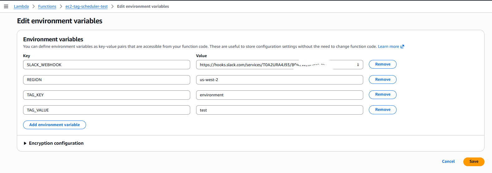
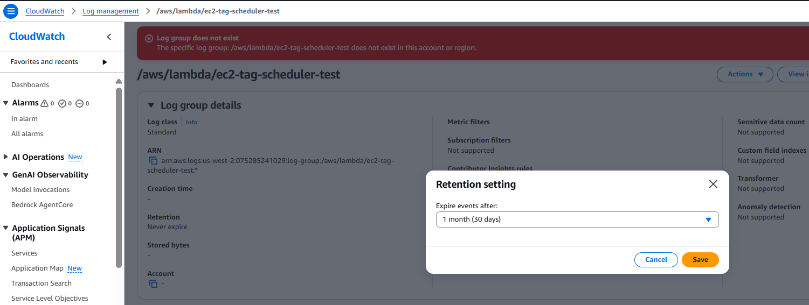


####  Create EventBridge scheduled rules (two rules)

- EventBridge uses UTC cron. Conversion (IST → UTC):

- 6:30 PM IST = 13:00 UTC → cron: cron(0 13 * * ? *)

- 9:30 AM IST = 04:00 UTC → cron: cron(0 4 * * ? *)

Create two rules:

#####  Stop rule — daily at 6:30 PM IST

- EventBridge → Rules → Create rule

- Name: ec2-stop-1830-IST-test-tag

- Rule type: Schedule → Cron expression: cron(0 13 * * ? *)

- Target: Lambda function → ec2-tag-scheduler-test

- Configure Input: Constant (JSON text) → paste:
 ```bash
{"action": "stop"}
```

- Create rule (EventBridge will add permission to invoke Lambda automatically).
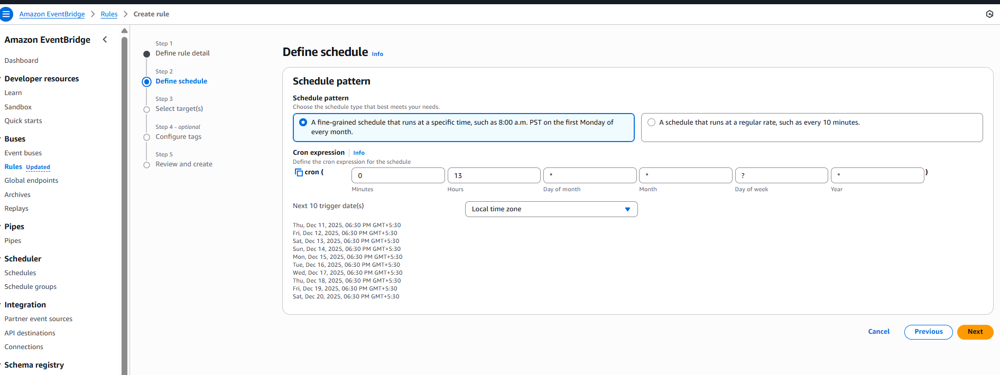

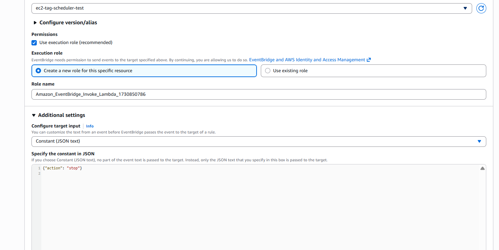
##### Start rule — daily at 9:30 AM IST

- Name: ec2-start-0930-IST-test-tag

- Cron: cron(0 4 * * ? *)

- Target: same Lambda

- Input:
```bash
{"action": "start"}
```

- Create rule.

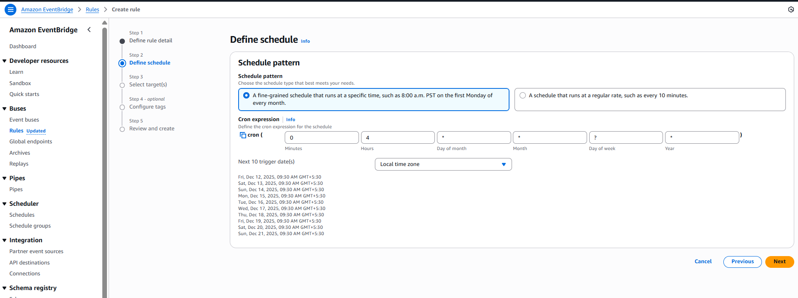
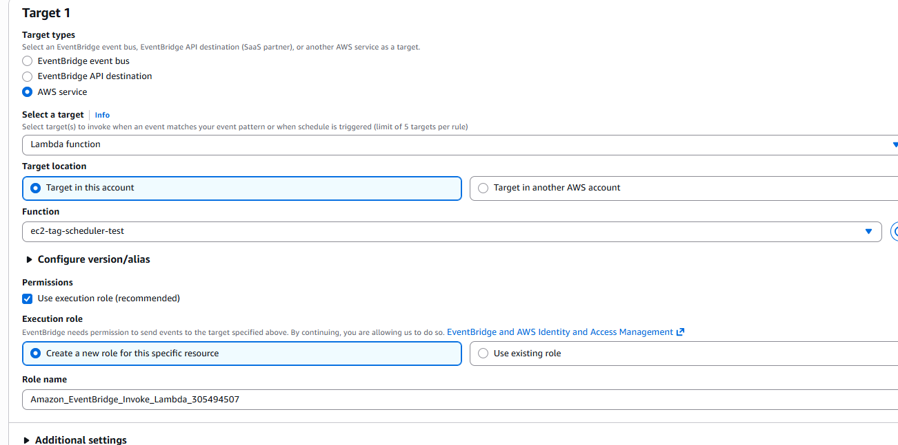
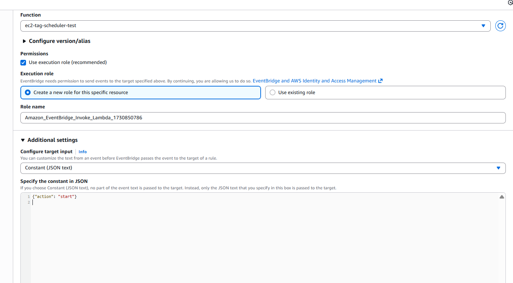

##### Test manually 
-  Test STOP

    - In Lambda console → Test → Configure test event → Name stopTest

    - Event JSON:
    ```bash
    {"action":"stop"}
    ```

    - Save and Test.

    - Check CloudWatch Logs for the function output.

    - Check Slack channel — you should get messages for each environment=test instance.

    - Check EC2 console — instances should move to stopping → stopped.

##### Test START

- Create startTest with:
```bash
{"action":"start"}
```

- Test.


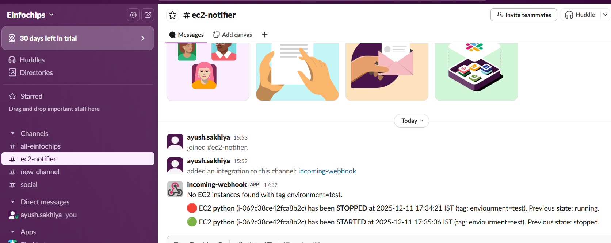
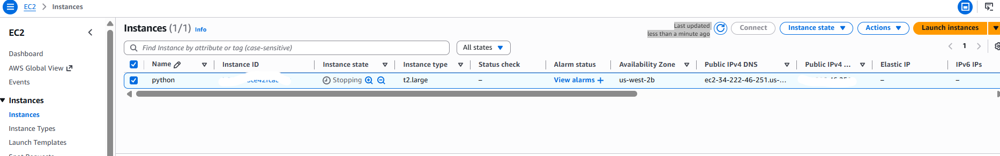
